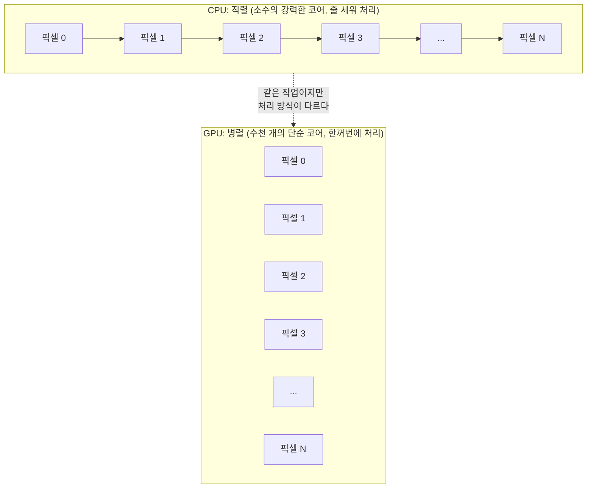
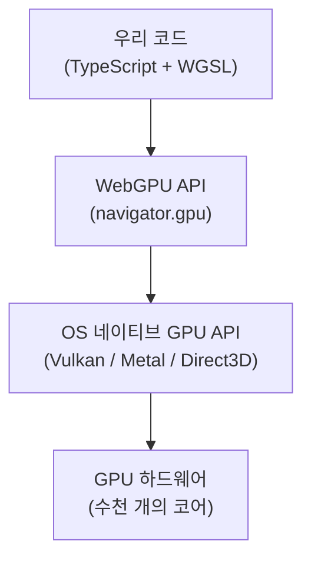

# 1. GPGPU와 WebGPU의 목적

## 학습 목표

이 챕터를 마치면, **GPU가 왜 그래픽뿐 아니라 일반 계산(GPGPU)에도 쓰이는지**, 그리고 그것이 **CPU 반복문과 어떻게 다른지**를 한 문장으로 설명할 수 있습니다. 또한 그 GPU 능력을 브라우저에서 꺼내 쓰게 해주는 것이 **WebGPU**이며, 이 모든 것이 결국 비디오 플레이어의 **Super Resolution**으로 어떻게 이어지는지 머릿속에 큰 그림을 그릴 수 있습니다.

이 챕터는 **개념 챕터**입니다. 실행 코드는 없고, 이후 챕터를 관통하는 사고방식을 잡는 것이 목적입니다.

## 예상 소요 시간 · 난이도

약 25분 · ★☆☆☆☆ (읽고 그림으로 이해하는 챕터)

## 사전 지식

- 특별한 사전 지식은 필요 없습니다. 이 튜토리얼의 첫 챕터입니다.
- 대학에서 배운 **벡터·행렬·내적(dot product)** 정도만 기억하면 충분합니다. 뒤에서 "같은 연산을 수많은 데이터에 동시에" 라는 아이디어를 이 언어로 설명합니다.
- TypeScript, HTML `<canvas>` / `<video>` 를 써본 경험이 있으면 마지막 절(Super Resolution)이 더 와닿습니다.

## 개념 설명

### GPU는 원래 "픽셀 공장"이다

먼저 용어부터. **GPU** 는 Graphics Processing Unit, 즉 그래픽 처리 장치입니다. 이름 그대로 원래는 화면에 그림을 그리기 위한 칩입니다.

화면을 그린다는 건 무슨 일일까요? 1920×1080 모니터에는 픽셀이 **약 200만 개** 있습니다. 게임이 60fps로 돌아간다면, 1초에 200만 개 픽셀의 색을 **60번** 다시 계산해야 합니다. 그런데 픽셀 하나하나는 대부분 **서로 독립적**입니다. (3, 5) 픽셀의 색을 구하는 일과 (800, 200) 픽셀의 색을 구하는 일은 서로를 기다릴 필요가 없습니다.

그래서 GPU는 처음부터 **"작은 계산기를 수천 개 늘어놓고 한꺼번에 돌리는"** 구조로 만들어졌습니다. 똑똑한 계산기 몇 개가 아니라, 단순한 계산기 수천 개입니다.

### GPGPU: 픽셀 공장을 "숫자 공장"으로 쓰기

여기서 핵심 통찰이 나옵니다.

> "픽셀의 색을 계산한다"는 것도 결국 **숫자 계산**이다. 그렇다면 화면에 안 그릴 거라도, 그냥 **숫자 덩어리를 똑같이 빠르게 계산**하는 데 GPU를 쓰면 되지 않을까?

이것이 **GPGPU** (General-Purpose computing on GPU), 즉 "GPU로 하는 범용 계산"입니다. 그래픽이 목적이 아니라, GPU의 **대규모 병렬 처리** 능력 자체를 빌려 일반적인 계산(이미지 필터, 물리 시뮬레이션, 그리고 우리가 할 신경망 추론)을 돌립니다.

이 튜토리얼이 다루는 CNN Super Resolution도 결국 **수백만 개 픽셀에 똑같은 산수(곱하고 더하기)를 동시에 적용**하는 일입니다. GPU에 딱 맞는 일이죠.

### CPU 반복문 vs GPU 병렬 처리

이 챕터에서 가장 중요한 그림입니다. 이미지의 모든 픽셀을 어둡게 만드는 간단한 작업을 생각해봅시다. 픽셀마다 `out = in * 0.5` 를 적용합니다.

**CPU는 반복문으로 하나씩** 처리합니다. 코어가 몇 개뿐이라(보통 4~16개), 본질적으로 픽셀을 줄 세워 차례대로 돕니다.

```text
for (y = 0; y < H; y++)
  for (x = 0; x < W; x++)
    out[y][x] = in[y][x] * 0.5;   // 200만 번 순서대로 반복
```

**GPU는 픽셀마다 작은 일꾼(invocation)을 하나씩 배정**해 동시에 처리합니다. 반복문 자체가 사라지고, "이 일을 모든 픽셀에 적용해" 라고 한 번 명령합니다.



위 그림에서 CPU는 픽셀을 화살표로 **이어서** 처리하고(직렬), GPU는 픽셀을 **나란히** 늘어놓고 동시에 처리합니다(병렬). 똑같은 `* 0.5` 연산이지만, GPU는 한 줄에 늘어선 픽셀들을 동시에 끝냅니다.

> 주의: "GPU가 CPU보다 무조건 빠르다"는 오해입니다. GPU 코어 하나는 CPU 코어보다 **느립니다**. GPU가 이기는 건 **같은 연산을 수많은 데이터에 동시에 적용**할 때뿐입니다. 데이터가 적거나, 각 단계가 앞 단계 결과에 의존하는 작업(예: 누적 합을 순서대로 더하기)은 오히려 CPU가 빠를 수 있습니다.

### 수학으로 보면: "벡터화"가 전부다

선형대수의 언어로 옮기면 더 또렷해집니다. 픽셀마다 같은 함수 $f$ 를 적용하는 일은, 픽셀들을 한 줄로 펴서 **벡터에 함수를 원소별(element-wise)로 적용**하는 것과 같습니다.

입력 픽셀들을 벡터 $\mathbf{x} = (x_0, x_1, \dots, x_{N-1})$ 로 보면:

```math
\mathbf{y} = f(\mathbf{x}) =
\begin{bmatrix} f(x_0) \\ f(x_1) \\ \vdots \\ f(x_{N-1}) \end{bmatrix}
\quad\text{예:}\quad f(x) = 0.5\,x
```

여기서 $\mathbf{x}$ 는 입력 픽셀들을 한 줄로 편 벡터, $\mathbf{y}$ 는 결과 벡터, $f$ 는 모든 원소에 **똑같이** 적용되는 함수입니다. CPU는 이 벡터의 원소를 $0$ 번부터 $N-1$ 번까지 차례로 계산하고, GPU는 모든 원소 $f(x_i)$ 를 **동시에** 계산합니다.

각 원소의 계산이 서로 **독립**($f(x_i)$ 가 다른 $x_j$ 를 보지 않음)이기 때문에 동시에 할 수 있다는 점이 핵심입니다. 이것을 **벡터화(vectorization)** 또는 **데이터 병렬(data-parallel)** 이라고 부릅니다.

뒤 챕터에서 다룰 convolution도 결국 이 틀 안에 있습니다. 출력 픽셀마다 "주변 픽셀 벡터와 kernel 벡터의 **내적**" 이라는 같은 함수를 적용하는 것이라, 위 그림에서 $f$ 가 "곱셈 하나" 대신 "내적 하나"로 바뀌었을 뿐입니다. GPU에 똑같이 잘 맞습니다.

### WebGPU: 브라우저에서 GPU를 꺼내 쓰는 표준 API

GPU의 병렬 능력을 쓰려면 GPU에게 명령을 내릴 통로가 필요합니다. 네이티브 앱에서는 그 통로가 Vulkan, Metal, Direct3D 같은 API입니다. 운영체제마다 다르죠.

브라우저(웹)에는 오랫동안 그래픽용 **WebGL** 만 있었습니다. WebGL은 이름처럼 "화면에 그리기"가 중심이라, 순수 계산(GPGPU)을 시키려면 우회 기법이 필요해 불편했습니다.

**WebGPU** 는 이 문제를 해결한 **최신 웹 표준 API**입니다.

- 브라우저 안에서 OS의 네이티브 GPU API(Vulkan/Metal/D3D)를 **하나의 통일된 인터페이스**로 감싸 줍니다. 우리는 OS 차이를 신경 쓸 필요가 없습니다.
- 그래픽뿐 아니라 **compute shader** 라는, 화면 출력과 무관한 **순수 계산 전용 경로**를 표준으로 제공합니다. 즉 WebGPU는 처음부터 GPGPU를 염두에 두고 설계됐습니다.
- 셰이더는 **WGSL** (WebGPU Shading Language) 이라는 전용 언어로 작성합니다. 이 튜토리얼이 가르치는 것이 바로 이 WGSL입니다.

코드에서 GPU를 쓸 수 있는지는 `navigator.gpu` 의 존재 여부로 확인합니다.

```js
if (!navigator.gpu) {
  throw new Error("WebGPU is not supported in this browser.");
}
```

전체 그림으로 보면, 우리가 짠 TypeScript와 WGSL이 WebGPU를 거쳐 실제 GPU 하드웨어까지 내려갑니다.



> 주의: WebGPU는 2026년 1월에 Baseline(주요 브라우저 공통 지원)에 도달했지만, **모든 환경에서 항상 켜져 있는 것은 아닙니다.** Chrome/Edge 113+, Safari 26+, Firefox 141+(Windows) 에서 동작하고, Linux 의 Firefox 나 오래된 기기에서는 `navigator.gpu` 가 `undefined` 일 수 있습니다. 그래서 모든 예제는 시작할 때 지원 여부를 먼저 확인합니다. 자세한 요구사항은 저장소 루트의 `README.md` "브라우저 요구사항" 절을 보세요.

> 주의: GPU 작업은 **비동기**입니다. WebGPU로 GPU에 일을 시키는 것은 "큐에 작업을 제출"하는 것이라, 명령을 보냈다고 바로 결과가 손에 들어오지 않습니다. 결과를 CPU로 다시 읽어올 때는 `await` 로 기다려야 합니다. (지금은 "GPU는 즉시 응답하지 않는다" 정도만 기억하면 됩니다. 6장 이후에서 직접 다룹니다.)

### 그래서 비디오 플레이어에는 왜 Super Resolution이 필요한가

이제 이 모든 게 향하는 최종 목적지입니다.

**Super Resolution** (초해상화, 줄여서 SR) 은 **저해상도 이미지를 더 선명한 고해상도 이미지로 키우는** 기술입니다. 비디오 플레이어에서 왜 필요할까요?

- 네트워크 사정으로 영상은 자주 **저해상도(360p, 480p)** 로 전송됩니다. 그런데 사용자의 화면은 1080p, 4K처럼 큽니다. 작은 영상을 큰 화면에 그냥 늘리면 흐릿하고 뭉개집니다.
- 단순 확대(bilinear 같은 기본 보간)는 픽셀을 **부드럽게 늘릴 뿐, 없던 디테일을 만들지 못합니다.** 그래서 결과가 뿌옇습니다.
- CNN 기반 SR은 학습된 weight를 이용해 **확대된 이미지에 그럴듯한 디테일을 보태** 더 선명하게 만듭니다.

그런데 비디오는 정지 이미지가 아닙니다. **초당 30~60장의 프레임**이 흘러갑니다. 즉 **매 프레임마다, 수백만 픽셀에, SR 계산을 제때 끝내야** 합니다. 이건 앞에서 말한 GPU의 강점("같은 연산을 수많은 데이터에 동시에")과 **정확히 같은 모양**의 문제입니다.


CPU로 매 프레임 수백만 픽셀에 convolution을 돌리면 60fps를 절대 못 맞춥니다. 그래서 **WebGPU(브라우저에서 GPU 병렬 계산) + GPGPU(픽셀에 동시에 같은 계산) + Super Resolution(저해상도를 선명하게)** 이 한 줄로 이어집니다. 이 튜토리얼 전체가 바로 이 한 줄을 직접 만들어 보는 과정입니다.

## 완성되면 이런 화면 (개념 챕터 — 머릿속에 남겨야 할 그림)

(개념 챕터라 실행 화면 대신, 끝까지 가져갈 핵심 그림을 정리합니다.)

- **GPU = 단순한 계산기 수천 개.** 같은 연산을 수많은 데이터에 동시에 적용할 때 빛난다. 픽셀·신경망 계산이 딱 그런 모양이다.
- **CPU는 직렬(줄 세워 하나씩), GPU는 병렬(나란히 동시에).** 코어 하나의 속도가 아니라 "동시에 몇 개냐"가 차이의 본질이다.
- **수학으로는 벡터화** — 픽셀 벡터에 같은 함수 $f$ 를 원소별로 적용. 각 원소 계산이 독립이라 동시에 가능하다.
- **WebGPU = 브라우저에서 GPU를 꺼내 쓰는 표준 통로.** OS 차이를 감추고, compute shader로 순수 계산(GPGPU)을 표준 지원한다. 셰이더 언어는 WGSL.
- **목적지는 비디오 SR** — 저해상도 프레임을 매초 수십 장씩 GPU로 선명하게. 이 튜토리얼 전체가 이 한 줄을 만드는 과정이다.

## 자가 점검 질문

스스로 설명할 수 있는지 확인하세요. (정답을 외우는 게 아니라 "설명할 수 있는가"입니다)

1. 똑같은 작업을 시켰을 때 CPU(직렬)와 GPU(병렬)가 처리 방식에서 어떻게 다른지, 그리고 "GPU가 항상 빠른 건 아니다"가 왜 맞는 말인지 함께 설명해보세요.
2. "같은 연산을 수많은 데이터에 동시에 적용"을 벡터/벡터화(element-wise) 관점에서 설명하고, 왜 각 원소 계산이 **독립**이어야 동시에 처리할 수 있는지 말해보세요.
3. WebGPU가 브라우저에서 하는 역할(OS 네이티브 GPU API를 감싸는 통일 인터페이스 + compute shader 제공)을 설명하고, 그것이 비디오 플레이어의 Super Resolution과 어떻게 이어지는지 한 흐름으로 엮어보세요.
