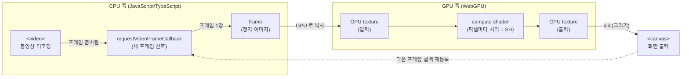

# 2. HTML5 Video Player 파이프라인 개요

## 학습 목표

이 챕터를 마치면, 우리가 만들 비디오 플레이어가 **"비디오 프레임 한 장을 받아서 → GPU 로 처리하고 → 화면(canvas)에 그린다"** 라는 하나의 반복 루프라는 것을 머릿속에 그릴 수 있습니다. 그 루프를 어떻게 시작하는지(`requestVideoFrameCallback`), 프레임이 어떤 경로로 GPU 까지 가는지(`<video>` → GPU texture)를 말로 설명할 수 있게 됩니다. 이 그림이 튜토리얼 전체(3~21장)의 뼈대입니다.

## 예상 소요 시간 · 난이도

약 30분 · ★☆☆☆☆ (개념 챕터, 작성할 코드 없음)

## 사전 지식

- 1장: GPGPU 와 WebGPU 의 목적 (왜 GPU 로 계산하는가)
- HTML 의 `<video>`, `<canvas>` 를 화면에 띄워본 경험
- `requestAnimationFrame` 같은 콜백 기반 반복을 본 적 있으면 더 좋음 (없어도 됨)

> 이 챕터는 **개념을 그리는** 챕터입니다. 실제 WebGPU 코드는 6장부터 한 줄씩 만듭니다. 여기서는 전체 지도를 먼저 봅니다.

## 개념 설명

### 우리가 만들 것을 한 문장으로

최종 데모는 결국 이 한 줄을 **초당 수십 번 반복**하는 프로그램입니다.

```text
비디오에서 새 프레임이 준비됨 → 그 프레임을 GPU 로 보냄 → GPU 가 처리(Super Resolution) → 결과를 canvas 에 그림
```

복잡해 보이는 SR 모델도, 화려한 셰이더도, 결국 이 반복 루프 안의 "처리" 한 칸을 채우는 것뿐입니다. 그래서 이 루프부터 이해하면 나머지 챕터가 전부 "이 칸 안에서 무슨 일이 일어나는가"로 읽힙니다.

### 등장인물 4명

| 이름 | 정체 | 역할 |
|------|------|------|
| `<video>` | HTML 요소 | 동영상을 디코딩해서 **프레임을 한 장씩 만들어내는 공장** |
| frame | 한 시점의 정지 이미지 | `<video>` 가 "지금 보여줄 그림" 한 장. 가로×세로 픽셀 격자 |
| GPU texture | GPU 메모리 안의 이미지 | GPU 가 읽고 쓸 수 있는 형태로 올려둔 프레임 |
| `<canvas>` | HTML 요소 | GPU 가 만든 결과를 **화면에 보여주는 출력 창** |

비유하자면 `<video>` 는 필름을 한 컷씩 뽑아주는 영사기이고, GPU texture 는 그 컷을 올려둔 작업대, `<canvas>` 는 완성본을 거는 액자입니다.

> 주의(`<video>` vs `<canvas>` 역할 구분): 신입이 자주 헷갈리는 지점입니다. `<video>` 는 **입력(소스)**, `<canvas>` 는 **출력(결과)** 입니다. 화면에는 `<canvas>` 만 보이게 하고, `<video>` 는 프레임을 공급하는 용도로 숨겨두는 경우가 많습니다. 둘을 같은 "비디오 화면"으로 뭉뚱그리지 마세요.

### 전체 파이프라인 (이 그림이 튜토리얼의 뼈대)

아래 그림이 이 튜토리얼 전체에서 가장 중요한 한 장입니다. 앞으로 어떤 챕터를 보든 "지금 나는 이 그림의 어느 칸을 만들고 있나"를 떠올리세요.



이 그림에서 짚을 점 세 가지입니다.

1. **루프다.** 맨 오른쪽에서 다시 왼쪽(`requestVideoFrameCallback`)으로 점선이 돌아갑니다. 프레임 한 장을 처리하고 끝이 아니라, "다음 프레임 알려줘"를 다시 등록해서 영상이 끝날 때까지 돕니다.
2. **경계선이 있다.** 왼쪽 절반은 CPU(자바스크립트)가 사는 곳, 오른쪽 절반은 GPU 가 사는 곳입니다. 프레임이 이 경계를 넘어 GPU 로 "복사"되는 순간이 핵심이고, 19장에서 실제로 구현합니다.
3. **가운데 칸(compute shader)이 이 튜토리얼의 본체입니다.** 3~18장 전체가 이 한 칸을 채우는 과정입니다. 처음엔 grayscale 같은 단순 필터로, 마지막엔 CNN Super Resolution 으로.

### 루프는 어떻게 시작되나: `requestVideoFrameCallback`

브라우저는 "비디오에 **새 프레임**이 화면에 표시될 준비가 됐다"는 시점을 우리에게 알려주는 콜백을 제공합니다. 바로 `video.requestVideoFrameCallback(callback)` 입니다.

`requestAnimationFrame` 을 써봤다면 형태가 똑같습니다. 차이는, `requestAnimationFrame` 은 "화면이 다시 그려질 때마다"(보통 60Hz) 불리는 반면, `requestVideoFrameCallback` 은 **비디오 프레임이 실제로 새로 나왔을 때만** 불립니다. 30fps 영상이면 초당 30번만 불리므로, 같은 프레임을 쓸데없이 두 번 처리하는 낭비가 없습니다.

콜백 등록 구조는 이렇게 생겼습니다.

```ts
const video = document.querySelector("video")!;

function onFrame(now: DOMHighResTimeStamp, metadata: VideoFrameCallbackMetadata) {
  // 1) 지금 video 에는 새 프레임이 준비되어 있다.
  // 2) 이 프레임을 GPU texture 로 복사하고, 처리하고, canvas 에 그린다. (뒤 챕터에서 구현)
  // ...

  // 3) 다음 프레임도 처리하려면 콜백을 "다시" 등록한다. ← 이게 루프를 도는 핵심
  video.requestVideoFrameCallback(onFrame);
}

// 루프 시작: 첫 콜백 등록
video.requestVideoFrameCallback(onFrame);
```

핵심은 마지막 줄과 콜백 안 3번입니다. `requestVideoFrameCallback` 은 **한 번만** 부릅니다(자동 반복이 아닙니다). 그래서 콜백이 끝나기 전에 자기 자신을 다시 등록해야 다음 프레임에도 불립니다. 이렇게 "처리 → 재등록 → 처리 → 재등록"이 위 다이어그램의 점선 화살표(루프)입니다.

콜백의 두 번째 인자 `metadata` 에는 이 프레임의 타임스탬프(`mediaTime`), 지금까지 표시된 프레임 수(`presentedFrames`) 같은 정보가 들어 있습니다. 재생/일시정지/seek 처리나 프레임 스킵 전략에서 쓰는데, 자세한 활용은 20장에서 다룹니다.

> 주의(브라우저 지원): `requestVideoFrameCallback` 은 비교적 최신 API 입니다. 대부분의 최신 Chrome/Edge/Safari 에서 동작하지만, 진짜 실무에서는 `if ("requestVideoFrameCallback" in HTMLVideoElement.prototype)` 로 존재 여부를 확인하고, 없으면 `requestAnimationFrame` 으로 대체하는 코드를 둡니다. 이 대체 전략도 20장에서 정리합니다.

### 프레임이 GPU 로 가는 길

`<video>` 의 한 프레임은 그냥 픽셀 격자(가로×세로의 RGBA 값)입니다. 하지만 compute shader 가 읽으려면 그 픽셀들을 **GPU 메모리 안의 texture** 로 올려야 합니다. CPU 메모리에 있는 그림을 GPU 가 직접 읽지는 못하기 때문입니다.

WebGPU 에서는 이 복사를 한 줄로 합니다(개념만 미리 봅니다. 실제 사용은 19장).

```ts
// video 의 현재 프레임을 GPU texture 로 복사한다 (개념 미리보기)
device.queue.copyExternalImageToTexture(
  { source: video },        // 소스: 지금 video 가 보여주는 프레임
  { texture: inputTexture }, // 목적지: GPU 안의 입력 texture
  [video.videoWidth, video.videoHeight],
);
```

이 한 줄이 위 다이어그램의 `frame → GPU texture` 화살표, 즉 CPU/GPU 경계를 넘는 지점입니다. 그 뒤로는 모든 작업이 GPU 안에서 일어납니다(처리 → 출력 texture → canvas).

> 주의(매 프레임 새 객체 만들지 않기 — 후속 챕터 예고): 위에서 `inputTexture` 를 **콜백 안에서 새로 만들면 안 됩니다.** 프레임마다 texture·pipeline·bind group 을 새로 생성하면 GPU 메모리가 금방 터지고 프레임이 뚝뚝 끊깁니다. 이런 무거운 객체는 루프 **밖에서 한 번만** 만들어두고, 콜백 안에서는 내용만 갱신해 재사용합니다. 이 "재사용 구조"가 실시간 데모의 성능을 좌우하며, 19~22장에서 본격적으로 다룹니다. 지금은 "프레임마다 만들지 말 것"만 기억하세요.

### WebGPU 없이도 흐름을 체감하는 초간단 버전

GPU 처리를 빼면, 같은 루프를 평범한 2D canvas API 만으로도 만들 수 있습니다. "비디오 → 프레임 → 화면"이라는 뼈대가 GPU 와 무관하게 똑같다는 걸 보여주는 예입니다.

```ts
const video = document.querySelector("video")!;
const canvas = document.querySelector("canvas")!;
const ctx = canvas.getContext("2d")!;

function onFrame() {
  // 비디오의 현재 프레임을 그대로 canvas 에 그린다 (처리 없이 복사만)
  ctx.drawImage(video, 0, 0, canvas.width, canvas.height);
  video.requestVideoFrameCallback(onFrame); // 다음 프레임 재등록 (루프)
}
video.requestVideoFrameCallback(onFrame);
```

이 코드의 `drawImage` 자리가, 우리 튜토리얼에서는 **"GPU 로 복사 → compute shader 처리 → canvas 출력"** 으로 바뀝니다. 즉 우리가 하는 일은 이 단순한 `drawImage` 한 줄을, 픽셀마다 병렬 계산하는 GPU 파이프라인으로 키우는 것입니다. 루프의 형태 자체는 처음부터 끝까지 동일합니다.

> 이 챕터에는 실행 코드(`index.html`/`src`)가 없습니다. 위 스니펫들은 개념을 보여주기 위한 것이고, 아직 샘플 비디오 파일이 준비되지 않았습니다. 실제로 돌려보는 것은 19~21장(Video Player 연결)에서 합니다.

## 완성되면 이런 화면

이 챕터는 개념 챕터라 직접 만드는 화면은 없습니다. 대신 이 그림을 머릿속에 그릴 수 있으면 성공입니다.

- 화면에는 `<canvas>` 하나가 보이고, 그 안에서 동영상이 매끄럽게 재생된다.
- 보이지 않는 곳에서는, 새 프레임이 나올 때마다 `requestVideoFrameCallback` → GPU texture 복사 → compute shader 처리 → canvas 출력이 **초당 수십 번** 반복되고 있다.
- 21장의 최종 데모에서는 이 canvas 가 좌/우로 나뉘어 한쪽은 원본, 한쪽은 Super Resolution 결과를 보여주고, FPS 와 GPU 처리 시간이 함께 표시된다.

> 21장 완성 화면 미리보기 자리: `docs/assets/21-sr-player.png` (해당 챕터에서 직접 캡처해 추가)

## 자가 점검 질문

스스로 설명할 수 있는지 확인하세요. (정답을 외우는 게 아니라 "설명할 수 있는가"입니다)

1. 이 비디오 플레이어의 전체 파이프라인을 `<video>` 부터 `<canvas>` 까지 4~5단계로 그려서 설명해보세요. 그 중 CPU 에서 일어나는 일과 GPU 에서 일어나는 일의 경계는 어디인가요?
2. `requestVideoFrameCallback` 의 콜백 안에서 왜 `video.requestVideoFrameCallback(onFrame)` 을 다시 호출해야 하는지(루프가 도는 원리)를 설명해보세요. `requestAnimationFrame` 과 비교하면 무엇이 더 낫나요?
3. 비디오 프레임을 처리하려면 왜 GPU texture 로 "복사"하는 단계가 필요한지(CPU 메모리와 GPU 메모리의 관계와 함께) 설명해보세요. 그리고 이 texture 를 매 프레임 새로 만들면 왜 안 되나요?
