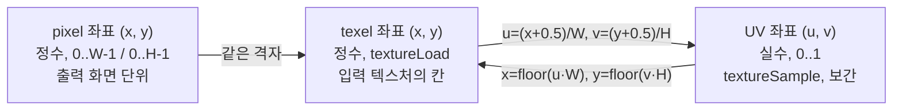

# 3. 픽셀 데이터 이해

## 학습 목표

이 챕터를 마치면, 이미지가 메모리에서 **숫자 배열**로 어떻게 표현되는지 설명할 수 있습니다. 구체적으로 RGBA 채널 구성, 0~255 정수 색상과 0~1 float 색상의 차이, 이미지 좌표계(원점과 Y축 방향), 그리고 **pixel · texel · UV 좌표**의 차이를 구분할 수 있습니다. 이 개념은 이후 모든 CPU/GPU 이미지 처리 챕터의 전제가 됩니다.

## 예상 소요 시간 · 난이도

약 30분 · ★☆☆☆☆ (개념 + 작은 인터랙티브 데모, WebGPU 불필요)

## 사전 지식

- TypeScript 기본 문법, `<canvas>` 2D context 사용 경험
- 1차원 배열 인덱싱, 그리고 2차원 행렬을 1차원으로 펴는 인덱스 식 (선형대수의 행 우선 저장)
- (선택) 1~2장 GPGPU/비디오 파이프라인 개요 — 안 봤어도 이 챕터는 독립적으로 진행됩니다.

## 개념 설명

### 이미지는 결국 숫자 배열이다

화면에 보이는 이미지 한 장은, 메모리에서는 그냥 **숫자들의 배열**입니다. 가로 $W$, 세로 $H$ 픽셀짜리 이미지는 $W \times H$ 개의 픽셀을 가지고, 픽셀 하나는 보통 색을 나타내는 몇 개의 숫자(채널, channel)로 이루어집니다.

브라우저의 `CanvasRenderingContext2D.getImageData()` 가 돌려주는 `ImageData.data` 가 바로 그 배열입니다. 타입은 `Uint8ClampedArray`(0~255 정수), 길이는 $W \times H \times 4$ 입니다. 픽셀 하나가 **R, G, B, A 네 칸을 연속으로** 차지합니다.

```text
배열:  [ R0 G0 B0 A0 | R1 G1 B1 A1 | R2 G2 B2 A2 | ... ]
        └─ 픽셀 0 ─┘   └─ 픽셀 1 ─┘   └─ 픽셀 2 ─┘
```

### RGB 와 RGBA

- **RGB**: Red, Green, Blue 세 채널. 빛의 삼원색을 더해(additive) 색을 만듭니다. $(255, 0, 0)$ 은 빨강, $(255, 255, 255)$ 는 흰색입니다.
- **RGBA**: 여기에 **A(Alpha, 불투명도)** 채널을 더한 것. $A = 255$ 면 완전 불투명, $A = 0$ 이면 완전 투명입니다.

브라우저 캔버스와 대부분의 GPU 텍스처는 채널 4개짜리(RGBA)를 기본으로 씁니다. 채널이 4개로 딱 맞아 메모리 정렬(alignment)이 깔끔하기 때문입니다. RGB 만 필요해도 A 채널은 보통 그냥 따라옵니다.

> 주의(채널 4개 한계): `rgba8` 텍스처는 채널이 4개뿐입니다. 뒤쪽 CNN 챕터에서 8채널 feature map 을 다룰 때는 텍스처 한 장으로 부족해, storage buffer 나 텍스처 여러 장으로 나눠 저장하게 됩니다. 지금은 "한 픽셀 = 4채널" 이라는 기본형만 확실히 잡아두세요.

색 벡터로 보면 픽셀 하나는 길이 4인 벡터입니다.

```math
\mathbf{c} = (r,\ g,\ b,\ a)
```

grayscale·convolution 같은 연산은 이 색 벡터에 가하는 산술이라, 선형대수에서 배운 벡터 연산이 그대로 적용됩니다. (예: 13장의 grayscale 은 RGB 벡터와 가중치 벡터의 내적입니다.)

### 0~255 정수 색상 vs 0~1 float 색상

같은 색을 두 가지 표현으로 다룹니다.

| 표현 | 범위 | 타입 예 | 주로 쓰는 곳 |
|------|------|---------|--------------|
| 정수(integer) | $0 \sim 255$ | `Uint8ClampedArray`, `rgba8unorm` 텍스처 | 저장·전송 (메모리 절약) |
| float | $0.0 \sim 1.0$ | `f32`, WGSL `vec4f` | 계산 (특히 GPU/셰이더) |

둘은 단순한 비례 변환입니다.

```math
c_{\text{float}} = \frac{c_{\text{int}}}{255}, \qquad
c_{\text{int}} = \operatorname{round}\!\left(c_{\text{float}} \times 255\right)
```

예를 들어 정수 $128$ 은 float 약 $0.502$, 정수 $255$ 는 float $1.0$ 입니다.

> 주의(양자화 오차): 정수↔float 왕복은 손실이 있습니다. float $0.502$ 를 다시 정수로 만들면 $128$ 로 돌아오지만, 중간 계산 결과를 8비트 정수 텍스처(`rgba8unorm`)에 저장하면 $1/255 \approx 0.004$ 단위로 **반올림**됩니다. 그래서 13장에서 CPU 와 GPU 결과를 비교할 때 "오차 ≤ 2" 정도는 정상으로 봅니다. 음수가 나올 수 있는 중간 결과(residual 등)는 0~1 로 클램프되는 정수 텍스처 대신 float 저장을 써야 잘리지 않습니다.

WGSL 셰이더는 색을 거의 항상 **0~1 float** 로 다룹니다. `textureLoad` 로 `rgba8unorm` 텍스처를 읽으면 GPU 가 자동으로 $/255$ 해서 `vec4f` 로 줍니다. 그러니 "메모리엔 정수, 계산은 float" 라는 두 세계를 머릿속에서 분리해 두세요.

### 이미지 좌표계: 원점은 좌상단

이미지 좌표계의 원점 $(0, 0)$ 은 **왼쪽 위 모서리**입니다. $x$ 는 오른쪽으로, $y$ 는 **아래로** 증가합니다. 수학 시간에 익숙한 그래프(원점이 왼쪽 아래, $y$ 가 위로 증가)와 **Y축 방향이 반대**입니다.

```text
   (0,0) ──────────── x 증가 ──────────▶  (W-1, 0)
     │  ┌───┬───┬───┬─ ... ─┐
     │  │   │   │   │       │   각 칸 = 픽셀 1개
     y  ├───┼───┼───┼─ ... ─┤
   증가 │   │   │   │       │
     │  ├───┼───┼───┼─ ... ─┤
     ▼  └───┴───┴───┴─ ... ─┘
  (0, H-1)                    (W-1, H-1)
```

> 주의(Y축 뒤집힘 함정): 이미지/캔버스/비디오는 원점이 **좌상단**, $y$ 가 아래로 증가합니다. 그런데 일부 GPU 텍스처 좌표 관례나 NDC(정규화 장치 좌표)는 원점이 **좌하단**이라 $y$ 가 위로 증가합니다. 이 차이를 무시하면 결과가 **상하 반전**되어 나옵니다. "이미지가 뒤집혀 보여요" 의 단골 원인이며, 뒤의 WebGPU 출력 챕터에서 다시 만나게 됩니다. 지금은 "이미지 좌표의 Y는 아래로 증가한다" 를 확실히 기억해 두세요.

### 2D 좌표를 1D 인덱스로: 행 우선 저장

배열은 1차원인데 이미지는 2차원입니다. 둘을 잇는 게 **행 우선(row-major) 저장**입니다. $y$ 행을 먼저 다 채우고 다음 행으로 넘어가므로, 픽셀 $(x, y)$ 의 인덱스는 이렇게 계산합니다.

```math
\text{pixelIndex} = y \cdot W + x
```

이건 선형대수에서 행렬 $M$ 을 1차원으로 펼 때 쓰는 바로 그 인덱싱입니다. $M_{y,x}$ (행 $y$, 열 $x$) 원소가 1차원 배열의 $y \cdot W + x$ 번째에 옵니다. 채널이 4개니 실제 배열 offset 은 한 번 더 곱합니다.

```math
\text{offset} = \text{pixelIndex} \times 4 = (y \cdot W + x)\,\times 4
```

그래서 픽셀 $(x, y)$ 의 R/G/B/A 는 `data[offset]`, `data[offset+1]`, `data[offset+2]`, `data[offset+3]` 입니다.

### pixel, texel, UV 좌표의 차이

이 세 용어는 비슷해 보이지만 가리키는 게 다릅니다.

- **pixel (픽셀)**: **출력 화면/이미지** 위의 점 한 개. 정수 좌표 $(x, y)$, 범위 $0 \le x < W,\ 0 \le y < H$. 우리가 화면에서 보는 단위입니다.
- **texel (텍셀, texture element)**: **텍스처(GPU 메모리에 올린 이미지)** 안의 한 칸. 개념은 픽셀과 같지만, "입력 텍스처 쪽의 셀" 을 가리킬 때 texel 이라고 구분해 부릅니다. `textureLoad(tex, vec2i(x, y), 0)` 처럼 **정수 좌표**로 특정 texel 을 콕 집어 읽습니다.
- **UV 좌표**: 텍스처를 가리키는 **정규화된 실수 좌표**, 범위 $[0, 1]$. $u$ 는 가로, $v$ 는 세로. 해상도에 무관하게 "가로로 30% 지점, 세로로 70% 지점" 같이 **비율**로 위치를 말합니다. `textureSample` 로 텍스처를 샘플링할 때(보간 포함) 이 좌표를 씁니다.

정수 픽셀 좌표 $(x, y)$ 와 UV 좌표의 변환은 다음과 같습니다. 픽셀의 **중심**을 가리키려고 $+0.5$ 를 더합니다.

```math
u = \frac{x + 0.5}{W}, \qquad v = \frac{y + 0.5}{H}
```

```math
x = \lfloor u \cdot W \rfloor, \qquad y = \lfloor v \cdot H \rfloor
```

왜 $+0.5$ 인가? 픽셀 $x = 0$ 은 폭 1짜리 칸이고 $u = 0 \sim 1/W$ 구간 전체를 차지합니다. 그 칸의 **가운데**는 $u = 0.5/W$ 입니다. $+0.5$ 를 빼먹으면 픽셀 경계(모서리)를 가리키게 되어, 샘플링할 때 옆 픽셀과 절반씩 섞이는 미묘한 흐림/어긋남이 생깁니다.

```text
픽셀 인덱스:     0       1       2       3      (W = 4)
              ┌───────┬───────┬───────┬───────┐
              │   ·   │   ·   │   ·   │   ·   │   · = 픽셀 중심
              └───────┴───────┴───────┴───────┘
UV(u):        0     0.25    0.5    0.75      1.0
중심 u:        0.125   0.375  0.625   0.875        = (x+0.5)/W
```

정리하면, **pixel/texel 은 정수 격자 위의 칸**이고, **UV 는 그 격자를 $[0,1]$ 로 정규화한 연속 좌표**입니다. 같은 위치를 두 가지 자(ruler)로 잰다고 생각하면 됩니다.



## 완성되면 이런 화면

왼쪽에 테스트 이미지(그라데이션 + 체커보드 + 흰 원), 오른쪽에 마우스가 가리킨 픽셀 주변 16×16 영역의 확대 뷰가 보입니다. 확대 뷰의 가운데 빨간 테두리 칸이 지금 가리키는 픽셀입니다. 아래 stats 패널에는 마우스를 따라 실시간으로 다음이 표시됩니다.

- `좌표 (x, y)` — 정수 픽셀 좌표
- `pixel index (y·W+x)` — 1D 배열 인덱스와 실제 배열 offset
- `RGBA 0~255` — 정수 색상
- `RGBA 0~1 float` — float 색상
- `UV (u, v)` — 정규화 좌표
- `색` — 해당 픽셀 색을 칠한 작은 스와치

이미지 위에서 마우스를 움직이며, **같은 픽셀이 정수와 float 두 표현으로, 그리고 pixel 좌표와 UV 좌표 두 자로** 동시에 보이는 것을 체감하세요. 왼쪽 위로 갈수록 $(x, y)$ 와 $u, v$ 가 0 에 가까워지고, 오른쪽 아래로 갈수록 1 에 가까워지는 것(Y가 아래로 증가)도 확인하세요.

> 스크린샷: `docs/assets/03-pixel-data.png` (직접 캡처해 추가)

## 자가 점검 질문

스스로 설명할 수 있는지 확인하세요. (정답을 외우는 게 아니라 "설명할 수 있는가" 입니다)

1. 256×256 RGBA 이미지에서 픽셀 $(10, 3)$ 의 R 값은 `data` 배열의 몇 번째 칸에 있나요? $y \cdot W + x$ 와 $\times 4$ 를 써서 계산 과정을 설명해보세요.
2. 같은 색을 0~255 정수와 0~1 float 로 표현할 때의 변환식을 쓰고, 정수 텍스처에 중간 결과를 저장하면 왜 오차가 생기는지(양자화) 설명해보세요.
3. pixel, texel, UV 좌표의 차이를 설명하고, UV 변환에서 $+0.5$ 를 더하는 이유를 픽셀 중심 개념으로 설명해보세요. 또 이미지 좌표계에서 Y축이 어느 방향으로 증가하는지, 그게 왜 함정이 되는지 말해보세요.
