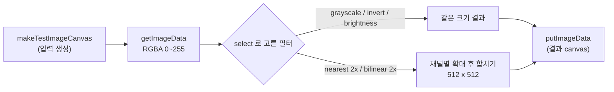
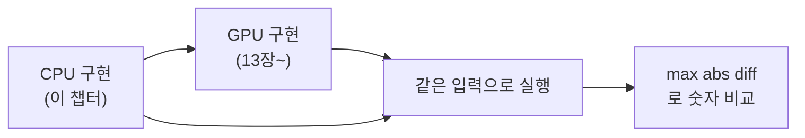

# 4. CPU로 먼저 만드는 이미지 처리

## 학습 목표

이 챕터를 마치면, WebGPU 없이 **2D canvas 와 순수 TypeScript 만으로** 다섯 가지 기본 이미지 처리를 직접 구현할 수 있습니다: grayscale, invert, brightness, nearest-neighbor 2x upscale, bilinear 2x upscale. 그리고 이 CPU 구현들이 왜 **이후 GPU 챕터(13장~)의 "정답 기준"** 이 되는지 이해하게 됩니다. 같은 연산을 먼저 CPU 로 정확히 만들어 두면, 나중에 GPU 결과가 맞는지를 "눈으로 비슷"이 아니라 **숫자로** 검증할 수 있습니다.

## 예상 소요 시간 · 난이도

약 35분 · ★☆☆☆☆ (수학·GPU 없이 픽셀 루프만)

## 사전 지식

- 3장 픽셀 데이터 (RGBA, **0~255 정수 색상 vs 0~1 float 색상**, 이미지 좌표계)
- `<canvas>` 2D context, `getImageData` / `putImageData` 사용 경험
- 대학 선형대수 기초: 벡터의 **선형결합(가중 평균)**, 내적(dot product)

> 이 챕터는 **WebGPU 가 필요 없습니다.** `navigator.gpu` 없이도 동작합니다. GPU 는 다음 파트(6장~)에서 시작하고, 여기서는 "GPU 가 나중에 똑같이 해낼 계산"을 CPU 로 먼저 만들어 둡니다.

## 개념 설명

### 픽셀은 숫자 배열이다 — RGBA 와 두 가지 색 표현

canvas 의 `getImageData(...).data` 는 길이 `width * height * 4` 의 `Uint8ClampedArray` 입니다. 픽셀 하나가 R, G, B, A 네 개의 **0~255 정수**로 연속 저장됩니다.

```text
픽셀 0        픽셀 1        픽셀 2
[R G B A]    [R G B A]    [R G B A]  ...
 0 1 2 3      4 5 6 7      8 9 ...
```

같은 색을 **0~1 float** 로도 표현합니다. 정수 `200` 은 float `200/255 ≈ 0.784` 입니다. GPU(WGSL)에서는 색을 거의 항상 0~1 float `vec4f` 로 다루므로, 이 두 표현을 자유롭게 오갈 수 있어야 합니다.

> 주의(0~255 정수 vs 0~1 float 혼동): 이 챕터에서 **가장 흔한 버그**입니다. `Uint8ClampedArray` 의 값은 0~255 정수인데, 거기에 float 밝기 `0.2` 를 그냥 더하면 사실상 아무 변화도 없습니다(`200 + 0.2` 가 다시 `200` 으로 반올림). brightness 처럼 0~1 기준으로 정의된 연산은 **먼저 `/255` 로 0~1 로 바꾼 뒤** 계산하고, 마지막에 `*255` 로 되돌려야 합니다.

전체 데모 흐름은 다음과 같습니다.



### grayscale 와 invert 는 픽셀 하나만 보면 된다 (재사용)

이 둘은 `src/math/color.ts` 에 이미 구현돼 있고, **그대로 재사용**합니다(중복 구현 금지). 둘 다 "현재 픽셀 하나만 보고 출력 픽셀을 정하는" pointwise 연산입니다.

- **grayscale**: RGB 벡터와 luma 가중치 벡터의 **내적**. $\text{luma} = 0.2126\,r + 0.7152\,g + 0.0722\,b$. (자세한 유도는 13장에서.)
- **invert**: 각 채널을 $255 - c$ 로 뒤집기.

### brightness $=\mathrm{clamp}(c + b,\ 0,\ 1)$

brightness 는 `src/math` 에 아직 없으므로 이 챕터에서 **lesson 로컬 함수**로 구현합니다. 정의는 간단합니다. 각 색 채널 $c \in [0, 1]$ 에 밝기 상수 $b$ 를 더하고, 결과를 $[0, 1]$ 범위로 자릅니다(clamp).

```math
\mathrm{brightness}(c) = \mathrm{clamp}(c + b,\ 0,\ 1)
= \min\bigl(1,\ \max(0,\ c + b)\bigr)
```

여기서 $c$ 는 한 채널의 색 값(0~1 float), $b$ 는 밝기 오프셋입니다. 데모에서는 $b = 0.2$ 로, "조금 더 밝게"를 적용합니다. 세 채널 R, G, B 에 각각 같은 $b$ 를 더하고, 알파 A 는 건드리지 않습니다.

```math
\begin{bmatrix} r' \\ g' \\ b' \end{bmatrix}
= \mathrm{clamp}\!\left(
\begin{bmatrix} r \\ g \\ b \end{bmatrix} + b\,\mathbf{1},\ 0,\ 1 \right),
\qquad \mathbf{1} = \begin{bmatrix} 1 \\ 1 \\ 1 \end{bmatrix}
```

> 주의(clamp 누락): clamp 를 빠뜨리면 어떻게 될까요? `Uint8ClampedArray` 는 이름처럼 대입할 때 자동으로 0~255 로 잘라주므로 **화면은 멀쩡해 보입니다**. 하지만 그게 함정입니다. GPU(WGSL)의 `f32` storage 나 중간 계산에는 그런 자동 clamp 가 없어서, $c + b$ 가 1을 넘으면 그 값이 그대로 다음 단계로 흘러가 결과가 달라집니다(특히 residual 을 다루는 SR 챕터에서). 그래서 **연산 정의 자체에 clamp 를 명시**해 두는 습관이 중요합니다. "타입이 알아서 잘라주니까"에 기대지 마세요.

### upscale: 단일 채널 평면 함수를 컬러에 적용하기

확대(upscale)는 출력 픽셀이 입력에 정확히 대응하지 않기 때문에, "주변 픽셀을 어떻게 섞을 것인가"가 핵심입니다. `src/math/upscale.ts` 의 `nearestUpscale` / `bilinearUpscale` 를 재사용합니다.

이 함수들은 SR(Super Resolution) 파이프라인의 channel-wise 처리를 염두에 두고 **"단일 채널 평면(plane)" 기준**으로 작성돼 있습니다. 입력이 `Float32Array` 한 장(채널 하나)입니다. 그래서 RGBA 컬러 이미지를 확대하려면 두 가지 방법 중 하나를 택해야 합니다.

1. **채널별 처리**: R, G, B, A 를 각각 평면으로 뽑아 따로 확대한 뒤 다시 RGBA 로 합친다.
2. **luma 평면 시연**: 컬러를 luma 한 채널로 줄여 확대만 보여준다.

이 데모는 **(1) 채널별 처리**를 택했습니다. 색을 유지한 채 nearest 와 bilinear 의 차이를 그대로 보여줄 수 있고, 실제 RGB 이미지 확대와 동일한 결과가 나오기 때문입니다. (luma 한 장만 확대하면 흑백이 되어, 13장에서 만든 grayscale 데모와 시각적으로 겹칩니다.) 코드에서는 `extractChannel` 로 채널을 뽑고, 네 번 확대한 뒤 인터리브해 합칩니다.

> 참고: bilinear 는 채널마다 **독립적으로** 보간해도 색이 자연스럽게 섞입니다. 이는 보간이 **선형 연산**이라, 각 채널에 따로 적용하든 벡터로 한 번에 적용하든 결과가 같기 때문입니다(아래 선형결합 설명 참고).

#### nearest-neighbor: 가장 가까운 원본 픽셀 복제

출력 좌표 $(x, y)$ 를 스케일로 나눠 가장 가까운 원본 픽셀 하나를 그대로 가져옵니다.

```math
\mathrm{out}(x, y) = \mathrm{in}\bigl(\lfloor x / s \rfloor,\ \lfloor y / s \rfloor\bigr)
```

여기서 $s$ 는 스케일(여기선 2)입니다. 계산은 빠르지만, 한 원본 픽셀이 $s \times s$ 블록으로 그대로 복제되므로 경계가 **계단(blocky)** 처럼 보입니다.

#### bilinear: 주변 4개 픽셀의 선형결합 (가중 평균)

bilinear 는 출력 픽셀 중심을 원본 좌표로 역산한 뒤, 그 좌표를 둘러싼 **4개 픽셀**을 거리에 따라 섞습니다. 먼저 출력 픽셀 중심 $(x+0.5, y+0.5)$ 를 원본 좌표로 되돌립니다.

3장에서 배웠던 UV 좌표 변환을 떠올려 봅시다.

**원본 픽셀 $i$ → 출력 픽셀 $j$**

픽셀은 점이 아니라 작은 사각형입니다. 인덱스 $i$ 인 픽셀의 **중심**은 좌표 $i + 0.5$ 에 있습니다. 두 이미지가 같은 물리적 영역을 덮는다고 보면, 원본 픽셀 중심을 정규화(0~1) 좌표로 변환한 뒤, 출력 이미지 크기로 다시 스케일합니다.

```math
\underbrace{\frac{i + 0.5}{W_{\text{src}}}}_{\text{정규화 }u}
\times W_{\text{out}}
= \frac{i + 0.5}{W_{\text{src}}} \times W_{\text{src}} \cdot s
= (i + 0.5)\, s
```

출력 픽셀 $j$ 의 중심도 $j + 0.5$ 이므로

```math
j + 0.5 = (i + 0.5)\, s \quad \Longrightarrow \quad j = (i + 0.5)\, s - 0.5
```

**출력 픽셀 $x$ → 원본 좌표 $x_{\text{src}}$**

본론으로 돌아와, 원본좌표를 구하기 위해 위 식을 $i$ 에 대해 풀면

```math
x + 0.5 = (x_{\text{src}} + 0.5)\, s
\quad \Longrightarrow \quad
x_{\text{src}} = \frac{x + 0.5}{s} - 0.5
```

> 주의: $s = 2$, 출력 첫 번째 픽셀($x = 0$)을 대입하면 $x_{\text{src}} = -0.25$ 로 음수가 나옵니다. 출력 이미지의 가장자리 픽셀 중심이 원본 이미지의 첫 픽셀 중심보다 **왼쪽**에 있기 때문입니다. 구현에서는 이 경우 원본 경계 픽셀값으로 clamp 합니다.

```math
x_{\text{src}} = \frac{x + 0.5}{s} - 0.5, \qquad
y_{\text{src}} = \frac{y + 0.5}{s} - 0.5
```

정수 부분 $x_0 = \lfloor x_{\text{src}} \rfloor$, $y_0 = \lfloor y_{\text{src}} \rfloor$ 과 소수 부분(보간 비율) $t_x = x_{\text{src}} - x_0$, $t_y = y_{\text{src}} - y_0$ 을 구합니다. 네 이웃 픽셀의 값을 다음과 같이 둡니다.

```text
   x0        x1=x0+1
y0  v00 ───────── v10        tx: 가로 보간 비율 (0~1)
     │   (tx,ty)    │        ty: 세로 보간 비율 (0~1)
     │     •        │
y1  v01 ───────── v11
```

먼저 **가로**로 위/아래 두 줄을 각각 보간하고(1차 선형보간), 그 두 결과를 다시 **세로**로 보간합니다.

```math
\begin{aligned}
\text{top} &= (1 - t_x)\, v_{00} + t_x\, v_{10} \\
\text{bot} &= (1 - t_x)\, v_{01} + t_x\, v_{11} \\
\mathrm{out} &= (1 - t_y)\,\text{top} + t_y\,\text{bot}
\end{aligned}
```

##### 1차 선형보간 = 두 벡터의 1차 선형결합

핵심은 **선형보간(linear interpolation)이 곧 두 값의 1차 선형결합(가중 평균)** 이라는 점입니다. 두 점 $a, b$ 를 비율 $t \in [0,1]$ 로 섞는 보간은

```math
\mathrm{lerp}(a, b, t) = (1 - t)\, a + t\, b
```

입니다. 이는 선형대수에서 배운 **선형결합** $\alpha\, a + \beta\, b$ 의 특수한 경우로, 계수가 $\alpha = 1 - t$, $\beta = t$ 이고 **합이 1** 입니다($\alpha + \beta = 1$). 계수 합이 1인 선형결합을 **affine combination(가중 평균)** 이라 부르고, 그래서 결과가 항상 $a$ 와 $b$ "사이"에 놓입니다.

bilinear 는 이 1차 보간을 **세 번** 한 것뿐입니다(가로 2번 + 세로 1번). 위 세 식을 순서대로 대입해 전개하면 내적이 나옵니다.

**1단계: top, bot 을 out 에 대입**

```math
\mathrm{out} = (1 - t_y)\,\mathrm{top} + t_y\,\mathrm{bot}
= (1-t_y)\bigl[(1-t_x)\,v_{00} + t_x\,v_{10}\bigr]
+ t_y\bigl[(1-t_x)\,v_{01} + t_x\,v_{11}\bigr]
```

**2단계: 괄호 전개**

```math
= (1-t_y)(1-t_x)\,v_{00}
+ (1-t_y)\,t_x\,v_{10}
+ t_y(1-t_x)\,v_{01}
+ t_y\,t_x\,v_{11}
```

**3단계: 내적 형태로 묶기**

각 $v$ 앞의 계수를 가중치 벡터 $\mathbf{w}$, 픽셀값을 $\mathbf{v}$ 로 묶으면

```math
\mathrm{out} = \langle \mathbf{w},\ \mathbf{v} \rangle, \qquad
\mathbf{w} = \begin{bmatrix}(1-t_x)(1-t_y) \\ t_x(1-t_y) \\ (1-t_x)\,t_y \\ t_x\,t_y\end{bmatrix}, \qquad
\mathbf{v} = \begin{bmatrix}v_{00} \\ v_{10} \\ v_{01} \\ v_{11}\end{bmatrix}
```

네 가중치의 합은 항상 $1$ 입니다.

```math
(1-t_x)(1-t_y) + t_x(1-t_y) + (1-t_x)\,t_y + t_x\,t_y
= (1-t_y)\underbrace{[(1-t_x)+t_x]}_{1} + t_y\underbrace{[(1-t_x)+t_x]}_{1} = 1
```

즉 bilinear 는 **"가까운 픽셀일수록 더 크게 쳐주는 가중 평균"** 이고, 이게 13장 grayscale 의 내적, 그리고 5장 convolution 의 내적과 정확히 같은 수학입니다. 새로운 개념이 아니라, **이미 아는 내적/선형결합의 또 다른 옷**입니다.

#### nearest vs bilinear, 눈으로 보면

같은 입력을 2배로 키웠을 때 한 줄(1차원)에서의 차이입니다. 원본 값 `10` 과 `20` 사이를 채울 때:

```text
원본:        10                      20
            └─────────────────────────┘

nearest:    10    10    20    20        (가까운 쪽을 통째로 복제 → 계단)
            └──┘  └──┘  └──┘  └──┘

bilinear:   10  12.5  15  17.5  20      (사이 값을 선형보간 → 매끈)
            └─────────────────────────┘
```

nearest 는 값이 뚝뚝 끊겨 경계가 **블록/계단**처럼 보이고, bilinear 는 사이 값을 채워 **부드럽게** 이어집니다. 데모의 체커보드 경계와 흰 원의 가장자리를 두 모드로 번갈아 보면 차이가 뚜렷합니다. (SR 의 출발점이 bilinear 인 이유 — 14장에서 이어집니다.)

### 왜 CPU 로 먼저 만드나 — "정답 기준" 만들기

이 챕터의 진짜 목적은 다섯 필터 그 자체가 아니라, **GPU 결과를 검증할 기준(reference)** 을 미리 만드는 것입니다. GPU 코드는 비동기에 디버깅이 어렵습니다. 그래서 이 프로젝트는 항상 이 순서를 따릅니다.



같은 입력에 CPU 와 GPU 를 돌려 **최대 절대 차이(max abs diff)** 를 재고, 그게 충분히 작으면(예: `rgba8unorm` 양자화 오차 ≤ 2) 일치로 봅니다. "비슷해 보인다"가 아니라 숫자입니다. 그래서 CPU 구현은 **빠를 필요가 없고, 대신 정확하고 명확해야** 합니다 — 이게 기준이니까요.

## 완성되면 이런 화면

왼쪽에 컬러 입력 이미지(그라데이션 + 체커보드 + 흰 원), 오른쪽에 select 로 고른 필터 결과가 나란히 보입니다. select 를 바꾸면 즉시 결과가 갱신됩니다.

- **grayscale / invert / brightness**: 256×256 결과.
- **nearest 2x / bilinear 2x**: 512×512 결과(캔버스가 커집니다). nearest 는 계단형, bilinear 는 부드럽게 보입니다.

아래 stats 패널에 현재 `필터`, `출력 크기`, `CPU 시간(ms)` 이 표시됩니다.

> 스크린샷: `docs/assets/04-cpu-image-filters.png` (직접 캡처해 추가)

## 자가 점검 질문

스스로 설명할 수 있는지 확인하세요. (정답을 외우는 게 아니라 "설명할 수 있는가"입니다)

1. brightness 를 `0~255` 정수 배열에 그냥 `+0.2` 하면 왜 거의 변화가 없을까요? 0~1 float 로 바꿔 계산해야 하는 이유와 clamp 가 왜 정의에 들어가야 하는지 설명해보세요.
2. bilinear 보간이 "두 벡터의 1차 선형결합(가중 평균)"이라는 말의 의미를, 가중치 합이 1 이라는 점과 함께 설명해보세요. nearest 와 시각적으로 무엇이/왜 다른가요?
3. 이 챕터의 필터를 굳이 CPU 로 먼저 만드는 이유는 무엇인가요? "정답 기준(reference)"과 max abs diff 비교를 엮어서 설명해보세요.
