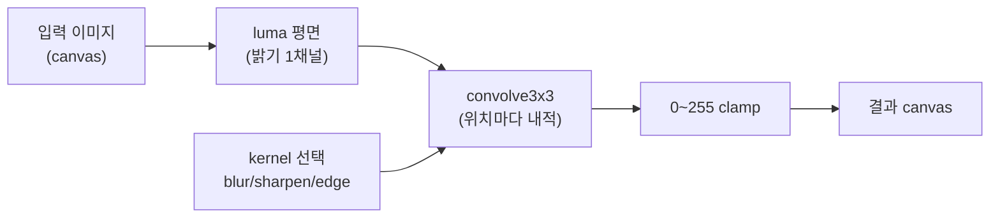

# 5. Convolution의 의미

## 학습 목표

이 챕터를 마치면, **convolution 이 결국 "주변 3x3 픽셀 벡터와 kernel 벡터의 내적(dot product)"** 이라는 것을 선형대수 언어로 설명할 수 있습니다. blur / sharpen / edge detection 같은 이미지 필터를 같은 한 가지 연산으로 이해하고, CPU 로 직접 적용해 원본과 결과를 비교할 수 있습니다. 그리고 경계 픽셀을 어떻게 처리(padding / clamp)하는지 압니다.

이 챕터는 이후 CNN 의 convolution layer 로 이어지는 **가장 중요한 개념적 다리**입니다. 여기서 convolution 을 내적으로 확실히 각인해 두면, 16장의 "CNN = 학습된 필터 여러 개"가 새로운 개념이 아니라 같은 연산의 확장으로 보입니다.

## 예상 소요 시간 · 난이도

약 40분 · ★★☆☆☆ (수학은 익숙한 내적, 코드는 2D canvas 만)

## 사전 지식

- 3장 픽셀 데이터 (RGBA, 0~255 정수 / 0~1 float 색상, 이미지 좌표계)
- 4장 CPU 이미지 처리 (grayscale, `getImageData` / `putImageData` 로 픽셀 직접 다루기)
- 선형대수의 **벡터와 내적(dot product)**. 두 길이 9 벡터 $\mathbf{a}, \mathbf{b}$ 의 내적 $\langle \mathbf{a}, \mathbf{b} \rangle = \sum_k a_k b_k$ 만 기억하면 됩니다.

> 이 챕터는 **WebGPU 를 쓰지 않습니다.** 순수 TypeScript + 2D `<canvas>` 로 CPU 에서 먼저 convolution 을 이해합니다. 같은 연산을 15장에서 WGSL compute shader 로 다시 구현하고, 이 CPU 결과와 숫자로 비교합니다 (이 프로젝트의 "CPU 먼저 → GPU → 비교" 원칙).

## 개념 설명

### convolution 은 "주변을 읽어 가운데를 정한다"

지금까지(4장)의 필터 — grayscale, invert, brightness — 는 모두 **픽셀 하나만 보고** 그 픽셀의 새 값을 정했습니다. 입력 픽셀 한 개 → 출력 픽셀 한 개.

convolution 은 다릅니다. **현재 픽셀의 주변 이웃까지 같이 읽어서** 가운데 픽셀의 새 값을 정합니다. "흐리게(blur)"는 주변 값을 평균 내는 것이고, "선명하게(sharpen)"는 주변과의 차이를 강조하는 것이고, "경계 검출(edge)"은 주변과 값이 갑자기 달라지는 지점만 남기는 것입니다. 셋 다 **"주변을 본다"** 가 핵심입니다.

주변을 얼마나 볼지는 **kernel**(필터, 마스크라고도 함) 크기가 정합니다. 이 챕터는 가장 흔한 $3 \times 3$ kernel 을 씁니다. 즉 현재 픽셀과 그 둘레 8개, 총 9개를 봅니다.

아래 애니메이션은 $3 \times 3$ kernel(가운데 작은 격자)이 입력 이미지(왼쪽) 위를 한 칸씩 미끄러지며, 그 위치의 출력 픽셀(오른쪽) 하나를 만들어 내는 과정입니다. 출력 픽셀 하나는 그 자리에서 **kernel 과 겹친 9개 입력 값의 가중합** 한 번으로 정해집니다.


> 출처: Michael Plotke, Wikimedia Commons, CC BY-SA 3.0. 자세한 출처는 `docs/assets/CREDITS.md` 참고.

### convolution 을 수식으로: 그냥 내적이다

출력 이미지 $O$ 의 픽셀 $(x, y)$ 는 입력 $I$ 의 그 자리 $3 \times 3$ 이웃과 kernel $K$ 를 곱해 더한 값입니다.

```math
O(x, y) = \sum_{i=-1}^{1} \sum_{j=-1}^{1} I(x+i,\ y+j)\, K(i, j) + b
```

기호를 풀면:

- $I$ 는 입력 이미지(여기서는 밝기 한 평면), $I(x+i, y+j)$ 는 현재 위치에서 $(i, j)$ 만큼 떨어진 이웃 픽셀 값입니다. $i, j$ 가 $-1, 0, 1$ 을 도니 정확히 $3 \times 3 = 9$ 개의 이웃입니다.
- $K$ 는 $3 \times 3$ kernel. $K(i, j)$ 는 그 이웃에 곱할 **가중치**입니다.
- $b$ 는 bias(상수). 이 챕터의 이미지 필터에서는 $b = 0$ 입니다. (CNN 에서는 학습되는 값이 됩니다 — 뒤에서 다시 봅니다.)

이게 9개의 곱을 더하는 것이므로, $3 \times 3$ 패치(입력 이웃)와 kernel 을 각각 **길이 9 벡터로 펴면** 그냥 두 벡터의 내적입니다. 선형대수에서 배운 그 내적이 맞습니다.

```math
\mathbf{i} =
\begin{bmatrix}
I_{0} & I_{1} & I_{2} & I_{3} & I_{4} & I_{5} & I_{6} & I_{7} & I_{8}
\end{bmatrix},
\qquad
\mathbf{k} =
\begin{bmatrix}
K_{0} & K_{1} & K_{2} & K_{3} & K_{4} & K_{5} & K_{6} & K_{7} & K_{8}
\end{bmatrix}
```

```math
O(x, y) = \langle \mathbf{i},\ \mathbf{k} \rangle + b
        = \sum_{k=0}^{8} I_k\, K_k + b
```

여기서 $\mathbf{i}$ 는 현재 위치의 $3 \times 3$ 입력 패치를 (왼쪽 위부터 오른쪽 아래로) 한 줄로 편 길이 9 벡터, $\mathbf{k}$ 는 kernel 을 같은 순서로 편 길이 9 벡터입니다. **출력 픽셀 하나 = 패치 벡터와 kernel 벡터의 내적 한 번.** convolution 전체는 이 내적을, 이미지의 **모든 픽셀 위치 $(x, y)$ 에서 반복**하는 것입니다.

> 이 한 줄을 꼭 기억하세요. 16장에서 CNN 의 convolution layer 는 "kernel 벡터 $\mathbf{k}$ 가 사람이 정한 값이 아니라 **학습된 weight**" 라는 차이만 있을 뿐, 정확히 이 내적입니다. 여러 출력 채널은 서로 다른 $\mathbf{k}$ 를 쌓은 **행렬-벡터 곱** $\mathbf{o} = W\mathbf{i} + \mathbf{b}$ 가 됩니다.

### kernel 세 개와 그 직관

같은 내적 연산이지만, kernel 값 $\mathbf{k}$ 를 무엇으로 두느냐에 따라 효과가 완전히 달라집니다. 이 챕터의 데모가 쓰는 kernel 은 `src/math/convolution.ts` 의 `KERNELS` 에 정의돼 있습니다.

**identity (그대로)** — 가운데만 1, 나머지는 0. 자기 자신만 그대로 통과시키므로 이미지가 변하지 않습니다. "내적으로 자기 픽셀만 1배" 라는 감을 잡는 기준점입니다.

```math
K_{\text{identity}} =
\begin{bmatrix} 0 & 0 & 0 \\ 0 & 1 & 0 \\ 0 & 0 & 0 \end{bmatrix}
```

**blur (흐리게)** — 9개를 모두 $\tfrac{1}{9}$ 로 곱해 더합니다. 즉 주변 9개의 **평균**입니다. 가중치 합이 $1$ 이라 전체 밝기는 유지하면서, 픽셀 간 차이를 평균으로 뭉개 경계가 부드러워집니다.

```math
K_{\text{blur}} =
\frac{1}{9}
\begin{bmatrix} 1 & 1 & 1 \\ 1 & 1 & 1 \\ 1 & 1 & 1 \end{bmatrix}
```

**sharpen (선명하게)** — 자기 자신은 크게(5배) 키우고 상하좌우 이웃을 빼서, 주변과의 **차이를 강조**합니다. 가중치 합은 $5 - 1 \times 4 = 1$ 이라 평탄한 영역의 밝기는 그대로 두고, 경계 부분만 대비가 세져 또렷해집니다.

```math
K_{\text{sharpen}} =
\begin{bmatrix} 0 & -1 & 0 \\ -1 & 5 & -1 \\ 0 & -1 & 0 \end{bmatrix}
```

**edge (경계 검출)** — 자기 자신을 8배 하고 주변 8개를 모두 뺍니다. 가중치 합이 $8 - 1 \times 8 = 0$ 이므로, 주변과 값이 같은 **평탄한 영역은 0(검정)** 이 되고, 값이 급변하는 **경계에서만 큰 값**이 나옵니다. 그래서 윤곽선만 밝게 남습니다.

```math
K_{\text{edge}} =
\begin{bmatrix} -1 & -1 & -1 \\ -1 & 8 & -1 \\ -1 & -1 & -1 \end{bmatrix}
```

가중치 합을 보면 효과가 보입니다. 합이 $1$ 이면 밝기를 보존(identity / blur / sharpen)하고, 합이 $0$ 이면 변화량만 남깁니다(edge).

### 경계 픽셀은 어떻게? padding 과 clamp

이미지 가장 왼쪽 위 픽셀 $(0, 0)$ 에서 $3 \times 3$ 이웃을 읽으려면 $(-1, -1)$ 같은 **이미지 밖 좌표**가 필요합니다. 존재하지 않는 픽셀입니다. 이걸 어떻게 채울지를 정하는 게 padding(경계 처리)입니다. 흔한 방법:

- **clamp (가장자리 복제)**: 밖으로 나간 좌표를 가장 가까운 가장자리 픽셀로 끌어당긴다. $x = -1$ 이면 $x = 0$ 으로, $x = W$ 면 $x = W-1$ 로. — 이 프로젝트의 기본값입니다.
- **zero padding**: 밖은 모두 0(검정)으로 친다. 경계에 인위적인 어두운 테두리가 생길 수 있다.
- **wrap**: 반대쪽 끝에서 가져온다 (이미지를 타일처럼 반복).

이 챕터(와 `convolve3x3`)는 **clamp** 를 씁니다. `convolution.ts` 의 `clampCoord` 가 좌표를 `[0, max-1]` 로 잘라주므로, 출력 이미지는 입력과 **같은 크기**($256 \times 256$)로 나옵니다.

> 주의(경계를 안 막으면 터진다): padding 을 처리하지 않고 `plane[(-1) * width + (-1)]` 같은 좌표를 그대로 읽으면, 배열 범위를 벗어나 `undefined`(→ 계산이 `NaN`)가 되거나 엉뚱한 줄의 픽셀을 읽어 경계에 줄무늬가 생깁니다. **이웃을 읽기 전에 좌표를 clamp 하는 것을 절대 빠뜨리지 마세요.** 같은 문제가 15장 GPU convolution 에서도 똑같이 나오며, 거기서는 `textureLoad` 좌표를 clamp 해서 막습니다.

> 주의(음수와 clamp): sharpen / edge kernel 은 음수 가중치가 있어 출력이 **음수**가 되거나 **255 를 넘을** 수 있습니다. 캔버스는 0~255 만 그릴 수 있으므로, 그리기 직전에 `Math.max(0, Math.min(255, v))` 로 clamp 해야 합니다. clamp 를 빼면 음수가 wrap 되어 색이 뒤집혀 보입니다. (이건 입력 좌표 clamp 와는 다른, **출력 값 범위** clamp 입니다. 둘을 헷갈리지 마세요.)

### 데모가 하는 일

`makeTestImageCanvas` 로 만든 입력 이미지를 **luma(밝기) 한 평면**으로 바꾼 뒤(convolution 의 의미를 한 채널로 또렷하게 보기 위해), 셀렉트로 고른 kernel 을 `convolve3x3` 로 적용하고, 0~255 로 clamp 해 오른쪽 캔버스에 그립니다. 전체 흐름:



내적의 "슬라이딩"을 텍스트 격자로 보면, 출력 픽셀 $O(x,y)$ 하나는 입력의 굵게 표시한 가운데 픽셀과 그 둘레 8개를 kernel 과 곱해 더한 것입니다.

```text
  입력 이웃(3x3 패치)          kernel K              출력 한 픽셀
  ┌────┬────┬────┐         ┌────┬────┬────┐
  │ I0 │ I1 │ I2 │         │ K0 │ K1 │ K2 │
  ├────┼────┼────┤         ├────┼────┼────┤      O(x,y) =
  │ I3 │[I4]│ I5 │   ⊙     │ K3 │ K4 │ K5 │  =   I0·K0 + I1·K1 + ... + I8·K8 + b
  ├────┼────┼────┤         ├────┼────┼────┤      = ⟨ i , k ⟩ + b
  │ I6 │ I7 │ I8 │         │ K6 │ K7 │ K8 │
  └────┴────┴────┘         └────┴────┴────┘      ([I4] = 현재 픽셀)
```

이 격자가 입력 이미지의 모든 $(x, y)$ 위치로 한 칸씩 미끄러지며 출력 전체를 채웁니다. — 위 애니메이션이 보여준 바로 그 동작입니다.

## 완성되면 이런 화면

왼쪽에 컬러 원본 이미지, 오른쪽에 선택한 kernel 로 convolution 한 흑백 결과가 나란히 보입니다. 위 셀렉트로 `blur / sharpen / edge / identity` 를 바꾸면 결과가 즉시 갱신됩니다.

- **identity**: 원본의 밝기 그대로 (흑백).
- **blur**: 체커보드 경계와 원의 윤곽이 부드럽게 번진다.
- **sharpen**: 경계가 더 또렷하고 대비가 세진다.
- **edge**: 평탄한 부분은 검게 가라앉고, 색·밝기가 바뀌는 윤곽선만 밝게 남는다.

아래 stats 패널에 선택한 `kernel` 이름과 `CPU 시간`(convolution 에 걸린 밀리초)이 표시됩니다.

> 스크린샷: `docs/assets/05-cpu-convolution.png` (직접 캡처해 추가)

## 자가 점검 질문

스스로 설명할 수 있는지 확인하세요. (정답을 외우는 게 아니라 "설명할 수 있는가"입니다)

1. "출력 픽셀 하나는 주변 $3 \times 3$ 패치 벡터와 kernel 벡터의 내적이다." — 이 문장을 위 수식 $O(x,y)=\sum\sum I\,K + b$ 와 연결해 설명해보세요. 길이 9 벡터 두 개가 각각 무엇인가요?
2. blur / sharpen / edge kernel 의 **가중치 합**을 각각 계산하고, 그 합이 1 일 때와 0 일 때 결과(밝기 보존 vs 변화량만)가 왜 그렇게 달라지는지 설명해보세요.
3. 가장자리 픽셀 $(0, 0)$ 에서 $3 \times 3$ 이웃을 읽을 때 생기는 이미지 밖 좌표를, clamp 방식이 어떻게 처리하는지 설명해보세요. 그리고 sharpen 결과를 그리기 직전에 0~255 로 clamp 해야 하는 이유(입력 좌표 clamp 와 어떻게 다른지)도 말해보세요.
