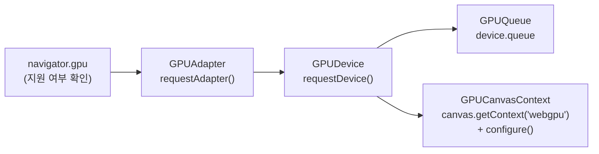

# 6. WebGPU 초기화

## 학습 목표

이 챕터를 마치면, **raw WebGPU API 로 GPU 를 직접 초기화**할 수 있습니다. 즉 `GPUAdapter → GPUDevice → GPUQueue` 를 손으로 얻고, `<canvas>` 에 WebGPU context 를 붙여 출력 준비를 끝낼 수 있습니다. 또한 이 보일러플레이트가 앞으로 우리가 계속 쓸 `src/core/webgpu.ts` 의 `initWebGPU` / `configureCanvas` 안에 그대로 들어 있다는 것을 이해하고, **render pass 와 compute pass 의 차이**를 말로 설명할 수 있습니다.

## 예상 소요 시간 · 난이도

약 35분 · ★★☆☆☆ (WebGPU 첫 발걸음)

## 사전 지식

- 1장 GPGPU 와 WebGPU 의 목적 (왜 GPU 로 계산하나)
- TypeScript 의 `async` / `await` (이 챕터의 초기화는 전부 비동기입니다)
- HTML `<canvas>` 와 `getContext` 의 개념 (`"2d"` / `"webgl"` 을 써본 경험이면 충분)

## 개념 설명

### WebGPU 를 쓰려면 네 가지를 순서대로 얻는다

WebGPU 는 바로 그림을 그리거나 계산을 시키지 않습니다. 먼저 **GPU 에 접속하는 과정**을 거칩니다. 마치 데이터베이스를 쓰기 전에 연결(connection)을 여는 것과 같습니다. 순서가 정해져 있고, 앞 단계의 결과가 다음 단계의 입력이 됩니다.



각 단계가 무엇인지 하나씩 봅시다. (영어 용어는 그대로 두고, 뜻만 풀어 씁니다.)

- **`navigator.gpu`**: 브라우저가 WebGPU 를 아는지 확인하는 진입점입니다. `undefined` 면 이 브라우저/환경은 WebGPU 자체를 지원하지 않습니다.
- **`GPUAdapter` (어댑터)**: 실제 물리 GPU 를 고른 "후보"입니다. 노트북에 내장 GPU 와 외장 GPU 가 둘 다 있으면, 어느 쪽을 쓸지 고르는 단계라고 생각하면 됩니다. `adapter.limits`(한계값)와 `adapter.features`(추가 기능)로 이 GPU 가 무엇을 할 수 있는지 알 수 있습니다.
- **`GPUDevice` (디바이스)**: adapter 로 연 **논리적 연결**입니다. 앞으로 만드는 모든 GPU 객체 — buffer, texture, pipeline — 는 전부 이 `device` 에서 만듭니다. WebGPU 코드에서 가장 자주 등장하는 객체입니다.
- **`GPUQueue` (큐)**: device 당 하나 있는 **명령 제출 창구**입니다. 우리가 인코딩한 명령(command buffer)을 GPU 로 보내는 `queue.submit()`, 데이터를 올리는 `queue.writeBuffer()` / `queue.writeTexture()` 가 모두 이 큐를 통합니다.
- **`GPUCanvasContext` (캔버스 컨텍스트)**: `<canvas>` 와 GPU 를 잇는 다리입니다. `canvas.getContext("2d")` 자리에 `"webgpu"` 를 넣어 얻고, `configure()` 로 device 와 format 을 연결하면 그제서야 이 캔버스에 GPU 가 그릴 수 있습니다.

> 주의: `requestAdapter()` 는 **`null` 을 돌려줄 수 있습니다.** 하드웨어가 없거나 브라우저가 요청을 거부하면 그렇습니다. `const adapter = await navigator.gpu.requestAdapter();` 뒤에 반드시 `if (!adapter) { ... }` 로 막아야 합니다. null 인 adapter 에 `.requestDevice()` 를 부르면 곧장 터집니다.

> 주의: 위 호출은 거의 다 **비동기(async)** 입니다. `requestAdapter()` 와 `requestDevice()` 앞에는 `await` 가 꼭 붙습니다. `await` 를 빠뜨리면 adapter/device 가 아니라 `Promise` 객체가 들어가 "왜 `.limits` 가 없지?" 같은 혼란이 생깁니다.

> 주의: `device` 는 실행 도중 **비동기로 사라질(device lost)** 수 있습니다. 탭이 오래 백그라운드에 있거나 드라이버가 리셋되면 그렇습니다. 이건 예외(throw)가 아니라 `device.lost` **Promise** 로 통지되므로, 초기화 직후 `device.lost.then(info => { ... })` 핸들러를 미리 걸어두는 습관이 필요합니다. 24장에서 device lost 대응을 다시 다룹니다.

### texture format: 추측하지 말고 물어본다

GPU 텍스처(이미지 데이터)는 픽셀을 어떤 형식으로 저장할지 — **format** — 를 정해야 합니다. 예를 들어 채널당 8비트 정수인 `rgba8unorm`, 채널 순서가 바뀐 `bgra8unorm` 등이 있습니다.

canvas 출력용 포맷은 플랫폼마다 가장 빠른 게 다릅니다. 그래서 직접 고르지 않고 브라우저에 물어봅니다.

```ts
const format = navigator.gpu.getPreferredCanvasFormat(); // 보통 "bgra8unorm" 또는 "rgba8unorm"
context.configure({ device, format, alphaMode: "opaque" });
```

이 챕터의 데모는 이 값을 그대로 stats 패널에 찍어 여러분의 환경에서 어떤 포맷이 선호되는지 보여줍니다. (`alphaMode: "opaque"` 는 "투명도 없이 불투명하게 출력" 이라는 뜻입니다.)

### 이게 곧 `src/core/webgpu.ts` 다

지금까지의 흐름은 우리 공통 모듈 `src/core/webgpu.ts` 에 이미 함수로 정리돼 있습니다. 즉 이 챕터의 raw 코드를 함수 두 개로 감싼 것입니다.

```ts
// initWebGPU(): navigator.gpu 확인 -> requestAdapter -> requestDevice -> device.queue + lost 핸들러
const { adapter, device, queue } = await initWebGPU();

// configureCanvas(): getContext("webgpu") -> getPreferredCanvasFormat() -> context.configure()
const { context, format } = configureCanvas(device, canvas);
```

**이 챕터에서만** 일부러 헬퍼를 쓰지 않고 raw 호출을 직접 짭니다 (초기화가 이 챕터의 주제이기 때문). **7장부터는** 초기화가 주제가 아니므로 위 두 함수를 `import` 해서 보일러플레이트를 반복하지 않습니다. 우리가 챕터마다 초기화를 다시 짜지 않는 이유가 바로 이것입니다.

### render pass 와 compute pass — 둘 다 다음 챕터의 예고

GPU 에 일을 시키는 방법은 크게 두 갈래입니다. 둘 다 `device.createCommandEncoder()` 로 명령을 인코딩한 뒤 `queue.submit()` 으로 제출한다는 점은 같지만, **무엇을 하느냐**가 다릅니다. 이 챕터에서는 실행하지 않고 **차이만** 알아둡니다.

- **render pass (렌더 패스)**: 삼각형을 화면(텍스처)에 **그리는** 전통적 그래픽스 경로입니다. vertex shader 로 정점을 배치하고 fragment shader 로 픽셀 색을 칠합니다. 우리 튜토리얼에서는 GPU 계산 결과를 canvas 에 보여줄 때(blit) 정도로만 가볍게 쓰입니다.
- **compute pass (컴퓨트 패스)**: 화면 출력과 무관하게 **순수 계산**을 시키는 경로입니다. compute shader 하나를 수많은 invocation 으로 **병렬 실행**합니다. 우리의 이미지 필터·convolution·CNN 추론은 전부 여기에 올라갑니다. **이 튜토리얼의 주력 경로입니다.**

| 구분 | render pass | compute pass |
|------|-------------|--------------|
| 목적 | 화면(텍스처)에 그리기 | 데이터 병렬 계산 |
| shader 종류 | vertex shader + fragment shader | compute shader |
| pass 시작 | `encoder.beginRenderPass(...)` | `encoder.beginComputePass()` |
| 실행 명령 | `pass.draw(...)` | `pass.dispatchWorkgroups(x, y, z)` |
| 실행 단위 | 정점(vertex) / 픽셀(fragment) | invocation (`@workgroup_size` 로 묶음) |
| 출력 | render target 텍스처 / canvas | storage buffer / storage texture |
| 이 튜토리얼에서 | 결과를 화면에 띄울 때만(blit) | **주력** — 모든 필터·CNN |
| 자세히 배우는 챕터 | (blit 으로 8·13장에서 사용) | 11장(compute shader 기초) |

> 두 pass 의 실제 코드는 후속 챕터에서 직접 짭니다. compute pass 는 11~13장에서, render pass 성격의 화면 출력(blit)은 8·13장에서 만나게 됩니다. 지금은 "GPU 일감에는 그리기용(render)과 계산용(compute) 두 종류가 있고, 우리는 주로 compute 를 쓴다" 만 기억하면 됩니다.

## 완성되면 이런 화면

캔버스 한 칸 아래 stats 패널에 다음이 표시됩니다.

- `WebGPU: 준비 완료`
- `canvas format: bgra8unorm` (환경에 따라 `rgba8unorm` 일 수 있음)
- `max buffer size: ... MB`, `max workgroup X: ...`, `max invocations/wg: ...` (이 GPU 의 `adapter.limits` 값)
- `timestamp-query: 있음/없음` (이 GPU 가 GPU 시간 측정 feature 를 지원하는지)
- `device 상태: alive`

`navigator.gpu` 가 없거나 adapter 를 못 얻으면, 빨간 글씨로 친절한 에러 메시지가 페이지 아래에 표시됩니다 (13장과 같은 `main().catch` 핸들러 형식).

> 스크린샷: `docs/assets/06-webgpu-init.png` (직접 캡처해 추가)

## 자가 점검 질문

스스로 설명할 수 있는지 확인하세요. (정답을 외우는 게 아니라 "설명할 수 있는가"입니다)

1. `GPUAdapter`, `GPUDevice`, `GPUQueue` 가 각각 무엇이고 왜 이 순서로 얻어야 하는지, 그리고 `device` 가 왜 "모든 GPU 객체를 만드는 출발점"인지 설명해보세요.
2. `requestAdapter()` 에서 신입이 자주 빠뜨리는 두 가지(`await` 누락, `null` 체크 누락)가 각각 어떤 문제를 일으키는지 설명해보세요. 추가로 `device.lost` 를 `try/catch` 가 아니라 Promise 핸들러로 다뤄야 하는 이유도 말해보세요.
3. render pass 와 compute pass 의 차이를 목적·shader·실행 명령(`draw` vs `dispatchWorkgroups`) 관점에서 설명하고, 이 튜토리얼이 왜 주로 compute pass 를 쓰는지 말해보세요.
