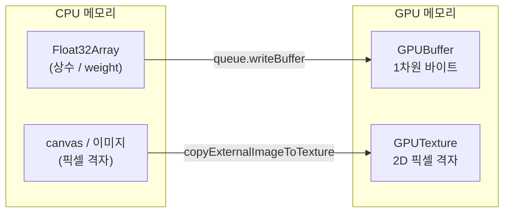

# 7. Buffer와 Texture

## 학습 목표

이 챕터를 마치면, GPU 에 데이터를 올리는 두 가지 그릇인 **`GPUBuffer`** 와 **`GPUTexture`** 를 직접 만들 수 있습니다. 그리고 각각을 만들 때 반드시 지정해야 하는 **usage 플래그**가 무엇이고 언제 어떤 플래그가 필요한지, **버퍼를 써야 할 때와 텍스처를 써야 할 때**를 구분해서 설명할 수 있습니다. 이번 챕터의 데모는 이미지를 GPUTexture 에 올려 화면에 다시 그리는 "텍스처 왕복"입니다.

## 예상 소요 시간 · 난이도

약 35분 · ★★☆☆☆ (개념 정리 + 생성 패턴)

## 사전 지식

- 3장 픽셀 데이터 (RGBA, 0~1 float 색상, pixel/texel/UV)
- 6장 WebGPU 초기화 (`GPUDevice`, `GPUQueue`, `GPUCanvasContext`, texture format)

> 이 챕터는 **생성(create)과 usage** 에 집중합니다. 만든 버퍼/텍스처를 셰이더에 **연결(bind)** 하는 것은 8장(Bind Group과 Pipeline), 셰이더 안에서 실제로 **읽고 쓰는** 것은 10장(주소 공간과 바인딩)·12장(텍스처 읽기/쓰기)에서 다룹니다.

## 개념 설명

### GPU 에 데이터를 올리는 두 가지 그릇

CPU 쪽 메모리(JS 의 `Float32Array`, `<canvas>` 픽셀)는 GPU 가 바로 읽지 못합니다. GPU 가 쓸 수 있는 메모리에 **올려야(upload)** 합니다. 그 그릇이 두 종류입니다.

- **`GPUBuffer`**: 1차원 바이트 덩어리. 숫자 배열을 그대로 담습니다. uniform(작은 상수 묶음), storage(큰 배열: weight, feature map) 등에 씁니다.
- **`GPUTexture`**: 2D(또는 3D) 픽셀 격자. 이미지처럼 (x, y) 로 접근하고, 색 포맷(`rgba8unorm` 등)과 하드웨어 샘플링(보간) 기능이 붙어 있습니다.



둘 다 만들 때 **usage 플래그**를 반드시 줍니다. usage 는 "이 메모리로 앞으로 무엇을 할 것인가"를 미리 선언하는 것입니다. WebGPU 는 만들 때 선언하지 않은 용도로 그 자원을 쓰면 **validation error** 를 냅니다.

> 주의(usage 플래그 누락): 가장 흔한 초보 함정입니다. 예를 들어 텍스처에 `COPY_DST` 를 빼고 `copyExternalImageToTexture` 를 호출하거나, 버퍼에 `COPY_DST` 를 빼고 `writeBuffer` 를 호출하면 콘솔에 validation error 가 뜹니다. "이 usage 를 빠뜨렸다"는 메시지가 같이 나오니, 에러를 읽고 필요한 플래그를 `|` (비트 OR)로 더해주면 됩니다.

### Buffer 만들기 — 작은 파라미터부터

가장 단순한 버퍼는 "색 강도" 같은 작은 상수 하나를 담는 **uniform 버퍼**입니다. raw 호출은 이렇게 생겼습니다.

```ts
const params = new Float32Array([0.5]); // colorIntensity = 0.5
const paramBuffer = device.createBuffer({
  size: 16, // uniform 은 16바이트 정렬 권장 (자세한 이유는 10장)
  usage: GPUBufferUsage.UNIFORM | GPUBufferUsage.COPY_DST,
});
device.queue.writeBuffer(paramBuffer, 0, params);
```

- `UNIFORM`: 나중에 셰이더에서 `var<uniform>` 으로 읽기 위한 usage.
- `COPY_DST`: `queue.writeBuffer` 로 값을 **써넣을 대상(destination)** 이 되기 위한 usage.

이 raw 호출을 그대로 감싼 것이 **`src/core/buffer.ts` 의 `createUniformBuffer`** 입니다. 실무 챕터에서는 매번 손으로 짜지 않고 이 래퍼를 씁니다.

```ts
import { createUniformBuffer } from "@core/buffer.ts";
const paramBuffer = createUniformBuffer(device, new Float32Array([0.5]));
```

`src/core/buffer.ts` 를 열어보면 안에서 정확히 `GPUBufferUsage.UNIFORM | GPUBufferUsage.COPY_DST` 로 `createBuffer` 를 호출하고, 16바이트 정렬 패딩까지 처리하는 걸 볼 수 있습니다. weight 처럼 큰 배열을 담는 **storage 버퍼**는 같은 파일의 `createStorageBuffer`(`STORAGE | COPY_DST`)가 담당합니다.

> 주의(16바이트 정렬): uniform 버퍼에 여러 값을 묶어 올릴 때는 16바이트 정렬 규칙을 지켜야 합니다. 특히 WGSL 의 `vec3f` 는 16바이트로 정렬됩니다. 지금은 `f32` 하나라 신경 쓸 게 없지만, 이 정렬을 본격적으로 다루는 건 10장입니다. 이번 챕터에서는 `createUniformBuffer` 가 알아서 패딩해 준다는 점만 기억하세요.

### Texture 만들기 — 이미지를 GPU 로

이미지(`<canvas>` 나 `ImageBitmap`)를 GPU 로 올리려면 텍스처를 만들고 거기로 복사합니다. raw 호출은 이렇습니다.

```ts
const inputTex = device.createTexture({
  size: [256, 256],
  format: "rgba8unorm", // 0~255 색을 0~1 로 담는 표준 색 포맷
  usage:
    GPUTextureUsage.TEXTURE_BINDING | // 셰이더에서 sampled texture 로 읽기
    GPUTextureUsage.COPY_DST |        // 이미지 데이터를 복사해 받기
    GPUTextureUsage.RENDER_ATTACHMENT, // copyExternalImageToTexture 가 요구
});
device.queue.copyExternalImageToTexture(
  { source: srcCanvas, flipY: false },
  { texture: inputTex },
  [256, 256],
);
```

이 raw 호출을 감싼 것이 **`src/core/texture.ts` 의 `createTextureFromSource`** 입니다. 데모와 실무 챕터에서는 이 한 줄을 씁니다.

```ts
import { createTextureFromSource } from "@core/texture.ts";
const inputTex = createTextureFromSource(device, srcCanvas, { width: 256, height: 256 });
```

`rgba8unorm` 은 R/G/B/A 각 채널을 8비트 정수(0~255)로 저장하되, 셰이더에서 읽을 때는 0.0~1.0 의 `f32` 로 정규화(normalize)해 주는 포맷입니다. 그래서 이름이 `unorm`(unsigned normalized)입니다. 이미지 색을 담는 표준이고, 이 튜토리얼 전체가 이 포맷을 기준으로 씁니다.

### usage 플래그 — 언제 무엇이 필요한가

usage 는 자원으로 무엇을 할지 미리 선언하는 것이라 했습니다. 자주 쓰는 플래그를 정리하면 다음과 같습니다.

#### Buffer usage

| 플래그 | 언제 필요한가 | 이번 챕터에서 |
|---|---|---|
| `COPY_DST` | `queue.writeBuffer`/copy 로 데이터를 **써넣을** 때 | 사용 (uniform 에 값 쓰기) |
| `COPY_SRC` | 이 버퍼를 다른 버퍼/텍스처로 **복사 원본**으로 쓸 때 | — |
| `UNIFORM` | 셰이더에서 `var<uniform>` 으로 작은 상수 묶음을 읽을 때 | 사용 (paramBuffer) |
| `STORAGE` | 셰이더에서 `var<storage>` 로 큰 배열(weight, feature map)을 읽거나 쓸 때 | — (17장 CNN) |
| `MAP_READ` | 결과를 CPU 로 **읽어오기**(mapAsync) 위한 readback 버퍼 | — (13장 readback) |

#### Texture usage

| 플래그 | 언제 필요한가 | 이번 챕터에서 |
|---|---|---|
| `COPY_DST` | `copyExternalImageToTexture` 등으로 이미지/데이터를 **올릴** 때 | 사용 (이미지 업로드) |
| `COPY_SRC` | 텍스처를 버퍼/다른 텍스처로 **복사 원본**으로 쓸 때(예: readback) | — (13장 readback) |
| `TEXTURE_BINDING` | 셰이더에서 **sampled texture**(`texture_2d`)로 **읽을** 때. blit 도 이걸로 샘플링 | 사용 (Blitter 가 샘플링) |
| `STORAGE_BINDING` | 셰이더에서 **storage texture**(`texture_storage_2d`)로 **써넣을** 때 | — (12·13장 출력) |
| `RENDER_ATTACHMENT` | render pass 의 출력 대상이 될 때. `copyExternalImageToTexture` 도 내부적으로 요구 | 사용 |

필요한 플래그는 `|` (비트 OR)로 합칩니다. 예: `TEXTURE_BINDING | COPY_DST | RENDER_ATTACHMENT`.

### sampled texture vs storage texture

같은 텍스처라도 셰이더에서 **읽는 방식**에 따라 두 종류로 나뉘고, 필요한 usage 와 WGSL 타입이 다릅니다. 이 둘의 구분이 이 챕터의 핵심입니다.

| | sampled texture | storage texture |
|---|---|---|
| WGSL 타입 | `texture_2d<f32>` | `texture_storage_2d<rgba8unorm, write>` |
| 필요한 usage | `TEXTURE_BINDING` | `STORAGE_BINDING` |
| 셰이더 동작 | **읽기** (`textureSample`, `textureLoad`) | **쓰기** (`textureStore`) |
| 보간(필터) | 있음 — sampler 로 주변 텍셀을 선형 보간 | 없음 — 정확히 한 텍셀에 값을 박아 넣음 |
| 포맷 자유도 | 다양 | **쓰는 포맷을 명시**해야 함 (여기선 `rgba8unorm`) |
| 대표 용도 | 입력 이미지 읽기, bilinear 확대 | compute 결과를 픽셀에 써넣기 |

핵심 차이는 이렇습니다.

- **sampled texture** 는 "읽기 전용 입력"입니다. sampler 가 붙어서 UV 좌표 사이의 색을 **보간**해 줍니다(14장 bilinear 확대가 이걸 그대로 씁니다). 이번 데모의 `Blitter` 가 입력 텍스처를 `TEXTURE_BINDING` 으로 읽어 화면을 채우는 게 바로 sampled texture 사용 예입니다.
- **storage texture** 는 compute shader 가 **결과를 써넣는** 출력입니다. `textureStore(tex, coord, color)` 로 정확히 한 좌표의 한 텍셀에 값을 박습니다. 보간이 없고, 만들 때 `texture_storage_2d<rgba8unorm, write>` 처럼 **쓰는 포맷을 박아서** 선언해야 합니다. `src/core/texture.ts` 의 `createStorageTexture` 가 `STORAGE_BINDING` 으로 이런 텍스처를 만듭니다(13장부터 출력으로 씁니다).

> 주의(storage texture 의 포맷): storage texture 는 입력 sampled texture 와 달리 "어떤 포맷으로 쓸지"를 WGSL 선언과 텍스처 생성에서 **둘 다 명시**해야 하고, 둘이 일치해야 합니다. 이 튜토리얼은 출력 storage texture 를 일관되게 `rgba8unorm` 으로 씁니다. (음수가 나오는 residual 같은 중간 결과는 `unorm`(0~1 클램프)에 담으면 잘리므로 float storage 버퍼를 쓰는데, 그건 17·18장에서 다룹니다.)

### Buffer 를 쓸 때 vs Texture 를 쓸 때

같은 숫자라도 어디에 담느냐는 **접근 패턴**으로 결정합니다.

| 기준 | Buffer 가 맞음 | Texture 가 맞음 |
|---|---|---|
| 데이터 모양 | 1차원 배열, 임의 길이 | 2D(또는 3D) 픽셀 격자 |
| 접근 방식 | 인덱스로 직접 (`data[i]`) | (x, y) 좌표로, 경계 클램프 |
| 보간 필요? | 없음 (정확한 인덱스) | 있음 — sampler 가 하드웨어로 선형 보간 |
| 색 포맷/채널 | 없음 (그냥 바이트) | 있음 (`rgba8unorm` 등, 채널 4개) |
| 대표 예 | uniform 상수, CNN weight/bias, feature map | 입력 이미지, 중간 화면, 출력 프레임 |

직관적으로: **"이미지처럼 좌표로 읽고 보간이 필요하면 texture, 그냥 숫자 배열을 인덱스로 다루면 buffer"** 입니다.

> 주의(채널 4개 한계): `rgba8` 텍스처는 채널이 R/G/B/A 4개뿐입니다. CNN 의 8채널 feature map 처럼 4개를 넘는 데이터는 텍스처 한 장에 못 담습니다. 그래서 이 튜토리얼은 feature map 을 **storage buffer + 명시적 인덱싱**으로 다룹니다(17장). 이것도 "버퍼냐 텍스처냐"를 데이터 모양으로 고르는 한 예입니다.

## 완성되면 이런 화면

왼쪽에 코드로 생성한 컬러 입력 이미지, 오른쪽에 **그 이미지를 GPUTexture 에 올렸다가 다시 화면으로 꺼낸 결과**가 나란히 보입니다. 두 캔버스는 똑같이 보여야 합니다 — 이미지가 GPU 메모리를 한 바퀴 돌아왔다는 뜻입니다(이미지 -> GPU texture -> 화면). 아래 stats 패널에는 입력 텍스처의 크기·포맷·usage, 그리고 만든 uniform 버퍼의 크기·usage 가 표시됩니다.

> 스크린샷: `docs/assets/07-buffer-and-texture.png` (직접 캡처해 추가)

## 자가 점검 질문

스스로 설명할 수 있는지 확인하세요. (정답을 외우는 게 아니라 "설명할 수 있는가"입니다)

1. 이번 데모에서 입력 텍스처에 `TEXTURE_BINDING`, `COPY_DST`, `RENDER_ATTACHMENT` 세 플래그가 각각 왜 필요한지, 어떤 호출과 연결되는지 설명해보세요. 하나를 빼면 어떤 일이 생기나요?
2. sampled texture 와 storage texture 의 차이를 usage 플래그·WGSL 타입·보간 유무 관점에서 설명해보세요. storage texture 는 왜 포맷(`rgba8unorm`)을 명시해야 하나요?
3. CNN weight 배열은 buffer 에, 입력 프레임은 texture 에 담습니다. 이 선택을 "데이터 모양과 접근 패턴" 기준으로 설명해보세요.
