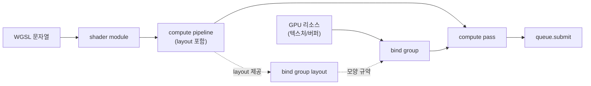
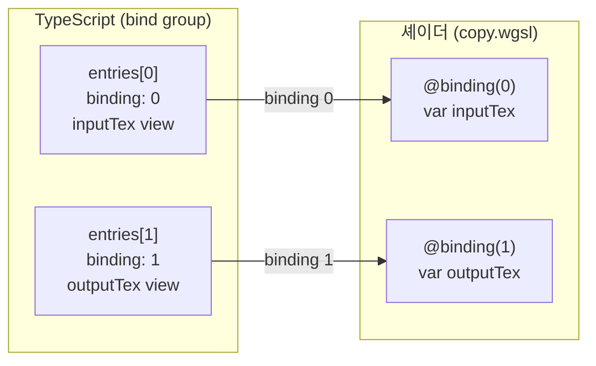

# 8. Bind Group과 Pipeline

## 학습 목표

이 챕터를 마치면, WebGPU 에서 **셰이더를 실제로 실행하기 위해 필요한 두 가지 핵심 객체** — pipeline 과 bind group — 이 무엇이고 어떻게 연결되는지 설명할 수 있습니다. 특히 **bind group(TypeScript) ↔ `@binding`(셰이더) ↔ 셰이더 변수**의 3자 대응을 손으로 직접 와이어링해보고, "WebGPU 코드는 왜 이렇게 장황한가"에 스스로 답할 수 있게 됩니다.

이 챕터의 데모는 일부러 **아무 변환도 하지 않는 복사(copy) compute shader** 를 씁니다. 계산 내용이 단순해야 와이어링 구조 자체가 잘 보이기 때문입니다.

## 예상 소요 시간 · 난이도

약 45분 · ★★☆☆☆ (개념 정리 + 첫 와이어링)

## 사전 지식

- 6장 WebGPU 초기화 (`GPUDevice`, `GPUQueue`, render pass vs compute pass)
- 7장 Buffer와 Texture (sampled texture vs storage texture)
- compute shader 가 "픽셀 하나당 invocation 하나" 모델로 도는 것 (자세한 문법은 11~12장)

## 개념 설명

### 큰 그림: 셰이더 하나를 돌리는 데 객체가 왜 이렇게 많나

셰이더(WGSL 문자열) 하나를 GPU 에서 돌리려면, WebGPU 에서는 다음 객체들을 차례로 만들어야 합니다.



처음 보면 "그냥 함수 한 번 호출하면 되지 왜 이렇게 많아?"라고 느낍니다. 핵심만 추리면 두 덩어리입니다.

- **pipeline**: "어떤 셰이더를, 어떤 설정으로 실행할지"를 미리 컴파일해 굳혀 둔 객체. 한 번 만들면 재사용한다.
- **bind group**: "이번 실행에서 셰이더의 각 `@binding` 슬롯에 어떤 실제 리소스를 꽂을지"를 적은 표.

비유하자면 **pipeline 은 함수 정의**, **bind group 은 그 함수에 넘기는 인자 묶음**입니다. 함수는 한 번 정의하고 여러 번, 다른 인자로 호출할 수 있습니다.

### bind group ↔ `@binding` ↔ 셰이더 변수 — 3자 대응 (이 챕터의 핵심)

셰이더 안에서 외부 리소스는 `@group`/`@binding` 으로 선언합니다. `copy.wgsl` 을 봅시다.

```wgsl
@group(0) @binding(0) var inputTex:  texture_2d<f32>;
@group(0) @binding(1) var outputTex: texture_storage_2d<rgba8unorm, write>;
```

이 선언은 "0번 슬롯에는 읽기용 텍스처가, 1번 슬롯에는 쓰기용 storage 텍스처가 들어올 것"이라는 **약속**일 뿐, 실제 리소스는 아닙니다. 실제 리소스는 TypeScript 쪽에서 bind group 으로 꽂아줍니다.

```ts
const bindGroup = device.createBindGroup({
  layout: pipeline.getBindGroupLayout(0), // group 0 의 모양 규약
  entries: [
    { binding: 0, resource: inputTex.createView() },  // -> 셰이더 inputTex
    { binding: 1, resource: outputTex.createView() },  // -> 셰이더 outputTex
  ],
});
```

세 곳의 번호가 정확히 한 줄로 꿰어집니다.



표로 정리하면 이렇게 됩니다.

| 셰이더 선언 | 셰이더 변수 | 종류 | bind group entry | 실제 리소스 |
|---|---|---|---|---|
| `@group(0) @binding(0)` | `inputTex` | sampled texture (읽기) | `{ binding: 0, resource: ... }` | 입력 텍스처 view |
| `@group(0) @binding(1)` | `outputTex` | storage texture (쓰기) | `{ binding: 1, resource: ... }` | 출력 텍스처 view |

- `@group(0)` 은 "0번 bind group"을 뜻합니다. `setBindGroup(0, bindGroup)` 의 그 0 과 같습니다. 하나의 셰이더에 group 을 여러 개 둘 수 있고(예: group 0 = 입출력, group 1 = uniform), 자주 안 바뀌는 것과 자주 바뀌는 것을 그룹으로 나눠 효율을 챙기는 용도입니다. 이 챕터는 group 0 하나만 씁니다.
- `@binding(n)` 은 그 그룹 안에서의 슬롯 번호입니다. bind group `entries` 의 `binding` 값과 1:1 로 맞아야 합니다.

> 주의(번호 일치): bind group `entries` 의 `binding` 번호는 셰이더의 `@binding` 번호와 **정확히 일치**해야 합니다. 0 과 1 을 바꿔 꽂으면 "쓰기용 storage 슬롯에 읽기용 텍스처를 넣었다"는 식의 타입 불일치로 검증에 걸려 실행이 거부됩니다. `entries` 의 **배열 순서**가 아니라 `binding` **값**이 기준입니다.

> 주의(입력=출력 금지): 같은 텍스처를 입력(`texture_2d`)이자 출력(`texture_storage_2d, write`)으로 **동시에** 쓸 수 없습니다. WebGPU 는 한 리소스를 같은 pass 에서 읽기와 쓰기로 동시에 바인딩하는 것을 막습니다(데이터 경쟁 방지). 그래서 입력 텍스처와 출력 텍스처를 **반드시 별도로** 만듭니다.

### pipeline layout: `layout: "auto"` vs 명시적 layout

bind group 을 만들려면 그 group 의 **모양(어떤 슬롯이 어떤 타입인지)** 을 정의한 **bind group layout** 이 필요합니다. 이 layout 들을 모아 pipeline 에 알려주는 게 **pipeline layout** 입니다. 둘을 지정하는 방법은 두 가지입니다.

- **`layout: "auto"`** (이 프로젝트의 기본, `src/core/pipeline.ts` 가 사용): 드라이버가 셰이더의 `@group`/`@binding` 선언을 읽어 layout 을 **자동 추론**합니다. 우리는 `pipeline.getBindGroupLayout(0)` 으로 추론된 layout 을 꺼내 bind group 을 만듭니다. 짧고 편합니다.
- **명시적 layout**: `device.createBindGroupLayout(...)` 로 슬롯 타입을 직접 적고, `device.createPipelineLayout({ bindGroupLayouts: [...] })` 로 묶어 pipeline 의 `layout` 에 넘깁니다. 코드가 길어지는 대신, **여러 pipeline 이 같은 bind group layout 을 공유**하거나(같은 bind group 을 여러 셰이더에서 재사용), 세밀한 가시성·타입 제어가 필요할 때 씁니다.

명시적으로 쓰면 대략 이런 모양입니다(참고용 — 이 챕터 데모는 `"auto"` 를 씁니다).

```ts
const bindGroupLayout = device.createBindGroupLayout({
  entries: [
    { binding: 0, visibility: GPUShaderStage.COMPUTE,
      texture: { sampleType: "float" } },
    { binding: 1, visibility: GPUShaderStage.COMPUTE,
      storageTexture: { access: "write-only", format: "rgba8unorm" } },
  ],
});
const pipelineLayout = device.createPipelineLayout({
  bindGroupLayouts: [bindGroupLayout],
});
// device.createComputePipeline({ layout: pipelineLayout, compute: {...} })
```

`"auto"` 는 위 layout 선언을 셰이더로부터 자동 생성해 주는 것이라고 보면 됩니다. 단점은 **`"auto"` 로 만든 layout 은 그 pipeline 전용**이라 다른 pipeline 과 공유할 수 없다는 점입니다. 지금은 pipeline 하나뿐이라 `"auto"` 로 충분합니다.

### compute pipeline 실행: 왜 이렇게 단계가 많은가 (장황함의 정체)

실제 실행은 명령을 **기록**하고 큐에 **제출**하는 구조입니다. 함수 한 번 호출이 아닙니다.

```ts
const encoder = device.createCommandEncoder(); // 명령 기록기
const pass = encoder.beginComputePass();        // compute 구간 시작
pass.setPipeline(pipeline);                     // 어떤 파이프라인을
pass.setBindGroup(0, bindGroup);                // group 0 에 어떤 리소스를
pass.dispatchWorkgroups(gx, gy);                // workgroup 을 gx×gy 개 실행
pass.end();                                     // 구간 종료
device.queue.submit([encoder.finish()]);        // 기록한 명령을 큐에 제출
```

`gx`, `gy` 는 `dispatchSizeFor(WIDTH, HEIGHT, [8, 8])` 로 계산합니다. `@workgroup_size(8, 8)` 이므로 256×256 이미지를 덮으려면 가로·세로 각 $\lceil 256/8 \rceil = 32$ 개, 총 $32 \times 32$ 개의 workgroup 을 dispatch 합니다(자세한 dispatch 계산은 11장).

이 모든 게 "장황해" 보이는 데에는 이유가 있습니다.

1. **명시성**: GPU 는 CPU 와 별도의 칩이고 비동기로 돕니다. 무엇을·어떤 리소스로·언제 실행할지를 애매함 없이 적어줘야 드라이버가 효율적으로 스케줄링하고 검증할 수 있습니다.
2. **검증(validation)**: bind group 의 슬롯 타입이 셰이더가 기대하는 타입과 맞는지, 텍스처 usage 플래그가 맞는지 등을 만드는 시점에 미리 검사합니다. 그래서 잘못 꽂으면 검은 화면 대신 **명확한 에러**가 납니다.
3. **안전·재사용**: pipeline 과 bind group 을 분리해 둔 덕에, pipeline 은 한 번 만들어 재사용하고 bind group 만 바꿔 같은 셰이더를 다른 입력에 반복 적용할 수 있습니다. 매 프레임 새로 만들 객체와 한 번만 만들 객체가 구조적으로 분리됩니다.

> 주의(GPU 는 비동기): `queue.submit` 은 작업을 큐에 **넣을** 뿐, 그 줄에서 GPU 실행이 끝나길 기다리지 않습니다. "submit 했는데 결과를 바로 읽으면 비어 있어요"의 원인입니다. 결과 읽기는 `mapAsync` 로 `await` 해야 합니다(13장에서 다룸).

### render pipeline 은 어디 있나 — Blitter 가 바로 그 예시

이 챕터 데모는 compute pipeline 만 직접 만들지만, **render pipeline** 도 이미 쓰고 있습니다. compute 가 써넣은 storage 텍스처는 그 자체로는 화면에 안 나오므로, 화면에 그리려면 작은 **render pass** 가 필요합니다. 그 역할을 하는 게 공통 모듈 `Blitter`(`src/core/blit.ts`)이고, 내부에서 `device.createRenderPipeline(...)` 으로 render pipeline 을 만듭니다.

```ts
// src/core/blit.ts (발췌)
this.pipeline = device.createRenderPipeline({
  layout: "auto",
  vertex:   { module, entryPoint: "vs" },
  fragment: { module, entryPoint: "fs", targets: [{ format }] },
  primitive:{ topology: "triangle-list" },
});
```

구조는 compute 와 같습니다. shader module → pipeline(layout 포함) → bind group(텍스처 + sampler 를 `@binding` 에 꽂음) → pass(`beginRenderPass`) → `setPipeline`/`setBindGroup`/`draw` → `submit`. compute 는 `dispatchWorkgroups`, render 는 `draw` 를 부른다는 점만 다릅니다. 그래서 이 챕터에서 새 render pipeline 을 직접 만들 필요는 없고, **render pipeline 의 와이어링이 궁금하면 `blit.ts`/`blit.wgsl` 을 읽으면** 됩니다.

## 완성되면 이런 화면

왼쪽에 컬러 입력 이미지, 오른쪽에 **그것과 똑같은** GPU 출력이 나란히 보입니다. 복사 셰이더라 변환이 없으므로, 두 캔버스가 동일하게 보이면 와이어링(pipeline + bind group + dispatch + blit)이 전부 맞은 것입니다. 아래 stats 패널에는 어떤 파이프라인과 bind group 구성을 썼는지가 표시됩니다.

> 만약 오른쪽이 검은 화면이라면: bind group 의 `binding` 번호가 셰이더와 어긋났는지, 출력 텍스처를 `createStorageTexture` 로(즉 `STORAGE_BINDING` usage 로) 만들었는지, `setBindGroup(0, ...)` 과 `@group(0)` 이 맞는지 순서대로 확인하세요.

> 스크린샷: `docs/assets/08-copy.png` (직접 캡처해 추가)

## 자가 점검 질문

스스로 설명할 수 있는지 확인하세요. (정답을 외우는 게 아니라 "설명할 수 있는가"입니다)

1. pipeline 과 bind group 의 역할 차이를 "함수 정의 vs 함수 인자" 비유로 설명해보세요. 왜 둘을 분리해 두는 게 유리한가요?
2. bind group `entries` 의 `binding` 번호, 셰이더의 `@binding`, 셰이더 변수 — 이 3자가 어떻게 대응되는지 `copy.wgsl` 의 0/1 슬롯을 예로 설명해보세요. 입력과 출력을 같은 텍스처로 둘 수 없는 이유는 무엇인가요?
3. `layout: "auto"` 와 명시적 pipeline layout 의 차이, 그리고 각각 언제 쓰는지 설명해보세요.
