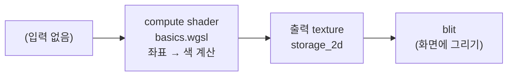

# 9. WGSL 기본 문법

## 학습 목표

이 챕터를 마치면, **WGSL 코드를 보고 한 줄씩 읽을 수 있습니다.** `let`/`var`의 차이, `f32`/`i32`/`u32`/`bool` 같은 기본 타입, `vec2f`/`vec3f`/`vec4f` 벡터 타입과 그 연산, 함수(`fn`) 선언, 그리고 WGSL의 가장 큰 함정인 **타입 변환**(암묵 변환이 없다)을 이해하게 됩니다. JavaScript의 `number` 하나로 모든 숫자를 다루던 감각에서, GPU가 요구하는 "타입이 엄격한 세계"로 넘어가는 장입니다.

이 챕터의 주제는 멋진 결과물이 아니라 **WGSL 코드 자체를 읽는 법**입니다. 그래서 입력 이미지 없이, 픽셀 좌표만으로 색을 계산하는 작은 compute shader(`shaders/basics.wgsl`) 하나를 두고, 아래에서 그 문법을 한 줄씩 해설합니다.

## 예상 소요 시간 · 난이도

약 35분 · ★★☆☆☆ (문법 읽기 위주, GPU 동작은 가벼움)

## 사전 지식

- TypeScript 기본 문법 (변수, 함수, 타입)
- 선형대수의 **벡터**: 벡터끼리의 덧셈, 스칼라 곱, 내적 (3장·13장에서 다룬 수준)
- 6~8장 WebGPU 초기화, texture, bind group, pipeline (보일러플레이트는 여기서 가져다 씁니다)
- (가벼운 선행) 11장의 compute shader 골격 — 이 챕터는 `@compute`/`@workgroup_size`를 "이미 있는 틀"로만 쓰고, 자세한 설명은 11장에서 합니다.

## 개념 설명

### WGSL은 "타입이 엄격한 작은 언어"다

WGSL(WebGPU Shading Language)은 GPU에서 도는 작은 프로그램(셰이더)을 쓰는 언어입니다. C나 TypeScript와 비슷해 보이지만, **JavaScript와 결정적으로 다른 점**이 하나 있습니다.

> 주의: **WGSL에는 암묵적 타입 변환이 없습니다.** JavaScript에서는 `1 + 2.5`, `"3" * 2`처럼 숫자/문자열을 알아서 섞어줬지만, WGSL에서 `i32`와 `f32`를 그냥 섞으면 **컴파일 에러**가 납니다. 변환이 필요하면 `f32(x)`처럼 **직접 명시**해야 합니다. 이게 신입이 가장 많이 막히는 지점입니다.

이 한 문장이 이 챕터의 절반입니다. 나머지는 "그래서 타입이 뭐가 있고, 어떻게 변환하는가"입니다.

### `let` 과 `var`

WGSL의 변수 선언은 두 가지입니다.

| 키워드 | 의미 | 재대입 | TypeScript 대응 |
|--------|------|--------|------------------|
| `let`  | 상수 바인딩. 한 번 정해지면 못 바꾼다 | ❌ 불가 | `const` |
| `var`  | 가변 변수. 나중에 다시 대입할 수 있다 | ✅ 가능 | `let` |

`basics.wgsl`에서 직접 봅니다.

```wgsl
let g: vec3f = gradientColor(uv);   // let — 이 값은 바뀌지 않는다
var color: vec3f = g;               // var — 아래에서 값을 바꾼다
// ...
color = color * shade;              // 재대입 (let 이었다면 여기서 컴파일 에러)
```

> 주의: 이름이 헷갈립니다. WGSL의 `let`은 TypeScript의 `let`이 아니라 **`const`에 가깝습니다.** "바꿀 거면 `var`, 안 바꿀 거면 `let`"으로 외우세요.

### 기본 스칼라 타입: `f32` / `i32` / `u32` / `bool`

JavaScript는 숫자가 `number` 하나뿐이지만, GPU는 비트 표현이 다른 숫자들을 구분합니다.

| WGSL 타입 | 의미 | 범위/예 | JavaScript에서 가장 가까운 것 |
|-----------|------|---------|-------------------------------|
| `f32`  | 32비트 부동소수점 (실수) | `0.5`, `1.0`, `-3.14` | `number` (소수 가능) |
| `i32`  | 32비트 부호 있는 정수 | `-2`, `0`, `41` | `number` (정수, 음수 가능) |
| `u32`  | 32비트 부호 **없는** 정수 (0 이상) | `0`, `1`, `4294967295` | `number` (0 이상 정수) |
| `bool` | 참/거짓 | `true`, `false` | `boolean` |

리터럴(literal, 코드에 직접 쓴 값)에도 타입이 있습니다.

- `1.0`, `0.5`, `1.0f` → `f32` (소수점이 있으면 실수)
- `1i`, `-2i` → `i32`
- `1u`, `32u` → `u32`
- 그냥 `1`, `32` → 문맥에 따라 추론되는 정수(abstract int)

> 주의(정수 나눗셈): WGSL에서 **정수 ÷ 정수는 정수**입니다 (소수점 버림). `i32(7) / i32(2)`는 `3.5`가 아니라 `3`입니다. `basics.wgsl`은 이걸 일부러 써서 체커보드 칸을 나눕니다(`i32(gid.x) / 32`). 실수 나눗셈이 필요하면 먼저 `f32(...)`로 바꾸세요.

### `vec2f` / `vec3f` / `vec4f` — 선형대수의 벡터 그대로

`vecNf`는 **`f32` N개를 묶은 벡터**입니다. 선형대수에서 배운 그 벡터가 맞습니다.

- `vec2f` = $(x, y)$ — 좌표나 UV
- `vec3f` = $(x, y, z)$ 또는 $(r, g, b)$ — 색
- `vec4f` = $(x, y, z, w)$ 또는 $(r, g, b, a)$ — 알파 포함 색

정수 버전도 있습니다: `vec2u`(=`vec2<u32>`), `vec2i`(=`vec2<i32>`). `vec3u`로 들어오는 `global_invocation_id`가 대표 예입니다.

**벡터 연산은 원소별(element-wise)로 동작**합니다. 두 벡터 $\mathbf{a} = (a_1, a_2, a_3)$, $\mathbf{b} = (b_1, b_2, b_3)$ 에 대해:

```math
\mathbf{a} + \mathbf{b} = \begin{bmatrix} a_1 + b_1 \\ a_2 + b_2 \\ a_3 + b_3 \end{bmatrix}, \qquad
\mathbf{a} \odot \mathbf{b} = \begin{bmatrix} a_1 b_1 \\ a_2 b_2 \\ a_3 b_3 \end{bmatrix}
```

여기서 $\odot$ 는 **원소별 곱(Hadamard product)** 입니다. WGSL의 `a * b`(둘 다 벡터)는 선형대수의 행렬곱이나 내적이 아니라 이 원소별 곱이라는 점을 기억하세요. 내적이 필요하면 `dot(a, b)`를, 길이가 필요하면 `length(a)`를 씁니다.

**스칼라와 벡터의 곱**은 모든 원소에 그 스칼라를 곱합니다. 스칼라 $s$ 와 벡터 $\mathbf{v} = (v_1, v_2, v_3)$ 에 대해:

```math
s \cdot \mathbf{v} = \begin{bmatrix} s\,v_1 \\ s\,v_2 \\ s\,v_3 \end{bmatrix}
```

`basics.wgsl`의 `gradientColor` 함수가 이걸 그대로 씁니다.

```wgsl
let baseColor = vec3f(uv.x, uv.y, 0.5);  // (r, g, b)
let tinted = baseColor * 0.85;           // 스칼라 곱: 모든 원소 × 0.85
```

벡터는 또 **swizzle**(원소 골라 뽑기)을 지원합니다. `color.rgb`는 `vec4f`에서 앞 3개를 뽑아 `vec3f`로, `color.x`/`color.y`로 개별 원소를 읽습니다. 그리고 `vec4f(color, 1.0)`처럼 **작은 벡터 + 스칼라를 이어 붙여** 큰 벡터를 만들 수 있습니다.

### 함수 선언: `fn`

WGSL 함수는 `fn 이름(매개변수: 타입, ...) -> 반환타입 { ... }` 형태입니다. TypeScript와 거의 같되, **타입을 빠짐없이 적어야** 합니다(추론에 기대지 않습니다).

```wgsl
fn vignette(uv: vec2f) -> f32 {
  let center = vec2f(0.5, 0.5);
  let d = distance(uv, center);     // f32
  return clamp(1.0 - d, 0.0, 1.0);  // f32
}
```

- `uv: vec2f` — 매개변수 이름과 타입
- `-> f32` — 반환 타입
- `distance(a, b)`, `clamp(x, lo, hi)`는 WGSL **내장 함수**(built-in)입니다. `dot`, `length`, `mix`, `min`, `max`, `floor` 등도 자주 씁니다.

`@compute @workgroup_size(8, 8) fn main(...)`의 `main`도 함수입니다. 다만 앞에 붙은 `@compute`/`@workgroup_size`/`@builtin(...)` 같은 **attribute**가 "이건 compute shader의 진입점이고, invocation을 8×8로 묶고, 매개변수로 좌표를 받는다"는 추가 정보를 줍니다(자세한 건 11장).

### 타입 변환: 직접 명시해야 한다

WGSL에서 타입을 바꾸려면 **그 타입의 이름을 함수처럼 호출**합니다(생성자 변환).

| 하고 싶은 것 | 쓰는 법 | 비고 |
|--------------|---------|------|
| `u32` → `f32` | `f32(x)` | 정수 좌표 → 실수 |
| `f32` → `i32` | `i32(x)` | 소수점 버림 |
| `vec2u` → `vec2f` | `vec2f(v)` | 벡터 통째로 변환 |
| 스칼라 → 벡터 | `vec3f(0.08)` | 모든 원소가 같은 값 |
| 벡터 + 스칼라 결합 | `vec4f(rgb, 1.0)` | `vec3f` + `f32` → `vec4f` |

`basics.wgsl`에서 변환이 일어나는 줄들입니다.

```wgsl
let pixel: vec2f = vec2f(vec2u(gid.x, gid.y));  // u32 좌표 -> f32 좌표
let size:  vec2f = vec2f(dims);                 // vec2u -> vec2f
let uv:    vec2f = pixel / size;                // 이제 f32 / f32 (원소별)
```

만약 `vec2f`로 바꾸지 않고 `gid.xy / dims`(둘 다 `vec2u`)를 했다면 **정수 나눗셈**이 되어 거의 모든 값이 0이 되어 버립니다. 그래서 먼저 `f32`로 올린 뒤 나누는 것입니다.

> 주의: 변환을 빼먹으면 "no matching overload" 또는 "cannot find ... for types ..." 같은 컴파일 에러가 납니다. 에러 메시지에 등장하는 타입 이름(`f32`, `u32` 등)을 보고 "어디서 타입이 안 맞았나"를 역추적하세요. 이게 WGSL 디버깅의 절반입니다.

### JavaScript 값과 WGSL 값의 차이 (요약)

| | JavaScript | WGSL |
|---|------------|------|
| 숫자 타입 | `number` 하나 (내부적으로 64비트 float) | `f32`, `i32`, `u32`로 구분 |
| 정수/실수 | 구분 없음 (`1`과 `1.0`이 같음) | 다른 타입 (`1i` ≠ `1.0`) |
| 타입 변환 | 암묵적 (알아서 섞임) | **명시적** (`f32(x)`) |
| 나눗셈 | 항상 실수 (`7/2 === 3.5`) | 정수끼리면 정수 (`i32(7)/i32(2) == 3`) |
| 변수 선언 | `const`(불변) / `let`(가변) | `let`(불변) / `var`(가변) |
| 벡터 | 기본 타입 없음 (배열로 흉내) | `vec2/3/4`가 1급 타입, 원소별 연산 내장 |

### 전체 흐름

이 챕터의 보일러플레이트는 6~8장과 같고, 새로운 건 `basics.wgsl` 안의 문법뿐입니다.



`main.ts`는 출력 storage 텍스처를 만들고, `createComputePipeline`으로 파이프라인을, `dispatchSizeFor`로 dispatch 크기를 구한 뒤, `Blitter`로 결과를 화면에 그립니다. 이 챕터는 **검증된 표시 경로(blit)만** 쓰고, buffer readback은 하지 않습니다. 즉 코드가 단순하므로, 시선은 `basics.wgsl`에 두면 됩니다.

## 완성되면 이런 화면

캔버스 하나에, **가로로 갈수록 빨강이, 세로로 갈수록 초록이 진해지는 그라데이션** 위에 중심이 밝고 가장자리가 어두운 원형 음영(vignette)이 깔리고, 그 위에 32픽셀 간격의 옅은 체커보드 무늬가 얹힌 이미지가 나옵니다. 입력 이미지가 없는데도 색이 나온다는 것이 핵심입니다 — **모든 색은 `basics.wgsl`이 픽셀 좌표로부터 계산한 값**입니다. 아래 stats 패널에는 출력 크기, workgroup 크기(8×8), dispatch 개수(32×32)가 표시됩니다.

> 스크린샷: `docs/assets/09-wgsl-basics.png` (직접 캡처해 추가)

## 자가 점검 질문

스스로 설명할 수 있는지 확인하세요. (정답을 외우는 게 아니라 "설명할 수 있는가"입니다)

1. WGSL의 `let`/`var`가 TypeScript의 `const`/`let`과 어떻게 대응하는지, 그리고 `basics.wgsl`에서 `color`가 왜 `var`여야 하는지 설명해보세요.
2. `vec2f(vec2u(gid.x, gid.y)) / vec2f(dims)`에서, 만약 변환 없이 `vec2u`끼리 그냥 나눴다면 결과가 왜 거의 다 0이 되는지(정수 나눗셈) 설명해보세요.
3. WGSL에 "암묵적 타입 변환이 없다"는 말의 의미를, JavaScript에서 `number` 하나로 숫자를 다루던 것과 비교해 설명해보세요. 그리고 `f32(x)` 같은 명시 변환이 왜 필요한지 말해보세요.
