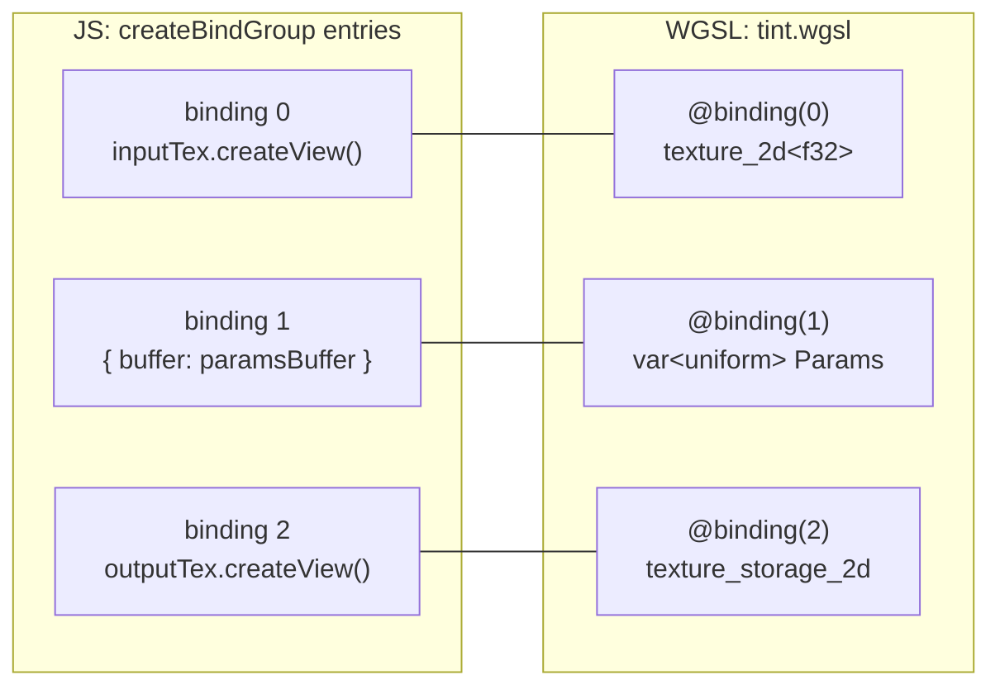

# 10. WGSL 주소 공간과 바인딩

## 학습 목표

이 챕터를 마치면, WGSL 셰이더가 바깥의 GPU 리소스(텍스처·버퍼)를 **어떻게 받아오는지** 설명하고 직접 연결할 수 있습니다. 구체적으로 `@group`/`@binding` 이 무엇이고, `var<uniform>`·`var<storage>`·`texture_2d`·`texture_storage_2d`·`sampler` 같은 **주소 공간(address space)·바인딩 타입**이 각각 어떤 리소스를 가리키는지 이해합니다. 그리고 이 챕터의 핵심인 **uniform 버퍼의 메모리 정렬(특히 `vec3f` 의 16바이트 함정)** 을 바이트 단위로 맞출 수 있게 됩니다.

## 예상 소요 시간 · 난이도

약 45분 · ★★★☆☆ (개념 위주, 정렬 함정 주의)

## 사전 지식

- 7장 Buffer 와 Texture (uniform buffer, storage buffer, sampled/storage texture의 용도 구분)
- 8장 Bind Group 과 Pipeline (bind group layout, pipeline layout이 왜 필요한지)
- 9장 WGSL 기본 문법 (`f32`, `vec3f`, `vec4f`, `let`/`var`)

> 이 챕터는 아직 compute shader 의 내부 계산을 깊게 다루지 않습니다. compute 의 `@workgroup_size`·invocation 모델은 11장에서, `textureLoad`/`textureStore` 의 좌표 처리는 12장에서 본격적으로 다룹니다. 여기서는 "리소스를 셰이더에 어떻게 꽂는가"에 집중합니다.

## 개념 설명

### 셰이더는 자기 메모리가 없다 — 바인딩으로 받아온다

compute shader 함수 하나는 입력 텍스처도, 색을 담은 상수도 스스로 만들 수 없습니다. 이것들은 모두 **바깥(JS/WebGPU)에서 만들어 GPU 메모리에 올려둔 리소스**이고, 셰이더는 그것을 **"가리키는 변수"** 로 선언해서 받아옵니다. 그 변수에 붙는 주소표가 `@group` 과 `@binding` 입니다.

```wgsl
@group(0) @binding(0) var inputTex: texture_2d<f32>;
@group(0) @binding(1) var<uniform> params: Params;
@group(0) @binding(2) var outputTex: texture_storage_2d<rgba8unorm, write>;
```

- `@group(0)` : 이 리소스가 **0번 bind group** 에 속한다. (JS 에서 `setBindGroup(0, ...)` 의 그 0)
- `@binding(0)` : 그 그룹 안에서 **0번 슬롯**. (JS entries 의 `binding: 0` 의 그 0)
- 그 뒤는 **무엇을 받는가**를 말하는 타입. `texture_2d<f32>` 는 읽기용 텍스처, `var<uniform>` 은 작은 상수 묶음 버퍼, `texture_storage_2d<...>` 는 셰이더가 직접 써넣는 텍스처입니다.

즉 `@group`/`@binding` 은 **셰이더 쪽 변수에 붙인 번호표**이고, JS 의 `createBindGroup` 은 **그 번호표에 실제 리소스를 끼우는 작업**입니다. 둘은 번호로 1:1 매칭됩니다.

### 주소 공간(address space) vs 바인딩 타입

신입이 헷갈리는 두 단어를 먼저 정리합니다.

- **주소 공간(address space)** : 변수가 "어느 종류의 메모리"에 사는가. `var<uniform>`, `var<storage>`, `var<workgroup>`, `var<private>`, `var<function>` 등. 이 챕터에서 바깥 리소스와 연결되는 것은 `uniform` 과 `storage` 두 가지입니다.
- **바인딩 타입(binding type)** : 텍스처/샘플러처럼 메모리 버퍼가 아닌 리소스. `texture_2d<f32>`, `texture_storage_2d<...>`, `sampler` 가 여기 해당합니다. 이들은 `var<...>` 의 `<...>` 를 쓰지 않고, 타입 자체가 종류를 말합니다.

이 챕터에서 쓰는 다섯 가지를 표로 정리하면:

| WGSL 선언 | 주소 공간 / 종류 | 무엇인가 | JS entries 에 넣는 것 |
|---|---|---|---|
| `var<uniform> p: Params` | uniform | 작고 자주 안 바뀌는 상수 묶음 | `{ buffer: uniformBuffer }` |
| `var<storage, read> w: array<f32>` | storage (읽기) | 대량 데이터 (weight 등) | `{ buffer: storageBuffer }` |
| `var<storage, read_write> o: array<f32>` | storage (읽기/쓰기) | 셰이더가 써넣는 대량 출력 | `{ buffer: storageBuffer }` |
| `var t: texture_2d<f32>` | sampled texture | 읽기 전용 입력 이미지 | `texture.createView()` |
| `var o: texture_storage_2d<rgba8unorm, write>` | storage texture | 셰이더가 써넣는 이미지 | `texture.createView()` |
| `var s: sampler` | sampler | 텍스처 보간 샘플링 도구 | `device.createSampler()` |

> 이 챕터 데모는 `uniform` + `texture_2d` + `texture_storage_2d` 세 가지를 직접 씁니다. `storage` 버퍼는 위 표로 개념만 소개하고, 실제 대량 데이터(weight) 사용은 17장에서 다룹니다. `sampler` 는 마지막 절에서 `textureLoad` 와 대비해 설명합니다(blit 에서 이미 한 번 봤습니다).

### @binding ↔ bind group entries: 이 챕터의 데모

데모는 입력 이미지에 **tint(색조)** 를 섞습니다. tint 색과 강도(strength)는 `uniform` 버퍼로 넘기고, 입력은 `texture_2d`, 출력은 `texture_storage_2d` 로 받습니다. 픽셀마다:

```math
\text{out} = \text{mix}(\text{src},\ \text{tint},\ \text{strength})
= (1 - s)\,\mathbf{src} + s\,\mathbf{tint}
```

여기서 $\mathbf{src}$ 는 입력 픽셀 RGB, $\mathbf{tint}$ 는 uniform 으로 받은 색조 벡터, $s = \text{strength} \in [0, 1]$ 는 섞는 비율입니다. $s=0$ 이면 원본 그대로, $s=1$ 이면 완전히 tint 색입니다. WGSL 의 `mix(a, b, t)` 가 바로 이 선형 보간 $(1-t)a + tb$ 입니다.

WGSL 의 `@binding` 번호와 JS 의 `createBindGroup` entries 가 어떻게 묶이는지 그림으로:



JS 쪽 코드는 이렇게 됩니다. `binding` 숫자가 WGSL `@binding` 과 정확히 일치해야 합니다.

```ts
const bindGroup = device.createBindGroup({
  layout: pipeline.getBindGroupLayout(0),   // @group(0)
  entries: [
    { binding: 0, resource: inputTex.createView() },     // @binding(0) texture_2d
    { binding: 1, resource: { buffer: paramsBuffer } },  // @binding(1) var<uniform>
    { binding: 2, resource: outputTex.createView() },    // @binding(2) texture_storage_2d
  ],
});
```

> 주의(바인딩 종류 불일치): entries 에 넣는 `resource` 모양이 WGSL 선언과 맞아야 합니다. 텍스처에는 `.createView()`, 버퍼에는 `{ buffer }`, 샘플러에는 `createSampler()` 입니다. uniform 자리에 텍스처 view 를 넣는 식으로 어긋나면 bind group 생성 단계에서 에러가 납니다. 번호(0/1/2)뿐 아니라 **종류**도 맞춰야 합니다.

### 이 챕터의 핵심: uniform 메모리 정렬 ⚠️

`var<uniform>` 버퍼는 **WGSL struct 의 메모리 레이아웃** 그대로 바이트를 읽습니다. 그래서 JS 에서 `Float32Array` 로 채워 넣을 때, **각 숫자가 struct 의 어느 필드의 어느 바이트에 놓이는지**를 정확히 맞춰야 합니다. 한 칸이라도 어긋나면 셰이더는 엉뚱한 바이트를 그 필드로 읽습니다. 그리고 이건 **번들/컴파일로는 절대 안 잡히는 런타임 버그**입니다.

WGSL 의 정렬 규칙(이 챕터에서 필요한 것만):

| 타입 | size (바이트) | align (바이트) |
|---|---|---|
| `f32`, `i32`, `u32` | 4 | 4 |
| `vec2f` | 8 | 8 |
| **`vec3f`** | **12** | **16** ← 함정 |
| `vec4f` | 16 | 16 |

핵심은 **`vec3f` 는 크기가 12바이트인데 정렬은 16바이트**라는 점입니다. 즉 `vec3f` 다음 멤버는 12가 아니라 **16의 배수 위치**에서 시작하려는 성질이 있고, 그 사이 4바이트는 보통 **패딩(빈 공간)** 이 됩니다.

각 멤버의 오프셋은 다음 규칙으로 정합니다.

```math
\text{offset}(\text{멤버}_k) = \text{roundUp}\bigl(\,\text{offset}_\text{end}(\text{멤버}_{k-1}),\ \ \text{align}(\text{멤버}_k)\bigr)
```

여기서 $\text{roundUp}(x, a) = \lceil x / a \rceil \cdot a$ 는 $x$ 를 정렬 $a$ 의 배수로 올림하는 함수이고, $\text{offset}_\text{end}$ 는 그 멤버가 끝나는 바이트 위치(시작 오프셋 + size)입니다.

#### 우리 struct: 우연히 딱 맞는 경우

데모의 struct 는 이렇습니다.

```wgsl
struct Params {
  tint: vec3f,    // offset 0
  strength: f32,  // offset ?
}
```

- `tint: vec3f` → offset $0$, size $12$ → 다음 가용 위치는 $12$.
- `strength: f32` → align $4$ 이므로 $\text{roundUp}(12, 4) = 12$. 즉 offset $12$ 에 들어갑니다.
- struct 전체 size = `roundUp(12 + 4, struct align=16)` = $\text{roundUp}(16, 16) = 16$ 바이트.

바이트 그림 (한 칸 = 4바이트):

```text
바이트:   0        4        8        12       16
        +--------+--------+--------+--------+
        | tint.r | tint.g | tint.b |strength|
        +--------+--------+--------+--------+
        |<------ vec3f (정렬 16) ----->|  f32  |
                                       ↑
                  strength 가 vec3f 의 "패딩 자리(12~16)"에 정확히 들어간다
```

그래서 JS 에서는 패딩을 따로 넣을 필요 없이 4개짜리 배열이 **그대로** 맞습니다.

```ts
// [0]=tint.r, [1]=tint.g, [2]=tint.b, [3]=strength  → 16바이트, 패딩 불필요
const params = new Float32Array([tint[0], tint[1], tint[2], strength]);
```

| Float32Array 슬롯 | 바이트 오프셋 | WGSL 필드 |
|---|---|---|
| `params[0]` | 0 | `tint.r` |
| `params[1]` | 4 | `tint.g` |
| `params[2]` | 8 | `tint.b` |
| `params[3]` | 12 | `strength` |

> 주의(이게 "우연히" 맞는 이유): `vec3f` 뒤에 **`f32` 하나**가 오면, 그 `f32` 가 vec3f 의 패딩 자리(12~16바이트)에 쏙 들어가서 패딩이 안 보입니다. 그래서 `[r, g, b, strength]` 가 그냥 맞아 떨어집니다. **이걸 "vec3f 는 항상 패딩 없이 4개로 채우면 된다"고 일반화하면 다음 케이스에서 반드시 틀립니다.** 아래 함정 케이스를 꼭 보세요.

#### 함정 케이스: 패딩이 진짜로 필요한 경우

같은 `vec3f` 라도 **뒤에 오는 멤버가 다르면** 결과가 달라집니다.

**케이스 A — `vec3f` 다음에 또 `vec3f`:**

```wgsl
struct Bad1 {
  a: vec3f,   // offset 0,  size 12
  b: vec3f,   // align 16 → roundUp(12, 16) = 16!  (12 가 아님)
}
// 전체 size = roundUp(16 + 12, 16) = 32 바이트
```

```text
바이트: 0      4      8      12     16     20     24     28     32
       +------+------+------+------+------+------+------+------+
       | a.x  | a.y  | a.z  | 패딩 | b.x  | b.y  | b.z  | 패딩 |
       +------+------+------+------+------+------+------+------+
```

JS 로 채울 때 **반드시 패딩 슬롯을 넣어야** 합니다. 안 넣으면 `b` 가 `a` 의 패딩 자리부터 읽혀 전부 어긋납니다.

```ts
// 8칸(32바이트). 인덱스 3, 7 은 패딩(0 으로 둠).
const buf = new Float32Array(8);
buf.set([ax, ay, az], 0);  // a → 0,4,8   (3 은 패딩)
buf.set([bx, by, bz], 4);  // b → 16,20,24 (7 은 패딩)
```

**케이스 B — 스칼라가 `vec3f` 앞에 오는 경우도 주의:**

```wgsl
struct Bad2 {
  s: f32,     // offset 0, size 4
  v: vec3f,   // align 16 → roundUp(4, 16) = 16!  (4 가 아님)
}
// 전체 size = roundUp(16 + 12, 16) = 32 바이트
```

`s` 다음에 `v` 가 4바이트 위치가 아니라 **16바이트 위치**에서 시작합니다. 즉 `s` 뒤에 **패딩 3칸(4~16바이트)** 이 생깁니다. `[s, vx, vy, vz]` 로 채우면 완전히 깨집니다.

> 주의(정렬 함정 — 신입이 가장 많이 틀리는 부분): **`vec3f` 가 보이면 일단 의심하라.** 화면이 이상한 색으로 나오거나, strength 가 무시되거나, 색이 전부 깨져 보이면 십중팔구 uniform 레이아웃이 어긋난 것입니다. 번들·컴파일은 통과합니다(에러가 안 납니다). 해결의 첫 단계는 **struct 의 각 멤버 오프셋을 위 규칙으로 손으로 계산해, JS 배열 인덱스와 1:1로 맞춰보는 것**입니다. 헷갈리면 안전책으로 **모든 멤버를 `vec4f`(16바이트)로 패딩**하거나, 끝에 `_pad: f32` 를 명시적으로 넣어 레이아웃을 눈에 보이게 만드세요.

### sampler vs textureLoad

이 데모는 입력 픽셀을 `textureLoad(inputTex, coord, 0)` 으로 읽습니다. **정수 좌표 `coord` 에 있는 픽셀 하나를 정확히, 보간 없이** 읽는 방식입니다. 출력 픽셀과 입력 픽셀이 1:1로 대응하는 필터(grayscale, tint, invert 등)에는 이게 맞습니다. 그래서 여기서는 `sampler` 가 **필요 없습니다.**

`sampler` 는 텍스처를 **연속 좌표(0~1 UV)** 로, 주변 픽셀을 **보간(linear)** 해서 읽을 때 씁니다. 출력 좌표가 입력의 정수 격자와 안 맞는 경우 — 예를 들어 **확대(upscale)** 처럼 입력 픽셀 사이를 부드럽게 섞어야 할 때 — `textureSample(tex, sampler, uv)` 형태로 사용합니다. 이미 우리 `src/core/blit.ts` 의 fullscreen blit 이 storage 텍스처를 화면 크기로 늘려 그릴 때 `sampler` 를 써서 부드럽게 보간하고 있습니다(2장에서 화면 출력 단계로 한 번 봤습니다). bilinear upscale 에서 `sampler` 를 직접 쓰는 것은 14장에서 다룹니다.

정리하면:

| | textureLoad | textureSample (+ sampler) |
|---|---|---|
| 좌표 | 정수 픽셀 좌표 `(x, y)` | 연속 UV `(u, v)` 0~1 |
| 보간 | 없음 (그 픽셀 그대로) | 있음 (linear 등) |
| 쓰는 곳 | 1:1 픽셀 필터 (이 챕터) | 확대/축소, 부드러운 샘플링 |
| 필요한 바인딩 | `texture_2d` 만 | `texture_2d` + `sampler` |

## 완성되면 이런 화면

왼쪽에 원본 컬러 입력 이미지, 오른쪽에 청록(cyan) 색조가 `strength=0.45` 만큼 섞인 GPU 출력이 나란히 보입니다. 아래 stats 패널에 `tint (r,g,b)`, `strength`, `uniform 크기`(16 bytes), 그리고 `@binding 0/1/2 = texture / uniform / storage` 대응이 표시됩니다. `strength` 를 0 에 가깝게 바꾸면 원본에, 1 에 가깝게 바꾸면 단색에 가까워집니다.

> 스크린샷: `docs/assets/10-wgsl-bindings.png` (직접 캡처해 추가)

## 자가 점검 질문

스스로 설명할 수 있는지 확인하세요. (정답을 외우는 게 아니라 "설명할 수 있는가"입니다)

1. WGSL 의 `@group(0) @binding(1) var<uniform> params: Params` 한 줄을, JS 의 `setBindGroup(0, ...)` 과 `createBindGroup` entries 의 `binding: 1` 과 연결해서 설명해보세요. 번호와 "종류(resource 모양)"가 각각 무엇과 맞아야 하는지 짚어보세요.
2. `struct Params { tint: vec3f, strength: f32 }` 에서 `strength` 의 바이트 오프셋이 왜 12 이고, JS `Float32Array([r,g,b,strength])` 가 왜 패딩 없이 맞는지 계산으로 설명해보세요. 그런 다음 `tint: vec3f` 다음에 또 `vec3f` 가 오면 왜 패딩이 필요한지 오프셋을 계산해 보여주세요.
3. 이 데모가 `sampler` 없이 `textureLoad` 만으로 충분한 이유를, "입력과 출력 픽셀이 1:1로 대응한다"는 점과 연결해 설명해보세요. 반대로 어떤 경우에 `sampler` 가 필요해지는지도 말해보세요.
