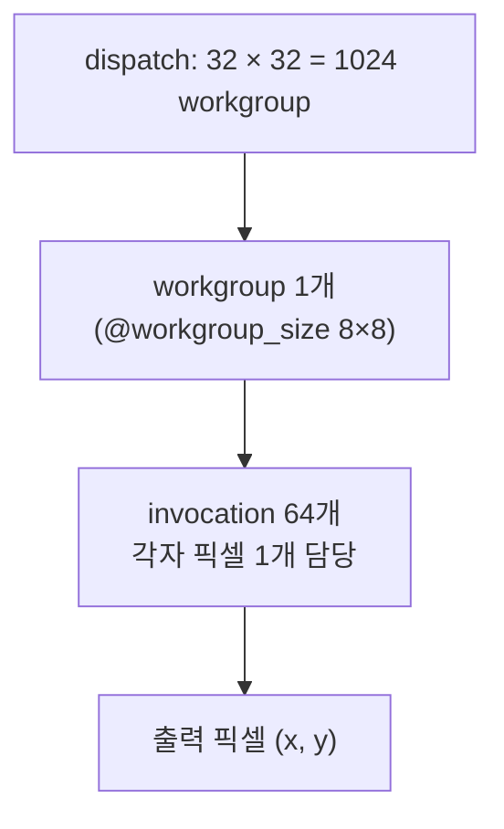

# 11. Compute Shader 기초

## 학습 목표

이 챕터를 마치면, **compute shader** 가 무엇인지, GPU 가 일을 어떻게 쪼개서 동시에 처리하는지(invocation / workgroup / dispatch)를 설명할 수 있습니다. 그리고 입력 없이 **좌표(`global_invocation_id`)만으로** 패턴을 그리는 가장 단순한 compute shader 를 직접 작성하고 실행할 수 있습니다. 여기서 익히는 "픽셀 하나당 invocation 하나" 모델은 이후 모든 GPU 필터·convolution·CNN 챕터의 뼈대입니다.

## 예상 소요 시간 · 난이도

약 35분 · ★★☆☆☆ (첫 compute shader)

## 사전 지식

- 3장 픽셀 데이터 (RGBA, 0~1 float 색상, 좌표계)
- 6~8장 WebGPU 초기화, texture, storage texture, bind group, pipeline
- (도움이 되는) 4~5장 CPU 이미지 필터 — CPU 의 이중 `for` 문을 GPU 가 어떻게 대체하는지 비교하면 이해가 빠릅니다.

## 개념 설명

### compute shader 는 "이중 for 문"을 GPU 가 병렬로 도는 것

4~5장에서 CPU 로 이미지를 처리할 때는 이렇게 픽셀을 하나씩 돌았습니다.

```ts
for (let y = 0; y < height; y++) {
  for (let x = 0; x < width; x++) {
    output[y][x] = f(x, y); // 픽셀 (x, y) 하나를 계산
  }
}
```

**compute shader** 는 이 이중 `for` 문의 몸통 `f(x, y)` 만 떼어내, 모든 `(x, y)` 에 대해 **동시에** 실행합니다. 우리가 `for` 를 직접 쓰지 않습니다. 대신 GPU 에게 "이 함수를 256×256 좌표에 한 번씩 실행해줘" 라고 시키고, 각 실행이 자기가 맡은 좌표를 `@builtin(global_invocation_id)` 로 전달받습니다.

### 핵심 용어 세 가지: invocation, workgroup, dispatch

- **invocation (실행 1개)**: 셰이더 함수가 한 번 실행되는 것. 이번 챕터에서는 **invocation 하나 = 픽셀 하나**입니다. 자기 좌표는 `global_invocation_id` 로 받습니다.
- **workgroup (실행 묶음)**: invocation 을 격자로 묶은 단위. `@workgroup_size(8, 8)` 은 "한 workgroup 안에 invocation 을 8×8 = 64개 둔다"는 뜻입니다. 같은 workgroup 안의 invocation 들은 (이후 챕터에서 배울) 공유 메모리를 함께 쓸 수 있습니다.
- **dispatch (작업 제출)**: workgroup 을 몇 개 띄울지 정해 GPU 큐에 제출하는 것. `pass.dispatchWorkgroups(gx, gy)` 가 `gx × gy` 개의 workgroup 을 실행합니다.

```math
\text{dispatch} \;\supset\; \text{workgroup} \;\supset\; \text{invocation} \;=\; \text{픽셀 하나}
```

세 단어의 포함 관계입니다. dispatch 가 workgroup 들을 담고, workgroup 이 invocation 들을 담고, invocation 하나가 픽셀 하나를 그립니다.

### 그림으로 보기: 256×256 이미지, `@workgroup_size(8, 8)`

전체 이미지를 8×8 칸짜리 workgroup 으로 타일처럼 덮습니다.



같은 내용을 격자로 보면 이렇습니다. 큰 사각형이 이미지(256×256), 굵은 선으로 나뉜 한 칸이 workgroup 하나(8×8 픽셀), 그 안의 작은 점 하나가 invocation(픽셀) 하나입니다.

```text
256px
┌──────┬──────┬─ ... ─┬──────┐   ┐
│ wg   │ wg   │       │ wg   │   │
│(0,0) │(1,0) │       │(31,0)│   │  각 wg = 8×8 = 64 invocation
│ ●●●● │      │       │      │   │  ● 하나 = invocation 1개 = 픽셀 1개
│ ●●●● │      │       │      │   │
├──────┼──────┼─ ... ─┼──────┤   │
│ wg   │ wg   │       │ wg   │   │  256px
│(0,1) │(1,1) │       │(31,1)│   │
│      │      │       │      │   │
⋮      ⋮      ⋮       ⋮          │
├──────┼──────┼─ ... ─┼──────┤   │
│ wg   │      │       │ wg   │   │
│(0,31)│      │       │(31,31│   │
└──────┴──────┴─ ... ─┴──────┘   ┘
   가로 32개 × 세로 32개 workgroup
```

각 invocation 은 `global_invocation_id` 로 자기 절대 좌표를 받습니다. 예를 들어 workgroup `(1, 0)` 의 왼쪽 위 invocation 은 `global_invocation_id = (8, 0)` 입니다. workgroup 인덱스 × workgroup_size + workgroup 내부 좌표로 계산되며, 우리가 직접 신경 쓸 필요 없이 GPU 가 채워줍니다.

### dispatch 개수 계산 (KaTeX)

이미지를 8×8 workgroup 으로 빠짐없이 덮으려면, 가로·세로로 몇 개의 workgroup 이 필요한지 **올림(ceil)** 으로 계산합니다.

```math
g_x = \left\lceil \frac{W}{s_x} \right\rceil, \qquad
g_y = \left\lceil \frac{H}{s_y} \right\rceil
```

여기서 $W \times H$ 는 이미지 크기, $(s_x, s_y)$ 는 `@workgroup_size` 입니다. 256×256 이미지에 `@workgroup_size(8, 8)` 이면:

```math
g_x = \left\lceil \frac{256}{8} \right\rceil = 32, \qquad
g_y = \left\lceil \frac{256}{8} \right\rceil = 32
```

그래서 dispatch 하는 workgroup 개수는

```math
g_x \times g_y = 32 \times 32 = 1024 \ \text{workgroup}
```

이고, 각 workgroup 이 $8 \times 8 = 64$ 개의 invocation 을 가지므로 전체 invocation 수는

```math
\underbrace{32 \times 32}_{\text{workgroup}} \times \underbrace{8 \times 8}_{\text{workgroup\_size}}
= 1024 \times 64 = 65536 = 256 \times 256
```

정확히 이미지의 픽셀 수와 같습니다. 즉 **픽셀 하나당 invocation 하나**가 딱 맞아떨어집니다.

이 계산은 코드의 `dispatchSizeFor(WIDTH, HEIGHT, [8, 8])` 가 그대로 해줍니다 (`src/core/pipeline.ts`). 반환값 `[gx, gy]` 를 `pass.dispatchWorkgroups(gx, gy)` 에 넘기면 됩니다. **여기서 쓴 `[8, 8]` 은 셰이더의 `@workgroup_size(8, 8)` 과 반드시 같아야 합니다.** 둘이 어긋나면 일부 픽셀이 안 그려지거나 같은 픽셀이 여러 번 그려집니다.

> 주의(범위 체크 필수): dispatch 개수는 위처럼 8의 배수로 **올림**됩니다. 이미지 크기가 8로 나누어떨어지지 않으면(예: 257×257), $\lceil 257/8 \rceil = 33$ 이 되어 $33 \times 8 = 264$ 칸을 덮으므로 이미지 **밖** 좌표를 맡은 invocation 이 생깁니다. 그대로 두면 텍스처 범위를 벗어나 쓰게 됩니다. 셰이더 첫머리에서 `if (gid.x >= dims.size.x || gid.y >= dims.size.y) { return; }` 로 반드시 버려야 합니다. (256×256 처럼 딱 떨어질 때도 습관으로 항상 넣으세요.)

### 입력이 없으면 크기는 어떻게 아나

13장에서는 입력 텍스처가 있어 `textureDimensions(inputTex)` 로 이미지 크기를 알았습니다. 이번 챕터는 **입력 텍스처가 없습니다** — 좌표만으로 그리기 때문입니다. 그래서 출력 크기 `(width, height)` 를 **uniform 버퍼**로 셰이더에 넘겨, 범위 체크에 씁니다.

```wgsl
struct Dims { size: vec2u };
@group(0) @binding(0) var<uniform> dims: Dims;
@group(0) @binding(1) var outputTex: texture_storage_2d<rgba8unorm, write>;
```

`vec2u` 는 8바이트라 uniform 정렬 규칙에 맞습니다(따로 패딩이 필요 없습니다). TypeScript 쪽에서는 `new Uint32Array([WIDTH, HEIGHT])` 로 채워 `writeBuffer` 합니다.

### 셰이더 한눈에 보기

`shaders/pattern.wgsl` 의 핵심입니다. 입력 없이 자기 좌표만으로 색을 정해 출력에 씁니다.

```wgsl
@compute @workgroup_size(8, 8)
fn main(@builtin(global_invocation_id) gid: vec3u) {
  if (gid.x >= dims.size.x || gid.y >= dims.size.y) { return; } // 범위 체크

  let coord = vec2i(i32(gid.x), i32(gid.y));
  let uv = vec2f(gid.xy) / vec2f(dims.size - vec2u(1u)); // 좌표 -> 0~1
  // ... uv 로 그라데이션 + 체커보드 색 계산 ...
  textureStore(outputTex, coord, vec4f(color, 1.0));
}
```

`global_invocation_id` 는 `vec3u`(x, y, z) 입니다. 2D 이미지라 `z` 는 항상 0 이고 `gid.xy` 만 씁니다. 결과를 `textureStore` 로 출력 storage 텍스처에 써넣으면, `Blitter`(`src/core/blit.ts`)가 그 텍스처를 화면 캔버스에 그려줍니다.

## 완성되면 이런 화면

오른쪽 캔버스에 좌→우로 빨강이 짙어지고 위→아래로 초록이 짙어지는 **UV 그라데이션** 위에, 32픽셀 간격의 은은한 **체커보드**가 겹쳐 보입니다. 입력 이미지 없이 순수하게 좌표 계산만으로 만든 결과입니다. 아래 stats 패널에는 `workgroup_size`, `dispatch (workgroup)` 개수(32 × 32 = 1024), `총 invocation`(65536) 이 표시되어, 코드와 셰이더의 크기가 일치하는지 눈으로 확인할 수 있습니다.

> 스크린샷: `docs/assets/11-pattern.png` (직접 캡처해 추가)

## 자가 점검 질문

스스로 설명할 수 있는지 확인하세요. (정답을 외우는 게 아니라 "설명할 수 있는가"입니다)

1. invocation, workgroup, dispatch 세 단어의 관계를, "픽셀 하나당 invocation 하나" 모델과 함께 설명해보세요. `@workgroup_size(8, 8)` 은 이 중 무엇을 정하나요?
2. 256×256 이미지에서 dispatch 하는 workgroup 개수가 왜 32×32 인지 직접 계산해보세요. 그리고 셰이더 첫머리의 범위 체크(`if ... return`)가 왜 필요한지(이미지가 257×257 이라면 어떻게 되는지) 설명해보세요.
3. 이 챕터의 셰이더에는 입력 텍스처가 없습니다. 그런데도 출력 픽셀마다 다른 색을 칠할 수 있는 이유는 무엇인가요? (`global_invocation_id` 의 역할로 설명해보세요.)
