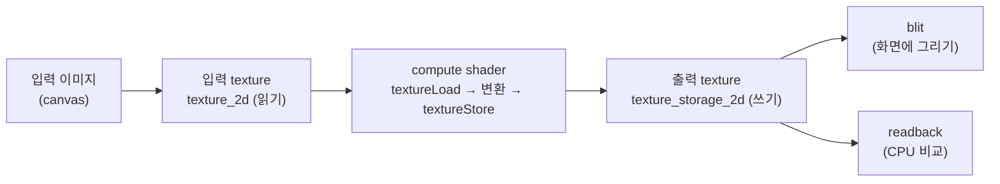

# 12. WGSL에서 Texture 읽고 쓰기

## 학습 목표

이 챕터를 마치면, compute shader 안에서 **`textureLoad` 로 입력 텍스처의 픽셀을 읽고, `textureStore` 로 출력 텍스처에 픽셀을 써넣는** 기본기를 갖추게 됩니다. 그 과정에서 **좌표 범위 체크**, 좌표를 안전하게 가두는 **clamp** 처리, 그리고 **입력 텍스처와 출력 텍스처를 왜 반드시 분리해야 하는지**를 이해하고, 결과를 CPU 와 숫자로 비교할 수 있습니다.

## 예상 소요 시간 · 난이도

약 35분 · ★★☆☆☆ (texture I/O 기본기)

## 사전 지식

- 3장 픽셀 데이터 (RGBA, 0~1 float 색상, 이미지 좌표계)
- 7장 texture (sampled texture 와 storage texture 의 차이)
- 10장 WGSL 바인딩 (`@group`, `@binding`, `texture_2d`, `texture_storage_2d`)
- 11장 compute shader 기초 (`@compute`, `@workgroup_size`, `global_invocation_id`, dispatch 크기 계산)

## 개념 설명

### texture 는 좌표로 직접 읽고 쓴다

CPU 에서 이미지는 `data[(y * width + x) * 4 + c]` 같은 인덱스로 픽셀에 접근했습니다. GPU 의 텍스처도 비슷하지만, **정수 픽셀 좌표 `(x, y)` 를 그대로 주고** 한 픽셀(texel)을 읽거나 씁니다.

- 읽기: `textureLoad(tex, coord, level)` → 좌표 `coord` 의 픽셀을 `vec4f`(RGBA, 0~1)로 반환
- 쓰기: `textureStore(tex, coord, value)` → 좌표 `coord` 에 `vec4f` 값을 써넣음

```math
\text{textureLoad}(\text{tex},\ (x, y),\ 0) \;=\; \begin{bmatrix} r & g & b & a \end{bmatrix}, \quad r,g,b,a \in [0, 1]
```

여기서 `(x, y)` 는 **정수** 픽셀 좌표이고, 세 번째 인자 `0` 은 mip level(원본 해상도는 level 0)입니다. UV 좌표(0~1 실수)가 아니라 픽셀 인덱스(0 ~ width-1)라는 점이 중요합니다.

좌표 그리드를 그림으로 보면 이렇습니다. 256×256 이미지라면 `x` 는 0부터 255, `y` 는 0부터 255 까지의 정수입니다.

```text
        x=0   x=1   x=2  ...  x=255
      +-----+-----+-----+     +-----+
 y=0  |0,0  |1,0  |2,0  | ... |255,0|
      +-----+-----+-----+     +-----+
 y=1  |0,1  |1,1  |2,1  | ... |255,1|
      +-----+-----+-----+     +-----+
 ...
      +-----+-----+-----+     +-----+
y=255 |0,255|     |     | ... |     |
      +-----+-----+-----+     +-----+
```

`textureDimensions(tex)` 로 텍스처 크기 `(width, height)` 를 얻습니다. 즉 유효한 좌표 범위는 $0 \le x \le \text{width}-1$, $0 \le y \le \text{height}-1$ 입니다.

### invocation 하나가 픽셀 하나를 읽고 쓴다

11장에서 본 대로, compute shader 의 실행 단위 하나(invocation)가 픽셀 하나를 맡습니다. 그 invocation 은 자기 좌표 `(x, y)` 의 입력 픽셀을 `textureLoad` 로 읽고, 변환한 뒤 같은 좌표의 출력 픽셀에 `textureStore` 로 씁니다.

```math
\text{invocation}(x, y):\quad \text{out}(x, y) \;=\; f\bigl(\text{in}(x, y)\bigr)
```

이 챕터에서 쓰는 변환 $f$ 는 일부러 단순하고 CPU 로 그대로 재현 가능한 것을 골랐습니다: **R 채널과 B 채널을 맞바꾸는 채널 스왑**입니다.

```math
f\bigl((r, g, b, a)\bigr) = (b,\ g,\ r,\ a)
```

WGSL 한 줄로:

```wgsl
let swapped = vec4f(color.b, color.g, color.r, color.a);
```

전체 흐름:



### 입력 texture 와 출력 texture 는 반드시 분리한다

가장 중요한 규칙입니다. **WebGPU 에서는 같은 텍스처를 한 pass 안에서 동시에 읽고 쓸 수 없습니다.** 그래서 입력용 텍스처(`texture_2d<f32>`, 읽기 전용)와 출력용 텍스처(`texture_storage_2d<rgba8unorm, write>`, 쓰기 전용)를 **서로 다른 텍스처**로 둡니다.

```wgsl
@group(0) @binding(0) var inputTex: texture_2d<f32>;                          // 읽기 전용
@group(0) @binding(1) var outputTex: texture_storage_2d<rgba8unorm, write>;   // 쓰기 전용
```

왜 이런 제약이 있을까요? GPU 는 수천 개의 invocation 을 **동시에** 실행합니다. 만약 같은 텍스처를 읽으면서 동시에 쓴다면, 어떤 invocation 이 읽는 값이 "변환 전 원본"인지 "다른 invocation 이 이미 덮어쓴 값"인지 보장할 수 없습니다(race condition). 그래서 in-place 변환은 금지하고, 원본은 그대로 둔 채 결과를 새 텍스처에 씁니다.

> 주의(입력=출력 동시 사용 금지): 같은 텍스처를 입력과 출력으로 동시에 바인딩하지 마세요. 읽기는 `texture_2d`, 쓰기는 `texture_storage_2d<..., write>` 로 **서로 다른 텍스처**를 씁니다. blur/convolution 처럼 이웃 픽셀을 읽는 필터에서는 이 분리가 특히 중요합니다. 같은 텍스처를 고치면 옆 invocation 이 이미 덮어쓴 값을 읽어 결과가 깨집니다.

### 좌표 범위 체크는 필수다

dispatch 하는 workgroup 개수는 `@workgroup_size` 의 배수로 올림됩니다(11장). `@workgroup_size(8, 8)` 에 256×256 이미지면 가로·세로 $\lceil 256 / 8 \rceil = 32$ 개씩, $32 \times 32 = 1024$ 개의 workgroup 을 dispatch 합니다. 256 은 8 로 나누어떨어지므로 딱 맞지만, 예컨대 **250×250** 이미지였다면 $\lceil 250 / 8 \rceil = 32$, $32 \times 8 = 256 > 250$ 이라 이미지 **밖**(x 또는 y 가 250~255)을 맡은 invocation 이 생깁니다.

이런 invocation 이 `textureStore` 를 하면 범위 밖 좌표에 쓰게 됩니다. 그래서 셰이더 첫머리에서 반드시 버립니다.

```wgsl
let dims = textureDimensions(inputTex);
if (gid.x >= dims.x || gid.y >= dims.y) {
  return;   // 이미지 밖 invocation 은 아무것도 하지 않고 종료
}
```

### clamp: 좌표를 유효 범위 안으로 가둔다

범위 체크가 "범위 밖이면 **버린다**"라면, clamp 는 "좌표를 유효 범위 **안으로 끌어당긴다**"입니다. 좌표 `(x, y)` 를 $[0, \text{width}-1] \times [0, \text{height}-1]$ 로 가둡니다.

```math
\text{clamp}(x, 0, \text{width}-1) = \min\bigl(\max(x, 0),\ \text{width}-1\bigr)
```

이게 왜 필요할까요? 지금처럼 자기 좌표만 읽을 때는 범위 체크를 통과한 좌표가 이미 유효하므로 clamp 가 값을 바꾸지 않습니다. 하지만 다음 챕터들의 필터(blur, convolution)는 **이웃 픽셀**(예: `coord + (-1, 0)`)을 읽습니다. 가장자리 픽셀에서는 이웃 좌표가 이미지 밖(x = -1 등)으로 나가고, 그 좌표로 `textureLoad` 하면 결과가 정의되지 않습니다. clamp 로 좌표를 가장자리 값으로 눌러주면(=clamp-to-edge) 항상 안전하게 읽을 수 있습니다.

```text
   요청 좌표      clamp 후
   x = -1   →     x = 0          (왼쪽 가장자리로)
   x = 256  →     x = 255        (오른쪽 가장자리로)
   x = 130  →     x = 130        (안쪽이면 그대로)
```

WGSL 의 `clamp` 는 벡터에도 그대로 동작하므로, 좌표 `vec2i` 를 한 번에 가둘 수 있습니다.

```wgsl
fn clampCoord(coord: vec2i, dims: vec2u) -> vec2i {
  let maxXY = vec2i(i32(dims.x) - 1, i32(dims.y) - 1);
  return clamp(coord, vec2i(0, 0), maxXY);
}
```

이 챕터의 `transform.wgsl` 은 이 `clampCoord` 를 자기 좌표에 적용해 패턴을 보여줍니다. 자기 좌표는 이미 유효하므로 결과는 변하지 않지만, 15장 convolution 에서 이웃을 읽을 때 이 패턴을 그대로 재사용하게 됩니다.

> 주의(범위 체크/clamp 필수): 셰이더에서 텍스처를 다룰 때는 두 가지를 항상 챙기세요. (1) 자기 좌표가 이미지 밖이면 `if ... return` 으로 **버린다**(쓰기 보호). (2) 이웃 좌표를 읽을 때는 `clamp` 로 **유효 범위 안으로 가둔다**(읽기 보호). 둘을 빠뜨리면 out-of-bounds 좌표 때문에 결과가 깨지거나 정의되지 않은 값이 섞입니다.

### 왜 CPU 와 "숫자로" 비교하나

"비슷해 보인다"는 검증이 아닙니다. GPU 의 채널 스왑 결과를 `readTextureRGBA` 로 CPU 로 읽어오고, 같은 변환을 CPU(`swapRB`)로도 계산해 **최대 절대 차이(max abs diff)** 를 잽니다.

```math
\text{diff} = \max_{p}\ \bigl| \text{CPU}(p) - \text{GPU}(p) \bigr|
```

출력 텍스처가 `rgba8unorm`(0~255 정수로 양자화)이라 채널 스왑은 손실이 거의 없어 보통 `diff = 0` 또는 1 정도가 나옵니다. 그래서 `diff ≤ 2` 면 일치로 봅니다. 큰 값이 나오면 채널 순서를 잘못 바꿨거나(R↔B 가 아니라 다른 조합), 좌표·범위 처리가 틀린 것입니다.

## 완성되면 이런 화면

왼쪽에 컬러 입력 이미지, 오른쪽에 R↔B 가 스왑된 GPU 출력이 나란히 보입니다. 입력의 파란 계열은 붉게, 붉은 계열은 푸르게 바뀝니다(초록은 그대로). 아래 stats 패널에 GPU 처리 시간과 `CPU vs GPU 최대차`, 그리고 `✅ 일치 (오차 ≤ 2)` 판정이 표시됩니다.

> 스크린샷: `docs/assets/12-texture-load-store.png` (직접 캡처해 추가)

## 자가 점검 질문

스스로 설명할 수 있는지 확인하세요. (정답을 외우는 게 아니라 "설명할 수 있는가"입니다)

1. 입력 텍스처와 출력 텍스처를 왜 같은 텍스처로 쓰면 안 되는지, GPU 가 invocation 을 동시에 실행한다는 점과 연결해 설명해보세요.
2. 범위 체크(`if gid.x >= dims.x ... return`)와 좌표 clamp 는 각각 무엇을 보호하는지(쓰기 vs 읽기) 구분해 설명해보세요. 250×250 이미지에서 범위 밖 invocation 이 왜 생기는지 계산해보세요.
3. `textureLoad` 의 좌표가 UV(0~1)가 아니라 정수 픽셀 좌표라는 점, 그리고 세 번째 인자 `0` 이 무엇인지 설명해보세요.

---

다음 13장에서는 이 `textureLoad → 변환 → textureStore` 골격을 그대로 가져가, 변환을 grayscale(RGB 가중치 내적)로 바꿔 첫 GPU 이미지 필터를 완성합니다.
