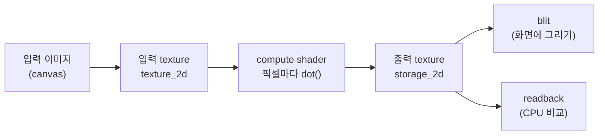

# 13. GPU Grayscale

## 학습 목표

이 챕터를 마치면, **입력 텍스처를 읽어 compute shader 로 픽셀마다 계산하고 출력 텍스처에 써넣는** 가장 기본적인 GPU 이미지 처리 흐름을 직접 구현할 수 있습니다. 그리고 그 결과가 맞는지 CPU 구현과 **숫자로** 비교할 수 있습니다. 이 흐름은 이후 모든 GPU 필터·convolution·CNN 챕터의 뼈대가 됩니다.

## 예상 소요 시간 · 난이도

약 40분 · ★★☆☆☆ (첫 compute shader)

## 사전 지식

- 3장 픽셀 데이터 (RGBA, 0~1 float 색상, 좌표계)
- 6~8장 WebGPU 초기화, texture, bind group, pipeline
- 11~12장 compute shader 기초, `textureLoad` / `textureStore`

## 개념 설명

### grayscale 은 "내적" 한 번이다

컬러 픽셀 하나는 RGB 세 값을 가진 벡터입니다. grayscale(밝기, luma)은 이 RGB 벡터와 **가중치 벡터의 내적(dot product)** 으로 구합니다. 선형대수에서 배운 그 내적이 맞습니다.

```math
\text{luma} = \langle \mathbf{c},\ \mathbf{w} \rangle
= \begin{bmatrix} r & g & b \end{bmatrix}
  \begin{bmatrix} 0.2126 \\ 0.7152 \\ 0.0722 \end{bmatrix}
= 0.2126\,r + 0.7152\,g + 0.0722\,b
```

여기서 $\mathbf{c} = (r, g, b)$ 는 픽셀 색 벡터, $\mathbf{w} = (0.2126, 0.7152, 0.0722)$ 는 Rec.709 luma 가중치입니다. 사람 눈이 초록(G)에 가장 민감하기 때문에 G 의 가중치가 가장 큽니다. 가중치의 합은 $0.2126 + 0.7152 + 0.0722 = 1$ 이라, 흰색 $(1,1,1)$ 은 밝기 $1$ 로, 검은색 $(0,0,0)$ 은 $0$ 으로 정확히 매핑됩니다.

WGSL 에서는 이 내적이 `dot()` 한 줄입니다.

```wgsl
let luma = dot(color.rgb, vec3f(0.2126, 0.7152, 0.0722));
```

### GPU 는 픽셀 하나에 invocation 하나를 배정한다

CPU 라면 이중 `for` 문으로 픽셀을 하나씩 도는 작업입니다. GPU 는 이걸 **동시에** 합니다. compute shader 의 실행 단위 하나(invocation)가 픽셀 하나를 맡습니다.

```math
\text{invocation}(x, y) \;\longrightarrow\; \text{출력 픽셀}(x, y)
```

전체 흐름:



`@workgroup_size(8, 8)` 은 invocation 을 8×8 = 64개씩 묶어 처리한다는 뜻이고, 이미지가 256×256 이면 가로·세로로 $\lceil 256 / 8 \rceil = 32$ 개씩, 총 $32 \times 32 = 1024$ 개의 workgroup 을 dispatch 합니다.

> 주의(범위 체크): dispatch 개수는 8의 배수로 올림되므로, 이미지 크기가 8로 나누어떨어지지 않으면 이미지 **밖** 픽셀을 맡은 invocation 이 생깁니다. 셰이더 첫머리에서 `if (gid.x >= dims.x || gid.y >= dims.y) { return; }` 로 반드시 버려야 합니다.

> 주의(비동기 readback): GPU 결과를 CPU 로 가져오는 `readTextureRGBA` 는 **비동기**입니다. 큐에 작업을 제출했다고 끝난 게 아니라 `await` 로 `mapAsync` 를 기다려야 값이 옵니다. "결과가 안 나와요"의 흔한 원인입니다.

### 왜 CPU 와 "숫자로" 비교하나

"비슷해 보인다"는 검증이 아닙니다. 같은 luma 식을 CPU(`src/math/color.ts` 의 `grayscale`)로도 계산해, 두 결과의 **최대 절대 차이(max abs diff)** 를 잽니다.

```math
\text{diff} = \max_{p}\ \bigl| \text{CPU}(p) - \text{GPU}(p) \bigr|
```

출력 텍스처가 `rgba8unorm`(0~255 정수로 양자화)이라 1~2 정도의 오차는 정상입니다. 그래서 `diff ≤ 2` 면 일치로 봅니다. 만약 큰 값이 나오면 가중치가 CPU/GPU 간에 다르거나, 좌표·범위 처리가 틀린 것입니다.

## 완성되면 이런 화면

왼쪽에 컬러 입력 이미지, 오른쪽에 흑백으로 변환된 GPU 출력이 나란히 보입니다. 아래 stats 패널에 GPU 처리 시간과 `CPU vs GPU 최대차`, 그리고 `✅ 일치 (오차 ≤ 2)` 판정이 표시됩니다.

> 스크린샷: `docs/assets/13-grayscale.png` (직접 캡처해 추가)

## 자가 점검 질문

스스로 설명할 수 있는지 확인하세요. (정답을 외우는 게 아니라 "설명할 수 있는가"입니다)

1. grayscale 계산이 왜 "내적"인지, 가중치 벡터의 의미와 함께 설명해보세요.
2. `@workgroup_size(8, 8)` 과 256×256 이미지에서 dispatch 하는 workgroup 개수가 왜 32×32 인지 계산해보세요. 그리고 셰이더에서 범위 체크(`if ... return`)가 왜 필요한지 설명해보세요.
3. GPU 출력을 CPU 로 읽어올 때 `await` 가 왜 필요한지(GPU 의 비동기성과 연결해서) 설명해보세요.
