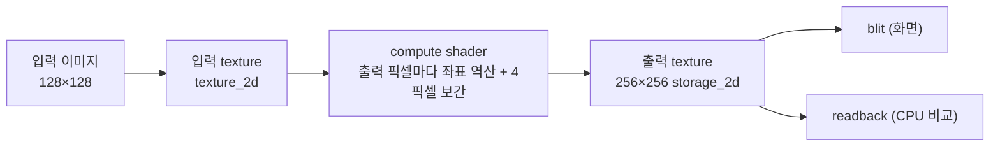

# 14. GPU Bilinear Upscale

## 학습 목표

이 챕터를 마치면, **작은 입력 텍스처를 compute shader 로 2배 확대(bilinear upscale)** 하는 GPU 코드를 직접 작성할 수 있습니다. 출력 픽셀마다 원본 좌표를 역산하고, 주변 4개 픽셀을 읽어 선형 보간하는 흐름을 WGSL 로 구현합니다. 그리고 그 GPU 결과가 4장에서 만든 CPU `bilinearUpscale` 와 **숫자로** 일치하는지 검증합니다. 이 bilinear 확대는 이후 **Super Resolution 파이프라인(18장)의 첫 단계** 가 됩니다.

## 예상 소요 시간 · 난이도

약 45분 · ★★★☆☆ (13장 흐름 + 좌표 역산/보간)

## 사전 지식

- 13장 GPU Grayscale: 입력 텍스처 → compute shader → 출력 storage 텍스처 → CPU 숫자 비교의 전체 골격
- 4장 CPU 이미지 처리: `bilinearUpscale` / `nearestUpscale`, 채널별 처리, 선형보간 = 가중 평균
- 12장 `textureLoad` / `textureStore`, 좌표 범위 체크와 clamp
- 대학 선형대수: 벡터의 **선형결합(가중 평균)**, 내적

## 개념 설명

### 13장과 무엇이 다른가 — 입력과 출력 크기가 다르다

13장 grayscale 은 입력 픽셀 $(x, y)$ 하나가 출력 픽셀 $(x, y)$ 하나로 1:1 대응했습니다. 입력과 출력 크기가 같았죠. 업스케일은 다릅니다. 출력이 입력보다 큽니다(여기선 2배). 그래서 **출력 픽셀이 입력의 어떤 위치에 대응하는지** 를 매번 역산해야 하고, 그 위치가 정수 격자에 딱 떨어지지 않으면 **주변 픽셀을 섞어** 메워야 합니다.



이번에는 **invocation 을 출력 픽셀 기준** 으로 배정합니다. 출력이 256×256 이므로 dispatch 도 256×256 을 덮도록 계산합니다(입력 크기가 아닙니다).

```math
\text{invocation}(x, y) \;\longrightarrow\; \text{출력 픽셀}(x, y),\quad (x, y) \in [0, 256)^2
```

### 1단계: 출력 픽셀 → 원본 좌표 역산

출력 픽셀 $(x, y)$ 가 원본 이미지의 **어디** 에서 왔는지 먼저 알아야 합니다. 단순히 $x / s$ 로 나누면 안 됩니다. 픽셀은 점이 아니라 **작은 정사각형이고, 그 중심은 정수 좌표가 아니라 $+0.5$ 위치** 에 있기 때문입니다. 출력 픽셀의 중심 $(x+0.5,\ y+0.5)$ 를 스케일로 나눠 원본 좌표로 옮긴 뒤, 다시 $0.5$ 를 빼서 원본 픽셀 중심 기준으로 맞춰야 합니다.

```math
x_{\text{src}} = \frac{x + 0.5}{s} - 0.5, \qquad
y_{\text{src}} = \frac{y + 0.5}{s} - 0.5
```

여기서 $s$ 는 스케일(이 데모는 $s = 2$), $(x, y)$ 는 출력 픽셀 정수 좌표입니다. 이 식은 **4장 `src/math/upscale.ts` 의 `bilinearUpscale` 와 글자 그대로 같은 식** 입니다. CPU 와 GPU 가 같은 식을 써야 두 결과가 일치하고, 그래야 숫자 비교가 의미를 가집니다.

> 주의(0.5 픽셀 중심 보정): `+0.5` 와 `-0.5` 를 빼먹고 그냥 $x / s$ 로 역산하면, 결과가 반 픽셀씩 한쪽으로 밀립니다. 화면으로는 "비슷해" 보이지만 CPU 와 비교하면 경계에서 큰 차이가 나서 판정이 ⚠️ 로 뜹니다. 픽셀은 점이 아니라 **중심이 $+0.5$ 에 있는 칸** 이라는 점을 항상 기억하세요.

### 2단계: 주변 4개 픽셀 고르기

$x_{\text{src}}$ 는 보통 정수가 아닙니다(예: $12.3$). 정수 부분과 소수 부분으로 나눕니다.

```math
x_0 = \lfloor x_{\text{src}} \rfloor, \quad t_x = x_{\text{src}} - x_0, \qquad
y_0 = \lfloor y_{\text{src}} \rfloor, \quad t_y = y_{\text{src}} - y_0
```

$x_0, y_0$ 은 왼쪽-위 이웃 픽셀의 정수 좌표, $t_x, t_y \in [0, 1)$ 는 **보간 비율** 입니다. 이 좌표를 둘러싼 4개 픽셀을 다음과 같이 부릅니다.

```text
        x0           x1 = x0+1
        │               │
 y0 ── v00 ─────────── v10 ──      tx: 가로 보간 비율 (0~1, 오른쪽으로 갈수록 1)
        │      • (tx,ty) │         ty: 세로 보간 비율 (0~1, 아래로 갈수록 1)
        │   여기를 채운다  │
 y1 ── v01 ─────────── v11 ──
        │               │
y1 = y0+1
```

GPU 에서는 이 4개를 `textureLoad` 로 읽습니다. `textureLoad(inputTex, vec2i(x, y), 0)` 은 정수 좌표 $(x, y)$ 의 픽셀을 `vec4f`(RGBA, 0~1)로 그대로 읽어옵니다(마지막 `0` 은 mip level).

> 주의(경계 clamp): $x_0 + 1$ 또는 $y_0 + 1$ 이 이미지 밖으로 나갈 수 있습니다(오른쪽/아래 가장자리). WGSL 의 `textureLoad` 는 범위를 벗어난 좌표에 대해 **0(검은색)** 을 돌려줍니다 — 그러면 가장자리가 어둡게 번집니다. CPU 의 `bilinearUpscale` 는 `clampIndex` 로 좌표를 가장 가까운 가장자리에 **고정(clamp-to-edge)** 합니다. 두 결과를 맞추려면 셰이더에서도 `clamp(coord, 0, max-1)` 로 똑같이 고정해야 합니다. 이 데모 셰이더의 `clampCoord` 가 그 역할입니다.

### 3단계: 선형 보간 = 두 번의 lerp = 가중치 합이 1인 선형결합

이제 4픽셀을 섞습니다. 핵심은 **bilinear 가 새로운 연산이 아니라, 1차 선형보간(lerp)을 세 번 한 것** 이라는 점입니다. 두 값 $a, b$ 를 비율 $t$ 로 섞는 lerp 는

```math
\mathrm{lerp}(a, b, t) = (1 - t)\,a + t\,b
```

입니다. 이는 선형대수의 **선형결합** $\alpha a + \beta b$ 에서 $\alpha = 1-t,\ \beta = t$ 인 특수한 경우이고, **계수의 합이 $1$** 입니다($\alpha + \beta = 1$). 계수 합이 1인 선형결합이라 결과가 항상 $a$ 와 $b$ "사이" 에 놓입니다(가중 평균). WGSL 에서는 `mix(a, b, t)` 한 줄이 정확히 이 식입니다.

bilinear 는 이 lerp 를 **가로 2번 + 세로 1번** 합니다. 먼저 위/아래 두 줄을 각각 가로로 보간하고, 그 두 결과를 세로로 보간합니다.

```math
\begin{aligned}
\text{top} &= \mathrm{lerp}(v_{00},\ v_{10},\ t_x) = (1 - t_x)\,v_{00} + t_x\,v_{10} \\
\text{bot} &= \mathrm{lerp}(v_{01},\ v_{11},\ t_x) = (1 - t_x)\,v_{01} + t_x\,v_{11} \\
\mathrm{out} &= \mathrm{lerp}(\text{top},\ \text{bot},\ t_y) = (1 - t_y)\,\text{top} + t_y\,\text{bot}
\end{aligned}
```

이 세 식을 한 줄로 펼치면, 네 픽셀의 **가중 평균** — 즉 길이 4 벡터 $\mathbf{v} = (v_{00}, v_{10}, v_{01}, v_{11})$ 과 가중치 벡터 $\mathbf{w}$ 의 **내적** 입니다.

```math
\mathrm{out} = \langle \mathbf{w},\ \mathbf{v} \rangle, \qquad
\mathbf{w} = \begin{bmatrix}
(1-t_x)(1-t_y) \\ t_x(1-t_y) \\ (1-t_x)\,t_y \\ t_x\,t_y
\end{bmatrix}
```

네 가중치의 합도 정확히 $1$ 입니다.

```math
(1-t_x)(1-t_y) + t_x(1-t_y) + (1-t_x)t_y + t_x t_y = 1
```

즉 bilinear 는 **"가까운 픽셀일수록 더 크게 쳐주는 가중 평균"** 이고, 이것은 13장 grayscale 의 내적, 5장 convolution 의 내적과 **같은 수학** 입니다. 새 개념이 아니라 이미 아는 내적/선형결합의 또 다른 옷입니다.

그리고 한 가지 편리한 점: 색은 RGBA 4채널이지만, 보간이 **선형 연산** 이라 채널마다 따로 섞든 `vec4f` 로 한 번에 섞든 결과가 같습니다. 그래서 WGSL 에서는 `mix(v00, v10, tx)` 가 RGBA 네 채널을 한 번에 보간합니다(CPU 기준은 채널별로 따로 돌려 합치지만 결과는 일치).

### nearest vs bilinear — 한 줄(1차원)로 보기

원본 값 `10` 과 `20` 사이를 2배로 채울 때:

```text
원본:        10                      20
            └─────────────────────────┘

nearest:    10    10    20    20        (가까운 쪽을 통째로 복제 → 계단)
            └──┘  └──┘  └──┘  └──┘

bilinear:   10  12.5  15  17.5  20      (사이 값을 선형보간 → 매끈)
            └─────────────────────────┘
```

nearest 는 값이 뚝뚝 끊겨 경계가 **블록/계단** 처럼 보이고, bilinear 는 사이 값을 채워 **부드럽게** 이어집니다. 데모의 `모드` 토글로 두 결과를 번갈아 보면, 체커보드 경계와 흰 원 가장자리에서 차이가 뚜렷합니다.

### 왜 CPU 와 "숫자로" 비교하나

"비슷해 보인다"는 검증이 아닙니다. 같은 좌표 규약을 쓰는 CPU `bilinearUpscale`(`src/math/upscale.ts`)을 R/G/B/A 채널별로 적용해 RGBA 기준 이미지를 만들고, GPU 출력(`readTextureRGBA`)과 **최대 절대 차이(max abs diff)** 를 잽니다.

```math
\text{diff} = \max_{p}\ \bigl| \text{CPU}(p) - \text{GPU}(p) \bigr|
```

> 주의(좌표 규약은 CPU 와 정확히 일치해야 한다): 이 비교가 통과하려면 셰이더의 역산 식 $x_{\text{src}} = (x+0.5)/s - 0.5$, `floor`, clamp-to-edge 경계 처리가 CPU 와 **글자 그대로** 같아야 합니다. 하나라도 어긋나면(예: `+0.5` 누락, clamp 대신 0 처리) 경계 픽셀에서 차이가 커져 판정이 ⚠️ 로 뜹니다. "GPU 가 틀렸나?" 보다 "두 좌표 규약이 정말 같은가?" 를 먼저 의심하세요.

출력 텍스처가 `rgba8unorm`(0~255 정수로 양자화)이고, CPU 기준도 채널 값을 `round` 로 0~255 정수에 맞추기 때문에, **반올림 경계에서 1~2 의 차이** 가 자연스럽게 생깁니다. 그래서 이 챕터는 `diff ≤ 3` 이면 일치로 봅니다(13장의 grayscale 보다 한 칸 넉넉). 큰 값이 나오면 양자화가 아니라 좌표 규약이 어긋난 것입니다.

> bilinear 는 SR(Super Resolution)의 **기본 확대** 단계입니다. 18장에서는 이 bilinear 결과 위에 CNN 이 추가 디테일(residual)을 더해 더 선명한 결과를 만듭니다 — bilinear 가 토대, CNN 이 보정입니다.

## 완성되면 이런 화면

왼쪽에 작은 입력 이미지(128×128, 화면에선 256으로 늘려 표시), 오른쪽에 GPU 가 2배 확대한 결과(256×256)가 나란히 보입니다. `모드` 셀렉트로 bilinear ↔ nearest 를 바꾸면 즉시 결과가 갱신됩니다 — nearest 는 계단형, bilinear 는 부드럽습니다.

아래 stats 패널에 `모드`, `출력 크기`, `GPU 시간`, `CPU vs GPU 최대차`, 그리고 `✅ 일치 (오차 ≤ 3)` 판정이 표시됩니다.

> 스크린샷: `docs/assets/14-bilinear-upscale.png` (직접 캡처해 추가)

## 자가 점검 질문

스스로 설명할 수 있는지 확인하세요. (정답을 외우는 게 아니라 "설명할 수 있는가"입니다)

1. 출력 픽셀 좌표를 원본으로 역산할 때 왜 $x/s$ 가 아니라 $(x+0.5)/s - 0.5$ 를 쓰는지, "픽셀 중심" 개념과 함께 설명해보세요. `+0.5` 를 빼먹으면 결과가 어떻게 틀어질까요?
2. bilinear 보간이 "가중치 합이 1인 선형결합(가중 평균)"이라는 말의 의미를, lerp 를 세 번 한다는 점·내적과 엮어 설명해보세요. 왜 채널별로 따로 보간해도 `vec4f` 로 한 번에 보간한 결과와 같은가요?
3. GPU `textureLoad` 가 범위 밖 좌표에 0 을 주는데도 CPU 와 비교가 통과하려면 셰이더에서 무엇을 해야 하는지(clamp-to-edge), 그리고 그게 CPU `clampIndex` 와 어떻게 맞물리는지 설명해보세요.
