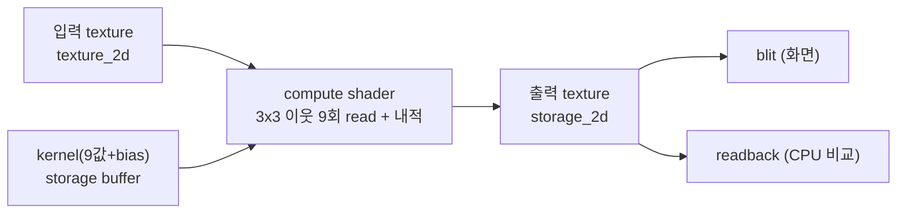

# 15. GPU Convolution Filter

## 학습 목표

이 챕터를 마치면, 5장에서 CPU 로 이해한 **3x3 convolution 을 WGSL compute shader 로 직접 구현**할 수 있습니다. blur / sharpen / edge kernel 을 셀렉트로 전환하고, 경계 픽셀을 clamp 로 처리하며, 픽셀마다 주변 9개를 읽는 비용(texture read 횟수)이 성능과 어떻게 연결되는지 설명할 수 있습니다. 그리고 GPU 결과가 5장 CPU 결과(`convolve3x3`)와 **숫자로** 일치하는지 확인할 수 있습니다.

이 챕터는 5장(CPU convolution)의 GPU 버전이자, CNN(16장~)으로 가는 **가장 중요한 다리**입니다. 여기서 convolution 을 "내적"으로 다시 한번 각인해 두면, 16장의 "CNN = 학습된 필터 여러 개"가 새 개념이 아니라 같은 연산의 확장으로 보입니다.

## 예상 소요 시간 · 난이도

약 50분 · ★★★☆☆ (13장 흐름 + storage buffer 로 kernel 전달)

## 사전 지식

- 5장 CPU convolution: convolution = "주변 3x3 패치 벡터와 kernel 벡터의 **내적** + bias", clamp 경계 처리, blur/sharpen/edge kernel
- 13장 GPU Grayscale: 입력 텍스처 → compute shader → 출력 storage 텍스처 → blit → CPU 숫자 비교의 전체 흐름
- 7장 Buffer: uniform / storage buffer, 그리고 `vec3f`·배열의 **정렬(alignment)**
- 11~12장 compute shader, `textureLoad` / `textureStore`, 좌표 범위 체크

## 개념 설명

### convolution 은 (또) 내적이다

5장에서 본 그대로입니다. 출력 이미지 $O$ 의 픽셀 $(x, y)$ 는 입력 $I$ 의 그 자리 $3 \times 3$ 이웃과 kernel $K$ 를 곱해 더한 값입니다.

```math
O(x, y) = \sum_{i=-1}^{1} \sum_{j=-1}^{1} I(x+i,\ y+j)\, K(i, j) + b
```

기호를 풀면:

- $I(x+i, y+j)$ 는 현재 위치에서 $(i, j)$ 만큼 떨어진 이웃 픽셀의 밝기(luma)입니다. $i, j$ 가 각각 $-1, 0, 1$ 을 도니 정확히 $3 \times 3 = 9$ 개의 이웃입니다.
- $K(i, j)$ 는 그 이웃에 곱할 **가중치**(kernel 값)입니다.
- $b$ 는 bias(상수). 이 챕터의 이미지 필터에서는 $b = 0$ 입니다. (CNN 에서는 학습되는 값이 됩니다.)

9개의 곱을 더하는 것이므로, $3 \times 3$ 패치를 **길이 9 벡터로 펴면** 그냥 두 벡터의 내적입니다. 선형대수에서 배운 그 내적이 맞습니다.

```math
\mathbf{i} =
\begin{bmatrix} I_{0} & I_{1} & I_{2} & I_{3} & I_{4} & I_{5} & I_{6} & I_{7} & I_{8} \end{bmatrix},
\qquad
\mathbf{k} =
\begin{bmatrix} K_{0} & K_{1} & K_{2} & K_{3} & K_{4} & K_{5} & K_{6} & K_{7} & K_{8} \end{bmatrix}
```

```math
O(x, y) = \langle \mathbf{i},\ \mathbf{k} \rangle + b
        = \sum_{k=0}^{8} I_k\, K_k + b
```

여기서 $\mathbf{i}$ 는 현재 위치의 $3 \times 3$ 입력 패치를 (왼쪽 위부터 오른쪽 아래로) 한 줄로 편 길이 9 벡터, $\mathbf{k}$ 는 kernel 을 같은 순서로 편 길이 9 벡터입니다. **출력 픽셀 하나 = 패치 벡터와 kernel 벡터의 내적 한 번.** 13장의 grayscale 이 "RGB 벡터와 가중치 벡터의 내적 한 번"이었던 것과 똑같은 구조이고, 다만 벡터 길이가 3 에서 9 로 늘었을 뿐입니다.

WGSL 에서는 9개를 한 번에 펴서 `dot` 하는 대신, 루프로 모으는 게 좌표 clamp 와 함께 쓰기 더 깔끔합니다. 이게 셰이더의 핵심 루프입니다.

```wgsl
var acc = kernelData[9];          // bias 로 시작
var k = 0;
for (var j = -1; j <= 1; j = j + 1) {
  for (var i = -1; i <= 1; i = i + 1) {
    acc = acc + lumaAt(x + i, y + j, dims) * kernelData[k];  // I_k * K_k 누적
    k = k + 1;
  }
}
```

### GPU 는 픽셀 하나에 invocation 하나, 그 안에서 9번 읽는다

13장에서는 invocation 하나가 입력 텍스처를 **1번** 읽었습니다(자기 픽셀만). convolution 은 invocation 하나가 주변까지 **9번** 읽습니다.



내적의 "슬라이딩"을 텍스트 격자로 보면, 출력 픽셀 $O(x,y)$ 하나는 입력의 가운데 픽셀 `[I4]` 와 그 둘레 8개를 kernel 과 곱해 더한 것입니다.

```text
  입력 이웃(3x3 패치)          kernel K              출력 한 픽셀
  ┌────┬────┬────┐         ┌────┬────┬────┐
  │ I0 │ I1 │ I2 │         │ K0 │ K1 │ K2 │
  ├────┼────┼────┤         ├────┼────┼────┤      O(x,y) =
  │ I3 │[I4]│ I5 │   ⊙     │ K3 │ K4 │ K5 │  =   I0·K0 + I1·K1 + ... + I8·K8 + b
  ├────┼────┼────┤         ├────┼────┼────┤      = ⟨ i , k ⟩ + b
  │ I6 │ I7 │ I8 │         │ K6 │ K7 │ K8 │
  └────┴────┴────┘         └────┴────┴────┘      ([I4] = 현재 픽셀)
```

이 격자가 모든 $(x, y)$ 위치로 한 칸씩 미끄러지며 출력 전체를 채웁니다 — 단, CPU 의 이중 `for` 문과 달리 GPU 는 모든 위치를 **동시에** 처리합니다. 아래 애니메이션이 그 슬라이딩 동작입니다(5장과 같은 그림).


> 출처: Michael Plotke, Wikimedia Commons, CC BY-SA 3.0. 자세한 출처는 `docs/assets/CREDITS.md` 참고.

### kernel 세 개

같은 내적 연산이지만 kernel 값 $\mathbf{k}$ 에 따라 효과가 완전히 달라집니다. `src/math/convolution.ts` 의 `KERNELS` 를 그대로 GPU 로 보냅니다(같은 값, 같은 규약).

**identity (그대로)** — 가운데만 1. 자기 픽셀만 통과시키므로 변화가 없습니다. GPU 결과가 입력 luma 와 같은지로 셰이더가 맞게 도는지 확인하는 기준점입니다.

```math
K_{\text{identity}} = \begin{bmatrix} 0 & 0 & 0 \\ 0 & 1 & 0 \\ 0 & 0 & 0 \end{bmatrix}
```

**blur (흐리게)** — 9개를 모두 $\tfrac{1}{9}$ 로 곱한 평균. 가중치 합이 $1$ 이라 밝기는 유지하면서 경계가 부드러워집니다.

```math
K_{\text{blur}} = \frac{1}{9}\begin{bmatrix} 1 & 1 & 1 \\ 1 & 1 & 1 \\ 1 & 1 & 1 \end{bmatrix}
```

**sharpen (선명하게)** — 자기 자신을 5배, 상하좌우를 빼서 차이를 강조. 합이 $5 - 4 = 1$ 이라 평탄한 영역은 그대로, 경계만 또렷해집니다.

```math
K_{\text{sharpen}} = \begin{bmatrix} 0 & -1 & 0 \\ -1 & 5 & -1 \\ 0 & -1 & 0 \end{bmatrix}
```

**edge (경계 검출)** — 자기 자신 8배, 주변 8개를 모두 뺌. 합이 $8 - 8 = 0$ 이라 평탄한 영역은 0(검정), 값이 급변하는 경계에서만 큰 값이 나옵니다.

```math
K_{\text{edge}} = \begin{bmatrix} -1 & -1 & -1 \\ -1 & 8 & -1 \\ -1 & -1 & -1 \end{bmatrix}
```

### kernel 을 셰이더로 어떻게 보내나 (storage buffer)

kernel 9개 값 + bias(총 10개 float)를 셰이더에 전달해야 합니다. 텍스처가 아니라 **버퍼**로 보냅니다. 셰이더 쪽 선언:

```wgsl
@group(0) @binding(2) var<storage, read> kernelData: array<f32, 10>;
//  data[0..8] = K0..K8 (왼쪽 위 -> 오른쪽 아래),  data[9] = bias
```

TypeScript 쪽은 `src/core/buffer.ts` 의 `createStorageBuffer` 를 그대로 재사용합니다.

```ts
const kernelData = new Float32Array([...kernel, bias]); // 길이 10
const kernelBuffer = createStorageBuffer(device, kernelData);
```

왜 uniform 이 아니라 **storage** 인가? uniform 주소 공간에서는 배열 원소가 **16바이트 단위로 정렬**됩니다. 즉 `array<f32, 10>` 를 uniform 으로 올리면 원소 하나마다 12바이트씩 빈 패딩이 생겨, JS 쪽 `Float32Array` 를 그냥 10칸으로 채우면 셰이더가 엉뚱한 자리를 읽습니다(매 4번째 칸만 유효). storage 주소 공간의 `array<f32>` 는 stride 가 4바이트라 **패딩 없이** 그대로 펴 넣을 수 있어 정렬 함정을 피합니다. (kernel 은 데이터가 작아 둘 다 가능하지만, 이 챕터는 정렬을 신경 쓸 일이 없는 storage 를 택합니다.)

> 주의(버퍼 정렬): `vec3f` 와 uniform 배열은 16바이트 정렬입니다. uniform 으로 9값을 올리려면 `array<vec4f, ...>` 처럼 16바이트에 맞춰 펴거나 패딩을 넣어야 합니다. "값을 분명히 넣었는데 셰이더에서 0 이나 이상한 값이 읽힌다"의 단골 원인이 이 정렬입니다. (7장 참고)

### texture read 횟수와 성능

여기서 성능 감각을 하나 챙겨 갑니다. 출력 픽셀 하나를 만들 때 입력을 몇 번 읽는지(`textureLoad` 호출 수)를 세어 보면:

- 13장 grayscale: 픽셀당 **1회** read
- 이 챕터 3x3 convolution: 픽셀당 **9회** read
- 일반화하면 $k \times k$ kernel 은 픽셀당 $k^2$ 회. $5 \times 5$ 면 25회, $7 \times 7$ 면 49회.

$256 \times 256$ 이미지면 3x3 은 총 $256 \times 256 \times 9 \approx 59$ 만 번의 텍스처 read 입니다. GPU 가 빨라도 **메모리에서 픽셀을 읽어 오는 비용**은 공짜가 아니고, 보통 convolution 의 병목은 곱셈·덧셈(연산)보다 이 read(메모리 대역폭)입니다. 그래서 실무 최적화의 핵심은 "read 횟수를 줄이는 것"입니다. 대표 기법:

- **이웃 픽셀 재사용**: 옆 픽셀과 겹치는 입력을 매번 다시 읽지 말고, workgroup 안에서 한 번 읽어 공유 메모리(`var<workgroup>`)에 캐싱한다.
- **separable kernel**: blur 같은 일부 kernel 은 $3 \times 3$(9회)을 가로 $1 \times 3$ + 세로 $3 \times 1$(3+3 = 6회)로 분리해 read 를 줄인다.

이 챕터는 가장 단순한 "픽셀당 9회 read" 버전을 그대로 구현하고, 위 최적화는 22장(성능 최적화)에서 다룹니다. 지금은 **read 횟수가 곧 비용**이라는 감만 가져갑니다. (stats 패널에 픽셀당 read 횟수를 표시해 둡니다.)

### 경계 픽셀: clamp-to-edge

가장 왼쪽 위 픽셀 $(0,0)$ 에서 $3 \times 3$ 이웃을 읽으려면 $(-1,-1)$ 같은 **이미지 밖 좌표**가 필요합니다. 5장(CPU `convolve3x3`)과 **똑같이 clamp(가장자리 복제)** 로 처리합니다. 밖으로 나간 좌표를 가장 가까운 가장자리로 끌어당깁니다.

```wgsl
fn clampCoord(v: i32, maxExclusive: i32) -> i32 {
  return clamp(v, 0, maxExclusive - 1);  // [-1] -> 0,  [W] -> W-1
}
```

CPU(`convolution.ts` 의 `clampCoord`)와 GPU 가 같은 clamp 규약을 쓰므로, 출력은 입력과 같은 크기($256 \times 256$)로 나오고 경계 픽셀까지 두 결과가 일치합니다.

> 주의(경계 clamp 를 안 하면): clamp 없이 음수 좌표로 `textureLoad` 하면 WebGPU 는 0(검정)을 돌려줍니다. 그러면 경계에 5장 CPU(clamp)와 다른 어두운 테두리가 생겨 비교가 어긋납니다. **이웃을 읽기 전에 좌표를 clamp** 하는 것을 빠뜨리지 마세요.

> 주의(음수 클리핑): sharpen / edge kernel 은 음수 가중치가 있어 결과가 **음수**거나 **1 초과**가 될 수 있습니다. 출력 텍스처가 `rgba8unorm`(0~1 클램프)이라 그냥 쓰면 잘립니다. 셰이더에서 `saturate(acc)`(= `clamp(acc, 0, 1)`)로 0~1 에 맞춰 저장하고, **CPU 비교도 동일하게 0~255 로 clamp** 해 같은 표현으로 맞춥니다. 양쪽 clamp 규약을 다르게 두면 음수 영역에서 maxAbsDiff 가 커집니다. (음수를 보존해야 하는 residual 은 18장에서 `r32float` 같은 float storage 로 다룹니다 — 그건 또 다른 이야기입니다.)

> 주의(입력 ≠ 출력): convolution 은 주변을 읽어 가운데를 정하므로, 읽는 텍스처와 쓰는 텍스처를 **분리**해야 합니다. 같은 텍스처에 동시에 읽고 쓰면 이미 갱신된 이웃을 다시 읽어 결과가 오염됩니다. 이 데모는 입력 sampled 텍스처와 출력 storage 텍스처를 따로 둡니다.

### CPU 와 "숫자로" 비교

5장과 같은 luma(밝기) 평면을 기준 표현으로 씁니다. CPU 는 입력 RGBA 를 luma 평면(0~255)으로 만들어 `convolve3x3` 를 돌리고, GPU 는 같은 입력 텍스처에서 luma 를 뽑아(같은 Rec.709 가중치) 같은 kernel 로 convolution 합니다. 두 결과를 0~255 로 clamp·round 한 뒤 최대 절대 차이를 잽니다.

```math
\text{diff} = \max_{p}\ \bigl| \text{CPU}(p) - \text{GPU}(p) \bigr|
```

`rgba8unorm` 양자화(0~255 정수)와 0~255 round 때문에 작은 오차는 정상입니다. 그래서 `diff ≤ 3` 이면 일치로 봅니다. 큰 값이 나오면 kernel 값·clamp 규약·좌표 처리 중 하나가 CPU/GPU 간에 어긋난 것입니다.

> **CNN 예고:** 이 kernel 9개 값을 사람이 직접 고르지 않고 **데이터로부터 학습한 값**으로 바꾸면, 그게 바로 16장에서 만날 CNN 의 convolution layer 입니다 — 연산(주변 패치와의 내적)은 똑같고, $\mathbf{k}$ 의 출처만 "사람의 직관"에서 "학습된 weight"로 바뀝니다.

## 완성되면 이런 화면

왼쪽에 컬러 입력, 오른쪽에 선택한 kernel 로 convolution 한 흑백 GPU 결과가 나란히 보입니다. 위 셀렉트로 `identity / blur / sharpen / edge` 를 바꾸면 즉시 갱신됩니다.

- **identity**: 입력 밝기 그대로 (흑백).
- **blur**: 체커보드 경계와 원의 윤곽이 부드럽게 번진다.
- **sharpen**: 경계 대비가 세져 또렷해진다.
- **edge**: 평탄한 부분은 검게, 윤곽선만 밝게 남는다.

아래 stats 패널에 선택한 `kernel`, `GPU 시간`(ms), `texture read`(픽셀당 9회), `CPU vs GPU 최대차`, 그리고 `✅ 일치 (오차 ≤ 3)` 판정이 표시됩니다.

> 스크린샷: `docs/assets/15-gpu-convolution.png` (직접 캡처해 추가)

## 자가 점검 질문

스스로 설명할 수 있는지 확인하세요. (정답을 외우는 게 아니라 "설명할 수 있는가"입니다)

1. "GPU convolution 의 invocation 하나는 출력 픽셀 하나를 만들고, 그 안에서 입력을 9번 읽는다." — 이 문장을 수식 $O(x,y)=\langle \mathbf{i}, \mathbf{k}\rangle + b$ 와 연결해, 길이 9 벡터 $\mathbf{i}, \mathbf{k}$ 가 셰이더 코드의 어느 부분에 해당하는지 설명해보세요.
2. kernel 을 uniform 이 아니라 storage buffer 로 보낸 이유를, uniform 배열의 16바이트 정렬과 연결해 설명해보세요. 만약 uniform 으로 보냈는데 `Float32Array` 를 그냥 10칸으로 채웠다면 셰이더가 무엇을 읽게 될까요?
3. sharpen/edge 결과를 저장하기 전에 `saturate` 로, CPU 비교 전에 0~255 clamp 로 맞추는 이유를 설명해보세요. 그리고 이 "출력 값 범위 clamp" 가 "입력 좌표 clamp(경계 처리)" 와 어떻게 다른지 구분해보세요.
