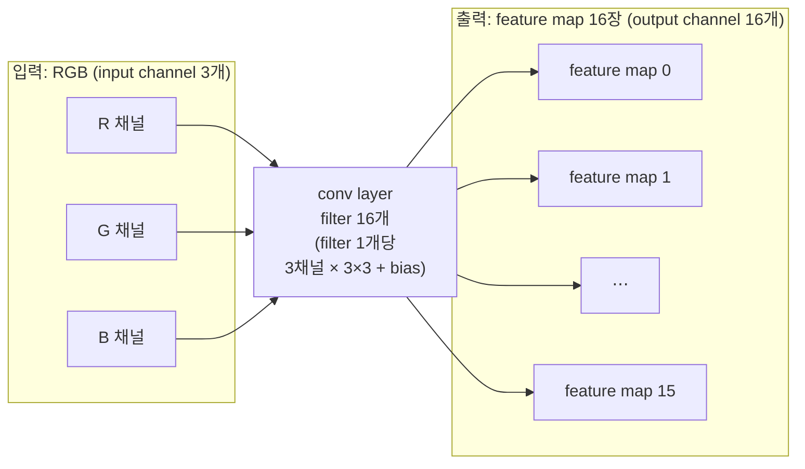

# 16. CNN을 이미지 필터 관점에서 설명

## 학습 목표

이 챕터를 마치면, **CNN 의 convolution layer 가 "새로운 딥러닝 마법"이 아니라 15장에서 직접 짠 3x3 convolution(이미지 필터)의 자연스러운 확장**이라는 것을 설명할 수 있습니다. 구체적으로 (1) 15장의 kernel 값이 "사람이 정한 값"에서 "학습된 weight"로 바뀐 것이 CNN 의 conv layer 라는 점, (2) conv layer 는 **필터(filter) 여러 개를 동시에** 적용해 여러 장의 **feature map**(output channel)을 만든다는 점, (3) 그래서 출력 채널 하나의 한 픽셀은 "모든 입력 채널의 주변 패치"와 "그 출력 채널의 kernel"의 **내적 + bias**이고, 모든 출력 채널을 모으면 픽셀마다 반복되는 **행렬-벡터 곱 + bias + activation** 이라는 점을 수식으로 풀 수 있습니다.

이 챕터는 **코드를 짜지 않습니다.** 개념·수식·그림으로 conv layer 의 정의를 머릿속에 또렷이 새기는 것이 목표이고, 17장에서 이 한 layer 를 WGSL 로 실제 구현합니다.

## 예상 소요 시간 · 난이도

약 35분 · ★★☆☆☆ (새 코드 없음. 익숙한 내적·행렬-벡터 곱으로 CNN 을 번역하는 개념 챕터)

## 사전 지식

- **5장 / 15장 convolution**: "출력 픽셀 하나 = 주변 $3 \times 3$ 패치 벡터와 kernel 벡터의 **내적** + bias", clamp 경계 처리, blur/sharpen/edge kernel. 이 챕터는 그 위에 그대로 얹습니다.
- **13장 grayscale**: "RGB 벡터와 가중치 벡터의 내적 한 번" → 출력 채널(luma) 1개. 여기서 출력 채널을 여러 개로 늘리는 것이 이 챕터입니다.
- **선형대수의 내적·행렬-벡터 곱**: 행렬 $W \in \mathbb{R}^{m \times n}$ 와 벡터 $\mathbf{p} \in \mathbb{R}^{n}$ 의 곱 $W\mathbf{p}$ 는 길이 $m$ 벡터이고, 그 $k$ 번째 원소는 $W$ 의 $k$ 번째 행과 $\mathbf{p}$ 의 내적입니다. 이 한 줄만 기억하면 됩니다.
- 3장 픽셀 데이터(채널, RGBA)의 "채널" 개념.

> 이 챕터는 **WebGPU 도, PyTorch 도 쓰지 않습니다.** 그림과 수식만 봅니다. 1·2장처럼 실행 코드(index.html / src) 없이 개념만 다지는 챕터입니다. 실제 구현은 바로 다음 17장입니다.

## 개념 설명

### 출발점: 15장의 convolution 은 "사람이 고른 필터 1개"였다

15장에서 우리가 GPU 로 돌린 3x3 convolution 을 다시 떠올려 봅시다. 출력 픽셀 $O(x, y)$ 하나는 입력의 그 자리 $3 \times 3$ 이웃과 kernel $K$ 의 내적에 bias 를 더한 것이었습니다.

```math
O(x, y) = \sum_{i=-1}^{1} \sum_{j=-1}^{1} I(x+i,\ y+j)\, K(i, j) + b
        = \langle \mathbf{p},\ \mathbf{k} \rangle + b
```

여기서 $\mathbf{p}$ 는 현재 위치의 $3 \times 3$ 입력 패치를 한 줄로 편 길이 9 벡터(patch), $\mathbf{k}$ 는 kernel 을 같은 순서로 편 길이 9 벡터입니다. 15장의 핵심 두 가지를 짚어 둡니다.

1. **kernel 값 $\mathbf{k}$ 를 사람이 직접 골랐다.** blur 면 $\tfrac{1}{9}$ 9개, edge 면 가운데 8, 주변 −1 … 이렇게 우리가 손으로 적어 넣었습니다.
2. **출력이 한 장(채널 1개)이었다.** kernel 하나 → 결과 이미지 하나.

CNN 의 convolution layer 는 이 두 가지를 정확히 두 군데에서 바꿉니다. **하나, kernel 값을 사람이 아니라 데이터가 정한다(= 학습된 weight). 둘, kernel 을 하나가 아니라 여러 개 동시에 적용해 결과 이미지를 여러 장 만든다.** 연산(주변 패치와의 내적)은 그대로입니다. 새 개념이 아니라 **출처와 개수만 바뀐 같은 convolution** 입니다.

> 이 한 문장이 이 챕터의 전부입니다: **CNN 의 conv layer = 학습된 kernel 여러 개를 동시에 적용하는 convolution.** 아래는 이 문장을 수식과 그림으로 풀어 쓴 것뿐입니다.

### 바뀐 점 1: kernel 값은 "학습된 weight"

15장 edge kernel 의 `8`, `-1` 은 사람이 "이렇게 하면 경계가 검출되겠지" 하고 고른 값입니다. CNN 에서는 이 자리에 들어갈 숫자를 사람이 고르지 않습니다. 저해상/고해상 이미지 쌍 같은 데이터를 잔뜩 주고, 결과가 좋아지는 방향으로 숫자를 **조금씩 자동으로 고쳐** 찾아낸 값을 씁니다. 그 숫자가 **weight** 이고, 그 자리에 같이 붙는 상수가 **bias** 입니다.

그래서 같은 수식인데 이름만 바뀝니다. 15장의 kernel $\mathbf{k}$ 와 bias $b$ 가, CNN 에서는 **weight 벡터 $\mathbf{w}$ 와 bias $b$** 로 불립니다.

| | 15장 이미지 필터 | CNN convolution layer |
|---|---|---|
| kernel 값의 출처 | **사람이 직접 정함** (blur/edge…) | **데이터로부터 학습됨** |
| 부르는 이름 | kernel, bias | **weight, bias** |
| 한 layer 의 필터 개수 | 보통 1개 | 보통 **여러 개**(예: 16개) |
| 출력 | 이미지 1장 | **feature map 여러 장** |
| 연산 자체 | 주변 패치와 내적 + bias | **똑같음** |

> **학습은 이 챕터에서 다루지 않습니다.** "weight 가 어떻게 좋은 값으로 정해지는가(gradient descent, backpropagation)"는 **옵셔널 트랙(O3: SRCNN/FSRCNN 학습)** 에서 PyTorch 로 직접 다룹니다. 메인 트랙은 **이미 학습된 weight 를 GPU 에서 추론(inference)** 하는 것만 합니다. 우리는 이 숫자들을 `bun run make:weights` 로 받아 그대로 곱하고 더할 뿐입니다 — 17장부터.

### 바뀐 점 2: 필터 여러 개 → feature map 여러 장

CNN conv layer 는 kernel(이제부터 **filter** 라고 부릅니다)을 **여러 개** 가지고 있고, 같은 입력에 **모두 동시에** 적용합니다. filter 가 16개면 결과 이미지가 16장 나옵니다. 이 결과 이미지 한 장 한 장을 **feature map**(특징 지도) 이라 하고, 몇 장이 나오느냐를 **output channel**(출력 채널) 수라고 합니다.

아래 애니메이션은 이 챕터의 핵심 그림입니다. 입력 이미지 위로 filter(kernel) **3개**가 각각 슬라이딩하면서, **서로 다른 feature map 3장**을 만들어 내는 모습입니다. 15장이 "filter 1개 → 결과 1장"이었다면, CNN 은 이걸 여러 벌 동시에 돌리는 것뿐입니다.


> 출처: Cecbur, Wikimedia Commons, CC BY-SA 4.0. 자세한 출처는 `docs/assets/CREDITS.md` 참고.

filter 마다 kernel 값이 다르므로, feature map 마다 강조하는 특징이 다릅니다. 한 filter 는 가로 경계를, 다른 filter 는 세로 경계를, 또 다른 filter 는 특정 색 패턴을 도드라지게 할 수 있습니다 — 15장에서 blur/sharpen/edge kernel 이 서로 다른 결과를 냈던 것과 같은 원리인데, 그 kernel 값을 **학습이 골라 줬다**는 점만 다릅니다.

여기에 한 가지가 더 있습니다. 입력도 채널이 여러 개입니다. 컬러 이미지는 **input channel**(입력 채널)이 R, G, B 로 **3개**입니다. 그래서 filter 하나는 "한 채널짜리 $3 \times 3$ kernel"이 아니라 "**입력 채널 수만큼 쌓인** $3 \times 3$ kernel 묶음"입니다. RGB 입력이면 filter 하나가 $3 \times (3\times3)$ = 27개 weight 를 가집니다(R 용 9개, G 용 9개, B 용 9개). filter 가 그 27개로 R·G·B 패치를 모두 읽어 **하나의** feature map 픽셀을 만듭니다.



이 그림이 17장에서 실제로 만들 첫 conv layer 입니다: **RGB(input channel 3) → feature map 16장(output channel 16)**, filter 16개.

### 한 출력 채널 픽셀 = "모든 입력 채널 패치"와 "그 채널 kernel"의 내적 + bias

이제 수식으로 또렷하게 적습니다. 출력 채널을 $k$ (각 filter 하나에 대응), 입력 채널을 $c$ 라 합시다. 출력 채널 $k$ 의 픽셀 $(x, y)$ 는 이렇게 정의됩니다.

```math
O_k(x, y) = \sum_{c}\ \sum_{i, j}\ I_c(x + i,\ y + j)\, W_{k, c}(i, j)\ +\ b_k
```

기호를 하나씩 풉니다.

- $c$ 는 **입력 채널** 인덱스입니다. RGB 입력이면 $c \in \{R, G, B\}$, 즉 3개. 바깥 합 $\sum_c$ 가 "**모든 입력 채널을 가로질러** 더한다"는 뜻입니다.
- $k$ 는 **출력 채널**(= feature map = filter) 인덱스입니다. output channel 이 16개면 $k = 0, 1, \dots, 15$. 이 식을 $k$ 마다 따로 한 번씩 계산하면 feature map 16장이 나옵니다.
- $i, j$ 는 kernel 안의 위치입니다. $3 \times 3$ 이면 $i, j \in \{-1, 0, 1\}$. 안쪽 합 $\sum_{i,j}$ 가 15장에서 본 "주변 $3\times3$ 패치와의 내적"입니다.
- $W_{k, c}(i, j)$ 는 **출력 채널 $k$ 의 filter 가 입력 채널 $c$ 를 읽을 때 쓰는 weight** 입니다. 즉 weight 는 $(k, c, i, j)$ 네 개의 인덱스를 가집니다 — output 채널 × input 채널 × kernel 높이 × kernel 너비. (이 순서 `[outC][inC][kh][kw]` 가 이 프로젝트의 weight export 레이아웃입니다. `model/architecture.md` 참고.)
- $b_k$ 는 출력 채널 $k$ 의 **bias** 입니다. feature map 한 장당 bias 하나.

15장 식 $O = \langle \mathbf{p}, \mathbf{k}\rangle + b$ 와 비교하면, 달라진 건 딱 두 군데입니다. (1) 입력 채널을 도는 바깥 합 $\sum_c$ 가 생겼고(흑백 1채널이 RGB 3채널이 됐으므로), (2) 출력 채널 $k$ 마다 식을 따로 돌린다(필터가 여러 개이므로). 안쪽의 "주변 패치 × kernel 을 곱해 더한다"는 **완전히 똑같습니다.**

### 다시 내적으로, 그리고 행렬-벡터 곱으로 (선형대수와 연결)

위 식을 한 픽셀 위치에 고정하고 보면, 13·15장에서 한 것처럼 **다 펴서 내적**으로 만들 수 있습니다.

먼저, 그 위치에서 **모든 입력 채널의 주변 패치를 한 줄로 길게 이어 붙인** 벡터를 $\mathbf{p}$ 라 합시다. RGB 입력에 $3\times3$ kernel 이면 R 패치 9개 + G 패치 9개 + B 패치 9개 = **길이 $27$ 벡터**입니다.

```math
\mathbf{p} = \bigl[\,
\underbrace{I_R(\cdots)}_{9\text{개}},\ \underbrace{I_G(\cdots)}_{9\text{개}},\ \underbrace{I_B(\cdots)}_{9\text{개}}
\,\bigr]^{\top} \in \mathbb{R}^{27}
```

출력 채널 $k$ 의 weight 도 같은 순서로 펴서 길이 27 벡터 $\mathbf{w}_k$ 로 둡니다. 그러면 출력 채널 $k$ 의 그 픽셀은 — 15장과 글자 그대로 똑같이 — **내적 + bias** 입니다.

```math
O_k(x, y) = \langle\, \mathbf{p},\ \mathbf{w}_k \,\rangle + b_k
```

이제 마지막 한 걸음. 출력 채널이 16개라는 건 **이런 내적을 16번**, 같은 패치 $\mathbf{p}$ 에 대해 서로 다른 weight 벡터 $\mathbf{w}_0, \dots, \mathbf{w}_{15}$ 로 한다는 뜻입니다. weight 벡터들을 **행으로 쌓아** 행렬 $W$ 를 만들면, 16개 내적을 한꺼번에 쓰는 게 바로 **행렬-벡터 곱**입니다.

```math
\mathbf{o} = W\,\mathbf{p} + \mathbf{b},
\qquad
W = \begin{bmatrix} \mathbf{w}_0^{\top} \\ \mathbf{w}_1^{\top} \\ \vdots \\ \mathbf{w}_{15}^{\top} \end{bmatrix} \in \mathbb{R}^{16 \times 27},
\quad
\mathbf{p} \in \mathbb{R}^{27},
\quad
\mathbf{b} \in \mathbb{R}^{16},
\quad
\mathbf{o} \in \mathbb{R}^{16}
```

기호를 풉니다. $\mathbf{p} \in \mathbb{R}^{27}$ 는 한 픽셀 위치에서 모든 입력 채널 패치를 편 벡터, $W \in \mathbb{R}^{16 \times 27}$ 는 **출력 채널 16 × (입력채널 3 × kernel 9 = 27)** 짜리 weight 행렬(각 행이 filter 하나), $\mathbf{b} \in \mathbb{R}^{16}$ 는 채널별 bias, $\mathbf{o} \in \mathbb{R}^{16}$ 는 그 픽셀 자리의 **16개 feature map 값**(각 feature map 의 그 픽셀)입니다. $W\mathbf{p}$ 의 $k$ 번째 원소가 $\langle \mathbf{w}_k, \mathbf{p}\rangle$ 라는, 선형대수에서 배운 그 성질 그대로입니다.

**그래서 convolution layer 한 장 = "한 번의 행렬-벡터 곱 $\mathbf{o} = W\mathbf{p} + \mathbf{b}$ 를, 이미지의 모든 픽셀 위치에서 반복하는 것"** 입니다. 13장 grayscale 이 $W \in \mathbb{R}^{1\times 3}$(출력 1채널), 15장 conv 가 $W \in \mathbb{R}^{1 \times 9}$ 였다면, CNN conv layer 는 그냥 $W$ 의 **행이 여러 개**(출력 채널 여러 개)일 뿐인, 같은 식입니다.

```text
   13장 grayscale :  o(1)  = W(1×3) · p(3)        + b        ← 출력 1채널
   15장 conv      :  o(1)  = W(1×9) · p(9)        + b        ← 출력 1채널, 주변 9개
   16장 conv layer:  o(16) = W(16×27) · p(27)     + b(16)    ← 출력 16채널, RGB 주변
                     └ 같은 "행렬-벡터 곱 + bias" 를 픽셀마다 반복. 행 수 = 출력 채널 수 ┘
```

### activation: 행렬-벡터 곱 다음에 붙는 ReLU

행렬-벡터 곱과 bias 까지만 하면, layer 를 아무리 쌓아도 결국 **하나의 affine 변환**(선형 변환 + 평행이동)으로 합쳐집니다. 두 layer 를 합성해 보면 바로 보입니다.

```math
W_2(W_1\mathbf{p} + \mathbf{b}_1) + \mathbf{b}_2 = (W_2 W_1)\,\mathbf{p} + (W_2\mathbf{b}_1 + \mathbf{b}_2) = W'\mathbf{p} + \mathbf{b}'
```

즉 또 하나의 $W'\mathbf{p} + \mathbf{b}'$ 일 뿐입니다(bias 가 전부 0이면 순수 선형 변환). 여러 층을 쌓아도 표현력이 한 층과 똑같아져 의미가 없습니다. 그래서 conv 다음에 **비선형 함수 한 개**를 원소별로 끼웁니다. 이게 **activation**(활성화 함수)이고, 이 프로젝트가 쓰는 것은 가장 단순한 **ReLU** 입니다.

```math
\mathrm{ReLU}(x) = \max(0,\ x)
```

ReLU 는 음수면 0, 양수면 그대로 두는 함수입니다. feature map 벡터 $\mathbf{o}$ 의 **모든 원소에 따로따로(element-wise)** 적용합니다.

```math
\mathbf{a} = \mathrm{ReLU}(W\mathbf{p} + \mathbf{b}) = \mathrm{ReLU}(\mathbf{o}),
\qquad a_k = \max(0,\ o_k)
```

즉 한 픽셀 위치에서 conv layer(+activation)가 하는 일 전체는: **패치 $\mathbf{p}$ 모으기 → 행렬-벡터 곱 $W\mathbf{p}$ → bias 더하기 → ReLU.** 이 네 단계를 모든 픽셀에서 반복하면 layer 하나가 끝납니다. 17장에서 WGSL invocation 하나가 정확히 이 네 단계를 합니다.

의사코드로 보면(개념 확인용, 실제 WGSL 은 17장):

```text
for 각 출력 픽셀 위치 (x, y):          # GPU 에서는 invocation 하나가 한 위치
    p = 모든 입력 채널의 (x,y) 주변 패치를 한 줄로 폄   # 길이 = inC × kh × kw
    for k in 0 .. outC-1:              # 출력 채널(=filter)마다
        o[k] = dot(W[k], p) + b[k]     # 행렬-벡터 곱의 한 행 = 내적 + bias
        a[k] = max(0, o[k])            # ReLU (activation)
    출력 채널 k 의 (x,y) 자리에 a[k] 저장
```

> **주의(feature map 채널 저장):** 출력 채널이 16개면 feature map 이 16장입니다. 그런데 `rgba8` 텍스처는 채널이 **4개**(R·G·B·A)뿐이라, 16채널 feature map 이 텍스처 한 장에 들어가지 않습니다. 그래서 이 프로젝트는 중간 feature map 을 **storage buffer**(채널 수만큼 명시적으로 인덱싱) 나 텍스처 여러 장으로 다룹니다 — **17장에서 구현**합니다. 게다가 conv 출력은 ReLU 이전에 **음수**가 나올 수 있어, 0~1 로 클램프되는 `unorm` 텍스처에 그냥 저장하면 잘립니다(중간 결과는 storage buffer 의 `array<f32>` 또는 `r32float` 같은 float texture 로). 지금은 "채널이 4개를 넘으면 텍스처로는 부족하다"는 점만 머리에 담아 두세요.

### 추론만 다루는 이유

다시 한번 못 박습니다. 이 챕터(와 메인 트랙 전체)는 **추론(inference)** 만 다룹니다. 즉 $W$, $\mathbf{b}$ 는 **이미 정해진 숫자**로 받아서 $\mathbf{o} = W\mathbf{p} + \mathbf{b}$ 를 계산해 결과를 내는 것까지입니다. 그 $W$, $\mathbf{b}$ 를 좋은 값으로 **찾아내는 과정(학습)** — loss 를 정의하고, gradient 를 구하고, weight 를 조금씩 고치는 일 — 은 다루지 않습니다.

이렇게 나누는 이유는 단순합니다. 이 튜토리얼의 목표는 **WebGPU/WGSL 로 GPU 위에서 CNN 을 굴리는 것**이고, 추론은 우리가 이미 13~15장에서 익힌 "내적·행렬-벡터 곱을 픽셀마다 GPU 로 반복"하는 것과 똑같은 일이기 때문입니다. 학습은 GPU 셰이더가 아니라 딥러닝(미분·최적화)의 영역이라, 궁금한 사람을 위한 **옵셔널 트랙(O2·O3, PyTorch)** 으로 분리했습니다. 거기서는 바로 이 메인 트랙에서 쓰는 weight 를 직접 학습해 만들어 봅니다.

> README 의 핵심 학습 원칙 그대로입니다: **convolution 을 먼저 이미지 필터로 이해하고(5·15장), CNN 을 "그 필터 값이 학습된 것"으로 확장한다(이 챕터). "딥러닝"으로 겁먹을 필요가 없습니다 — 우리가 할 일은 익숙한 곱셈·덧셈(내적)뿐입니다.**

### 이 관점이 17~19장으로 어떻게 이어지나

- **17장**: 이 챕터의 그림(RGB 3채널 → feature map 16채널)을 **WGSL conv layer 한 장**으로 실제 구현합니다. weight 를 storage buffer 에 올리고, 위 의사코드의 네 단계를 invocation 하나가 수행합니다. 이 한 layer 가 18·19장의 공통 building block 입니다.
- **18장 SRCNN**: 이 conv layer 를 **3장 쌓습니다**. `Conv 9x9 (3→16, ReLU) → Conv 1x1 (16→16, ReLU) → Conv 5x5 (16→3)`. 앞 두 layer 는 이 챕터의 $\mathbf{a} = \mathrm{ReLU}(W\mathbf{p}+\mathbf{b})$ 를 kernel 크기·채널 수만 바꿔 반복하고, **마지막 conv3 은 activation 없이** $W\mathbf{p}+\mathbf{b}$ 로 최종 RGB 픽셀값을 직접 만든 뒤 $[0,1]$ 로 클램프합니다(보통 마지막 layer 는 ReLU 를 빼서 최종 값을 그대로 출력합니다 — `model/architecture.md` 참고).
- **19장 FSRCNN**: 같은 conv layer 를 더 많이 쌓고, 마지막 확대를 **학습된 deconvolution** 으로 합니다. deconvolution 도 "학습된 weight 로 하는 convolution 류 연산"이라는 점에서 이 챕터의 관점 위에 있습니다.

즉 18·19장의 복잡해 보이는 구조도, 전부 **"이 챕터의 conv layer 를 kernel 과 채널 수만 바꿔 여러 번 쌓은 것"** 입니다. 이 챕터에서 layer 한 장의 정의를 확실히 잡아 두면, 나머지는 반복입니다.

## 머릿속에 남길 그림

(이 챕터는 실행 화면 대신, 다음 한 장의 그림을 머릿속에 또렷이 남기는 것이 목표입니다.)

> **한 픽셀 위치에서 conv layer 가 하는 일:**
>
> 1. 그 자리에서 **모든 입력 채널의 주변 패치**를 한 줄로 편다 → 벡터 $\mathbf{p}$ (길이 = 입력채널 × kh × kw).
> 2. weight 행렬 $W$(행 = 출력 채널/필터)와 **행렬-벡터 곱** 하고 bias 를 더한다 → $\mathbf{o} = W\mathbf{p} + \mathbf{b}$ (길이 = 출력 채널 수).
> 3. **ReLU** 를 원소별로 씌운다 → $\mathbf{a} = \max(0, \mathbf{o})$.
> 4. 이 $\mathbf{a}$ 가 그 픽셀 자리의 **여러 feature map 값**이다.
>
> 이걸 **모든 픽셀 위치에서 반복**하면 conv layer 한 장이 끝난다.
>
> 그리고 단 하나의 핵심 메시지: **15장의 convolution 과 똑같은 내적이다. 다른 건 kernel 값이 "학습된 weight"이고, filter 가 여러 개라 feature map 이 여러 장 나온다는 것뿐이다.**

이 그림과, 그에 붙는 식 $\mathbf{o} = \mathrm{ReLU}(W\mathbf{p} + \mathbf{b})$ 하나면 이 챕터는 충분합니다. 나머지 17~19장은 이 식의 $W$ 크기와 layer 개수를 바꾸는 일입니다.

## 자가 점검 질문

스스로 설명할 수 있는지 확인하세요. (정답을 외우는 게 아니라 "설명할 수 있는가"입니다)

1. 15장의 3x3 convolution 과 CNN 의 convolution layer 가 **무엇이 같고 무엇이 다른지** 설명해보세요. 특히 "kernel 값의 출처"와 "출력 채널(feature map) 개수" 두 축으로 답해보세요.
2. RGB(input channel 3) 입력에 출력 채널 16개짜리 $3 \times 3$ conv layer 가 있다고 합시다. (a) 패치 벡터 $\mathbf{p}$ 의 길이는? (b) weight 행렬 $W$ 의 크기는? (c) bias 벡터 $\mathbf{b}$ 의 길이는? — 그리고 한 출력 채널의 한 픽셀이 왜 "내적 + bias" 인지, $\mathbf{o} = W\mathbf{p} + \mathbf{b}$ 와 연결해 설명해보세요.
3. 이 챕터가 **학습이 아니라 추론만** 다루는 이유를 설명해보세요. 그리고 출력 채널이 16개일 때 왜 feature map 을 `rgba8` 텍스처 한 장에 담을 수 없는지(채널 수와 연결해), 그래서 17장에서 무엇으로 다루는지도 말해보세요.
