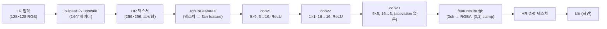

# 18. SRCNN Super Resolution

## 학습 목표

이 챕터를 마치면, **학습된 SRCNN(Super-Resolution CNN)을 GPU 에서 추론**해 저해상도(LR) 이미지를 고해상도(HR)로 복원할 수 있습니다. 구체적으로 (1) "먼저 bilinear 로 확대(14장)하고 그 위에서 conv 스택이 디테일을 복원한다"는 SRCNN 의 2단 구조를 이해하고, (2) 16장에서 정의한 conv layer $\mathbf{o} = \mathrm{ReLU}(W\mathbf{p} + \mathbf{b})$ 를 **세 번 쌓아**(마지막은 activation 없이) HR RGB 를 직접 만들며, (3) conv 를 직접 짜지 않고 공통 추론 엔진(`src/core/cnn.ts`)에 학습된 weight 를 올려 한 프레임을 굴리는 전체 파이프라인을 구성할 수 있습니다.

## 예상 소요 시간 · 난이도

약 50분 · ★★★☆☆ (16·17장 conv layer 를 여러 장 쌓고, 14장 bilinear 와 엮는 첫 "완성 모델")

## 사전 지식

- **14장 bilinear upscale**: LR → HR 로 부드럽게 2x 확대하는 compute shader. SRCNN 의 **입력**이 바로 이 결과입니다. 이 챕터에서 셰이더를 그대로 재사용합니다.
- **16장 CNN as filters**: conv layer = "학습된 weight 행렬 $W$ 와 패치 벡터 $\mathbf{p}$ 의 행렬-벡터 곱 + bias + ReLU 를 모든 픽셀에서 반복". 그 식 $\mathbf{o} = \mathrm{ReLU}(W\mathbf{p} + \mathbf{b})$ 를 이 챕터에서 3번 씁니다.
- **17장 / `src/core/cnn.ts`**: conv layer 한 장을 storage buffer 기반으로 GPU 에서 실행하는 `CnnRunner` / `uploadConvLayer` / `createFeatureBuffer`. 이 챕터는 conv 를 새로 짜지 않고 이 엔진을 그대로 호출합니다.
- **13장 흐름**: 입력 텍스처 → compute → 출력 텍스처 → blit, 그리고 결과를 숫자로 비교(`maxAbsDiff`)하는 패턴.

## 개념 설명

### SRCNN 은 "확대"와 "복원"을 분리한 모델이다

Super Resolution(초해상, SR)은 저해상도 이미지에서 고해상도 이미지를 만드는 일입니다. SRCNN(2014, 최초의 CNN 기반 SR)의 아이디어는 단순합니다. **먼저 평범한 방법(bilinear)으로 크기만 HR 로 키운 뒤, conv 스택이 그 위에 디테일을 그려 넣는다.** 두 일을 한 모델이 통째로 하지 않고, "크기 키우기"와 "선명하게 만들기"를 분리한 것입니다.



> 주의(입력은 반드시 bilinear 확대): SRCNN 은 학습할 때 **"bilinear 로 미리 확대한 흐릿한 HR"** 을 입력으로 받아, 그것을 선명한 HR 로 고치도록 배웠습니다. 그래서 추론할 때도 conv 스택 앞에 **반드시 같은 bilinear 확대를 먼저** 거쳐야 합니다. LR 을 그대로 conv 에 넣으면 (a) 해상도가 안 맞고 (b) 학습 때 보던 입력 분포와 달라 결과가 깨집니다. 이 사전 확대를 LR 해상도에서 끝내고 마지막에 deconvolution 으로 키우는 방식이 19장 FSRCNN 입니다.

### conv 3장: 같은 $\mathbf{o} = \mathrm{ReLU}(W\mathbf{p}+\mathbf{b})$ 를 크기만 바꿔 반복

16장에서 conv layer 한 장은 "패치 벡터 $\mathbf{p}$ 와 weight 행렬 $W$ 의 행렬-벡터 곱 + bias + ReLU"였습니다. SRCNN 은 이 식을 **세 번** 적용합니다. 채널 수와 kernel 크기만 다릅니다.

| 레이어 | 역할 | 종류 | 커널 | in → out | activation | $W$ 크기 |
|------|------|------|------|------|------|------|
| pre | 사전 확대 | bilinear 2x | — | 3 → 3 | — | (학습 weight 없음) |
| conv1 | patch extraction | conv | 9×9 | 3 → 16 | ReLU | $16 \times 243$ |
| conv2 | non-linear mapping | conv | 1×1 | 16 → 16 | ReLU | $16 \times 16$ |
| conv3 | reconstruction | conv | 5×5 | 16 → 3 | — (clamp $[0,1]$) | $3 \times 400$ |

$W$ 의 크기는 16장 공식 그대로 **(출력 채널) × (입력 채널 × $k_h$ × $k_w$)** 입니다. 기호를 풀어 보면:

- **conv1**: 출력 16채널, 입력은 RGB 3채널을 $9 \times 9$ 로 봅니다. 패치 벡터 $\mathbf{p}$ 의 길이는 $3 \times 9 \times 9 = 243$. 그래서 $W \in \mathbb{R}^{16 \times 243}$ 입니다. 큰 kernel(81칸)로 넓은 주변을 한 번에 보는 "특징 뽑기" 단계입니다.

```math
\mathbf{a}^{(1)} = \mathrm{ReLU}(W_1 \mathbf{p} + \mathbf{b}_1), \qquad W_1 \in \mathbb{R}^{16 \times 243},\ \ \mathbf{p} \in \mathbb{R}^{243},\ \ \mathbf{b}_1 \in \mathbb{R}^{16}
```

- **conv2**: $1 \times 1$ kernel 입니다. 주변을 보지 않고 **그 픽셀 자리의 16채널 벡터**만 입력으로 받아, 16채널로 다시 섞습니다. 패치 길이 = $16 \times 1 \times 1 = 16$, 즉 $W \in \mathbb{R}^{16 \times 16}$. 픽셀마다 적용되는 순수한 행렬-벡터 곱 + ReLU 로, "채널들을 비선형으로 다시 조합"하는 mapping 단계입니다.

```math
\mathbf{a}^{(2)} = \mathrm{ReLU}(W_2 \mathbf{a}^{(1)} + \mathbf{b}_2), \qquad W_2 \in \mathbb{R}^{16 \times 16}
```

- **conv3**: 16채널을 $5 \times 5$ 로 보고 RGB 3채널로 되돌립니다. 패치 길이 = $16 \times 5 \times 5 = 400$, 즉 $W \in \mathbb{R}^{3 \times 400}$. **이 마지막 layer 에는 ReLU 가 없습니다.** 최종 픽셀 값을 직접 만들어야 하므로 음수도 그대로 두고, 대신 출력을 $[0, 1]$ 로 clamp 합니다.

```math
\mathbf{o} = W_3 \mathbf{a}^{(2)} + \mathbf{b}_3, \qquad W_3 \in \mathbb{R}^{3 \times 400}, \qquad \text{출력} = \mathrm{clamp}(\mathbf{o},\ 0,\ 1)
```

세 식을 이어 보면 SRCNN 전체는 이렇게 한 줄로 적힙니다(편의상 bilinear 확대 입력을 $\mathbf{p}$ 로 둠).

```math
\text{HR} = \mathrm{clamp}\bigl(\,W_3\,\mathrm{ReLU}(W_2\,\mathrm{ReLU}(W_1 \mathbf{p} + \mathbf{b}_1) + \mathbf{b}_2) + \mathbf{b}_3,\ \ 0,\ 1\bigr)
```

### residual 없이 HR 을 직접 출력한다

어떤 SR 모델은 "bilinear 확대본 + conv 가 만든 보정량(residual)"을 더해 출력합니다. **SRCNN 은 그렇게 하지 않습니다.** conv3 의 출력 $\mathbf{o}$ 가 곧 최종 HR 픽셀입니다(residual 더하기 없음). 즉 conv 스택이 흐릿한 입력을 받아 **선명한 결과 전체를 통째로** 만들어 냅니다. 16장의 "마지막 layer 는 보통 ReLU 를 빼서 최종 값을 그대로 출력한다"는 원칙이 그대로 적용된 형태입니다.

> 주의(중간 feature map 은 storage buffer): conv1·conv2 의 출력은 **16채널** feature map 입니다. `rgba8` 텍스처는 채널이 4개뿐이라 16채널이 들어가지 않습니다. 게다가 ReLU 이전 중간값은 음수가 나올 수 있어, $[0,1]$ 로 잘리는 `unorm` 텍스처에 담으면 깨집니다. 그래서 중간 feature map 은 모두 `array<f32>` **storage buffer**(`createFeatureBuffer`)로 다룹니다 — 채널 수만큼 명시적으로 인덱싱(channel-last: `(y*width + x)*channels + c`). 이 처리는 `src/core/cnn.ts` 가 이미 해 줍니다.

> 주의(마지막 출력만 $[0,1]$ clamp): clamp 는 **conv3 결과를 텍스처로 내보낼 때 단 한 번**만 합니다(`featuresToRgb` 가 `unorm` 텍스처에 쓰면서 자동 clamp). conv1·conv2 의 중간 feature 는 clamp 하지 않습니다 — 음수/1 초과 값이 ReLU 와 다음 conv 의 입력으로 정상적으로 쓰여야 하기 때문입니다.

### 엔진을 어떻게 호출하나 (conv 직접 구현 금지)

conv 연산 자체는 17장의 `src/core/cnn.ts` 가 담당합니다. 이 챕터는 그 엔진에 **학습된 weight 를 올리고(setup), 매 추론마다 순서대로 호출**할 뿐입니다.

- `import { srcnn } from "../model/srcnn-weights.ts"` — 이미 생성된 학습 결과(`SrModel`). `srcnn.layers` 가 conv1/conv2/conv3 입니다.
- **setup(한 번)**: 각 `layer` 를 `uploadConvLayer(device, layer, 256, 256)` 로 GPU 에 올립니다. feature buffer 들은 `createFeatureBuffer(device, 256, 256, ch)` 로 만듭니다(3 → 16 → 16 → 3).
- **추론(매 프레임)**: `CnnRunner` 로 `rgbToFeatures`(HR 텍스처 → feat0) → `runConv(conv1)` → `runConv(conv2)` → `runConv(conv3)` → `featuresToRgb(channels=3)` → 출력 텍스처 → `Blitter.blit`.

```text
   feat0(3ch) --conv1--> feat1(16ch) --conv2--> feat2(16ch) --conv3--> feat3(3ch)
   (rgbToFeatures)         ReLU                    ReLU            (no activation)  --featuresToRgb-->
```

> weight 출처(옵셔널): 여기 쓰는 `srcnn-weights.ts` 는 옵셔널 트랙 O3 의 PyTorch 학습 결과를 `bun run make:weights` 로 변환한 값입니다(Python 없이 변환만). 메인 트랙은 이 숫자를 그대로 곱하고 더하는 추론만 합니다.

## 완성되면 이런 화면

세 캔버스가 나란히 보입니다. 왼쪽은 거친 **입력 LR(128×128)**, 가운데는 **bilinear 확대(256×256, 흐릿함)**, 오른쪽은 **SRCNN 결과(256×256)** 입니다. 흰 원의 가장자리나 가는 선을 보면 SRCNN 쪽이 더 또렷합니다. 아래 stats 패널에 bilinear / SRCNN 각각의 GPU 시간과, **원본 HR 대비 최대차**(`bilinear vs 원본`, `SRCNN vs 원본`)가 표시되어 SRCNN 이 원본에 더 가까움(= 디테일을 더 복원함)을 숫자로 확인합니다.

> 스크린샷: `docs/assets/18-srcnn.png` (직접 캡처해 추가)

> 주의(브라우저 확인 필요): 실제 GPU 동작은 자동 검증할 수 없습니다. `bun run dev 18` 로 WebGPU 지원 브라우저(Chrome/Edge 최신)에서 직접 확인하세요.

## 자가 점검 질문

스스로 설명할 수 있는지 확인하세요. (정답을 외우는 게 아니라 "설명할 수 있는가"입니다)

1. SRCNN 입력으로 LR 을 그대로 넣지 않고 **bilinear 로 먼저 확대한 HR** 을 넣어야 하는 이유를, "학습 때 본 입력"과 연결해 설명해보세요.
2. conv1 의 $W$ 가 왜 $16 \times 243$ 이고 conv3 의 $W$ 가 왜 $3 \times 400$ 인지, 16장의 **(출력 채널) × (입력 채널 × $k_h$ × $k_w$)** 공식으로 계산해보세요. 그리고 conv2 가 $1 \times 1$ 이라는 게 "주변을 안 본다"는 뜻임을 패치 길이로 설명해보세요.
3. 중간 feature map(conv1·conv2 출력)을 `rgba8` 텍스처가 아니라 **storage buffer** 로 다뤄야 하는 두 가지 이유(채널 수, 음수값)를 설명하고, 반대로 마지막 conv3 출력은 왜 $[0,1]$ 로 clamp 해도 되는지 말해보세요.
