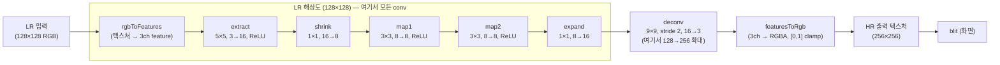

# 19. FSRCNN Super Resolution

## 학습 목표

이 챕터를 마치면, **학습된 FSRCNN(Fast SRCNN)을 GPU 에서 추론**해 저해상도(LR) 이미지를 고해상도(HR)로 복원할 수 있습니다. 구체적으로 (1) FSRCNN 이 SRCNN 과 반대로 **LR 해상도에서 conv 를 다 끝내고 마지막에 deconvolution 으로 확대**한다는 구조를 이해하고, (2) **deconvolution(transposed convolution)** 이 bilinear 같은 고정 방식이 아니라 **학습된 가중치로 확대**하는 연산임을 gather 관점에서 설명하며, (3) conv·deconv 를 직접 짜지 않고 공통 추론 엔진(`src/core/cnn.ts`)에 학습된 weight 를 올려 conv 5장 + deconv 1장으로 이어지는 전체 파이프라인을 구성할 수 있습니다.

## 예상 소요 시간 · 난이도

약 55분 · ★★★★☆ (메인 트랙 마지막 SR 챕터 — conv 5장을 쌓고, 처음 보는 deconvolution 으로 확대까지 엮는다)

## 사전 지식

- **18장 SRCNN**: 학습된 conv 스택을 GPU 추론 엔진(`CnnRunner`)에 올려 한 프레임을 굴리는 패턴, 그리고 bilinear 확대본과 비교해 결과를 `maxAbsDiff` 로 숫자 비교하는 흐름. 이 챕터는 그 패턴을 그대로 쓰되 **확대 위치가 정반대**입니다.
- **16장 CNN as filters**: conv layer = "학습된 weight 행렬 $W$ 와 패치 벡터 $\mathbf{p}$ 의 행렬-벡터 곱 + bias + (ReLU)". 식 $\mathbf{o} = \mathrm{ReLU}(W\mathbf{p} + \mathbf{b})$ 를 이 챕터에서 5번 씁니다.
- **14장 bilinear upscale**: 여기서는 SRCNN 처럼 사전 확대로 쓰지 **않고**, 오직 "고정 방식 확대 vs 학습된 deconv 확대"를 나란히 비교하는 baseline 으로만 씁니다.
- **17장 / `src/core/cnn.ts`**: conv 한 장을 storage buffer 기반으로 실행하는 엔진. 이 챕터에서 새로 **`runDeconv` / `uploadDeconvLayer`** 도 쓰지만, 둘 다 엔진이 이미 구현해 두었습니다(직접 구현 금지).

## 개념 설명

### FSRCNN 은 "확대를 맨 끝으로 미룬" 모델이다

18장 SRCNN 은 **먼저 bilinear 로 HR 크기로 키운 다음** conv 스택을 HR 해상도에서 돌렸습니다. 문제는 conv 가 큰 격자(256×256)에서 돌아 느리다는 점입니다. FSRCNN(2016)의 아이디어는 순서를 뒤집는 것입니다. **작은 LR 격자(128×128)에서 conv 를 다 끝내고, 맨 마지막에 한 번 deconvolution 으로 2x 확대**합니다. 무거운 conv 연산이 작은 격자에서 돌므로 빠릅니다("Fast" SRCNN).



위 그림에서 점선 박스 안(conv 5장)은 전부 **128×128** 에서 돕니다. 박스를 나오는 화살표, 즉 **deconv 에서 처음으로 256×256** 이 됩니다.

### FSRCNN 구조: conv 5장 + deconv 1장

`model/architecture.md` 의 tiny 스펙입니다(원논문보다 채널이 작지만 레이어 종류·커널은 충실). 각 conv 의 $W$ 크기는 16장 공식 **(출력 채널) × (입력 채널 × $k_h$ × $k_w$)** 그대로입니다.

| 레이어 | 역할 | 종류 | 커널 | in → out | 해상도 | activation | $W$ 크기 |
|------|------|------|------|------|------|------|------|
| extract | 특징 뽑기 | conv | 5×5 | 3 → 16 | 128 | ReLU | $16 \times 75$ |
| shrink | 채널 줄이기 | conv | 1×1 | 16 → 8 | 128 | — | $8 \times 16$ |
| map1 | 비선형 mapping | conv | 3×3 | 8 → 8 | 128 | ReLU | $8 \times 72$ |
| map2 | 비선형 mapping | conv | 3×3 | 8 → 8 | 128 | ReLU | $8 \times 72$ |
| expand | 채널 늘리기 | conv | 1×1 | 8 → 16 | 128 | — | $16 \times 8$ |
| deconv | **확대** | transposed conv | 9×9, stride 2 | 16 → 3 | **128 → 256** | — (clamp $[0,1]$) | (아래 별도 설명) |

- **extract**: RGB 3채널을 $5 \times 5$ 로 봅니다. 패치 길이 = $3 \times 5 \times 5 = 75$, $W \in \mathbb{R}^{16 \times 75}$.
- **shrink / expand($1 \times 1$)**: 주변을 보지 않고 그 자리의 채널 벡터만 섞습니다(채널 수 16↔8 변환). shrink 가 채널을 8로 줄여 가운데 mapping 을 싸게 만들고, expand 가 deconv 직전에 다시 16으로 늘립니다.
- **map1·map2($3 \times 3$)**: 8채널을 좁게 보며 비선형으로 변형. 패치 길이 = $8 \times 3 \times 3 = 72$, $W \in \mathbb{R}^{8 \times 72}$.

conv 스택 전체는 16장 식을 5번 이은 합성 함수입니다(편의상 마지막 conv 출력을 $\mathbf{z}$ 로 둠).

```math
\mathbf{z} = W_{\text{exp}}\,\mathrm{ReLU}(W_{m2}\,\mathrm{ReLU}(W_{m1}\,(W_{\text{shr}}\,\mathrm{ReLU}(W_{\text{ext}}\mathbf{p}+\mathbf{b}_{\text{ext}})+\mathbf{b}_{\text{shr}})+\mathbf{b}_{m1})+\mathbf{b}_{m2})+\mathbf{b}_{\text{exp}}
```

여기까지는 전부 **LR(128×128) 해상도의 16채널 feature map** $\mathbf{z}$ 입니다. 아직 크기가 커지지 않았습니다.

### deconvolution: 고정 방식이 아니라 "학습된 확대"

14장 bilinear 확대는 **규칙이 고정**입니다 — 주변 4픽셀을 정해진 비율(`mix`)로 섞을 뿐, 학습할 값이 없습니다. **deconvolution(transposed convolution, 전치 합성곱)** 은 다릅니다. 확대에 쓰이는 가중치 자체가 **학습된 값**입니다. 그래서 "어떻게 채워 넣을지"를 데이터로부터 배웁니다.

이름은 헷갈리지만 동작은 conv 와 거울 대칭입니다. **gather 형태**로 보면 가장 명확합니다 — "출력 픽셀 하나가 어떤 입력 픽셀들에서 오는가"입니다. 출력 좌표 $(o_x, o_y)$ 에 기여하는 입력 좌표는

```math
i_x = \frac{o_x + \text{pad} - k_x}{\text{stride}}, \qquad i_y = \frac{o_y + \text{pad} - k_y}{\text{stride}}
```

이고, **분자가 stride 로 나누어떨어지고 입력 범위 안일 때만** 더합니다($k_x, k_y$ 는 kernel 안 위치). stride 2 라서 출력 격자에서 한 칸 건너 한 칸씩만 어떤 입력과 맞아떨어집니다. 즉 작은 입력 격자(128)가 큰 출력 격자(256)에 "흩뿌려지고", kernel 이 그 사이를 학습된 값으로 메웁니다. 출력 픽셀 $\mathbf{o}$ 는 여전히 (기여하는 입력 값들) · (학습된 weight) 의 합 + bias 인, **익숙한 내적**입니다.

deconv 의 weight 레이아웃은 conv 와 in/out 순서가 다릅니다: `[inC][outC][kh][kw]` (PyTorch `ConvTranspose2d.weight` 와 동일). conv 의 `[outC][inC][kh][kw]` 와 헷갈리지 마세요 — 다행히 이 변환은 `uploadDeconvLayer` 가 알아서 처리합니다.

출력 크기는 다음 공식으로 정해집니다(엔진이 계산해 줌):

```math
\text{outW} = (\text{inW}-1)\cdot\text{stride} - 2\cdot\text{pad} + k_w + \text{outputPadding}
```

우리 값 $\text{inW}=128,\ \text{stride}=2,\ \text{pad}=4,\ k_w=9,\ \text{outputPadding}=1$ 을 넣으면 $\text{outW} = 127\cdot2 - 8 + 9 + 1 = 256$ — 정확히 2x 입니다.

> 주의(checkerboard artifact): deconvolution 은 **출력에 격자 무늬(바둑판, checkerboard)** 를 만들 수 있습니다. stride 가 kernel 크기로 깔끔히 나누어떨어지지 않으면, 출력 픽셀마다 "더해지는 입력 개수(겹침 횟수)"가 달라집니다. 어떤 칸은 여러 kernel 이 겹쳐 밝고, 옆 칸은 적게 겹쳐 어두워 — 규칙적인 밝기 차이가 격자처럼 보입니다. stride 2 에 kernel 9 는 $9/2$ 가 정수가 아니라 이 위험이 있습니다(우리 tiny 모델은 매끄러운 테스트 이미지에서 잘 안 드러나지만, 개념으로 알아 두세요). 실무에선 stride 의 배수인 kernel 을 쓰거나, "bilinear 로 키우고 stride 1 conv" 로 바꾸는 방법으로 피합니다.

### SRCNN vs FSRCNN: 확대 위치가 정반대

| | SRCNN (18장) | FSRCNN (19장) |
|------|------|------|
| 확대 시점 | **먼저** bilinear 로 HR 확대 → 그 위에서 처리 | LR 에서 처리 → **마지막에** deconv 로 확대 |
| 확대 방식 | 고정(bilinear), 학습 안 함 | **학습된** deconvolution |
| conv 가 도는 해상도 | HR(256×256) — 큼 | LR(128×128) — 작음 |
| 속도 | 느림(큰 격자에서 conv) | 빠름(작은 격자에서 conv) |
| 레이어 | conv 3장 | conv 5장 + deconv 1장 |
| 위험 | — | deconv 의 checkerboard artifact |

핵심 한 줄: **SRCNN 은 "크게 만들고 고친다", FSRCNN 은 "작게 고치고 키운다".** 같은 추론 엔진, 같은 비교 패턴이지만 확대를 어디서 하느냐가 두 모델을 가릅니다.

### 엔진을 어떻게 호출하나 (conv·deconv 직접 구현 금지)

conv·deconv 연산 자체는 `src/core/cnn.ts` 가 담당합니다. 이 챕터는 그 엔진에 **학습된 weight 를 올리고(setup), 순서대로 호출**할 뿐입니다.

- `import { fsrcnn } from "../model/fsrcnn-weights.ts"` — 이미 생성된 학습 결과(`SrModel`). `fsrcnn.layers` 가 extract/shrink/map1/map2/expand/deconv 6장이고, `fsrcnn.deconv` 에 `{ stride, padding, output_padding }` 가 들어 있습니다.
- **setup(한 번)**:
  - conv 5장: `fsrcnn.layers.slice(0, 5)` 각각을 `uploadConvLayer(device, layer, 128, 128)` — 모두 LR 해상도.
  - deconv 1장: `uploadDeconvLayer(device, fsrcnn.layers[5], 128, 128, fsrcnn.deconv.stride, fsrcnn.deconv.padding, fsrcnn.deconv.output_padding)`.
  - feature buffer 7개: `createFeatureBuffer(device, W, H, ch)` — feat0=3@128, feat1=16@128, feat2=8@128, feat3=8@128, feat4=8@128, feat5=16@128, **feat6=3@256**(deconv 출력만 256).
- **추론(매 프레임)**: `rgbToFeatures`(LR 텍스처 → feat0) → `runConv`×5 → **`runDeconv`(feat5 → feat6, 여기서 128→256)** → `featuresToRgb(channels=3, 256, 256)` → 출력 텍스처 → `Blitter.blit`.

```text
   feat0(3@128) --extract--> feat1(16@128) --shrink--> feat2(8@128) --map1--> feat3(8@128)
                --map2--> feat4(8@128) --expand--> feat5(16@128) ==deconv 2x==> feat6(3@256) --featuresToRgb-->
```

> 주의(중간 feature map 은 storage buffer): conv 출력은 8~16채널이라 `rgba8` 텍스처(채널 4개)에 안 들어갑니다. ReLU 이전 중간값은 음수도 나와 $[0,1]$ 로 잘리는 `unorm` 텍스처에 담으면 깨집니다. 그래서 중간 feature map 은 모두 `array<f32>` **storage buffer**(`createFeatureBuffer`)로 다룹니다(channel-last: `(y*width + x)*channels + c`). 이 처리는 엔진이 이미 해 줍니다.

> 주의(해상도 섞지 말 것): conv 5장은 **128×128**, deconv 출력 feat6 와 `featuresToRgb` 는 **256×256** 입니다. feat6 만 256 으로 만들고, `uploadConvLayer` 에 넘기는 크기는 전부 128 이어야 합니다. 크기를 섞으면 dispatch 와 strides 가 어긋나 결과가 깨집니다.

> weight 출처(옵셔널): 여기 쓰는 `fsrcnn-weights.ts` 는 옵셔널 트랙 O3 의 PyTorch 학습 결과를 `bun run make:weights` 로 변환한 값입니다(Python 없이 변환만). 메인 트랙은 이 숫자를 그대로 곱하고 더하는 추론만 합니다.

## 완성되면 이런 화면

세 캔버스가 나란히 보입니다. 왼쪽은 거친 **입력 LR(128×128)**, 가운데는 **bilinear 확대(256×256, 흐릿함)**, 오른쪽은 **FSRCNN 결과(256×256)** 입니다. 아래 stats 패널에 bilinear / FSRCNN 의 GPU 시간과 **원본 HR 대비 최대차**(`bilinear vs 원본`, `FSRCNN vs 원본`)가 표시됩니다.

> 솔직한 기대치: 이 tiny FSRCNN 은 채널이 작아 bilinear 대비 화질 gain 이 항상 크지는 않습니다. **매끄러운 영역(넓은 단색·완만한 그라데이션)은 bilinear 가 오히려 강하고, 텍스처·가는 선·경계가 많은 영역에서 FSRCNN 이 낫습니다.** 그래서 `판정` 이 영역/이미지에 따라 갈릴 수 있는데, 이건 버그가 아니라 작은 모델의 정직한 한계입니다. 이 챕터의 목표는 "최고 화질"이 아니라 **conv 5장 + deconv 확대 파이프라인을 GPU 에서 정확히 굴리는 것**입니다.

> 스크린샷: `docs/assets/19-fsrcnn.png` (직접 캡처해 추가)

> 주의(브라우저 확인 필요): 실제 GPU 동작은 자동 검증할 수 없습니다. `bun run dev 19` 로 WebGPU 지원 브라우저(Chrome/Edge 113+, Safari 26+, Firefox 141+)에서 직접 확인하세요.

## 자가 점검 질문

스스로 설명할 수 있는지 확인하세요. (정답을 외우는 게 아니라 "설명할 수 있는가"입니다)

1. SRCNN 과 FSRCNN 의 **확대 위치**가 어떻게 반대인지, 그리고 그 차이가 왜 FSRCNN 을 더 빠르게 만드는지(어느 해상도에서 conv 가 도는가)를 설명해보세요.
2. deconvolution 이 bilinear 와 다른 점을 "고정 규칙 vs 학습된 가중치", 그리고 gather 식 $i_x = (o_x + \text{pad} - k_x)/\text{stride}$ 로 "출력 픽셀이 어떤 입력에서 오는가" 관점에서 설명해보세요. 또 $\text{outW} = (\text{inW}-1)\cdot\text{stride} - 2\cdot\text{pad} + k_w + \text{outputPadding}$ 에 우리 값을 넣어 256 이 나오는지 계산해보세요.
3. checkerboard artifact 가 왜 생기는지(stride 와 kernel 크기의 관계, 출력 픽셀마다 겹침 횟수가 다름)를 설명하고, 이를 피하는 방법 한 가지를 말해보세요.
