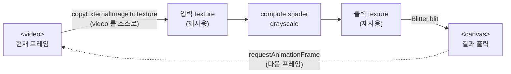

# 20. 정지 이미지에서 비디오 프레임으로 확장

## 학습 목표

이 챕터를 마치면, 지금까지 정지 이미지 한 장에 하던 GPU 처리를 **재생 중인 `<video>` 의 매 프레임**으로 확장할 수 있습니다. 핵심은 "매 프레임 새 객체를 만들지 않는다"입니다. 텍스처·pipeline·Blitter 를 **루프 밖에서 한 번만** 만들고, 루프 안에서는 `copyVideoFrameToTexture` 로 텍스처 **내용만** 갱신해 재사용하는 구조를 직접 구현합니다.

## 예상 소요 시간 · 난이도

약 40분 · ★★☆☆☆ (13장 GPU grayscale 을 비디오로 확장. 새 셰이더는 없음)

## 사전 지식

- **13장 (GPU Grayscale, 파일럿)**: compute pipeline · bind group · `Blitter.blit` · stats 패턴. 이 챕터는 그 코드를 거의 그대로 가져와 입력만 비디오로 바꿉니다.
- **2장 (Video Player 파이프라인 개요)**: `<video> → frame → GPU texture → compute → canvas` 라는 루프 그림. 그 개념도를 이 챕터에서 **실제 코드로** 만듭니다.
- `requestAnimationFrame` 같은 콜백 반복을 본 경험 (없어도 따라올 수 있습니다).

## 개념 설명

### 바뀌는 것은 "입력"뿐이다

13장에서 우리가 한 일을 한 줄로 줄이면 이렇습니다.

```text
입력 텍스처 1장 → compute(grayscale) → 출력 텍스처 → canvas 에 한 번 그림
```

20장이 하는 일은 그 입력을 **정지 이미지 → 비디오 프레임**으로 바꾸고, 전체를 **초당 수십 번 반복**하는 것뿐입니다. compute shader(`grayscale.wgsl`)는 13장과 **글자 하나 다르지 않습니다.** GPU 입장에서 "정지 이미지"든 "비디오의 한 프레임"이든 똑같은 픽셀 격자이기 때문입니다.



오른쪽 끝에서 다시 왼쪽으로 돌아가는 점선이 **루프**입니다. 이 루프 한 바퀴가 "프레임 한 장 처리"이고, 영상이 끝날 때까지(여기선 `loop` 라 무한히) 반복됩니다.

### 비디오 프레임을 텍스처로 옮기는 한 줄

`<video>` 의 현재 프레임을 GPU 텍스처로 복사하는 일은 공통 유틸 `src/core/video-frame.ts` 의 `copyVideoFrameToTexture` 가 해줍니다. 내부는 결국 이 한 줄입니다.

```ts
device.queue.copyExternalImageToTexture(
  { source: video, flipY: false }, // 소스: 지금 video 가 보여주는 프레임
  { texture: inputTex },            // 목적지: 미리 만들어 둔 입력 텍스처 (재사용)
  [width, height],
);
```

13장에서 `createTextureFromSource` 가 `canvas`/`ImageBitmap` 을 소스로 썼던 것과 똑같은 함수(`copyExternalImageToTexture`)입니다. 소스 자리에 **`<video>` 를 그대로 넣을 수 있다**는 점만 새롭습니다. 브라우저가 "video 의 지금 프레임"을 알아서 텍스처로 복사해 줍니다.

### 핵심: 매 프레임 새 객체를 만들지 마라

이 챕터에서 가장 중요한 단 한 가지입니다. 코드를 두 영역으로 나눠 보세요.

```text
setup (딱 한 번)            루프 frame() (초당 수십 번)
─────────────────────      ─────────────────────────────
createFrameTexture     ┐   copyVideoFrameToTexture  ← 내용만 갱신
createStorageTexture   │   compute dispatch
createComputePipeline  ├─▶ Blitter.blit
createBindGroup        │   FPS 표시
new Blitter            ┘   requestAnimationFrame(frame)
```

왼쪽(무거운 객체 생성)은 setup 에서 **한 번만** 하고, 오른쪽 루프에서는 만든 객체를 **재사용**합니다. 루프 안에서 만드는 것은 매 프레임 버려지는 `CommandEncoder` 정도의 가벼운 것뿐입니다.

> 주의(매 프레임 새 객체 만들지 않기 — 이 챕터의 핵심): `createFrameTexture`, `createComputePipeline`, `new Blitter()`, `createBindGroup` 을 `frame()` **안에서** 부르면, 초당 수십 개씩 GPU 텍스처·파이프라인이 새로 할당되고 버려집니다. GPU 메모리가 금세 차고 GC 가 끼어들어 화면이 뚝뚝 끊깁니다. 이 무거운 객체들은 반드시 루프 **밖**에서 한 번 만들고, 루프 안에서는 `copyVideoFrameToTexture` 로 **내용만** 갱신하세요. 이것이 실시간 영상 처리 성능을 좌우하는 가장 기본적인 규칙입니다.

### 비디오를 자동재생시키는 조건들

`<video>` 를 GPU 파이프라인의 소스로 쓰려면, 먼저 비디오가 **재생되고 프레임을 만들어 내고 있어야** 합니다. 신입이 여기서 자주 막힙니다.

```html
<!-- 자동재생을 위한 핵심 속성들. src 는 main.ts 에서 video.src 로 지정한다
     (정적 빌드 때 번들러가 src 속성을 자산으로 해석하지 않도록 data-src 로 두고 JS 에서 옮김). -->
<video id="video" data-src="/videos/sample.mp4" autoplay loop muted playsinline crossorigin></video>
```

```ts
video.src = video.dataset.src!; // "/videos/sample.mp4"
```

- **`muted` + `autoplay`**: 브라우저는 소리가 나는 영상을 사용자 클릭 없이 자동재생하지 못하게 막습니다. `muted` 가 있어야 `autoplay` 가 실제로 동작합니다. (둘 중 하나만 빠져도 "왜 영상이 멈춰 있죠?"가 됩니다.)
- **`playsinline`**: 모바일 Safari 가 영상을 전체화면으로 띄우지 않고 인라인으로 재생하게 합니다.
- **`loop`**: 영상이 끝나면 처음부터 다시 — 데모가 계속 돌도록.
- **`crossorigin`**: 다른 출처(CDN 등)의 영상을 텍스처로 읽을 때 CORS 가 필요합니다.

> 주의(CORS — 출처가 다른 영상): `copyExternalImageToTexture` 로 읽는 영상이 **다른 도메인**에서 온 것이면, 서버가 CORS 헤더를 허용하고 `<video crossorigin>` 이 있어야 합니다. 그렇지 않으면 "tainted"(오염된) 소스로 간주되어 GPU 로 읽으려는 순간 보안 에러가 납니다. 이 챕터의 `sample.mp4` 는 같은 dev 서버(`/videos/sample.mp4`)에서 서빙되므로 문제없지만, 외부 URL 로 바꾸면 이 함정에 빠질 수 있습니다.

> 주의(첫 프레임을 기다려라 — `loadeddata`): 페이지가 막 로드된 순간에는 `<video>` 안에 아직 픽셀이 없습니다. 이때 `copyExternalImageToTexture` 를 부르면 복사가 실패합니다. 그래서 루프를 시작하기 전에 `loadeddata`(또는 `readyState >= 2`)로 **첫 프레임이 준비될 때까지 기다린** 다음 시작해야 합니다. solution 의 `waitForVideoReady` 가 이 일을 합니다.

### rAF 로 단순하게 — 정확한 동기화는 21장

이 챕터의 루프는 `requestAnimationFrame`(rAF)으로 돕니다. rAF 는 "화면이 다시 그려질 때마다"(보통 60Hz) 불립니다. 비디오가 30fps 면 같은 프레임을 두 번 처리하는 약간의 낭비가 있지만, 코드가 단순해 입문에 적합합니다.

> 비디오 프레임과 **정확히 한 번씩** 동기화하는 `requestVideoFrameCallback` 은 **21장**에서 다룹니다. 이 챕터에서는 "비디오 프레임을 GPU 로 보내 처리하는 루프"의 뼈대에 집중하고, 프레임 동기화 정밀도는 다음 장으로 미룹니다.

## 완성되면 이런 화면

- 왼쪽에 작은 `<video>`(원본 컬러 영상)가 재생되고, 오른쪽 `<canvas>` 에는 같은 영상이 **실시간으로 흑백 처리**되어 나옵니다.
- "필터" 버튼을 누르면 grayscale on/off 가 토글됩니다. off 면 오른쪽 canvas 에도 원본 컬러 프레임이 그대로 나옵니다.
- stats 패널에 **FPS**, 프레임 크기(320×240), 현재 필터 상태가 표시되며, FPS 가 끊김 없이 유지되면 "재사용 구조"가 제대로 동작하는 것입니다.

> 완성 화면 미리보기 자리: `docs/assets/20-video-grayscale.png` (브라우저에서 직접 캡처해 추가)

이 챕터는 실제 GPU·비디오 동작이라 자동 검증이 불가능합니다. `bun run dev 20` 으로 직접 브라우저(Chrome/Edge 최신)에서 확인하세요.

## 자가 점검 질문

스스로 설명할 수 있는지 확인하세요. (정답을 외우는 게 아니라 "설명할 수 있는가"입니다)

1. `frame()` 루프 **안**에서 절대 만들면 안 되는 객체 3가지를 꼽고, 만들면 어떤 일이 벌어지는지 설명해보세요. 반대로 루프 안에서 매 프레임 해도 되는 일은 무엇인가요?
2. 13장의 정지 이미지 버전과 이 챕터의 비디오 버전에서 **compute shader(`grayscale.wgsl`)는 왜 똑같아도 되는지** 설명해보세요. 무엇이 바뀌었고 무엇이 그대로인가요?
3. `<video>` 에서 `muted` 를 빼면, 그리고 루프를 `loadeddata` 전에 시작하면 각각 어떤 증상이 나타날지 설명해보세요. 이 챕터의 rAF 루프를 `requestVideoFrameCallback` 으로 바꾸면 무엇이 더 나아지나요(21장 예고)?
