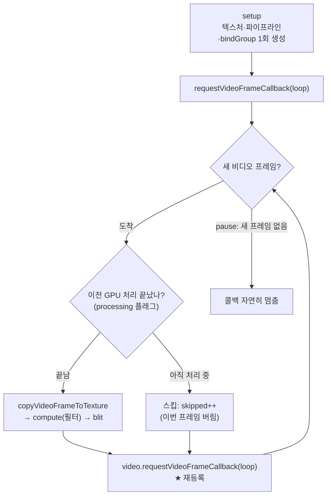

# 21. requestVideoFrameCallback 통합

## 학습 목표

이 챕터를 마치면, 20장의 "비디오 프레임 → GPU 필터 → canvas" 처리를 **`requestVideoFrameCallback`(rVFC)** 으로 옮겨, **새 비디오 프레임마다 정확히 한 번씩** GPU 작업을 돌릴 수 있습니다. 재생/일시정지/seek 를 올바르게 처리하고, GPU가 늦을 때 **프레임을 스킵**하는 전략과, 매 프레임 새 객체를 만들지 않는 구조까지 직접 구현합니다.

## 예상 소요 시간 · 난이도

약 40분 · ★★★☆☆ (이벤트 루프 설계 + 프레임 동기화)

## 사전 지식

- 13장 GPU 필터(텍스처 → compute shader → storage 텍스처 → blit)
- 20장 비디오 프레임 입력(`createFrameTexture` / `copyVideoFrameToTexture`, 매 프레임 텍스처 재사용)
- `<video>` 기본 사용(`play` / `pause` / `currentTime`), `requestAnimationFrame` 개념

## 개념 설명

### 문제: 비디오 프레임과 우리 처리 루프가 어긋난다

20장에서는 보통 `requestAnimationFrame`(rAF)으로 루프를 돌렸습니다. 그런데 rAF는 **디스플레이가 갱신될 때마다**(보통 60Hz) 호출됩니다. 비디오는 30fps일 수도, 24fps일 수도 있습니다. 그러면 rAF 루프와 비디오 프레임이 **1:1로 정렬되지 않습니다.**

- 같은 비디오 프레임을 **두 번** 처리하거나 (60Hz 화면에 30fps 영상),
- 어떤 프레임은 **건너뛰거나**,
- 지금 그리는 게 정확히 영상의 어느 시각(타임스탬프)인지 **알 수 없습니다.**

`requestVideoFrameCallback`(rVFC)은 이 문제를 풀려고 만든 API입니다. **`<video>`에 새 프레임이 합성(compositing)될 때마다 정확히 한 번** 콜백을 부르고, 그 프레임의 **타임스탬프 메타데이터**까지 넘겨줍니다.

### rVFC vs rAF — 무엇이 다른가

| | `requestAnimationFrame` | `requestVideoFrameCallback` |
| --- | --- | --- |
| 호출 시점 | 디스플레이 갱신마다(예: 60Hz) | **새 비디오 프레임마다** |
| 비디오와 정렬 | 안 됨(중복/누락 가능) | **1:1 정렬** |
| 타임스탬프 | 없음(화면 시간만) | `metadata.mediaTime` 등 **영상 시각 제공** |
| 대상 | `window` 전역 | **`<video>` 요소별** |

핵심: **rVFC는 "새 프레임이 있을 때만" 불린다.** 그래서 `video.pause()`로 새 프레임이 끊기면 콜백도 자연히 멈춥니다.

### 콜백 시그니처와 메타데이터

```ts
video.requestVideoFrameCallback((now, metadata) => {
  // now: 콜백이 불린 시각 (performance.now() 기준, rAF 의 timestamp 와 같은 축)
  // metadata.mediaTime:       이 프레임이 가리키는 "영상 안의 시각"(초)
  // metadata.presentedFrames: 지금까지 표시된 프레임 수(연속이 아니면 브라우저가 드랍한 것)
  // metadata.width/height:    프레임 해상도
  // ... 처리 ...
  video.requestVideoFrameCallback(loop); // ★ 다음 프레임을 받으려면 매번 재등록!
});
```

`mediaTime`은 "이 프레임이 영상의 몇 초 지점인가"입니다. 자막 동기화, 프레임 정확한 캡처, 우리처럼 처리 시각 표시 등에 씁니다. `presentedFrames`가 1보다 많이 뛰면 그 사이를 **브라우저가 드랍**한 것이라 화질 저하를 감지할 수 있습니다.

### rVFC 콜백 루프 구조

rVFC는 한 번 등록으로 반복되지 않습니다. 콜백 끝에서 **자기 자신을 다시 등록**해야 다음 프레임이 옵니다(rAF와 같은 패턴).



### 프레임 스킵 전략 — GPU가 예산을 넘을 때

한 프레임의 시간 예산은 60fps면 약 16.7ms, 30fps면 약 33ms입니다. GPU 필터(특히 22장 이후의 SR)가 이 예산을 넘으면, 콜백이 불릴 때마다 작업을 큐에 계속 쌓아 **점점 더 밀립니다.**

그래서 간단하고 효과적인 전략을 씁니다: **"처리 중이면 이번 프레임은 건너뛴다."**

```ts
let processing = false;
function loop(now, metadata) {
  if (processing) {
    skipped++;            // 이전 GPU 작업이 아직 안 끝남 → 이번 프레임은 버린다
  } else {
    void processCurrentFrame(metadata.mediaTime); // 끝나면 processing=false 로 되돌림
  }
  video.requestVideoFrameCallback(loop); // 재등록은 항상
}
```

이러면 항상 "가장 최신 프레임"만 처리하고, 밀린 프레임은 떨어뜨려 큐가 무한정 쌓이는 걸 막습니다. 스킵한 수를 stats에 표시해 부하를 눈으로 확인합니다. (이 데모의 GPU 시간은 `measureGpuMs`로 잽니다.)

> 주의(재등록 필수): rVFC는 **한 번 등록하면 한 번만** 불립니다. 콜백 끝에서 `video.requestVideoFrameCallback(loop)`를 다시 호출하지 않으면 두 번째 프레임부터 멈춥니다. rAF와 똑같은 함정입니다.

> 주의(매 프레임 새 객체 금지): 텍스처·파이프라인·bind group·`Float32Array` 등은 **setup에서 한 번**만 만들고 재사용하세요. 콜백 안에서 매번 `createTexture`/`createBindGroup` 하면 할당·GC로 프레임이 끊깁니다(20장의 원칙). 콜백 안에서는 `copyVideoFrameToTexture` → `compute` → `blit`만 합니다.

> 주의(pause/seek 처리): `pause()`하면 새 프레임이 없어 콜백이 자연히 멈춥니다(따로 cancel 안 해도 됨). 반대로 **seek**는 프레임이 흐르지 않으므로 콜백이 안 불릴 수 있습니다. `seeked` 이벤트에서 **한 프레임만** 직접 처리해 화면을 갱신하세요. 안 그러면 seek 후 화면이 멈춘 듯 보입니다.

> 주의(GPU가 늦을 때 스킵): 예산을 넘는 작업을 매 콜백마다 큐에 쌓으면 지연이 누적됩니다. `processing` 플래그로 **처리 중인 동안 도착한 프레임은 버리세요.** 영상은 약간 끊겨도 "지금 시각"에 가까운 프레임을 보여주는 게, 점점 뒤처지는 것보다 낫습니다.

### rVFC 미지원 브라우저 폴백

rVFC는 Chrome/Edge/Safari에서 지원되지만, 일부 브라우저(과거 Firefox 등)에는 없을 수 있습니다. 기능 탐지로 분기하고, 없으면 rAF로 폴백합니다(프레임 정렬은 부정확해짐을 안내).

```ts
const hasRVFC = "requestVideoFrameCallback" in HTMLVideoElement.prototype;
if (hasRVFC) video.requestVideoFrameCallback(loop);
else requestAnimationFrame(rafLoop); // 정렬 부정확: 같은 프레임 중복/누락 가능
```

## 완성되면 이런 화면

왼쪽에 재생되는 `<video>`(샘플 영상), 오른쪽에 **프레임 단위로** grayscale 필터가 적용된 GPU 출력이 나란히 나옵니다. 아래 컨트롤의 **재생/일시정지** 버튼과 **seek** 슬라이더가 동작하고, stats 패널에 `FPS`, `GPU 시간`, `mediaTime`, 예산 초과 여부, 그리고 `스킵` 수가 실시간으로 표시됩니다. 일시정지하면 FPS가 0으로 수렴하고(콜백이 멈춤), seek하면 해당 시각의 한 프레임이 바로 갱신됩니다.

> 스크린샷: `docs/assets/21-rvfc.png` (직접 캡처해 추가)

> 참고: rVFC·`copyExternalImageToTexture`의 실제 동작은 자동 검증이 불가능합니다. WebGPU 지원 브라우저에서 직접 열어 확인하세요(`bun run dev 21`).

## 자가 점검 질문

스스로 설명할 수 있는지 확인하세요. (정답을 외우는 게 아니라 "설명할 수 있는가"입니다)

1. `requestVideoFrameCallback`이 `requestAnimationFrame`과 비교해 비디오 처리에 더 적합한 이유를, "호출 시점"과 "타임스탬프" 관점에서 설명해보세요.
2. 콜백 안에서 `video.requestVideoFrameCallback(loop)`를 다시 호출하지 않으면 무슨 일이 일어나나요? 또 콜백 안에서 매 프레임 텍스처/파이프라인을 새로 만들면 왜 안 되나요?
3. GPU 처리가 프레임 예산을 넘을 때 `processing` 플래그로 프레임을 스킵하는 전략이, 작업을 계속 큐에 쌓는 방식보다 나은 이유를 설명해보세요. pause와 seek는 각각 어떻게 다르게 처리해야 하나요?
