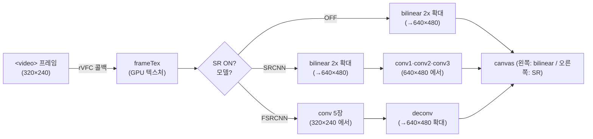

# 22. 실시간 Super Resolution 데모 (캡스톤)

## 학습 목표

이 챕터를 마치면, **18·19장에서 만든 SR 추론(SRCNN·FSRCNN)을 21장의 비디오 프레임 루프(`requestVideoFrameCallback`)에 연결해 `<video>` 위에서 실시간으로 돌릴 수 있습니다.** 구체적으로 (1) "비디오 프레임마다 CNN 추론" 이 곧 **18·19장 파이프라인을 프레임마다 반복하는 것**임을 이해하고, (2) **SRCNN ↔ FSRCNN 전환·SR on/off·재생/일시정지** 를 매 프레임 새 객체를 만들지 않고 토글만으로 구현하며, (3) **FPS·GPU 시간을 표시**하고 GPU 가 프레임 예산을 넘기면 **프레임을 스킵**해 영상이 일정하게 흐르게 만들 수 있습니다. 이것이 이 튜토리얼의 **최종 목표** 화면입니다.

## 예상 소요 시간 · 난이도

약 60분 · ★★★★★ (메인 트랙 캡스톤 — 새 알고리즘은 없지만, 앞 챕터들을 하나의 실시간 파이프라인으로 엮는다)

## 사전 지식

- **18장 SRCNN**: 먼저 bilinear 로 HR 확대 → conv 3장을 HR 해상도에서. `CnnRunner`/`uploadConvLayer`/`createFeatureBuffer` 로 한 프레임을 굴리는 패턴.
- **19장 FSRCNN**: LR 해상도에서 conv 5장 → 마지막 deconvolution 으로 확대. `uploadDeconvLayer`/`runDeconv`.
- **21장 rVFC 루프**: `requestVideoFrameCallback` 으로 새 프레임마다 한 번씩 처리, **setup 에서 객체를 한 번만 만들기**, GPU 가 밀리면 프레임 스킵, 재생/일시정지.
- **`src/core`**: `cnn.ts`(추론 엔진), `video-frame.ts`(`createFrameTexture`/`copyVideoFrameToTexture`), `blit.ts`, `gpu-timer.ts`. 이 챕터는 이들을 **재사용만** 합니다(conv/deconv/확대/blit 직접 구현 금지).

## 개념 설명

### 캡스톤: 정지 이미지 한 장 → 영상의 매 프레임

18·19장은 **정지 이미지 한 장**에 SR 을 한 번 적용했습니다. 영상은 그저 그 한 장이 **초당 수십 번 바뀌는 것**입니다. 그래서 "비디오 프레임마다 CNN 추론" 은 새로운 알고리즘이 아니라, **18·19장의 추론을 프레임마다 반복**하는 것입니다. 차이는 단 하나 — 입력 텍스처를 코드로 만든 테스트 이미지가 아니라 **현재 비디오 프레임**으로 매번 갱신한다는 점뿐입니다(21장의 `copyVideoFrameToTexture`).

이것이 README 의 **최종 목표** 그림 그대로입니다.



왼쪽 캔버스엔 항상 **bilinear 확대**(SR 안 한 비교본), 오른쪽엔 **SR 결과**가 그려집니다. SR off 면 오른쪽도 bilinear 라, "SR 이 정말 뭔가 바꾸는가"를 눈으로 켜고 끄며 비교할 수 있습니다.

### 두 모델을 실시간으로 비교: SRCNN vs FSRCNN

이 데모의 핵심 가치는 **같은 영상에서 두 모델의 속도·화질을 곧바로 비교**하는 것입니다. 18·19장에서 배운 구조 차이가 GPU 시간 숫자로 드러납니다.

| | SRCNN | FSRCNN |
|------|------|------|
| 확대 시점 | **먼저** bilinear 로 640×480 확대 → 그 위에서 conv | LR(320×240)에서 conv → **마지막에** deconv 로 확대 |
| conv 가 도는 해상도 | **HR 640×480 — 큼** | **LR 320×240 — 작음** (1/4 픽셀) |
| 레이어 | conv 3장 | conv 5장 + deconv 1장 |
| 보통 속도 | 느림(큰 격자에서 conv) | **빠름**(작은 격자에서 conv — "Fast" SRCNN) |

핵심 한 줄: **SRCNN 은 "크게 만들고 고친다", FSRCNN 은 "작게 고치고 키운다".** FSRCNN 은 무거운 conv 를 320×240(=HR 의 1/4 픽셀)에서 끝내므로 보통 GPU 시간이 더 짧습니다. 데모에서 모델을 전환하며 `GPU 시간` 숫자가 어떻게 달라지는지 직접 확인하세요.

처리 픽셀 수로 보면 직관이 섭니다. SRCNN 의 무거운 $9\times9$ conv 는 출력 픽셀 $640\times480$ 마다 $3\times9\times9$ 의 내적을 합니다. FSRCNN 의 $5\times5$ conv 는 $320\times240$ 마다 $3\times5\times5$ 의 내적을 합니다 — 격자도 작고 커널도 작습니다.

```math
\frac{\text{SRCNN 무거운 conv 일량}}{\text{FSRCNN 무거운 conv 일량}}
= \frac{640\cdot480\cdot(3\cdot9\cdot9)}{320\cdot240\cdot(3\cdot5\cdot5)}
= 4 \times \frac{81}{25} \approx 13
```

여기서 $640\cdot480$ 과 $320\cdot240$ 은 각각 출력 픽셀 수, $9\cdot9$·$5\cdot5$ 는 커널 크기입니다. 같은 입력 채널(3)을 가정하면 첫 conv 한 장만 비교해도 SRCNN 이 십수 배 무겁습니다(레이어 수·채널이 달라 정확한 배수는 아니지만, "왜 FSRCNN 이 Fast 인가" 의 핵심 직관입니다).

### 매 프레임 새 객체를 만들지 않는다 (실시간의 제1 규칙)

21장에서 배운 가장 중요한 규칙입니다. layer·feature buffer·pipeline·bind group 을 **프레임마다 새로 만들면** GC 와 GPU 할당으로 영상이 끊깁니다. 그래서 **setup(한 번)** 에서 SRCNN·FSRCNN 양쪽 layer 와 feature buffer 를 **모두 미리** 올려 둡니다. 모델 전환은 "어느 쪽 버퍼·레이어를 쓰느냐" 를 고르는 **plain 변수 토글**일 뿐, 다시 만드는 게 아닙니다.

```text
setup(한 번)                                루프(매 프레임)
  SRCNN layers + feature buffers              copyVideoFrameToTexture(frameTex)  ← 내용만 갱신
  FSRCNN layers + deconv + feature buffers    encoder = createCommandEncoder()   ← encoder 만 새로
  bilinear pipeline + bind group              recordBilinear / recordSrcnn / recordFsrcnn
  CnnRunner / Blitter / frameTex / hrTex      blit ×2, FPS·GPU 시간 갱신, 다음 콜백 재등록
```

> 주의(매 프레임 할당 금지): 루프(`onFrame`) 안에서는 **절대** `uploadConvLayer`·`createFeatureBuffer`·`createComputePipeline`·`createBindGroup`·`createTexture` 를 부르지 마세요. 루프에서 새로 만드는 것은 **command encoder 하나뿐**이고, 텍스처·버퍼·파이프라인은 setup 에서 만든 것을 **재사용**합니다. 이걸 어기면 프레임이 뚝뚝 끊깁니다.

### 프레임 스킵: GPU 가 예산을 넘기면 건너뛴다

디스플레이는 보통 60fps(한 프레임 ≈ 16.7ms)입니다. SRCNN 추론이 한 프레임에 16.7ms 보다 오래 걸리면, 처리하는 동안 다음 비디오 프레임이 이미 도착해 **GPU 큐가 점점 밀립니다.** 그러면 영상이 점점 뒤처져 끊깁니다.

21장 전략을 그대로 씁니다: **직전 프레임의 GPU 작업이 아직 안 끝났으면(`processing === true`) 이번 프레임은 추론을 건너뛴다.** `measureGpuMs` 가 GPU 완료까지 기다리므로, 처리 중에 도착한 rVFC 콜백은 `processing` 플래그로 스킵하면 됩니다. 건너뛴 프레임 수를 stats 에 표시해, "지금 GPU 가 실시간을 못 따라가고 있다" 를 눈으로 보게 합니다.

> 주의(프레임 예산 초과 = 정상적 한계): 스킵이 생기는 건 버그가 아닙니다. tiny 모델이라도 SRCNN 을 640×480 에서 돌리면 GPU 에 따라 16.7ms 를 넘길 수 있습니다. 그럴 땐 FSRCNN 으로 바꾸거나(보통 더 빠름) SR off 로 두면 스킵이 줄어듭니다. `GPU 시간` 옆 `⚠ 초과` 표시와 `스킵` 누적 수로 상태를 읽으세요.

> 주의(좌표계 Y 뒤집힘): 비디오 프레임을 텍스처로 복사할 때 원점 규약이 어긋나면 결과가 상하 반전됩니다. `copyVideoFrameToTexture` 는 `flipY: false` 로 복사하고, bilinear/blit 셰이더도 같은 규약을 쓰므로 그대로 두면 맞습니다. 결과가 뒤집혀 보이면 이 규약을 먼저 의심하세요.

### tiny 모델의 정직한 한계 (실서비스는 23장 예고)

이 데모의 SRCNN/FSRCNN 은 **학습용으로 채널을 크게 줄인 tiny 모델**입니다. 그래서:

- **화질**: bilinear 대비 gain 이 항상 크지 않습니다. 매끄러운 영역은 bilinear 가 강하고, 텍스처·가는 선·경계에서 SR 이 낫습니다(19장과 동일한 정직한 한계).
- **속도**: 640×480 실시간이 GPU 에 따라 빠듯합니다. 실서비스라면 (a) FP16/quantize, (b) 타일 단위 처리·해상도 적응, (c) 셰이더·메모리 레이아웃 최적화, (d) timestamp-query 로 정밀 프로파일링이 필요합니다.

> 주의(실서비스는 최적화 필요 — 23장 예고): 이 챕터는 "**파이프라인을 정확히, 실시간으로 굴리는 법**" 을 익히는 게 목표입니다. 화질·속도를 짜내는 최적화는 다음 파트(23장 성능)에서 다룹니다. 지금 GPU 시간이 길거나 스킵이 잦아도, 그건 다음 단계가 풀 문제입니다.

## 완성되면 이런 화면

두 캔버스가 나란히 보입니다. 왼쪽은 **bilinear 확대(640×480, 흐릿)**, 오른쪽은 **SR 결과(640×480)** — 영상이 실시간으로 흐릅니다. 컨트롤로 **재생/일시정지**, **SRCNN ↔ FSRCNN 전환**, **SR on/off** 를 누르며 즉시 비교할 수 있습니다. 아래 stats 패널에 **모델 · FPS · GPU 시간(예산 대비) · 스킵 누적 수** 가 실시간으로 갱신됩니다. FSRCNN 으로 바꾸면 보통 `GPU 시간` 이 줄고 `FPS` 가 오르는 것을 봅니다.

> 스크린샷: `docs/assets/22-realtime-sr.png` (직접 캡처해 추가)

> 주의(브라우저 확인 필요): 실시간 비디오·rVFC·WebGPU 동작은 자동 검증할 수 없습니다. `bun run dev 22` 로 WebGPU 지원 브라우저(Chrome/Edge 최신)에서 직접 확인하세요. 자동재생이 막히면 `재생` 버튼을 누르면 됩니다.

## 자가 점검 질문

스스로 설명할 수 있는지 확인하세요. (정답을 외우는 게 아니라 "설명할 수 있는가"입니다)

1. "비디오 프레임마다 CNN 추론" 이 왜 18·19장의 반복일 뿐인지, 그리고 정지 이미지 실습과 비교해 **무엇이 setup 에서 한 번**이고 **무엇이 루프에서 매 프레임** 바뀌는지를 설명해보세요(특히 `copyVideoFrameToTexture` 가 하는 일).
2. SRCNN 과 FSRCNN 의 **확대 위치 차이**가 왜 보통 FSRCNN 을 더 빠르게 만드는지, 처리 해상도(640×480 vs 320×240)와 위 일량 비교식으로 설명해보세요.
3. GPU 가 한 프레임 예산(≈16.7ms)을 넘길 때 **프레임을 스킵하지 않으면** 어떤 일이 생기는지, 그리고 `processing` 플래그가 어떻게 큐가 밀리는 것을 막는지 설명해보세요.
