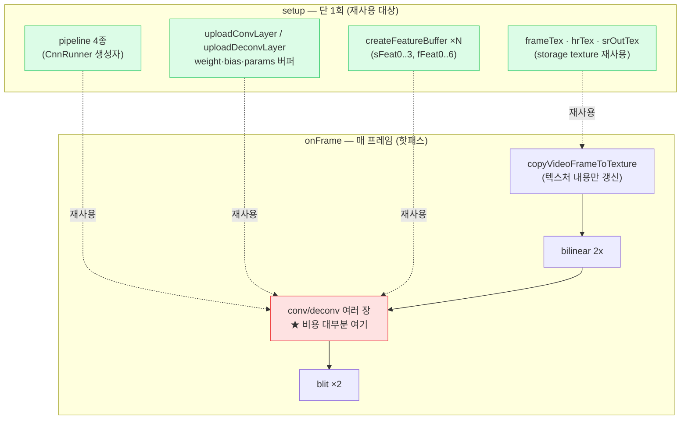
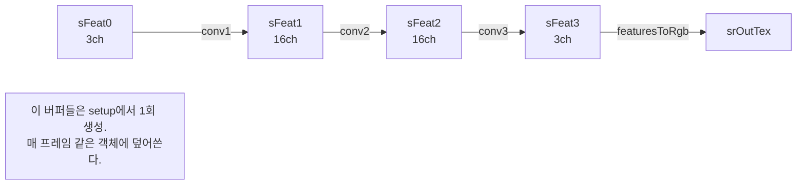
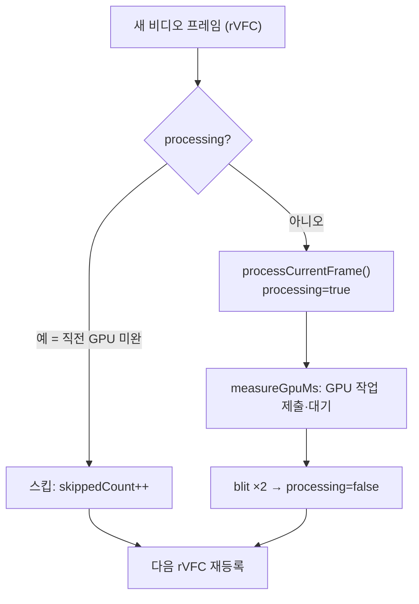

# 23. 성능 최적화 기초

## 학습 목표

이 챕터를 마치면, 22장까지 만든 실시간 SR 플레이어가 **왜 그렇게 짜여 있는지**를 성능 관점에서 설명할 수 있습니다. 구체적으로 (1) texture/feature read 횟수가 곧 비용이라는 점, (2) `workgroup_size`를 8×8로 고른 근거와 `dispatchSizeFor`의 올림 처리, (3) intermediate texture·feature buffer를 재사용하는 이유, (4) pipeline·bind group을 캐싱하는 이유, (5) 매 프레임 절대 만들면 안 되는 객체가 무엇인지, (6) GPU 시간이 프레임 예산($16.7$ms)을 넘을 때 어떻게 대응하는지를, **이 저장소의 실제 코드를 근거로** 말할 수 있습니다.

이 챕터는 **문서 위주**입니다 — 새로 실행할 코드는 없습니다. 16·24·25장처럼 개념을 읽고, 이미 구현된 코드(`src/core/*`, 22장 정답)를 성능의 눈으로 다시 읽습니다.

## 예상 소요 시간 · 난이도

약 40분 · ★★★☆☆ (새 셰이더 없음, 대신 22장까지의 코드를 성능 관점으로 재독)

## 사전 지식

- **15장 GPU convolution**: 픽셀당 $k^2$ 회 texture read, "read 횟수 = 비용"이라는 감.
- **18·19장 SRCNN·FSRCNN**: conv/deconv layer 구조, feature map은 storage buffer.
- **22장 실시간 SR 플레이어(캡스톤)**: rVFC 루프, setup에서 1회 생성 / 루프에서 재사용, GPU 시간 측정, 프레임 스킵.
- **21장 `requestVideoFrameCallback`**: `processing` 플래그로 밀린 프레임을 건너뛰는 패턴.

> 주의(측정 없이 최적화 금지): 이 챕터의 모든 원칙은 "**먼저 GPU 시간을 재고**, 병목을 확인한 뒤" 적용하는 것입니다. 추측으로 코드를 비틀지 마세요. 22장 정답은 매 프레임 `measureGpuMs(device, ...)`로 실제 GPU 시간을 재서 stats에 표시합니다(`src/core/gpu-timer.ts`). 무엇이 느린지 숫자로 보기 전에는 어디를 고쳐야 할지 알 수 없습니다.

## 개념 설명

### 전체 그림: 한 프레임에서 돈이 새는 곳

먼저 22장 정답(`lessons/22-realtime-sr-player/solution/main.ts`)의 한 프레임을 성능의 눈으로 봅니다. 비용이 큰 칸(빨강)과, 한 번만 만들어 재사용하는 칸(초록)을 구분하세요.



핵심은 두 가지입니다. (1) **연산량 대부분은 conv/deconv**에 있고, (2) **무거운 객체는 전부 setup에서 한 번만** 만들어 루프에서 재사용한다는 것입니다. 아래에서 6개 원칙을 하나씩 코드로 봅니다.

### 원칙 1 — texture/feature read 횟수를 줄여라

15장에서 본 그대로입니다. 출력 픽셀 하나를 만들 때 입력을 몇 번 읽는가(`textureLoad`/버퍼 인덱싱 횟수)가 메모리 대역폭 비용입니다. $k \times k$ kernel은 픽셀당 $k^2$ 회 read입니다.

CNN의 conv layer는 채널까지 가로지르므로 read가 더 늘어납니다. 한 출력 픽셀 한 채널을 만들 때 입력 feature를 읽는 횟수는

```math
\text{read/픽셀/출력채널} = \text{inC} \cdot k_h \cdot k_w
```

여기서 $\text{inC}$는 입력 채널 수, $k_h \times k_w$는 kernel 크기입니다. 출력 채널이 $\text{outC}$개면 위 패치를 채널마다 다시 곱하므로, **layer 하나의 총 MAC(곱셈-누적) 수**는

```math
\text{MAC}_{\text{layer}} = W \cdot H \cdot \text{outC} \cdot \text{inC} \cdot k_h \cdot k_w
```

$W \cdot H$는 처리하는 픽셀 수입니다. 이 식이 성능 직관의 전부입니다 — **해상도($W\cdot H$), 채널 곱($\text{inC}\cdot\text{outC}$), kernel 크기($k_h\cdot k_w$) 중 어느 하나가 커지면 비용이 곱으로 커집니다.**

실제 SRCNN(18장, 모두 HR $640\times480$에서 처리, $W\cdot H = 307{,}200$)에 넣어 보면:

| layer | inC→outC | kernel | $W\times H$ | MAC |
| --- | --- | --- | --- | --- |
| conv1 | 3→16 | 9×9 | 640×480 | $\approx 1.19\text{G}$ |
| conv2 | 16→16 | 1×1 | 640×480 | $\approx 0.08\text{G}$ |
| conv3 | 16→3 | 5×5 | 640×480 | $\approx 0.37\text{G}$ |
| **합계** | | | | $\approx \mathbf{1.64\text{G}}$ |

conv1 하나가 전체의 70%가 넘습니다($9\times9=81$이라 kernel이 큼). read를 줄이는 두 표준 기법은 15장 README에 적은 그대로입니다: **이웃 재사용**(겹치는 입력을 `var<workgroup>` 공유 메모리에 한 번 읽어 캐싱), **separable kernel**(가능한 kernel을 $1\times k$ + $k\times 1$로 분리). 둘 다 "같은 입력을 여러 번 다시 읽지 마라"는 한 줄로 요약됩니다.

> 주의(정확도 vs 속도 트레이드오프): read를 줄이겠다고 kernel을 함부로 줄이거나 채널을 쳐내면, 그건 더 이상 같은 모델이 아닙니다. 출력 품질(PSNR)이 떨어집니다. 모델 구조를 바꾸는 최적화(채널 prune, kernel 축소)는 **재학습**이 필요하고, 18장 CPU 기준과의 수치 비교(maxAbsDiff)로 정확도 손실을 반드시 확인해야 합니다. "이웃 재사용·separable" 같은 기법은 결과가 **수학적으로 동일**해 안전하지만, "채널을 줄이자"는 정확도를 파는 거래입니다.

### 원칙 2 — `workgroup_size`를 8×8로 고른 근거, dispatch는 올림

`src/core/pipeline.ts`의 `dispatchSizeFor`와 `src/core/cnn.ts`의 `dispatch`가 같은 규약을 씁니다. 둘 다 기본 workgroup_size가 `[8, 8]`입니다.

```ts
// src/core/pipeline.ts
export function dispatchSizeFor(
  width: number, height: number,
  workgroupSize: [number, number] = [8, 8],
): [number, number] {
  return [Math.ceil(width / workgroupSize[0]), Math.ceil(height / workgroupSize[1])];
}
```

```ts
// src/core/cnn.ts — CnnRunner.dispatch
pass.dispatchWorkgroups(Math.ceil(width / 8), Math.ceil(height / 8));
```

**왜 하필 8×8 = 64?**

- **2의 거듭제곱**이라 좌표 계산·정렬이 깔끔합니다.
- 64는 대부분 GPU의 **하드웨어 스레드 묶음(warp/wave; 보통 32 또는 64)의 배수**라, 워프가 절반만 차서 노는 일이 적습니다. 너무 작으면(예: 1×1) 점유율(occupancy)이 낮고, 너무 크면(예: 16×16=256) 레지스터·공유 메모리 압박으로 동시 실행 워프 수가 줄 수 있습니다. 8×8은 2D 이미지 처리에서 잘 맞는 무난한 기본값입니다.
- **2D 타일**(8×8)이라 convolution의 가로·세로 이웃을 함께 다루기 좋습니다(공유 메모리 캐싱 시 특히).

**왜 올림(`Math.ceil`)인가?** $640$은 $8$로 나누어떨어지지만($80$), 일반적으로 영역 크기가 8의 배수라는 보장이 없습니다. 예컨대 $W=323$이면 $\lceil 323/8 \rceil = 41$개 workgroup($\times 8 = 328$)을 띄워 **약간 더 덮습니다**. 모자라게 띄우면 오른쪽·아래 가장자리 픽셀이 빠집니다.

```text
 W = 323            워프 한 줄당 invocation = workgroup수 × 8
 ───────────────────────────────────────────────────────────
 ⌈323/8⌉ = 41 workgroups → 41×8 = 328 invocations
 [■■■…■■■][■■■…■■■]…[■■■|░░░░░]   ← 마지막 5칸(323..327)은 범위 밖
                          └ if (x>=W) return; 으로 버린다
```

올림으로 생긴 **범위 밖 invocation은 셰이더 첫머리의 좌표 체크(`if (x >= width) return;`)로 버립니다.** 그래서 dispatch는 항상 "올림으로 넉넉히 띄우고, 남는 건 셰이더가 버린다"입니다. 22장도 `dispatchSizeFor(HR_W, HR_H, [8, 8])`로 같은 규약을 씁니다.

### 원칙 3 — intermediate texture / feature buffer를 재사용하라

CNN은 layer를 거칠 때마다 중간 결과(feature map)가 필요합니다. 이걸 매 프레임 새로 할당하면, 60fps에서 초당 수십 개의 큰 GPU 버퍼를 만들고 버리게 됩니다 — GC 압박과 할당 지연의 원천입니다.

22장 정답은 **모든 중간 버퍼·텍스처를 setup에서 한 번만** 만듭니다.

```ts
// lessons/22-realtime-sr-player/solution/main.ts (setup, 1회)
const frameTex = createFrameTexture(device, LR_W, LR_H);   // 텍스처 재사용
const hrTex    = createStorageTexture(device, HR_W, HR_H);
const srOutTex = createStorageTexture(device, HR_W, HR_H);
// SRCNN 중간 feature buffer (HR 해상도)
const sFeat0 = createFeatureBuffer(device, HR_W, HR_H, 3);        // rgbToFeatures 결과
const sFeat1 = createFeatureBuffer(device, HR_W, HR_H, sConv1.outC); // 16
const sFeat2 = createFeatureBuffer(device, HR_W, HR_H, sConv2.outC); // 16
const sFeat3 = createFeatureBuffer(device, HR_W, HR_H, sConv3.outC); // 3
```

루프에서는 **내용만 갱신**합니다. 텍스처 객체는 그대로 두고 새 비디오 프레임만 복사합니다(주석도 "텍스처는 재사용, 내용만 갱신"이라고 적혀 있습니다).

```ts
// 매 프레임: 새 텍스처를 만들지 않고 frameTex 내용만 갈아끼움
copyVideoFrameToTexture(device, video, frameTex, LR_W, LR_H);
```



> 참고: conv는 같은 버퍼에 동시에 읽고 쓰면 안 됩니다(15장 "입력 ≠ 출력" 주의). 그래서 layer마다 입력·출력 버퍼를 **분리**해 둡니다(`sFeat1 → sFeat2`처럼). 분리는 하되, 각 버퍼는 프레임 간 재사용합니다 — 분리와 재사용은 모순이 아닙니다.

### 원칙 4 — pipeline / bind group을 캐싱하라

`createComputePipeline`·`createRenderPipeline`은 셰이더 컴파일을 동반해 **비쌉니다.** bind group도 매번 만들면 작지만 쌓이면 핫패스를 갉아먹습니다. 이 저장소는 두 군데서 캐싱을 보여줍니다.

**(a) pipeline은 생성자에서 1회** — `CnnRunner`(`src/core/cnn.ts`)는 conv·deconv·rgbToFeatures·featuresToRgb 4개 pipeline을 **생성자에서 한 번만** 만듭니다.

```ts
// src/core/cnn.ts — constructor
this.convPipeline   = make(convCode);
this.deconvPipeline = make(deconvCode);
this.rgbPipeline    = make(rgbToFeatCode);
this.featPipeline   = make(featToRgbCode);
```

**(b) uniform 버퍼 캐시** — `CnnRunner`는 dims/params 같은 **값이 고정인 uniform**을 key로 캐싱합니다. 같은 key면 새로 만들지 않고 재사용합니다(주석: "매 프레임 재할당되지 않게").

```ts
// src/core/cnn.ts
private uniformCache = new Map<string, GPUBuffer>();
private uniform(key: string, data: Uint32Array | Int32Array): GPUBuffer {
  let buf = this.uniformCache.get(key);
  if (!buf) {                                   // 처음 본 key 만 생성
    buf = createUniformBuffer(this.device, data);
    this.uniformCache.set(key, buf);
  }
  return buf;                                   // 이후 프레임은 캐시 히트
}
// 사용처: rgbToFeatures 의 `rgb:${width}x${height}`, featuresToRgb 의 `feat:...:selChannel`
```

**(c) bind group은 텍스처별 WeakMap 캐시** — `Blitter`(`src/core/blit.ts`)는 같은 텍스처면 blit용 bind group을 재사용합니다.

```ts
// src/core/blit.ts
private bindGroups = new WeakMap<GPUTexture, GPUBindGroup>();
blit(context, texture) {
  let bindGroup = this.bindGroups.get(texture);
  if (!bindGroup) {                             // 이 텍스처를 처음 blit 할 때만
    bindGroup = this.device.createBindGroup({ /* texture + sampler */ });
    this.bindGroups.set(texture, bindGroup);
  }
  // ...재사용한 bindGroup 으로 draw
}
```

22장은 `hrTex`·`srOutTex` 두 텍스처만 반복해 blit하므로, 이 WeakMap은 **첫 두 프레임 이후로는 항상 캐시 히트**입니다. `WeakMap`을 쓴 이유는 텍스처가 버려지면 캐시 항목도 자동으로 GC되게 하기 위함입니다.

### 원칙 5 — 프레임마다 절대 만들면 안 되는 객체

22장 정답의 파일 맨 위 주석이 규칙을 한 줄로 못 박습니다.

> "매 프레임 새 객체 금지: layer·feature buffer·pipeline·bind group은 전부 setup에서 한 번만 만든다. 루프 안에서는 만들어 둔 것을 재사용하고 **command encoder만 새로 만든다.**"

그리고 `onFrame` 안에도 "여기 안에서는 절대 새 layer/buffer/pipeline을 만들지 않는다"고 적혀 있습니다. 정리하면:

| 객체 | 언제 만드나 | 이유 |
| --- | --- | --- |
| pipeline (compute/render) | setup 1회 | 셰이더 컴파일이 비쌈 |
| weight·bias·params 버퍼 (`uploadConvLayer`) | setup 1회 | 값이 고정 — 다시 올릴 이유 없음 |
| feature buffer / intermediate texture | setup 1회 | 큰 GPU 할당, 내용만 갱신하면 됨 |
| bind group | 첫 사용 시 1회 (WeakMap/cache) | 같은 리소스면 재사용 |
| **command encoder** | **매 프레임 새로** | 이건 일회용 기록 장치 — 매 프레임 새로 만드는 게 정상 |
| 비디오 프레임 내용 | 매 프레임 갱신 | `copyVideoFrameToTexture`로 내용만 복사 |

즉 "매 프레임 새로 만들어도 되는 것은 command encoder와 (재사용 못 하는) 일부 bind group 정도"이고, 나머지 무거운 객체는 전부 setup으로 끌어올립니다. `uploadConvLayer`가 setup에서 단 한 번 호출되어 layer를 GPU에 올리고, 이후 `runConv`가 그 `GpuConvLayer`를 매 프레임 재사용하는 것이 이 원칙의 대표 사례입니다(`GpuConvLayer` 주석: "한 번 올리고 매 프레임 재사용한다").

### 원칙 6 — GPU 시간이 프레임 예산을 넘을 때

60fps라면 한 프레임에 주어진 전체 시간은

```math
\text{프레임 예산} = \frac{1000\ \text{ms}}{60\ \text{fps}} \approx 16.7\ \text{ms}
```

이 안에 디코딩·SR 추론·blit·브라우저 합성이 모두 끝나야 합니다. 22장은 이 예산을 상수로 박아 두고 초과를 표시합니다.

```ts
// lessons/22-realtime-sr-player/solution/main.ts
const FRAME_BUDGET_MS = 16.7; // 16.7ms ≈ 60fps
// ...
stats.set("GPU 시간",
  `${gpuMs.toFixed(2)} ms / 예산 ${FRAME_BUDGET_MS.toFixed(1)} ms` +
    (gpuMs > FRAME_BUDGET_MS ? " ⚠ 초과" : ""));
```

**예산을 넘으면 무엇이 문제인가?** GPU 작업이 16.7ms보다 오래 걸리는데 매 비디오 프레임마다 새 작업을 큐에 밀어 넣으면, **큐가 무한정 쌓여** 화면이 점점 더 과거의 프레임을 보여주고 지연(latency)이 누적됩니다.

해결책은 **프레임 스킵**입니다 (21·22장 패턴). `processing` 플래그로 "직전 프레임의 GPU 작업이 아직 안 끝났으면" 이번 프레임을 통째로 건너뜁니다.

```ts
// 21·22장: 직전 프레임이 처리 중이면 이번 프레임은 버린다
let processing = false;
function onFrame() {
  if (processing) {                 // GPU 가 아직 밀려 있음
    skippedCount++;
    stats.set("스킵", `누적 ${skippedCount} 프레임 (GPU 가 밀려 건너뜀)`);
  } else {
    void processCurrentFrame();     // processing=true → ...작업... → processing=false
  }
  if (!paused) video.requestVideoFrameCallback(onFrame); // 다음 프레임 재등록
}
```



이렇게 하면 GPU가 버거워도 **큐가 쌓이지 않고**, 실제로 끝낸 프레임만 화면에 나가 영상이 일정하게(끊기더라도) 흐릅니다. 그래도 계속 초과한다면 그때 비로소 구조적 대응을 고려합니다: **더 가벼운 모델로 전환**(아래), 처리 해상도 축소, 또는 원칙 1~4의 read·할당 줄이기.

#### 같은 일을 더 적게: SRCNN vs FSRCNN

19장의 FSRCNN이 "더 빠른" 이유가 바로 원칙 1의 식 $\text{MAC} = W\cdot H\cdot \text{outC}\cdot \text{inC}\cdot k_h\cdot k_w$에 있습니다. **SRCNN은 모든 conv를 HR($640\times480$)에서** 돌리지만, **FSRCNN은 conv 5장을 LR($320\times240$)에서** 돌리고 마지막 deconv로만 확대합니다. LR은 HR보다 픽셀이 $4$배 적으므로($W\cdot H$가 $\tfrac14$), 같은 채널·kernel이라도 일량이 확 줄어듭니다.

| 모델 | 대부분 연산이 도는 해상도 | 총 MAC(대략) |
| --- | --- | --- |
| SRCNN | HR $640\times480$ (전부) | $\approx 1.64\text{G}$ |
| FSRCNN | LR $320\times240$ (conv 5장) + HR deconv 1장 | $\approx 0.50\text{G}$ |

같은 2배 확대인데 FSRCNN의 일량이 **약 3.3배 적습니다.** "느린 작업을 더 빨리"가 아니라 **"비싼 해상도에서 일을 덜 하게 구조를 바꾼" 최적화**입니다 — 22장이 두 모델을 셀렉트로 전환하게 둔 것은, GPU 시간을 재며 예산에 맞는 쪽을 고르라는 실습이기도 합니다.

> 주의(timestamp-query 가용성): GPU 시간 측정(`measureGpuMs`, `src/core/gpu-timer.ts`)은 `"timestamp-query"` feature에 의존합니다. 이 feature는 일부 브라우저·디바이스에서 **지원되지 않거나 꺼져** 있을 수 있고(보안·정밀도 이유로 비활성인 환경도 있음), `requestDevice` 시 `requiredFeatures`로 요청해야 합니다. 지원되지 않으면 `gpuMs`가 0이거나 측정 불가가 됩니다 — 이때는 `performance.now()`로 제출~완료(`onSubmittedWorkDone`) 구간을 재는 등 **대체 측정**으로 폴백하세요. 측정값을 맹신하기 전에 feature 지원 여부부터 확인하는 습관이 중요합니다.

## 완성되면 이런 화면

이 챕터는 실행 코드가 없으므로 새 화면은 없습니다. 대신 **22장 데모를 다시 띄워**(`bun run dev 22`) stats 패널을 성능의 눈으로 읽어 보세요.

- `GPU 시간`: `XX.XX ms / 예산 16.7 ms`. SRCNN을 켜고 예산을 넘는지(⚠ 초과) 보세요.
- 모델을 **SRCNN ↔ FSRCNN**으로 바꿔 GPU 시간이 어떻게 달라지는지(원칙 6의 표) 확인하세요.
- 예산을 넘으면 `스킵` 항목의 누적 프레임 수가 늘어나는지(원칙 6의 프레임 스킵) 보세요.
- SR을 OFF(bilinear만)로 두면 GPU 시간이 거의 0에 가깝게 떨어지는지 — conv/deconv가 비용의 대부분(원칙 1)임을 확인하세요.

## 자가 점검 질문

스스로 설명할 수 있는지 확인하세요. (정답을 외우는 게 아니라 "설명할 수 있는가"입니다)

1. conv layer 하나의 비용 $\text{MAC} = W\cdot H\cdot \text{outC}\cdot \text{inC}\cdot k_h\cdot k_w$를 쓰고, 이 식으로 **FSRCNN이 SRCNN보다 빠른 이유**를 설명해보세요. ($W\cdot H$ 항이 두 모델에서 왜 다른지를 중심으로.)
2. `dispatchSizeFor`/`CnnRunner.dispatch`가 `workgroup_size`를 8×8로 고른 근거 두 가지와, dispatch 개수를 `Math.ceil`로 **올림**하는 이유, 그리고 올림으로 생긴 범위 밖 invocation을 어디서 처리하는지 설명해보세요.
3. 22장 정답에서 "매 프레임 새로 만들어도 되는 객체"와 "절대 setup 밖에서 만들면 안 되는 객체"를 각각 들고, `uploadConvLayer`·`CnnRunner`의 pipeline·`Blitter`의 bind group WeakMap이 각각 어느 쪽인지 설명해보세요. 또 GPU 시간이 예산(16.7ms)을 넘을 때 `processing` 플래그가 하는 일을 말해보세요.
