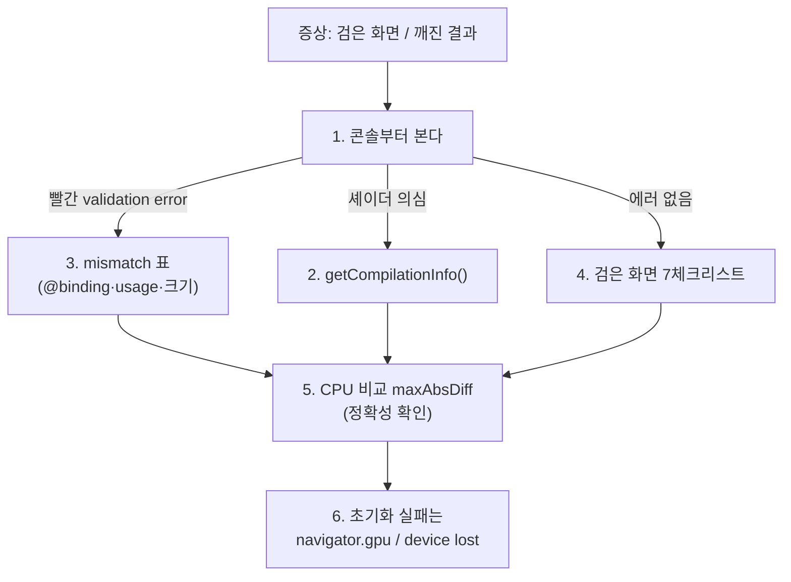

# 24. 디버깅 방법

## 학습 목표

이 챕터를 마치면, WebGPU/WGSL 프로그램이 **검은 화면을 내거나 결과가 깨질 때** 무작정 코드를 뒤지는 대신, **증상으로 원인을 좁혀** 빠르게 고칠 수 있습니다. 특히 (1) shader compile error 를 직접 읽고, (2) 검은 화면의 흔한 원인 7가지를 순서대로 점검하고, (3) bind group·텍스처 크기·usage 같은 mismatch 를 콘솔의 validation error 로 잡고, (4) GPU 결과를 CPU 와 **숫자로** 비교해 정확성을 확인하는 습관을 들입니다.

이 챕터는 개념을 6단으로 정리하고, 실제 점검표는 참조 문서 [`docs/webgpu-debugging.md`](../../docs/webgpu-debugging.md) 로 안내합니다. 막힐 때마다 그 문서를 펼쳐 보세요.

## 예상 소요 시간 · 난이도

약 35분 · ★★★☆☆ (앞 챕터들의 함정을 한 번에 복습)

## 사전 지식

- 6~8장 WebGPU 초기화, texture/buffer, bind group/pipeline (validation 이 무엇인지)
- 13장 첫 compute shader, 범위 체크, CPU vs GPU `maxAbsDiff` 비교
- 15·17·18장 convolution·CNN feature map (음수 클리핑, 채널 저장)
- 공통 코드: `src/core/webgpu.ts`, `src/core/texture.ts`, `src/core/cnn.ts`, `src/math/color.ts`

## 개념 설명

GPU 디버깅은 CPU 와 두 가지가 다릅니다. 첫째, **에러가 비동기로 콘솔에 나옵니다** — 예외로 던져지지 않는 경우가 많아 콘솔을 안 보면 "조용한 검은 화면"만 남습니다. 둘째, **결과를 눈으로 검증할 수 없습니다** — "비슷해 보인다"가 아니라 CPU 기준 구현과 숫자로 비교해야 합니다. 이 둘을 전제로 아래 6단계로 접근합니다.



### 1. 콘솔부터 본다

브라우저 개발자도구 콘솔을 **항상 열어 두세요.** WebGPU 의 검증(validation)은 잘못된 사용을 대부분 콘솔에 빨간 줄로 찍어 줍니다. 디버깅의 시작은 "콘솔에 에러가 있나 없나"를 가르는 것입니다. 에러가 있으면 3번(mismatch)으로, 없으면 4번(검은 화면 체크리스트)으로 갑니다.

### 2. shader compile error 읽는 법

WGSL 은 `with { type: "text" }` 로 **문자열로 import** 됩니다(CLAUDE.md 규약, `cnn.ts` 의 `import convCode ... with { type: "text" }`). 그래서 `bun build` 번들이 통과해도 셰이더 문법은 틀려 있을 수 있고, `createShaderModule` 은 에러를 던지지 않습니다. 컴파일 메시지는 직접 받아야 합니다.

```ts
const module = device.createShaderModule({ code });
const info = await module.getCompilationInfo();
for (const m of info.messages) console.log(`${m.type} @${m.lineNum}:${m.linePos} — ${m.message}`);
```

`lineNum`(줄)·`linePos`(칸)부터 보고, `unresolved`(오타·타입), `expected ';'`(구문) 같은 키워드로 원인을 좁힙니다.

> 주의(번들 통과 ≠ 셰이더 정상): TypeScript 번들러는 WGSL 문자열 안을 검사하지 않습니다. "오타가 분명한데 에러가 안 나요"는 `getCompilationInfo()` 를 안 봐서 그렇습니다.

### 3. mismatch: 텍스처 크기 · bind group @binding · usage flag

깨진 결과/검은 화면의 대부분은 **셰이더가 기대하는 모양과 JS 가 넘긴 리소스의 어긋남**이고, WebGPU 가 이를 validation error 로 잡아 줍니다. 세 가지 대표 증상→원인→해결:

| 증상 | 원인 | 해결 (근거) |
|------|------|-------------|
| 결과가 줄무늬/사선으로 깨지거나 잘림 | dispatch 한 크기 ≠ 텍스처 실제 크기 | width/height 를 하나로 통일. `CnnRunner` 는 `layer.width/height` 로만 dispatch |
| "expected ... at binding N" 에러 / 출력이 안 써짐 | JS `entries[].binding` ↔ WGSL `@binding` 번호·타입·access 불일치 | 번호·주소 공간을 1:1 로. `runConv` binding 0~4 ↔ `conv.wgsl` 선언 |
| bind group/blit/readback 생성 시 validation error | usage flag 누락 | 용도별 flag 켜기: storage 출력 `STORAGE_BINDING`, blit `TEXTURE_BINDING`, readback `COPY_SRC` + 버퍼 `COPY_DST\|MAP_READ` (`createStorageTexture`, `readTextureRGBA`) |

> 주의(번호는 맞아도 타입이 틀릴 수 있다): `@binding` 숫자는 맞는데 `texture_2d` 자리에 buffer 를 꽂거나 read 자리에 read_write 를 넣으면 validation error 가 납니다. 콘솔 메시지의 **binding 번호 N 을 먼저 읽으세요.**

### 4. 검은 화면 7가지 체크리스트 + out-of-bounds 좌표

콘솔에 에러가 없는데 화면이 검다면, 흔한 순서로 점검합니다(전체 표는 참조 문서 1번): ① dispatch/submit 호출 누락 → ② 출력 텍스처 usage → ③ blit 대상이 빈 텍스처 → ④ 범위 체크에서 전부 return(`dims` 가 0) → ⑤ bind group @binding → ⑥ canvas configure → ⑦ 값이 0~1 밖이라 전부 검정 클램프.

특히 ⑦과 좌표 문제가 자주 겹칩니다. dispatch 는 `Math.ceil(width/8)` 로 **올림**되므로(`CnnRunner.dispatch`) 이미지 밖 invocation 이 항상 생깁니다. 셰이더 첫머리에서 버려야 합니다.

```wgsl
if (gid.x >= dims.x || gid.y >= dims.y) { return; }  // 13장: 없으면 범위 밖 좌표를 읽음
```

> 주의(값이 0~1 밖이면 검게 잘린다): conv/residual 중간 결과는 **음수**가 흔합니다. `rgba8unorm`(0~1 클램프)에 음수를 쓰면 전부 0(검정)이 됩니다. 중간 feature map 은 float storage buffer 로 다룹니다(`cnn.ts` 는 feature map 을 `array<f32>` storage buffer + 인덱스 `(y*width+x)*channels+c` 로 저장 — `rgba8` 채널 4개에 안 들어가는 8채널을 위해서).

### 5. CPU fallback 으로 정확성 검증 (maxAbsDiff)

화면이 그려져도 "맞는" 건 아닙니다. 같은 연산을 `src/math/` 의 CPU 기준 구현으로도 계산해, GPU readback 과 **최대 절대 차이**를 잽니다.

```math
\text{diff} = \max_{p}\ \bigl| \text{CPU}(p) - \text{GPU}(p) \bigr|
```

```ts
const gpu = await readTextureRGBA(device, outTex, W, H);   // ← await 필수(GPU 는 비동기)
const cpu = grayscale(srcPixels);                          // src/math/color.ts 등 CPU 기준
console.log("maxAbsDiff =", maxAbsDiff(cpu, gpu));         // src/math/color.ts
```

`rgba8unorm` 양자화 때문에 **diff ≤ 2** 면 일치로 봅니다. 큰 값이면 **어느 영역**에서 큰지로 원인을 좁힙니다: 전 영역이면 식/좌표 전체, 가장자리만이면 out-of-bounds(4번), 음수 영역만이면 clamp 규약 불일치(15장).

> 주의(비동기 readback): `readTextureRGBA`(`texture.ts`)는 내부에서 `await buffer.mapAsync(READ)` 를 합니다. 호출부도 반드시 `await` 하세요 — 빼면 `console.log` 가 빈 배열을 찍습니다("결과가 안 나와요"의 단골). 그리고 `maxAbsDiff` 는 길이가 다르면 **예외를 던집니다**(`color.ts`): 행 패딩(`bytesPerRow` 256 정렬)을 안 지운 잘린 readback 을 작은 차이로 잘못 통과시키지 않으려는 안전장치입니다.

### 6. navigator.gpu 없음 / device lost

초기화 단계 실패는 `src/core/webgpu.ts` 가 미리 잡아 메시지를 줍니다.

- **`navigator.gpu` 없음**: 미지원 브라우저/비보안 컨텍스트 → 최신 Chrome/Edge·WebGPU Safari, `localhost`/https 에서 열기.
- **`requestAdapter()` null**: 하드웨어/드라이버 문제.
- **device lost**: 동작 중 콘솔에 `GPU device lost: ...`. `device.lost` 는 **Promise** 라 try/catch 로 안 잡히고, `webgpu.ts` 가 `.then` 으로 콘솔에 남깁니다.

> 주의(잘 되다가 갑자기 검은 화면): 콘솔에 `GPU device lost` 가 보이면 코드 버그가 아니라 device 가 죽은 것(드라이버 리셋·과대 dispatch 등)입니다. dispatch/버퍼 크기를 점검하세요.

### 자세한 체크리스트는 참조 문서로

위 6단계의 **세부 표·코드·전체 체크리스트**는 [`docs/webgpu-debugging.md`](../../docs/webgpu-debugging.md) 에 있습니다. 막혔을 때 "증상 → 어디를 볼까" 표부터 보세요.

## 완성되면 이런 화면

이 챕터는 새 데모 화면 대신 **디버깅 절차**를 익히는 챕터입니다. 완성 상태는 "검은 화면이나 깨진 결과를 만났을 때, 콘솔을 열고 → 증상으로 표를 찾아 → 원인 후보를 좁혀 → CPU 비교로 확인까지" 막힘없이 진행하는 것입니다. 연습용 고장 사례는 [`exercise.md`](./exercise.md) 의 시나리오로 직접 진단해 봅니다.

> 스크린샷 자리: `docs/assets/24-debugging-console.png` (검은 화면 + 콘솔의 validation error 예시, 직접 캡처해 추가)

## 자가 점검 질문

스스로 설명할 수 있는지 확인하세요. (정답 암기가 아니라 "설명할 수 있는가"입니다)

1. `createShaderModule` 이 에러를 던지지 않는데도 셰이더가 틀릴 수 있는 이유와, 그 오류를 어떻게 직접 확인하는지(`getCompilationInfo`) 설명해보세요. WGSL 이 "문자열로 import" 된다는 점과 연결해서요.
2. 콘솔에 에러가 **없는** 검은 화면과 **있는** 검은 화면을 어떻게 다르게 접근하는지, 각각 어떤 원인 후보부터 보는지 설명해보세요(7체크리스트 중 어느 것이 에러를 내고 어느 것이 안 내나).
3. GPU 결과를 CPU 와 `maxAbsDiff` 로 비교할 때, 큰 차이가 (a) 전 영역, (b) 가장자리만, (c) 음수 영역만 나오면 각각 무엇을 의심해야 하는지 설명해보세요. 그리고 `maxAbsDiff` 가 길이 불일치로 예외를 던지는 게 왜 도움이 되는지도요.
</content>
</invoke>
