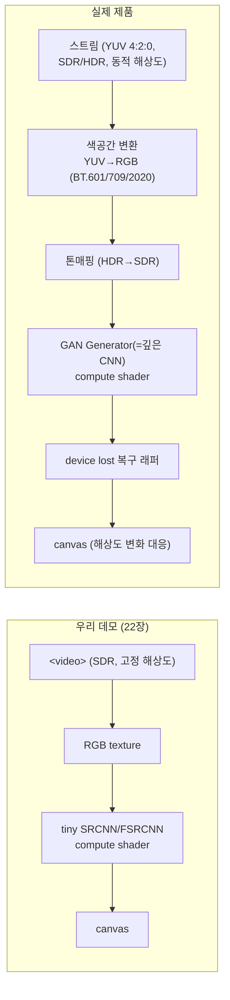
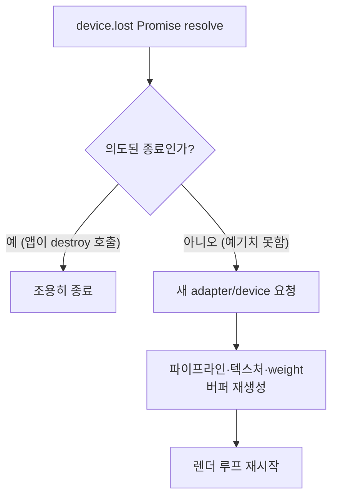
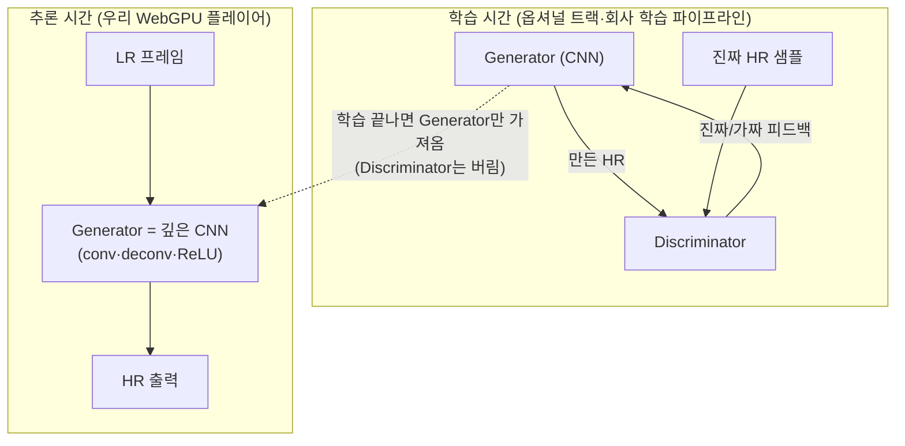

# 25. 회사 비디오 플레이어로 가기 전에 알아야 할 것

## 학습 목표

이 챕터를 마치면, 우리가 22장까지 만든 **tiny SR 데모**와 실제 **IDIS Pylon 비디오 플레이어** 사이의 간극을 말로 설명할 수 있습니다. 구체적으로 (1) 실제 영상은 RGB 가 아니라 YUV(색공간)로 들어온다는 것, (2) HDR/SDR·동적 해상도·device lost·브라우저/모바일 GPU 편차 같은 "제품이라서 생기는 문제"가 무엇인지, (3) **회사 모델이 GAN 이어도 추론 때 우리가 18·19장에서 짠 CNN 추론과 같은 원리로 돈다**는 것을 이해합니다.

이 장은 **실행 코드가 없는 문서 챕터**입니다. 새 셰이더를 짜지 않습니다. 대신 "데모 → 제품" 다리를 머릿속에 놓는 게 목표입니다.

## 예상 소요 시간 · 난이도

약 30분 · ★★☆☆☆ (개념 정리, 코드 없음)

## 사전 지식

- 13장 GPU Grayscale: luma = RGB 와 가중치 벡터의 **내적** (이 장의 Y 와 직접 연결)
- 18장 SRCNN / 19장 FSRCNN: conv·deconvolution 추론 파이프라인
- 22장 실시간 SR 플레이어 (캡스톤): `<video>` 프레임 → texture → compute → canvas
- `model/architecture.md` 의 tiny SRCNN/FSRCNN 스펙

## 개념 설명

### 우리 데모는 일부러 단순화했다

22장까지의 데모는 학습을 위해 많은 것을 **고정·단순화**했습니다. 실제 제품은 그 단순화를 하나씩 풀어야 합니다. 먼저 전체 대조를 표 하나로 봅니다. 이 장의 나머지는 이 표의 각 행을 풀어 설명하는 것입니다.

#### 핵심 대조표: 이 튜토리얼이 단순화한 것 ↔ 실제 제품의 대응

| 주제 | 이 튜토리얼(tiny 데모) | 실제 IDIS Pylon 플레이어 |
|------|----------------------|--------------------------|
| 색 표현 | RGB 3채널 `[0,1]` 로 바로 처리 (13장) | 디코더가 **YUV**(주로 Y'CbCr 4:2:0)로 줌. 색공간(BT.601/709/2020) 메타데이터에 맞춰 변환 |
| 밝기 | RGB→luma 내적으로 흑백만 (13장) | **Y(luma) 채널 자체가 입력으로 분리**되어 있음. SR 을 Y 에만 걸기도 함 |
| 다이내믹 레인지 | SDR 만 가정, 값이 `[0,1]` | **HDR**(HDR10/HLG, 10‑bit, PQ/HLG 전달함수) 입력 가능. 톤매핑 필요 |
| 해상도 | 고정 크기(예: 256×256), 빌드 시 결정 | 스트림마다·도중에 **해상도가 바뀜**. 텍스처·버퍼·파이프라인 재생성 |
| SR 모델 | tiny SRCNN/FSRCNN, conv 몇 개 (18·19장) | 더 깊은 CNN. 흔히 **GAN 으로 학습된 Generator**(추론 땐 그 Generator=CNN 만 돈다) |
| GPU 장애 | "한 번 init 되면 계속 된다" 가정 | **device lost** 가 실제로 일어남(드라이버 리셋, 절전, 탭 백그라운드). 감지·복구 필요 |
| 실행 환경 | 내 데스크톱 Chrome 하나 | 다양한 브라우저·버전, **모바일 GPU**까지. 지원 범위·성능 편차 대응 |
| 검증 | CPU 와 max abs diff (13장) | 위 + 실기기 매트릭스 테스트, 프레임 드랍·열 발열·배터리까지 |



아래에서 행 하나씩 풉니다.

### 1. RGB 가 아니라 YUV — 그리고 Y 는 13장의 그 luma 다

우리는 13장에서 컬러 픽셀 $\mathbf{c}=(r,g,b)$ 의 밝기를 가중치 벡터와의 **내적**으로 구했습니다.

```math
\text{luma} = \langle \mathbf{c},\ \mathbf{w} \rangle = 0.2126\,r + 0.7152\,g + 0.0722\,b
```

실제 영상 디코더는 이 **luma 를 따로 분리해서**(채널 Y) 줍니다. 색은 Y(밝기) + U·V(색차, Cb·Cr)로 저장됩니다. 이게 YUV(정확히는 Y'CbCr)입니다. 즉 13장에서 우리가 손으로 계산하던 Y 가, 실제로는 영상 안에 **이미 따로 들어 있는 한 채널**입니다.

아래 그림은 한 사진을 Y(맨 위, 밝기만)·Cb·Cr 세 채널로 분리한 것입니다. Y 만 봐도 13장에서 만든 흑백 이미지와 똑같다는 점에 주목하세요.


왜 이렇게 쪼개 둘까요? 사람 눈은 **밝기(Y)에는 민감하고 색차(U·V)에는 둔감**합니다. 그래서 영상 코덱은 색차를 절반 해상도로 줄여 저장합니다(이게 "4:2:0" — Y 는 풀 해상도, Cb·Cr 은 가로·세로 절반). 데이터를 크게 아끼면서 눈에는 거의 티가 안 납니다.

YUV 를 다시 RGB 로(또는 RGB 를 YUV 로) 바꾸는 건 **행렬-벡터 곱**입니다. 선형대수에서 배운 그대로입니다. 예를 들어 BT.601(SD 표준) 기준 RGB→YUV 변환 행렬은:

```math
\begin{bmatrix} Y \\ U \\ V \end{bmatrix}
=
\begin{bmatrix}
 0.299 & 0.587 & 0.114 \\
-0.169 & -0.331 & 0.500 \\
 0.500 & -0.419 & -0.081
\end{bmatrix}
\begin{bmatrix} R \\ G \\ B \end{bmatrix}
```

여기서 첫 행 $\begin{bmatrix}0.299 & 0.587 & 0.114\end{bmatrix}$ 이 바로 luma 가중치 벡터 $\mathbf{w}$ 입니다(BT.601 버전). 13장에서 쓴 $(0.2126, 0.7152, 0.0722)$ 은 BT.709(HD 표준) 버전이고요. **숫자만 다를 뿐 같은 내적**입니다.

> 주의: 색공간(BT.601 vs BT.709 vs BT.2020)이 다르면 가중치 행렬이 다릅니다. 영상 메타데이터에 적힌 색공간을 무시하고 아무 행렬이나 쓰면, 색이 미묘하게 틀어집니다(특히 빨강·초록 채도). 제품에서는 디코더가 알려주는 색공간 태그를 보고 맞는 행렬을 골라야 합니다. 우리 데모는 브라우저가 `<video>`→texture 단계에서 알아서 RGB 로 변환해줘서 이 고민을 건너뛴 것입니다.

### 2. HDR 과 SDR

우리 데모는 모든 값이 $[0,1]$ 인 **SDR**(Standard Dynamic Range)만 가정했습니다. 실제 영상에는 **HDR**(High Dynamic Range)이 있습니다. HDR 은:

- **더 넓은 밝기 범위**: 아주 어두운 그림자부터 눈부신 하이라이트까지. 값이 $[0,1]$ 에 안 갇힙니다.
- **10‑bit 이상**: SDR 은 채널당 8‑bit(0~255), HDR 은 보통 10‑bit(0~1023)라 계단(밴딩)이 덜 보입니다.
- **다른 전달함수(transfer function)**: 저장된 값과 실제 밝기의 관계가 SDR(보통 sRGB/감마 2.2)과 다릅니다. HDR 은 PQ(HDR10) 또는 HLG 곡선을 씁니다.

문제는, SDR 디스플레이나 SDR 캔버스에 HDR 영상을 그대로 그리면 **너무 밝거나 색이 바래** 보인다는 것입니다. 그래서 **톤매핑(tone mapping)** — HDR 밝기를 SDR 범위로 눌러 담는 변환 — 이 필요합니다. SR 모델도 보통 SDR `[0,1]` 가정으로 학습되므로, HDR 입력은 SR 전에 적절히 변환해 줘야 합니다.

> 주의: CLAUDE.md 에서 경고한 **음수/범위 클리핑**과 같은 종류의 함정입니다. HDR 값을 `unorm`(0~1 클램프) 텍스처에 무심코 넣으면 하이라이트가 다 `1.0` 으로 잘려 정보가 사라집니다. 중간 처리는 float 텍스처/버퍼로 두고, 마지막에 톤매핑해서 표시 범위로 보내야 합니다.

### 3. 동영상 해상도가 도중에 바뀐다

데모에서는 입력 크기를 빌드 시 상수(예: `WIDTH = 256`)로 박아 두고, 그 크기에 맞춰 텍스처·storage buffer·dispatch 개수를 한 번 만들었습니다. 실제 플레이어에서는:

- 사용자가 **다른 카메라/스트림으로 전환**하면 해상도가 바뀝니다(예: 1280×720 → 1920×1080).
- 네트워크 상황에 따라 **같은 스트림 안에서도** 해상도가 적응적으로 바뀝니다(ABR).

해상도가 바뀌면 그 크기에 의존하던 GPU 리소스가 전부 안 맞습니다. 그래서 제품 코드는 프레임 크기를 **매 프레임 확인**하고, 바뀌었으면 텍스처·버퍼·바인드그룹을 **다시 만들고** dispatch 개수를 다시 계산해야 합니다. 13장에서 본 dispatch 식을 해상도 변수로 다시 돌리는 것입니다.

```math
(g_x,\, g_y) = \left( \left\lceil \tfrac{W}{8} \right\rceil,\ \left\lceil \tfrac{H}{8} \right\rceil \right)
```

여기서 $W, H$ 는 이제 상수가 아니라 **현재 프레임의 너비·높이**입니다.

> 주의: 해상도가 바뀐 첫 프레임에서 옛 크기 텍스처에 새 크기 영상을 쓰면, 범위 밖 접근이나 깨진 화면이 납니다. "크기 바뀜 감지 → 리소스 재생성 → 그 다음에 dispatch" 순서를 지켜야 합니다. 재생성은 비싸니, 매 프레임이 아니라 **크기가 실제로 변했을 때만** 합니다.

### 4. device lost — GPU 가 사라질 수 있다

우리 데모는 "한 번 `requestAdapter`/`requestDevice` 로 GPU 를 잡으면 끝까지 쓸 수 있다"고 가정했습니다. 실제로는 **GPUDevice 가 도중에 무효화**될 수 있습니다(device lost). 원인:

- 드라이버 크래시/리셋, OS 의 GPU 타임아웃(TDR)
- 노트북 절전, 외장 GPU 분리, 탭이 오래 백그라운드
- 다른 무거운 GPU 앱과의 경쟁

device 가 lost 되면 그 device 로 만든 텍스처·파이프라인·버퍼가 **전부 못 쓰게** 됩니다. 그래서 제품에서는:

1. `device.lost` (Promise)를 구독해 **잃어버린 순간을 감지**하고,
2. 다시 `requestAdapter` → `requestDevice` 로 **새 device 를 잡고**,
3. 셰이더·파이프라인·텍스처·바인드그룹·weight 버퍼를 **처음부터 다시 만들어** 재생합니다.

핵심은 "초기화 로직을 한 번만 부르는 스크립트"가 아니라, **언제든 다시 부를 수 있는 함수**로 짜 두는 것입니다.



> 주의: device 가 lost 된 뒤에 옛 device 객체로 명령을 제출하면 조용히 실패하거나 에러가 납니다. lost 를 감지하면 **옛 리소스를 더 건드리지 말고** 새 device 로 전부 새로 만드는 게 원칙입니다.

### 5. 브라우저 지원 범위와 모바일 GPU 편차

WebGPU 는 비교적 최신 API 입니다. 제품은 데모와 달리 "내 Chrome 하나"가 아니라 **고객의 다양한 환경**에서 돌아야 합니다.

- **지원 범위**: WebGPU 미지원 브라우저/버전이 아직 있습니다. `navigator.gpu` 가 없거나 `requestAdapter()` 가 `null` 이면, 친절히 안내하거나 **WebGL/CPU 폴백** 또는 SR 끄기로 떨어져야 합니다. "지원하면 SR, 아니면 원본 재생"처럼.
- **한계(limits) 차이**: 기기마다 `maxComputeWorkgroupSizeX`, `maxStorageBufferBindingSize`, `maxTextureDimension2D` 등이 다릅니다. 데스크톱에서 되던 `@workgroup_size`·버퍼 크기가 모바일에서 한계를 넘을 수 있습니다. 어댑터의 `limits` 를 읽어 맞춰야 합니다.
- **모바일 GPU 성능**: 모바일 GPU 는 데스크톱보다 **연산량이 훨씬 적고 발열·배터리 제약**이 큽니다. 데스크톱에서 60fps 로 돌던 SR 이 모바일에선 프레임을 못 맞출 수 있습니다. 대응: 더 작은 모델, Y 채널에만 SR 적용, 해상도/프레임레이트 낮추기, 또는 모바일에선 SR 끄기.

> 주의: 데스크톱 한 대에서 잘 된다고 끝이 아닙니다. WebGPU 기능은 자동 검증이 안 되는 부분이라(CLAUDE.md "검증" 절), **실기기 매트릭스에서 직접** 확인해야 합니다. 특히 모바일은 같은 셰이더라도 정밀도·성능이 달라 결과가 미묘하게 다를 수 있습니다.

### 6. GAN 기반 SR 과 우리 CNN 의 관계 (가장 중요)

회사 SR 모델이 **GAN 기반**이라는 말을 들으면, 18·19장에서 배운 게 쓸모없어 보일 수 있습니다. 정반대입니다. **추론(inference) 관점에서 둘은 같은 원리**입니다.

핵심은 이것입니다:

> **GAN 은 "학습 기법"이지, 다른 종류의 추론이 아니다.**

GAN(Generative Adversarial Network)은 두 신경망 — **Generator(생성기)**와 **Discriminator(판별기)** — 을 **경쟁시키며 학습**하는 방법입니다. Generator 는 저해상도(LR)에서 고해상도(HR)를 만들고, Discriminator 는 "이게 진짜 HR 같냐, 만들어낸 거냐"를 맞히려 합니다. 둘이 서로를 이기려고 경쟁하면서, Generator 가 점점 더 그럴듯한 디테일을 만들게 됩니다. 이 경쟁 덕분에 SRCNN 류보다 **더 선명하고 사실적인 텍스처**가 나옵니다(SRGAN, ESRGAN 등).

하지만 **학습이 끝나고 제품에서 영상을 처리할 때(추론할 때)는 Discriminator 는 버립니다.** 실제로 도는 건 **Generator 하나뿐**입니다. 그리고 그 Generator 는 — 우리가 18·19장에서 만든 것과 똑같이 — **conv / deconvolution / ReLU 로 쌓은 CNN** 입니다. 단지 더 깊고 채널이 많을 뿐입니다.



즉:

- 우리가 18·19장에서 짠 **conv → ReLU → deconvolution** 추론 루프가, 회사 GAN 모델 추론의 **축소판**입니다.
- 회사 모델로 바꾸는 작업은 "완전히 새 기술 배우기"가 아니라, **같은 추론 골격에 더 큰 weight 와 더 많은 레이어를 끼우는 것**에 가깝습니다. 채널 수·레이어 수가 늘어 메모리·연산이 커지는 게 차이지, 한 레이어가 하는 일($\text{out} = W \cdot \text{in} + b$ 의 행렬-벡터 곱 + ReLU)은 똑같습니다.
- 그래서 이 튜토리얼이 다룬 건 **추론뿐**입니다(CLAUDE.md 원칙). GAN 학습(Generator·Discriminator 경쟁)은 옵셔널 트랙 **O4 「GAN 기반 SR 개요」**에서 다룹니다. 메인 트랙 입장에서 "어떤 모델로 학습됐든, 추론은 Generator=CNN 을 돌리는 것"이라는 점만 확실히 잡으면 됩니다.

> 주의: "GAN 이니까 추론도 두 네트워크가 같이 돈다"는 흔한 오해입니다. 아닙니다. 추론 때 Discriminator 는 **없습니다**. 플레이어가 GPU 에서 돌리는 건 Generator 하나, 즉 우리가 아는 그 CNN 입니다.

## 완성되면 이런 화면

이 장은 코드가 없어 실행 화면이 없습니다. 대신 이 장을 마치면, 위 **핵심 대조표**의 각 행을 보고 "우리 데모는 이렇게 단순화했고, 실제 제품은 이래서 이게 더 필요하다"를 스스로 한 문장씩 말할 수 있어야 합니다. 그게 이 장의 "완성된 상태"입니다.

## 자가 점검 질문

스스로 설명할 수 있는지 확인하세요. (정답을 외우는 게 아니라 "설명할 수 있는가"입니다)

1. 실제 영상의 **Y 채널**이 13장에서 우리가 RGB 내적으로 구한 **luma** 와 본질적으로 같은 이유를, BT.601/709 변환 행렬의 첫 행과 연결해 설명해보세요. 그리고 4:2:0 에서 색차(U·V)만 해상도를 줄이는 이유도 말해보세요.
2. **device lost** 가 무엇이고 왜 일어나며, 데모처럼 "초기화를 한 번만 부르는" 구조가 제품에서 왜 위험한지(복구하려면 코드를 어떻게 짜야 하는지) 설명해보세요.
3. 회사 SR 모델이 **GAN 기반**이어도, 우리 WebGPU 플레이어의 추론 루프가 18·19장에서 만든 **CNN 추론과 같은 원리**인 이유를 설명해보세요. 추론 시점에 Discriminator 가 어디로 가는지도 말해야 합니다.
