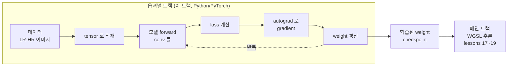
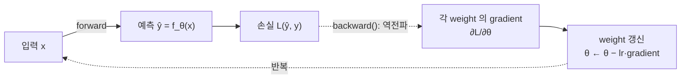

# O1. PyTorch 환경과 기초 (옵셔널)

## 학습 목표

이 챕터를 마치면, (1) 이 저장소의 `uv` 가상환경에 Python 과 PyTorch 를 깔아 학습 스크립트를 돌릴 준비를 하고, (2) PyTorch 의 **tensor** 가 메인 트랙에서 본 WGSL `vec3f`·`Float32Array` 와 사실 같은 "숫자 묶음"이라는 것을 연결해 이해하며, (3) **autograd**(자동 미분)와 **backpropagation** 이 "손실을 weight 로 미분해 gradient 를 자동으로 구해 주는 것"이라는 직관을 잡습니다.

이 챕터는 **딥러닝 입문 문서**입니다. 메인 트랙(쉐이더)과 분리된 옵셔널 트랙의 시작점이고, O2(신경망 학습 기초)·O3(SRCNN/FSRCNN 학습)의 선행입니다.

> **주의(메인 트랙에는 Python 이 필요 없습니다):** 메인 트랙(`lessons/01`~`22`)은 WebGPU/WGSL 추론만 하므로 Python·PyTorch 가 전혀 필요 없습니다. 이 옵셔널 트랙은 "메인 트랙에서 쓰는 weight 가 어디서 오는가"가 궁금한 사람을 위한 별도 길입니다. 쉐이더 학습만 하려면 이 챕터를 건너뛰어도 됩니다.

## 예상 소요 시간 · 난이도

약 40분 (설치 시간 제외) · ★★☆☆☆ (Python 기본 문법 정도. 새 수학 없음 — 메인 트랙의 vec/행렬을 그대로 씀)

## 사전 지식

- 메인 트랙 13장(grayscale = RGB 벡터와 가중치 벡터의 내적), 15장(convolution), 16장(CNN 을 행렬-벡터 곱으로 번역)에서 본 **vec·배열·weight 행렬** 개념. 이 챕터는 그 "숫자 묶음"을 PyTorch tensor 로 다시 보는 것입니다.
- Python 기본 문법(변수, 함수, import). 깊이 몰라도 따라올 수 있게 코드는 짧게 둡니다.
- 선형대수의 벡터·행렬·내적(대학에서 배운 수준). 미분은 "기울기(gradient)" 직관만 있으면 됩니다 — 수식은 O2 에서 다룹니다.

## 개념 설명

### 1. 왜 PyTorch 인가 — 메인 트랙과의 관계

메인 트랙은 **이미 정해진 weight** 를 GPU 에서 곱하고 더해 결과를 내는 **추론(inference)** 만 했습니다(16장). 그 weight 숫자들은 하늘에서 떨어진 게 아니라, 누군가가 데이터로 **학습(training)** 해서 찾아낸 값입니다. PyTorch 는 그 학습 — loss 를 정의하고, gradient 를 구하고, weight 를 조금씩 고치는 일 — 을 사람이 직접 미분 계산을 짜지 않아도 되게 해 주는 딥러닝 라이브러리입니다.



이 챕터(O1)는 위 그림에서 **tensor 적재**와 **autograd→gradient** 두 칸의 기초를 다집니다. 실제 SR 모델 학습(전체 루프)은 O3 에서 합니다.

### 2. 설치: 이 저장소의 `uv` 가상환경

이 저장소는 Python 의존성을 **`uv`** 가상환경(`.venv`)으로 관리합니다. 시스템 Python 을 더럽히지 않고, 저장소 루트에 `.venv` 폴더 하나로 격리합니다. 저장소 루트(`gpgpu-tutorial/`)에서 아래를 **한 번만** 실행합니다.

```bash
# 1) Python 3.12 가상환경 생성 (.venv 폴더가 만들어진다)
uv venv --python 3.12 .venv

# 2) 학습에 필요한 패키지 설치
VIRTUAL_ENV=.venv uv pip install torch numpy pillow
```

- `torch`: PyTorch 본체(tensor·autograd·신경망).
- `numpy`: 수치 배열. PyTorch tensor 와 서로 변환된다.
- `pillow`(PIL): 이미지 읽기/쓰기. O3 에서 LR/HR 패치를 다룰 때 쓴다.

설치되면 `.venv/bin/python` 으로 스크립트를 돌립니다(O3 와 동일한 방식).

```bash
.venv/bin/python -c "import torch; print(torch.__version__)"
```

> **주의(시스템 Python 말고 `.venv`):** `python script.py` 처럼 그냥 `python` 을 쓰면 시스템 Python 이 잡혀 PyTorch 를 못 찾을 수 있습니다("ModuleNotFoundError: No module named 'torch'" 의 단골 원인). 이 저장소에서는 항상 **`.venv/bin/python`** 으로 실행하세요(또는 가상환경을 activate 한 뒤 `python`).

> **주의(torch 버전·디바이스):** PyTorch 는 실행 디바이스로 **`cuda`**(NVIDIA GPU), **`mps`**(Apple Silicon Mac), **`cpu`** 중 하나를 씁니다. 설치된 torch 빌드와 하드웨어에 따라 쓸 수 있는 디바이스가 다릅니다. 학습 스크립트는 보통 "있으면 GPU, 없으면 CPU"를 자동으로 고릅니다(아래 5절). 버전·디바이스가 안 맞아 생기는 오류가 잦으니, 막히면 먼저 `torch.__version__` 과 사용 가능한 디바이스부터 확인하세요.

### 3. tensor — WGSL 의 vec·`Float32Array` 와 같은 "숫자 묶음"

**tensor** 는 겁먹을 단어가 아닙니다. 그냥 **N 차원 숫자 배열**입니다. 메인 트랙에서 이미 같은 것을 다른 이름으로 써 왔습니다.

| 메인 트랙(TypeScript/WGSL) | PyTorch | 모양(shape) |
|---|---|---|
| `f32` 스칼라 하나 | 0차원 tensor (scalar) | `[]` |
| WGSL `vec3f`(RGB 한 픽셀) | 1차원 tensor (vector) | `[3]` |
| 13장 grayscale weight `vec3f` | 1차원 tensor | `[3]` |
| 16장 weight 행렬 $W \in \mathbb{R}^{16 \times 27}$ | 2차원 tensor (matrix) | `[16, 27]` |
| JS `Float32Array`(버퍼에 올리는 weight 평면 배열) | tensor 를 `.reshape(-1)` 한 1차원 | `[N]` |
| 한 layer 의 conv weight 전체 | 4차원 tensor | `[outC, inC, kh, kw]` |

즉 WGSL 의 **`vec3f` ↔ PyTorch tensor** 는 같은 개념의 다른 표기입니다. 메인 트랙에서 weight 를 storage buffer 에 올릴 때 결국 `Float32Array` 한 줄(평면 배열)로 폈는데, PyTorch 에서는 그 평면 배열을 **shape 가 붙은 tensor** 로 다룰 뿐입니다. `tensor.reshape(-1)` 하면 그대로 `Float32Array` 처럼 1차원으로 펴집니다 — 이게 바로 O3 의 export 가 하는 일입니다.

tensor 의 핵심 속성 두 가지만 기억하세요.

- **shape**: 각 차원의 크기. 길이 3 벡터는 shape $[3]$, $16 \times 27$ 행렬은 shape $[16, 27]$. 인라인으로 $T \in \mathbb{R}^{16 \times 27}$ 처럼 적습니다.
- **dtype**: 원소의 자료형. 우리는 거의 `float32`(WGSL `f32` 와 같음)를 씁니다.

수식으로 보면, 16장에서 본 행렬-벡터 곱이 tensor 연산 그대로입니다. 패치 벡터 $\mathbf{p} \in \mathbb{R}^{27}$ 와 weight $W \in \mathbb{R}^{16 \times 27}$, bias $\mathbf{b} \in \mathbb{R}^{16}$ 에 대해

```math
\mathbf{o} = W\mathbf{p} + \mathbf{b}, \qquad \mathbf{o} \in \mathbb{R}^{16}
```

이고, PyTorch 로는 `o = W @ p + b` 한 줄입니다. `@` 가 행렬-벡터 곱(내적의 묶음)이고, 메인 트랙 WGSL 에서 `dot()` 을 출력 채널마다 반복했던 것과 정확히 같은 계산입니다.

### 4. conv weight tensor 의 shape: `[outC][inC][kh][kw]`

16장에서 conv layer 의 weight 가 네 인덱스 $(k, c, i, j)$ = (출력 채널 × 입력 채널 × kernel 높이 × kernel 너비)를 가진다고 했습니다. PyTorch 의 `nn.Conv2d` weight tensor 가 정확히 그 4차원입니다.

```math
W \in \mathbb{R}^{\,\text{outC} \times \text{inC} \times kh \times kw}
```

예를 들어 17장의 첫 conv layer(RGB 3채널 → feature map 16장, $3\times3$ kernel)는

```math
W \in \mathbb{R}^{\,16 \times 3 \times 3 \times 3}, \qquad \mathbf{b} \in \mathbb{R}^{16}
```

shape 로 적으면 weight 는 $[16, 3, 3, 3]$, bias 는 $[16]$ 입니다. 이 순서 **`[outC][inC][kh][kw]`** 가 이 프로젝트가 weight 를 export 할 때 쓰는 레이아웃이고(O3 의 `export_checkpoint.py`, `model/architecture.md` 와 동일), 메인 트랙 WGSL 이 그대로 받아 인덱싱합니다. 즉 "PyTorch tensor 의 shape" 와 "WGSL storage buffer 의 인덱싱 순서" 가 이 한 줄에서 맞물립니다.

> **주의(채널 4개 한계):** 메인 트랙에서 봤듯 `rgba8` 텍스처는 채널이 4개뿐이라 16채널 feature map 을 한 장에 못 담습니다(16장). PyTorch tensor 는 채널 수에 그런 제약이 없어 `outC=16`, `64` 든 자유롭게 둡니다 — 학습은 storage 제약을 신경 쓰지 않고 순수 숫자로 계산하기 때문입니다. 텍스처 채널 제약은 어디까지나 메인 트랙의 GPU 추론 쪽 이야기입니다.

### 5. autograd·backpropagation — gradient 를 자동으로 구한다

학습의 핵심 한 문장: **"손실(loss)을 weight 로 미분해서 얻은 gradient 방향의 반대로 weight 를 조금 옮기면 손실이 준다."** PyTorch 의 **autograd** 는 이 "손실을 weight 로 미분"을 **자동으로** 해 줍니다. 우리가 미분 공식을 손으로 짜지 않아도 됩니다.

직관은 이렇습니다. 모델이 weight $\theta$ 로 결과 $\hat{y} = f_\theta(x)$ 를 만들고, 정답 $y$ 와의 차이를 손실 $\mathcal{L}(\theta)$ 로 잽니다. gradient $\dfrac{\partial \mathcal{L}}{\partial \theta}$ 는 "weight 를 아주 조금 키우면 손실이 얼마나·어느 방향으로 변하나"를 알려 주는 기울기입니다. 손실을 줄이려면 기울기 **반대** 방향으로 weight 를 조금 옮기면 됩니다(gradient descent — 정확한 수식과 갱신 규칙은 O2).

PyTorch 는 tensor 에 연산을 할 때마다 "어떤 연산을 거쳤는지" 계산 그래프를 몰래 기록해 둡니다. 그리고 `loss.backward()` 를 부르면, 그 그래프를 **거꾸로 따라가며**(이게 **backpropagation**, 역전파) 연쇄법칙(chain rule)으로 각 weight 의 gradient 를 한 번에 채워 줍니다.



autograd 를 켜는 스위치가 tensor 의 **`requires_grad`** 속성입니다. `requires_grad=True` 인 tensor 는 "이건 학습 대상 weight 다, 미분을 추적해라"라는 표시입니다. forward 로 손실까지 계산한 뒤 `loss.backward()` 를 부르면, 그 weight tensor 의 `.grad` 에 gradient 가 채워집니다.

가장 단순한 예로 $L = x^2$ 를 봅시다. 미분하면 $\dfrac{dL}{dx} = 2x$ 이므로, $x = 3$ 에서 gradient 는 $6$ 이어야 합니다. PyTorch 가 이걸 자동으로 구하는지 다음 절 코드에서 확인합니다.

## PyTorch 예시 코드 스니펫

> 아래는 **개념 확인용 코드 조각**입니다(실행 파일이 아니라 읽고 직접 쳐 보는 용도). `.venv/bin/python` 으로 한 줄씩 따라 해 보세요. 실제 학습 스크립트는 O3 에 있습니다.

**(a) tensor 만들기 — vec/행렬을 tensor 로**

```python
import torch

# 길이 3 벡터: WGSL vec3f 와 같은 RGB 한 픽셀
p = torch.tensor([0.2, 0.5, 0.9])
print(p.shape)        # torch.Size([3])
print(p.dtype)        # torch.float32

# 16x27 weight 행렬 (16장의 W) — 여기선 무작위 값으로
W = torch.randn(16, 27)
print(W.shape)        # torch.Size([16, 27])

# conv weight tensor: [outC, inC, kh, kw] = [16, 3, 3, 3]
conv_w = torch.randn(16, 3, 3, 3)
print(conv_w.shape)   # torch.Size([16, 3, 3, 3])

# Float32Array 처럼 1차원으로 펴기 (export 가 하는 일)
flat = conv_w.reshape(-1)
print(flat.shape)     # torch.Size([432])  = 16*3*3*3
```

**(b) `requires_grad` — 이 tensor 는 학습 대상이라고 표시**

```python
import torch

# requires_grad=True 면 autograd 가 이 tensor 에 대한 미분을 추적한다
x = torch.tensor(3.0, requires_grad=True)

loss = x * x          # L = x^2
print(loss)           # tensor(9., grad_fn=<MulBackward0>)
#                       grad_fn 이 붙었다 = 계산 그래프가 기록되는 중
```

**(c) `backward()` — gradient 를 자동으로 구한다**

```python
import torch

x = torch.tensor(3.0, requires_grad=True)
loss = x * x          # L = x^2,  dL/dx = 2x

loss.backward()       # 역전파: 그래프를 거꾸로 따라가며 gradient 계산
print(x.grad)         # tensor(6.)   ← 2*x = 2*3 = 6, 손으로 미분한 값과 같다
```

`x.grad` 가 우리가 손으로 미분해 기대한 $6$ 과 정확히 같습니다. 손실이 conv weight 수만 개짜리로 복잡해져도, `loss.backward()` 한 줄이면 **모든 weight 의 gradient** 가 같은 방식으로 한 번에 채워집니다. 이것이 신경망 학습을 가능하게 하는 autograd 의 힘입니다 — 갱신 규칙과 전체 학습 루프는 O2·O3 에서 이어집니다.

## 완성되면 이런 화면

- `uv venv` · `uv pip install` 이 끝나면 저장소 루트에 `.venv/` 폴더가 생기고, 아래가 버전 문자열(예: `2.x.x`)을 출력합니다.

  ```bash
  .venv/bin/python -c "import torch; print(torch.__version__)"
  # 2.x.x
  ```

- 위 (c) 스니펫을 실행하면 `tensor(6.)` 가 찍힙니다. 손으로 미분한 $\dfrac{dL}{dx}=2x=6$ 과 같은 값이 **자동으로** 나온다는 것을 눈으로 확인하면 이 챕터의 목표(autograd 직관)는 달성된 것입니다.
- 사용 가능한 디바이스도 확인해 둡니다(학습 스크립트가 자동으로 고르는 그 디바이스).

  ```bash
  .venv/bin/python -c "import torch; print('cuda', torch.cuda.is_available(), '| mps', torch.backends.mps.is_available())"
  ```

## 자가 점검 질문

스스로 설명할 수 있는지 확인하세요. (정답을 외우는 게 아니라 "설명할 수 있는가"입니다)

1. PyTorch 의 **tensor** 가 메인 트랙에서 쓴 WGSL `vec3f` 나 JS `Float32Array` 와 어떻게 같고, **shape** 와 `reshape(-1)` 이 그 둘을 어떻게 잇는지 설명해보세요. conv weight 의 shape 가 왜 `[outC, inC, kh, kw]` 인지도(16장과 연결해) 말해보세요.
2. `requires_grad=True` 가 무엇을 표시하며, `loss.backward()` 를 부르면 무슨 일이 일어나는지(계산 그래프·역전파·`.grad`) 설명해보세요. $L = x^2$, $x=3$ 에서 gradient 가 왜 $6$ 인지도 함께.
3. 메인 트랙에 Python 이 필요 없는 이유, 그리고 이 저장소에서 **시스템 Python 말고 `.venv/bin/python`** 을 써야 하는 이유를 설명해보세요. `cuda`/`mps`/`cpu` 디바이스가 무엇을 뜻하는지도 한 줄로.
