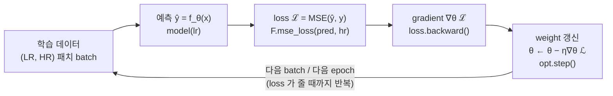

# O2. 신경망 학습 기초 (옵셔널)

## 학습 목표

이 챕터를 마치면, 메인 트랙 16장에서 "어딘가에서 학습돼 온다"고만 말하고 넘어간 conv layer 의 **weight $W$ 와 bias $\mathbf{b}$ 가 정확히 어떻게 정해지는지**를 개념·수식으로 설명할 수 있습니다. 구체적으로 (1) **loss function**(손실 함수)이 "예측이 정답에서 얼마나 틀렸는가"를 하나의 숫자로 재는 것이고, (2) **gradient descent**(경사 하강)가 그 숫자를 줄이는 방향으로 weight 를 **조금씩 고치는** 절차이며, (3) **epoch · batch · learning rate** 가 그 고치는 과정을 조절하는 세 손잡이라는 것, 그리고 (4) 16장의 $\mathbf{o} = W\mathbf{p} + \mathbf{b}$ 에서 그 **$W$ 를 데이터로부터 찾아내는 일**이 바로 학습이라는 점을 풀어낼 수 있습니다.

이 챕터는 **코드를 짜지 않습니다.** 16장이 메인 트랙의 conv layer 를 그림·수식으로 다진 개념 챕터였듯이, O2 는 **옵셔널 트랙의 학습 개념을 그림·수식으로 다지는** 챕터입니다. 여기서 잡은 개념(loss, gradient, epoch/batch/lr)을 바로 다음 **O3 에서 PyTorch 코드로 직접 돌려** SRCNN/FSRCNN 의 weight 를 만듭니다.

## 예상 소요 시간 · 난이도

약 40분 · ★★☆☆☆ (새 코드 없음. 미적분의 "기울기 따라 내려가기"로 학습을 번역하는 개념 챕터)

## 사전 지식

- **O1 PyTorch 기초**: 텐서, `model(x)` 로 예측을 뽑는 것, `.backward()` 가 무엇을 하는지 한 번 본 정도면 충분합니다.
- **메인 트랙 16장 (CNN을 필터로)**: conv layer 한 장이 한 픽셀에서 $\mathbf{o} = \mathrm{ReLU}(W\mathbf{p} + \mathbf{b})$ 라는 **행렬-벡터 곱 + bias + activation** 이라는 것. 이 챕터는 그 $W$, $\mathbf{b}$ 를 **어떻게 찾느냐**를 다룹니다.
- **대학 미적분의 미분·기울기**: 함수 $f(\theta)$ 의 미분 $f'(\theta)$ 가 "그 점에서 $\theta$ 를 늘리면 $f$ 가 얼마나 빨리 커지는가"(기울기)라는 것. 여러 변수면 그 기울기들을 모은 게 gradient $\nabla f$ 라는 것. 이 한 줄이면 gradient descent 를 이해할 수 있습니다.
- **선형대수의 벡터 노름**: 벡터 $\mathbf{v}$ 의 길이(크기) $\lVert \mathbf{v} \rVert$ 와 그 제곱 $\lVert \mathbf{v} \rVert^2 = \sum_i v_i^2$. MSE loss 가 이걸 씁니다.

> 이 챕터는 **WebGPU 도, 실행 코드(index.html / src)도 없습니다.** 16장처럼 그림과 수식만 봅니다. 인용하는 PyTorch 코드는 전부 **다음 챕터 O3 의 실제 학습 스크립트**(`train_srcnn.py` / `train_fsrcnn.py`)에서 가져온 것이고, 여러분이 직접 돌리는 것은 O3 에서입니다.

## 개념 설명

### 출발점: 16장의 $W$ 는 "어디선가 학습돼 온다"고만 했다

16장에서 우리는 conv layer 한 장이 한 픽셀 위치에서 하는 일을 이렇게 적었습니다.

```math
\mathbf{o} = W\mathbf{p} + \mathbf{b}, \qquad \mathbf{a} = \mathrm{ReLU}(\mathbf{o})
```

여기서 $\mathbf{p}$ 는 그 자리에서 모든 입력 채널의 주변 패치를 편 벡터, $W$ 는 출력 채널마다 한 행씩 쌓은 **weight 행렬**, $\mathbf{b}$ 는 채널별 **bias** 였습니다. 그리고 16장은 분명히 못 박았습니다 — 메인 트랙은 이 $W$, $\mathbf{b}$ 를 **이미 정해진 숫자**로 받아 곱하고 더하는 **추론(inference)** 만 한다고. "그 숫자를 좋은 값으로 찾아내는 과정은 옵셔널 트랙으로 미룬다"고 했죠.

**이 챕터가 바로 그 미뤄 둔 과정입니다.** 18·19장이 쓰는 SRCNN/FSRCNN 모델은 conv layer 를 여러 장 쌓은 것이고, 그 모든 layer 의 $W$, $\mathbf{b}$ 를 **한 덩어리로 묶어 $\theta$**(파라미터, parameter)라고 부릅니다. 모델이 입력 $x$(저해상 이미지)로부터 예측 $\hat{y}$(복원한 고해상 이미지)를 만드는 과정을 한 글자로 쓰면 이렇습니다.

```math
\hat{y} = f_\theta(x)
```

$f$ 는 모델(쌓인 conv layer 들), $\theta$ 는 그 안의 모든 weight·bias 를 한데 모은 것입니다. **학습이란 이 $\theta$ 를 좋은 값으로 정하는 일**이고, 그게 이 챕터의 전부입니다. 아래에서 (1) "좋다"를 숫자로 재는 법(loss), (2) 그 숫자를 줄이는 절차(gradient descent), (3) 그 절차를 돌리는 손잡이(epoch/batch/lr) 순으로 풉니다.

### 1단계: loss function — 얼마나 틀렸는지를 숫자 하나로 잰다

weight 를 "고친다"고 하려면, 먼저 지금 weight 가 **얼마나 나쁜지** 잴 자가 있어야 합니다. 그 자가 **loss function**(손실 함수)입니다. 모델 예측 $\hat{y}$ 와 정답 $y$ 를 받아 **"틀린 정도"를 숫자 하나**로 돌려줍니다. 클수록 나쁘고, 0 에 가까울수록 좋습니다.

SR 에서 가장 단순하고, 이 프로젝트가 실제로 쓰는 것이 **MSE**(Mean Squared Error, 평균제곱오차)입니다. 예측 픽셀과 정답 픽셀의 차이를 제곱해서 평균낸 값입니다.

```math
\mathcal{L} = \frac{1}{N} \sum_{i=1}^{N} \lVert \hat{y}_i - y_i \rVert^2
```

기호를 하나씩 풉니다.

- $\hat{y}_i$ 는 모델이 만든 $i$ 번째 픽셀(또는 RGB 면 픽셀의 색 벡터), $y_i$ 는 그 자리의 **정답**(고해상 원본) 픽셀입니다.
- $\hat{y}_i - y_i$ 는 그 자리의 **오차**(error). $\lVert \cdot \rVert^2$ 는 그 오차 벡터 크기의 **제곱**(16장에서 본 노름의 제곱, $\sum_c (\hat{y}_{i,c} - y_{i,c})^2$). 제곱이라서 **부호가 사라지고**(음수든 양수든 멀면 벌점), **크게 틀릴수록 훨씬 더** 벌점을 받습니다.
- $\frac{1}{N}\sum_{i=1}^{N}$ 는 $N$ 개 픽셀(또는 한 batch 안 모든 샘플의 모든 픽셀)에 대해 **평균**을 냅니다. 그래서 결과는 이미지 크기와 무관한 숫자 하나입니다.

이 한 줄이 O3 의 학습 스크립트에 글자 그대로 들어 있습니다. `pred` 가 $\hat{y}$, `hr`(고해상 원본)이 $y$ 입니다.

```python
# lessons/optional/O3-train-srcnn-fsrcnn/train_srcnn.py
pred = model(lr_up)            # ŷ = f_θ(x)
loss = F.mse_loss(pred, hr)    # ℒ = (1/N) Σ ‖ŷ - y‖²
```

> 주의(loss 가 줄지 않으면 학습이 망가진 것): loss 는 학습이 잘 되는지 보는 **유일한 계기판**입니다. epoch 가 지나도 loss 가 안 줄거나 오히려 커지면(NaN 포함) 무언가 잘못된 것입니다 — 흔한 원인은 learning rate 가 너무 크거나(아래 발산 참고), 입력 정규화가 안 맞는 경우입니다. O3 의 학습 로그가 epoch 마다 loss 를 찍는 이유가 이것입니다.

### 2단계: gradient descent — loss 를 줄이는 방향으로 weight 를 조금씩 고친다

이제 "나쁜 정도" $\mathcal{L}$ 을 숫자로 쟀으니, 이걸 **줄이도록** $\theta$ 를 고치면 됩니다. 어느 방향으로? 여기서 **대학 미적분**이 그대로 등장합니다.

$\mathcal{L}$ 은 결국 $\theta$ 의 함수입니다($\theta$ 를 바꾸면 예측이 바뀌고, 그래서 loss 가 바뀌니까). 미적분에서 함수 $\mathcal{L}(\theta)$ 의 **gradient** $\nabla_\theta \mathcal{L}$ 는 "$\theta$ 를 어느 쪽으로 밀면 $\mathcal{L}$ 이 **가장 빠르게 커지는가**"를 가리키는 벡터입니다. 그렇다면 $\mathcal{L}$ 을 **줄이고** 싶으면 그 **반대 방향**($-\nabla_\theta \mathcal{L}$)으로 가면 됩니다. 한 걸음의 크기를 $\eta$(eta, learning rate)로 잡고 한 발 내딛는 것 — 이게 **gradient descent**(경사 하강)입니다.

```math
\theta \leftarrow \theta - \eta\, \nabla_\theta \mathcal{L}
```

기호를 풉니다.

- $\theta$ 는 모델의 모든 weight·bias. $\leftarrow$ 는 "왼쪽을 오른쪽 값으로 **갱신한다**"는 대입입니다(한 번에 한 걸음).
- $\nabla_\theta \mathcal{L}$ 는 loss 의 gradient — $\theta$ 의 각 성분(각 weight)에 대해 "이 weight 를 늘리면 loss 가 얼마나 빨리 커지나"를 모은 벡터입니다. 부호 앞의 $-$ 가 "커지는 방향의 **반대**, 즉 줄어드는 방향으로" 가게 합니다.
- $\eta$ 는 **learning rate**(학습률) — **한 걸음의 보폭**입니다. 크면 성큼성큼, 작으면 조심조심.

> 비유: $\mathcal{L}(\theta)$ 를 안개 낀 골짜기 지형이라고 합시다. 우리는 가장 낮은 곳(loss 최소)으로 내려가고 싶습니다. gradient 는 "지금 발밑에서 가장 가파르게 **올라가는** 방향"을 알려주는 나침반이고, 우리는 그 반대(가장 가파르게 내려가는 쪽)로 $\eta$ 만큼 한 발 딛습니다. 이걸 수없이 반복하면 골짜기 바닥 근처로 내려갑니다.

산을 한 번에 못 내려가듯, 이 한 발($\theta \leftarrow \theta - \eta\nabla_\theta\mathcal{L}$)을 **수천·수만 번 반복**하면서 weight 가 **조금씩** 좋은 값으로 옮겨 갑니다. 그래서 "**학습이란 weight 를 (한 번에가 아니라) 조금씩 고치는 과정**"이라고 말하는 것입니다.

PyTorch 가 이 두 줄로 해 줍니다. `loss.backward()` 가 gradient $\nabla_\theta\mathcal{L}$ 를 자동으로 계산하고(이게 backpropagation, 역전파 — 미분의 연쇄법칙을 모델 거꾸로 한 번 흘리는 것), `opt.step()` 이 위 갱신식을 모든 $\theta$ 에 적용합니다.

```python
# train_srcnn.py — gradient descent 한 걸음
opt.zero_grad()   # 지난 걸음의 gradient 누적을 0으로 비움
loss.backward()   # ∇θ ℒ 계산 (backpropagation)
opt.step()        # θ ← θ - η ∇θ ℒ  (한 걸음 갱신)
```

> 참고(Adam): O3 는 순수 gradient descent 대신 **Adam** 이라는 개선판 옵티마이저를 씁니다(`torch.optim.Adam(model.parameters(), lr=1e-3)`). 큰 그림은 똑같습니다 — **gradient 의 반대 방향으로 weight 를 조금씩 고친다.** Adam 은 거기에 "방향마다 보폭을 알아서 조절"하는 장치를 더해 더 빠르고 안정적으로 내려갈 뿐입니다. 이 챕터는 그 토대인 gradient descent 만 또렷이 잡으면 됩니다.

### 3단계: epoch · batch · learning rate — 학습을 돌리는 세 손잡이

gradient descent 한 걸음을 "수없이 반복한다"고 했습니다. 그 반복을 **어떻게** 도느냐를 정하는 세 용어를 정의합니다. O3 의 학습 루프가 정확히 이 세 가지로 짜여 있습니다.

- **batch**(배치): 한 걸음(gradient 한 번 계산 → weight 한 번 갱신)에 쓰는 **샘플 묶음**. 데이터 전체로 gradient 를 매번 계산하면 느리고 메모리도 큽니다. 그래서 보통 한 번에 **일부(batch)** 만 써서 gradient 를 근사하고 한 걸음 갑니다. O3 는 `BATCH = 16` — 패치 16장으로 한 걸음.
- **epoch**(에폭): 학습 데이터를 **한 바퀴 다 본 것**을 1 epoch 이라 합니다. 데이터가 batch 여러 개로 쪼개지므로, 1 epoch 안에는 **여러 걸음**(batch 개수만큼)이 들어 있습니다. O3 는 `EPOCHS = 60`, epoch 당 `ITERS = 500` 걸음 → 한 epoch 에 500 번 weight 를 갱신하고, 그걸 60 바퀴 반복합니다.
- **learning rate**(학습률) $\eta$: 위에서 본 **보폭**. 너무 크면 골짜기를 건너뛰어 **발산**하고, 너무 작으면 한없이 느립니다(아래 주의 블록).

O3 의 epoch 루프를 그대로 보면 이 세 손잡이가 한눈에 들어옵니다.

```python
# train_srcnn.py — epoch / batch / lr 가 다 보이는 학습 루프
EPOCHS = 60
BATCH  = 16
opt   = torch.optim.Adam(model.parameters(), lr=1e-3)                  # learning rate η
sched = torch.optim.lr_scheduler.CosineAnnealingLR(opt, T_max=EPOCHS, eta_min=1e-5)

for epoch in range(EPOCHS):          # 데이터를 60 바퀴
    for lr, hr in dl:                # batch 하나씩 (16장 묶음) → 한 걸음
        pred = model(lr_up)          # ŷ
        loss = F.mse_loss(pred, hr)  # ℒ
        opt.zero_grad()
        loss.backward()              # ∇θ ℒ
        opt.step()                   # θ ← θ - η ∇θ ℒ
    sched.step()                     # epoch 끝마다 learning rate 를 조금씩 줄임
```

마지막 `sched.step()` 의 **CosineAnnealingLR** 은 learning rate 를 **고정하지 않고**, 학습 초반엔 크게(성큼성큼 내려가다가) 후반으로 갈수록 코사인 곡선을 따라 작게($1\times10^{-3} \to 1\times10^{-5}$) 줄여 줍니다. 처음엔 크게 움직여 빨리 내려가고, 골짜기 바닥 근처에선 보폭을 줄여 **살살 안착**하려는 흔한 요령입니다. 이 챕터에선 "**learning rate 는 학습 동안 바뀔 수 있고, 보통 점점 줄인다**" 정도만 알면 됩니다.

> 주의(learning rate 가 너무 크면 발산): 보폭 $\eta$ 가 너무 크면, 골짜기 바닥을 향해 내려가는 게 아니라 **반대편 비탈로 건너뛰어** 매 걸음 더 높이 튕겨 올라갑니다. loss 가 줄기는커녕 점점 커지다 `NaN`(숫자가 아님)으로 터집니다. 반대로 너무 작으면 발산은 안 하지만 **한없이 느립니다.** O3 가 `1e-3` 에서 시작해 `1e-5` 로 줄이는 것은 이 둘 사이의 타협입니다. loss 가 폭발하면 가장 먼저 의심할 것이 learning rate 입니다.

> 주의(overfitting): 학습 데이터의 loss 만 무작정 0 으로 밀어붙이면, 모델이 학습에 쓴 **그 이미지들만** 외워 버려, **처음 보는** 영상에선 오히려 결과가 나빠질 수 있습니다. 이걸 **overfitting**(과적합)이라 합니다. SR 에선 다양한 패치를 많이 보여 주는 것(DIV2K 같은 큰 데이터셋 + 랜덤 패치)이 가장 기본적인 방어책입니다. "학습 loss 가 낮다 = 항상 좋다" 가 아니라는 점만 기억해 두세요.

### 전체 루프 한눈에: 데이터 → 예측 → loss → gradient → 갱신 → 반복

지금까지를 한 그림으로 묶습니다. 학습은 아래 사이클을 **batch 마다 한 바퀴**(= gradient descent 한 걸음), 그걸 **epoch 만큼 수천 번** 도는 것입니다.



이 사이클이 도는 동안 loss 가 어떻게 변하는지를 표로 보면(O3 학습 로그가 찍는 바로 그 숫자입니다) "**조금씩 내려간다**"가 보입니다. 아래는 형태를 보이기 위한 예시 수치입니다(실제 값은 데이터·모델마다 다릅니다).

| epoch | loss (MSE) | learning rate $\eta$ | 무슨 일이 일어났나 |
|---|---|---|---|
| 1 | 0.0214 | 1.0e-3 | weight 가 거의 무작위 → 예측이 많이 틀림 |
| 10 | 0.0061 | 9.3e-4 | 큰 보폭으로 빠르게 내려감 |
| 30 | 0.0019 | 5.0e-4 | 골짜기 중턱, 보폭이 줄기 시작 |
| 60 | 0.0011 | 1.0e-5 | 바닥 근처에 살살 안착, 거의 평평 |

```text
loss
 ^
 |x
 | x
 |  x
 |   xx
 |     xxx
 |        xxxxx
 |             xxxxxxxxx        ← 처음엔 가파르게, 나중엔 완만하게 평평해짐
 +---------------------------> epoch
```

> 주의(학습은 옵셔널, 메인은 추론): 다시 못 박습니다. 이 사이클(loss → gradient → 갱신)은 **옵셔널 트랙(O2·O3)에서만** 돕니다. **메인 트랙(13~22장)은 학습을 전혀 하지 않습니다.** 메인 트랙이 하는 일은 이 사이클이 **끝난 뒤 확정된 $W$, $\mathbf{b}$ 를 받아** $\mathbf{o} = W\mathbf{p} + \mathbf{b}$ 를 GPU 에서 계산하는 **추론**뿐입니다. 학습은 GPU 셰이더가 아니라 미분·최적화(딥러닝)의 영역이라 이렇게 분리했습니다.

### 16장과 잇기: 그 $W$ 를 학습으로 찾는다

이제 16장과 정확히 이어 붙입니다. 16장의 핵심 식은 이거였습니다.

```math
\mathbf{o} = W\mathbf{p} + \mathbf{b}
```

16장은 "$W$ 의 값(예: 15장 edge kernel 의 `8`, `-1`)을 **사람이 고르지 않고 데이터가 정한다**"고만 말하고 넘어갔습니다. **그 "데이터가 정한다"의 실제 정체가 이 챕터의 gradient descent 입니다.** 처음엔 $W$ 를 무작위 숫자로 채워 두고, (LR, HR) 데이터 쌍에 대해 loss 를 재고, $\nabla_\theta\mathcal{L}$ 의 반대 방향으로 $W$ 를 조금씩 고치기를 수천 번 — 그러면 $W$ 가 "저해상을 고해상으로 잘 복원하는" 값으로 스스로 수렴합니다. 15장에서 사람이 손으로 적던 kernel 숫자를, **데이터와 gradient 가 대신 적어 주는 것**입니다.

```text
   15장 :  kernel 값을 사람이 손으로 적음 (blur=1/9, edge=8,-1 …)
   16장 :  그 자리를 "학습된 weight W" 로 부르되, "어떻게" 는 미룸
   O2   :  그 "어떻게" = loss 재고 → ∇θ ℒ 의 반대로 W 를 조금씩 갱신 (이 챕터)
   O3   :  실제 PyTorch 로 SRCNN/FSRCNN 의 W, b 를 학습해 파일로 저장
   18·19장 : 그 W, b 를 GPU 로 추론 (학습 없음)
```

그래서 18·19장 데모가 쓰는 weight 파일(`srcnn-weights.ts` 등)은 결국 **이 사이클을 60 epoch 돌려 나온 $\theta$ 의 숫자들**입니다. 다음 챕터 O3 에서 여러분이 이 루프를 직접 돌려 그 숫자를 만들고, 메인 트랙에 연결합니다.

## 완성되면 이런 화면

(이 챕터는 실행 화면 대신, 다음 한 장면을 머릿속에 또렷이 남기는 것이 목표입니다. 실제 학습 로그는 O3 에서 봅니다.)

> O3 에서 학습 스크립트를 돌리면 터미널에 epoch 마다 이런 줄이 찍히고, **loss 가 점점 줄어드는 것**을 직접 보게 됩니다.
>
> ```text
> epoch 1/60   loss 0.021400  lr 1.00e-03
> epoch 10/60  loss 0.006100  lr 9.27e-04
> epoch 30/60  loss 0.001900  lr 5.00e-04
> epoch 60/60  loss 0.001100  lr 1.00e-05
> 저장: model/srcnn.pt
> ```
>
> 이 한 화면 안에 이 챕터의 모든 개념이 들어 있습니다: **loss**(틀린 정도), **epoch**(데이터 몇 바퀴), **lr**(보폭, 점점 줄어듦), 그리고 마지막 줄의 **저장된 weight** — 이것이 메인 트랙이 추론에 쓰는 $W$, $\mathbf{b}$ 입니다.

## 자가 점검 질문

스스로 설명할 수 있는지 확인하세요. (정답을 외우는 게 아니라 "설명할 수 있는가"입니다)

1. **loss 와 gradient descent 의 관계**를 설명해보세요. MSE loss $\mathcal{L} = \frac1N\sum\lVert\hat y - y\rVert^2$ 가 무엇을 재는지, 그리고 $\theta \leftarrow \theta - \eta\nabla_\theta\mathcal{L}$ 에서 왜 gradient 의 **반대** 방향으로, 왜 **$\eta$ 만큼만(조금씩)** 가는지를 "안개 낀 골짜기" 비유로 말해보세요.
2. **epoch · batch · learning rate** 를 각각 한 문장으로 정의하고, O3 의 학습 루프(`for epoch ... for lr, hr in dl ...`)에서 셋이 각각 어디에 해당하는지 짚어보세요. 그리고 learning rate 가 **너무 크면** 무슨 일이 생기는지 설명해보세요.
3. 16장의 $\mathbf{o} = W\mathbf{p} + \mathbf{b}$ 에서 **그 $W$ 가 어디서 오는지**를, 15장(사람이 kernel 을 적음) → O2(gradient descent 로 W 를 조금씩 고침) → 메인 트랙(그 W 로 추론만 함)의 흐름으로 설명해보세요. 그리고 **메인 트랙이 학습을 하지 않는 이유**도 함께 말해보세요.
