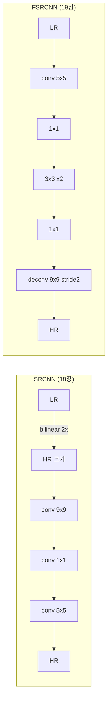

# O3. SRCNN / FSRCNN 학습하기 (옵셔널)

## 학습 목표

이 챕터를 마치면, 메인 트랙 18·19장에서 쓰는 weight가 **어디서 오는지**를 직접 만들어 보며 이해합니다. PyTorch로 두 고전 SR 모델(SRCNN, FSRCNN)을 DIV2K 데이터셋으로 학습하고, 그 결과를 메인 트랙에 연결합니다.

## 예상 소요 시간 · 난이도

약 90분 (학습 시간 제외) · ★★★☆☆ (PyTorch 기초 필요, O1·O2 선행)

## 사전 지식

- O1 PyTorch 환경, O2 신경망 학습 기초
- 메인 트랙 15장(convolution)과 16~17장(CNN을 필터로 이해)

## 개념 설명

### 두 모델은 "확대를 어디서 하느냐"가 다르다

둘 다 LR(저해상)을 HR(고해상)로 만드는 conv 신경망이지만, **확대 위치**가 다릅니다.



- **SRCNN**: 먼저 bilinear로 확대한 뒤 conv로 복원 → 모든 conv가 큰 HR 해상도에서 돈다(느림).
- **FSRCNN**: 작은 LR에서 conv를 끝내고 마지막에 **deconvolution(transposed conv)**으로 확대 → 빠름.

정확한 레이어 스펙은 `model/architecture.md`에 있습니다(메인↔옵셔널 공유 계약).

### 학습이란 손실을 줄이는 것

모델이 만든 SR 결과 $\hat{y}$ 와 정답 HR $y$ 의 차이를 **MSE 손실**로 재고, 그 손실을 줄이도록 weight를 조금씩 고칩니다.

```math
\mathcal{L} = \frac{1}{N} \sum_{i=1}^{N} \lVert \hat{y}_i - y_i \rVert_2^2
```

$\hat{y} = f_\theta(x)$ 에서 $\theta$ 가 모든 conv의 weight·bias이고, gradient descent로 $\theta$ 를 갱신합니다(O2 참고). DIV2K HR 이미지에서 패치를 떼어 LR을 만들고, 그 LR을 다시 HR로 복원하도록 학습합니다.

### 데이터: DIV2K

DIV2K는 SR 연구의 표준 데이터셋입니다. HR 이미지에서 랜덤 패치를 뽑아, bicubic으로 축소해 LR을 만들고 `(LR, HR)` 쌍으로 학습합니다.

```bash
bash scripts/download-div2k.sh         # valid HR 100장 (~430MB)
# 정식 학습은: bash scripts/download-div2k.sh train   (800장, ~3.5GB)
```

> 주의(정규화 일치): 학습 입력은 `[0,1]`로 정규화합니다. 메인 트랙 WGSL 추론도 동일하게 `[0,1]`을 써야 합니다. 어긋나면 결과가 깨집니다.

> 주의(deconvolution): FSRCNN의 deconv는 `checkerboard artifact`(격자 무늬)를 만들 수 있습니다. stride와 kernel 크기 관계에서 생기며, 19장에서 추론 측면을 다룹니다.

## 실행 방법

```bash
# 0) 가상환경 (처음 한 번)
uv venv --python 3.12 .venv
VIRTUAL_ENV=.venv uv pip install torch numpy pillow

# 1) 데이터
bash scripts/download-div2k.sh

# 2) 학습
.venv/bin/python lessons/optional/O3-train-srcnn-fsrcnn/train_srcnn.py
.venv/bin/python lessons/optional/O3-train-srcnn-fsrcnn/train_fsrcnn.py

# 3) export -> Bun-readable checkpoint
.venv/bin/python lessons/optional/O3-train-srcnn-fsrcnn/export_checkpoint.py

# 4) checkpoint -> 메인 트랙 weights.ts (Python 불필요)
bun run make:weights
```

이후 18·19장 데모를 열면 **내가 학습한 weight**로 동작합니다.

## 완성되면 이런 화면

학습 로그에서 epoch마다 loss가 줄어듭니다. export 후 `model/srcnn.checkpoint`, `model/fsrcnn.checkpoint`가 생기고, `make:weights`가 `lessons/18.../model/srcnn-weights.ts`와 `lessons/19.../model/fsrcnn-weights.ts`를 만듭니다.

## 자가 점검 질문

1. SRCNN과 FSRCNN이 "확대를 어디서 하는가" 관점에서 어떻게 다른지, 그것이 속도에 주는 영향과 함께 설명해보세요.
2. MSE 손실이 무엇을 측정하며, 학습이 weight를 어떻게 바꾸는지 설명해보세요.
3. 학습 입력 정규화(`[0,1]`)가 메인 트랙 WGSL 추론과 일치해야 하는 이유를 설명해보세요.
