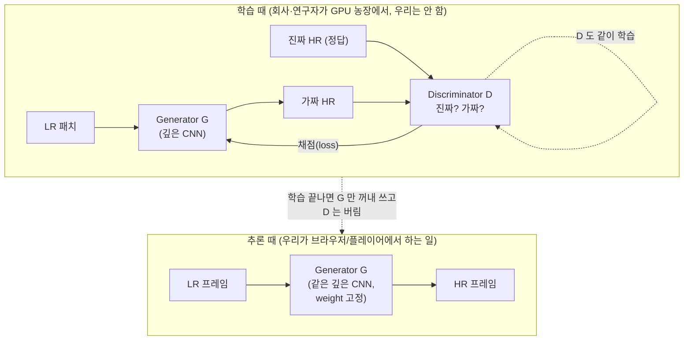
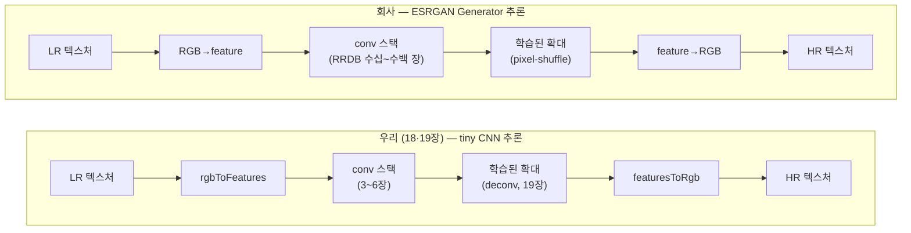

# O4. GAN 기반 Super Resolution 개요 (옵셔널)

## 학습 목표

이 챕터를 마치면, 회사가 실제로 쓰는 **GAN 기반 SR**(SRGAN·ESRGAN·Real-ESRGAN)이 메인 트랙에서 우리가 만든 CNN 추론과 **어떻게 이어지는지**를 설명할 수 있습니다. 구체적으로 (1) SRGAN/ESRGAN 의 핵심 아이디어를 한눈에 잡고, (2) **GAN 은 "학습 기법"일 뿐 "추론 구조"가 아니다 — 추론할 때는 Generator 만 돌고 Discriminator 는 버린다**는 점을 또렷이 이해하며, (3) 그 Generator 가 결국 우리가 17~19장에서 돌린 conv 스택과 **같은 종류**의 CNN(규모만 큼)임을 알고, (4) 회사 모델로 넘어가기 위한 다음 학습 방향을 잡습니다.

> 이 챕터는 **개념 문서**입니다. 실행 코드가 없습니다. 우리가 한 CNN 추론과 회사 GAN SR 사이의 **개념의 다리**만 놓습니다.

## 예상 소요 시간 · 난이도

약 30분 · ★★☆☆☆ (수식·실습 없음. 18·19장을 마쳤다는 전제 위에서 "관계"만 정리)

## 사전 지식

- **18장 SRCNN · 19장 FSRCNN**: 학습된 conv 스택을 `src/core/cnn.ts` 추론 엔진에 올려 한 프레임을 굴리는 파이프라인. 이 챕터의 결론("회사 GAN 추론도 이거랑 같다")은 그 경험 위에서만 와닿습니다.
- **16장 CNN as filters**: conv layer = "학습된 weight 행렬 $W$ 와 패치 벡터 $\mathbf{p}$ 의 행렬-벡터 곱 + bias + (ReLU)", $\mathbf{o} = \mathrm{ReLU}(W\mathbf{p}+\mathbf{b})$. GAN 의 Generator 도 결국 이 식의 반복입니다.
- (있으면 도움) **O2 신경망 학습 기초**: "손실(loss)을 줄이도록 weight 를 고친다"는 학습의 개념. GAN 의 새로움은 그 손실을 **또 다른 신경망이 만든다**는 점뿐입니다.

## 개념 설명

### 1. SRGAN / ESRGAN 의 핵심 아이디어

지금까지 우리 SRCNN/FSRCNN 은 정답 HR 과의 **픽셀 차이(MSE)** 를 줄이도록 배웠습니다(O3 참고). MSE 는 "평균적으로 안 틀리는" 답을 좋아해서, 잘 모르는 디테일(머리카락·풀잎·벽돌 질감)은 **여러 그럴듯한 답을 평균낸 흐릿한 값**으로 채우는 경향이 있습니다. 그래서 수치는 좋아도 사람 눈엔 밋밋합니다.

**SRGAN(2017)** 의 아이디어는 손실 함수를 바꾸는 것입니다. "정답과 픽셀이 똑같은가"를 묻는 대신, **"이 결과가 진짜 고해상 사진처럼 보이는가"를 판정하는 또 다른 신경망(Discriminator, 판별자)** 을 두고, 그 판정관을 속이도록 SR 모델(Generator, 생성자)을 훈련합니다. 둘이 경쟁하며 같이 커지는 이 구조가 **GAN(Generative Adversarial Network, 적대적 생성 신경망)** 입니다.

**ESRGAN(2018)** 은 SRGAN 을 개량했습니다. Generator 를 더 깊고 잘 흐르는 conv 구조(residual-in-residual dense block, RRDB)로 바꾸고, batch normalization 을 빼고, Discriminator 판정과 perceptual loss(특징 공간에서의 비교)를 손봐 더 또렷하고 자연스러운 질감을 얻었습니다. **Real-ESRGAN(2021)** 은 여기에 "현실의 더러운 저화질"(압축·노이즈·블러가 섞인 입력)을 학습 데이터로 합성해, 실제 영상·사진에서도 잘 도는 실무용 모델로 만들었습니다. 회사가 쓰는 SR 이 보통 이 계열입니다.

> 우리 메인 트랙은 MSE 로 학습한 tiny CNN(SRCNN/FSRCNN)을 추론합니다. 회사 모델은 **GAN 으로 학습한 큰 CNN**(ESRGAN 계열)을 추론합니다. **바뀐 건 "어떻게 학습했나"이고, "어떻게 추론하나"는 같습니다.** 다음 절이 그 이유입니다.

### 2. GAN 은 학습 기법이다 — 추론 때는 Generator(=CNN)만 돈다

가장 중요한 메시지입니다. **GAN 은 모델을 "어떻게 학습시키는가"에 대한 기법이지, "추론을 어떻게 하는가"에 대한 구조가 아닙니다.**

- **학습 때**: Generator $G$ 와 Discriminator $D$ 가 **경쟁**합니다. $G$ 는 LR 을 받아 HR 후보를 만들고, $D$ 는 "이게 진짜 HR 인가, $G$ 가 만든 가짜인가"를 맞히려 합니다. $G$ 는 $D$ 를 속이려, $D$ 는 안 속으려 — 둘이 서로를 밀어 올리며 같이 좋아집니다. $D$ 는 **$G$ 를 가르치기 위한 채점기**일 뿐입니다.
- **추론 때(우리가 하는 일)**: 학습이 끝나면 **$D$ 는 버립니다.** 실제로 SR 을 만들 때 필요한 건 LR → HR 변환기인 $G$ 하나뿐입니다. 즉 **추론 = Generator 한 번 forward pass**. Discriminator 도, 손실 함수도, 경쟁도 추론에는 등장하지 않습니다.



위 그림에서 **아래쪽(추론) 박스에는 $D$ 가 아예 없습니다.** 우리가 회사 모델을 플레이어에 올릴 때 다루는 것은 위 박스의 복잡한 경쟁이 아니라, 아래 박스의 단순한 "LR 넣고 $G$ 한 번 돌려 HR 받기"뿐입니다.

수식으로도 학습과 추론을 갈라 보면 분명합니다. 학습에서 $G$ 와 $D$ 는 다음 **적대적 목적(adversarial objective)** 으로 서로 반대 방향으로 최적화됩니다.

```math
\min_{G}\ \max_{D}\ \ \mathbb{E}_{y \sim \text{진짜 HR}}\bigl[\log D(y)\bigr]\ +\ \mathbb{E}_{x \sim \text{LR}}\bigl[\log\bigl(1 - D(G(x))\bigr)\bigr]
```

기호를 풀면: $G(x)$ 는 LR 입력 $x$ 로 $G$ 가 만든 HR, $D(\cdot)$ 는 "진짜일 확률"(0~1). $D$ 는 이 값을 **키우려**($\max_D$, 진짜는 1·가짜는 0 으로), $G$ 는 $D(G(x))$ 가 1 에 가깝게 보이도록 이 값을 **낮추려**($\min_G$) 합니다. ESRGAN 은 여기에 **perceptual loss** 를 더합니다 — 픽셀이 아니라 **사전학습된 CNN 의 feature 공간**에서 결과 $G(x)$ 와 정답 $y$ 를 비교합니다.

```math
\mathcal{L}_{\text{perceptual}} = \bigl\lVert\, \phi\bigl(G(x)\bigr) - \phi(y)\,\bigr\rVert^2
\qquad(\phi:\ \text{사전학습 CNN 의 feature 추출})
```

> 위 두 식($\min_G\max_D$, perceptual loss)은 **오직 학습 때만** 등장합니다. **추론과는 전혀 무관합니다.** 추론에서 우리가 계산하는 건 오직 $G(x)$ — conv 들의 곱·합뿐이고, $D$ 도 $\phi$ 도 부르지 않습니다. 이 식들은 "왜 GAN 결과가 더 또렷한가"의 배경으로만 읽고, 추론 파이프라인을 짤 때는 잊어도 됩니다.

### 3. ESRGAN Generator = 더 깊은 CNN (우리가 한 conv 와 같은 종류)

그럼 그 Generator $G$ 는 무엇으로 만들어졌을까요? **conv layer 입니다.** 우리가 16~19장에서 쌓은 바로 그 $\mathbf{o} = \mathrm{ReLU}(W\mathbf{p}+\mathbf{b})$ 의 반복입니다. ESRGAN 의 Generator 도 결국:

- 입력 LR 의 RGB 를 feature 로 펴고(우리 `rgbToFeatures` 와 같은 역할),
- conv layer 를 **아주 많이** 통과시키고(우리는 3~6장, ESRGAN 은 수십~수백 장이 residual block 으로 묶임),
- 마지막에 **학습된 업샘플 연산**(우리 19장 deconvolution 과 같은 계열의 학습된 확대, 보통 pixel-shuffle/sub-pixel conv)으로 HR 크기로 키우고,
- conv 로 RGB 3채널을 만들어 냅니다(우리 `featuresToRgb` 자리).

즉 ESRGAN Generator 는 **새로운 종류의 연산이 아니라, 우리가 이미 GPU 에서 굴린 conv·deconv·ReLU 를 훨씬 많이 쌓은 것**입니다. 추가되는 구조도 우리가 19장에서 만난 개념의 확장입니다.

| ESRGAN 의 구성요소 | 우리가 이미 배운 것 (메인 트랙) |
|------|------|
| conv 3×3 layer | 16·17장 conv layer $\mathbf{o}=\mathrm{ReLU}(W\mathbf{p}+\mathbf{b})$ |
| ReLU / LeakyReLU activation | 16장 ReLU($\max(0,x)$) — 음수 기울기만 살짝 다름 |
| **residual** 연결(블록 입력을 출력에 더함) | 18장에서 언급한 "bilinear 확대본 + 보정량(residual)" 개념의 일반화 |
| RRDB(residual-in-residual dense block) | 위 residual 을 여러 겹 중첩한 **묶음 단위**. 안은 전부 conv |
| 학습된 업샘플(pixel-shuffle/sub-pixel) | 19장 deconvolution(학습된 확대)와 같은 목적·다른 구현 |
| 마지막 conv → RGB | 18·19장 conv3 / `featuresToRgb` |

핵심: **표의 오른쪽 칸이 비어 있지 않습니다.** ESRGAN Generator 의 부품은 전부 우리가 이미 만져 본 것입니다. 다른 건 **개수(깊이)** 와 **채널 폭(규모)** 뿐입니다.

### 4. 우리 tiny CNN 추론 → 회사 ESRGAN Generator 추론: 같은 파이프라인, 규모만 다름

이제 결론입니다. 메인 트랙에서 우리가 만든 추론 파이프라인과, 회사 ESRGAN 추론 파이프라인은 **같은 모양**입니다.



두 줄을 위아래로 견주면 **자리(단계)가 1:1 로 대응**합니다. 입력 텍스처를 feature 로 펴고 → conv 를 많이 통과시키고 → 학습된 방식으로 확대하고 → 다시 RGB 로 — 이 골격은 같습니다. 따라서:

- **추론 엔진은 같은 종류**: storage buffer 에 feature map 을 두고(채널 수만큼 인덱싱), compute shader 로 conv 를 돌리고, 중간 feature 는 음수가 있으니 float 으로 보관하는(`r32float`/storage) 우리 `src/core/cnn.ts` 의 방식이 그대로 ESRGAN 에도 적용됩니다.
- **다른 건 규모**: 채널이 16 이 아니라 64~? 이고, 레이어가 3~6 장이 아니라 수십~수백 장이며, 그래서 **메모리와 GPU 시간이 훨씬 큽니다.** 알고리즘이 새로운 게 아니라 **양이 큰** 것입니다.
- 그래서 회사 모델로 가며 새로 배워야 할 것은 "GAN" 그 자체가 아니라, **큰 모델을 빠르게/효율적으로 추론하는 엔지니어링**(연산 융합, 메모리 절약, 타일링, 양자화 등)입니다.

| 구분 | 우리 tiny CNN (18·19장) | 회사 ESRGAN 계열 |
|------|------|------|
| 학습 방법 | MSE (O3) | **GAN + perceptual** (이 챕터) |
| 추론에 쓰는 부분 | conv 스택 = Generator | **Generator 만** (D 버림) |
| Generator 의 정체 | conv 3~6 장 | conv 수십~수백 장(RRDB) |
| 확대 방식 | deconv(학습된 확대) | pixel-shuffle(학습된 확대) |
| 채널 폭 | 8~16 | 보통 64+ |
| 추론 파이프라인 | LR→feature→conv→확대→RGB | **완전히 같은 골격** |
| 다른 점 | — | **깊이·폭(규모)뿐** |

> 주의(GAN = 학습 기법 ≠ 추론 구조): "GAN SR 을 추론한다"는 말에 겁먹지 마세요. **추론할 때 GAN 은 사라집니다.** Discriminator 도, 적대적 손실도, perceptual loss 도 추론에는 없습니다. 우리가 추론하는 것은 **우리가 18·19장에서 한 것과 같은 종류의 conv 스택(Generator)** 하나뿐이고, 단지 더 깊고 넓을 뿐입니다. "GAN 모델 추론"을 "큰 CNN 추론"으로 바꿔 읽으면 회사 모델은 새로운 영역이 아니라 **우리가 한 일의 큰 버전**입니다.

### 계보 한눈에: SRGAN → ESRGAN → Real-ESRGAN

| 모델 | 연도 | 핵심 한 줄 | Generator(추론에 쓰는 부분) | 추론 때 D 사용? |
|------|------|------|------|------|
| **SRCNN/FSRCNN** (우리 메인 트랙) | 2014/2016 | MSE 로 학습한 최소 conv SR | conv 3~6 장 | (GAN 아님) |
| **SRGAN** | 2017 | "진짜처럼 보이게" — GAN 손실을 SR 에 처음 도입 | residual block 기반 conv (SRResNet) | 아니오 (D 버림) |
| **ESRGAN** | 2018 | RRDB·BN 제거·개선된 손실로 더 또렷한 질감 | 더 깊은 RRDB conv | 아니오 (D 버림) |
| **Real-ESRGAN** | 2021 | 현실의 더러운 저화질을 합성 학습 → 실무용 | ESRGAN 계열 conv (실무 튜닝) | 아니오 (D 버림) |

**오른쪽 두 칸의 메시지**: 왼쪽에서 오른쪽으로 가며 Generator 는 점점 깊어지지만 **여전히 conv 스택**이고, **추론 때 Discriminator 를 쓰는 모델은 하나도 없습니다.** 계보 전체에서 우리가 추론할 대상은 항상 "학습된 conv Generator" 하나입니다.

### 5. 회사 모델로 넘어가기 위한 다음 학습 방향

이 개념의 다리를 건넌 뒤, 회사 ESRGAN 계열 모델을 실제 플레이어에 올리려면 다음을 순서대로 익히면 좋습니다.

1. **모델 구조 읽기**: 회사 모델의 레이어 목록(conv 커널·채널·residual 연결·업샘플 방식)을 PyTorch 정의나 ONNX 그래프로 확인. 우리 `model/architecture.md` 처럼 "레이어 스펙 = 메인↔모델 계약"으로 봅니다.
2. **weight 추출·변환**: O3 의 `export_checkpoint.py` / `bun run make:weights` 와 같은 흐름으로, 회사 checkpoint 의 weight 를 우리 추론 엔진이 읽는 형식으로 변환. conv 와 deconv/pixel-shuffle 의 **weight 레이아웃 차이**(19장에서 본 `[inC][outC][kh][kw]` vs `[outC][inC][kh][kw]`)에 특히 주의.
3. **pixel-shuffle(sub-pixel conv) 이해**: ESRGAN 의 확대는 보통 deconv 가 아니라 pixel-shuffle 입니다. "conv 로 채널을 $r^2$ 배 만든 뒤 그 채널을 공간으로 재배치해 $r$ 배 확대"하는 연산으로, 19장 deconv 와 **목적은 같고 checkerboard 가 덜한** 대안입니다. 이 연산만 엔진에 추가하면 됩니다.
4. **큰 모델 추론 최적화(23~25장 방향)**: 깊은 conv 스택을 실시간으로 돌리려면 메모리·속도가 관건입니다 — feature buffer 재사용, 연산 융합, 타일 단위 처리, 필요시 양자화/반정밀도(f16). 메인 트랙 Part 8(성능·디버깅·회사 플레이어로 가기 전에)이 이 방향입니다.
5. **(선택) GAN 학습 자체**: 추론에는 불필요하지만, 회사 모델을 **재학습/미세조정**할 일이 생기면 그때 Generator+Discriminator 경쟁과 perceptual loss 를 옵셔널 트랙 깊이로 더 파면 됩니다. 추론만 한다면 1~4 로 충분합니다.

## 완성되면 이런 이해 (코드 산출물 없음)

이 챕터에는 실행 화면이 없습니다. 대신 다음을 **말로 설명할 수 있으면** 완성입니다.

- 누가 "회사는 GAN 으로 SR 한다"고 하면 → "학습을 GAN 으로 한 거고, 추론할 때는 Generator(큰 CNN)만 돈다. 우리가 18·19장에서 한 conv 추론과 같은 파이프라인이고 규모만 크다"고 1 분 안에 설명.
- ESRGAN Generator 를 보고 "이건 새로운 게 아니라 conv·확대·residual 을 많이 쌓은 것"이라고 부품 단위로 짚기.

## 자가 점검 질문

스스로 설명할 수 있는지 확인하세요. (정답을 외우는 게 아니라 "설명할 수 있는가"입니다)

1. 동료가 "우리 회사는 GAN 으로 super resolution 을 한대"라고 말했습니다. **추론(실제 영상에 적용)할 때 Generator 와 Discriminator 중 무엇이 돌고 무엇이 버려지는지**, 그리고 그 이유(GAN 은 학습 기법이라는 점)를 설명해보세요.
2. ESRGAN 의 Generator 가 "우리가 16~19장에서 한 것과 같은 종류의 CNN"이라고 말할 수 있는 근거를, **conv layer·ReLU·학습된 확대(deconv/pixel-shuffle)** 라는 구성요소로 짚어 설명해보세요. 우리 추론과 회사 추론이 다른 점은 무엇 하나입니까?
3. SRCNN/FSRCNN → SRGAN → ESRGAN → Real-ESRGAN 계보에서, **무엇이 바뀌고(학습 방법·Generator 깊이) 무엇이 그대로인지(추론은 Generator conv 스택 하나, D 는 추론에 안 씀)** 를 한 줄로 정리해보세요.
